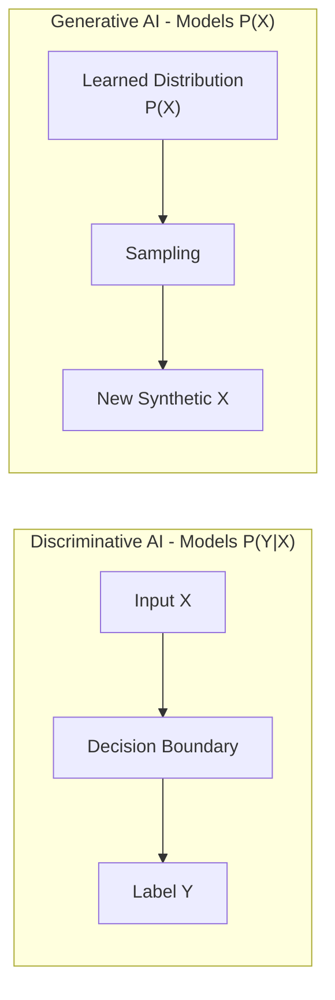
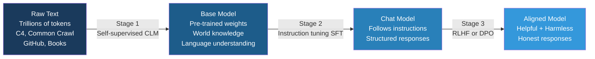
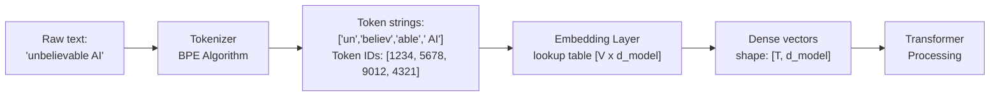
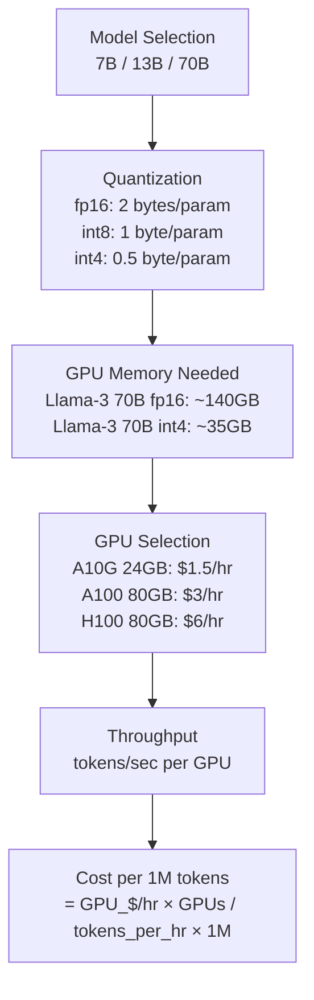
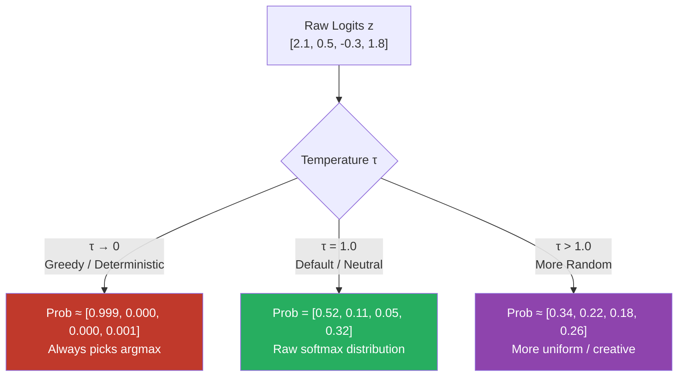
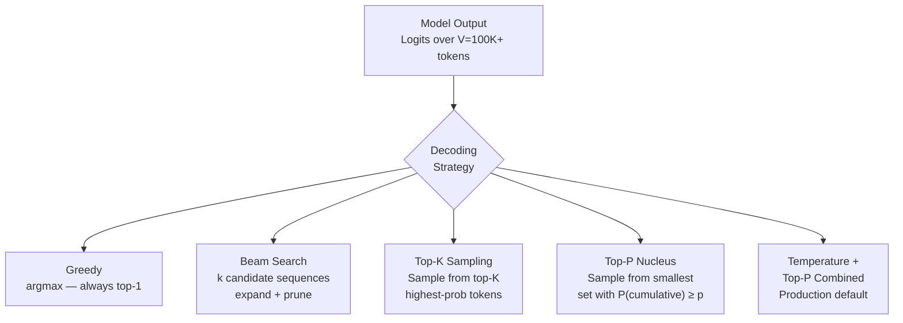
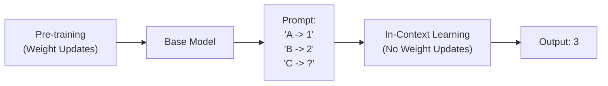

# Prompt Engineering & LLM Fundamentals

> Core concepts every LLM engineer must know — from how models generate text to advanced reasoning techniques. Answers are calibrated for a **Google L5 Senior AI/ML Engineer** interview bar.

---

## Q1. How does Generative AI differ from traditional Predictive/Discriminative AI?

### Core Answer

**Discriminative models** learn the conditional distribution **P(Y|X)** — given input X, predict label Y. They draw a decision boundary between classes. Examples: logistic regression, SVM, BERT with a classification head.

**Generative models** learn the joint distribution **P(X)** (or P(X,Y)) — they model how data is generated and can *synthesize new data*. LLMs learn P(token_t | token_1, ..., token_{t-1}) — the probability of the next token given all previous tokens.



### Deep-Dive: Key Differences

| Aspect | Discriminative AI | Generative AI |
|---|---|---|
| **Probability modeled** | P(Y\|X) | P(X) or P(X,Y) |
| **Goal** | Classify / predict label | Synthesize new content |
| **Training signal** | Labeled pairs (X, Y) | Unlabeled data (self-supervised) |
| **Examples** | BERT (classifier), SVM, Random Forest | GPT-4, Gemini, Llama, DALL-E |
| **Data requirement** | Needs human-annotated labels | Trains on raw internet-scale data |
| **Generalization** | Within training distribution | Can extrapolate to new combinations |
| **Failure mode** | Miscalibrated probabilities | Hallucination, fabrication |

### Why It Matters for Engineering

- **BERT vs GPT**: BERT is a masked LM (sees full bidirectional context) — ideal for classification but cannot auto-regressively generate text. GPT is causal — generates token by token. This architectural difference is fundamental.
- **Hybrid approaches**: Modern LLMs like Gemini can do both — they're generative but adapted for discriminative tasks via prompting or classifier heads.
- **Data efficiency**: Discriminative models need labeled data (expensive); generative models pre-train on cheap unlabeled data then fine-tune with small labeled sets.

### Related Questions

!!! question "Follow-up Interview Questions"
    1. Why can't BERT generate text the same way GPT does? What architectural constraint prevents it?
    2. What is the difference between a masked language model (MLM) and a causal language model (CLM)?
    3. How does a Variational Autoencoder (VAE) relate to generative AI and how does it differ from an LLM?
    4. Why is modeling P(X) harder than P(Y|X)?
    5. Can a generative LLM be used for classification? What are two concrete approaches?
    6. What is the "discriminative vs generative" tradeoff in terms of sample efficiency?
    7. How does GPT's next-token prediction pre-training implicitly learn P(Y|X) for many downstream tasks?

---

## Q2. What is a Large Language Model and how is it trained?

### Core Answer

An LLM is a transformer-based neural network with billions of parameters trained on massive text corpora to model language probability distributions. The training pipeline has three stages:



### Stage 1: Pre-Training (Causal Language Modeling)

Self-supervised learning on internet-scale data. Objective is **next-token prediction**:

$$\mathcal{L}_{CLM} = -\frac{1}{T}\sum_{t=1}^{T} \log P_\theta(x_t \mid x_1, ..., x_{t-1})$$

```python
# Simplified pre-training loop
for batch in dataloader:
    input_ids = batch["input_ids"]             # shape: [B, T]
    labels    = input_ids[:, 1:].clone()       # shift: predict next token
    logits    = model(input_ids[:, :-1])       # shape: [B, T-1, vocab_size]

    # Standard cross-entropy loss
    loss = F.cross_entropy(
        logits.reshape(-1, vocab_size),        # [B*(T-1), vocab_size]
        labels.reshape(-1),                    # [B*(T-1)]
        ignore_index=tokenizer.pad_token_id    # ignore padding
    )
    loss.backward()
    optimizer.step()
    scheduler.step()
    optimizer.zero_grad()
```

**Scale at Google/OpenAI:**
- **Parameters**: 7B (small) → 70B (large) → 1T+ (frontier)
- **Data**: 1–15 trillion tokens
- **Compute**: Thousands of TPU/GPU chips for months
- **Distributed training**: Tensor parallelism (split attention heads) + Pipeline parallelism (split layers) + Data parallelism (split batches)

### Stage 2: Supervised Fine-Tuning (SFT)

Train on high-quality `(instruction, response)` pairs. Critical: **loss is computed only on assistant tokens**, not user/system tokens.

```python
# SFT data format (OpenAI-style)
{
  "messages": [
    {"role": "system", "content": "You are a helpful assistant."},
    {"role": "user", "content": "Explain gradient descent."},
    {"role": "assistant", "content": "Gradient descent minimizes loss by..."}
  ]
}
# During training: mask out system + user tokens in the loss computation
```

### Stage 3: Preference Alignment

- **RLHF**: Train a reward model on (chosen, rejected) preference pairs → optimize LLM with PPO to maximize reward
- **DPO**: Direct Preference Optimization — skips the separate reward model, directly optimizes on preference pairs using a closed-form reparameterization
- **RLAIF**: Replace human labelers with an AI judge (Constitutional AI approach used by Anthropic)

### Related Questions

!!! question "Follow-up Interview Questions"
    1. What is the Chinchilla scaling law and how does it guide decisions about model size vs. data volume?
    2. How does instruction tuning differ from task-specific fine-tuning?
    3. What is catastrophic forgetting and how do you mitigate it during fine-tuning?
    4. Why do LLMs need RLHF if SFT already teaches instruction-following?
    5. How would you detect and handle data contamination during pre-training?
    6. What is curriculum learning? Is it used in modern LLM pre-training?
    7. What is the difference between DPO and RLHF in terms of training stability and compute cost?
    8. How does the Adam optimizer's weight decay interact with LLM pre-training? What is AdamW?

---

## Q3. What exactly is a "token" in the context of language models?

### Core Answer

A token is the **atomic unit of text** that an LLM processes — not a word, not a character. Tokenization converts raw text into integer IDs from a fixed vocabulary. The model operates entirely in token space.



### Tokenization Algorithms

| Algorithm | Used By | Key Mechanism |
|---|---|---|
| **BPE** (Byte-Pair Encoding) | GPT family, Llama, Qwen | Iteratively merge most frequent adjacent byte pairs |
| **WordPiece** | BERT, DistilBERT | Like BPE but merges based on likelihood ratio |
| **SentencePiece** | T5, Llama 2+, PaLM | Language-agnostic, handles whitespace explicitly |
| **Tiktoken** | GPT-4, GPT-3.5 | OpenAI's optimized BPE in Rust |

### BPE Algorithm Step-by-Step

```
Initial character vocab: {u, n, b, e, l, i, v, a, ...}
Training corpus: "unbelievable" appears 10,000 times

Iteration 1: Count all adjacent pairs
  ('u','n') → 10,000, ('n','b') → 10,000, ('b','e') → 25,000 ← most frequent
  Merge: 'b'+'e' → 'be'  →  vocab now has 'be'

Iteration 2: ('be','l') → 15,000, ('l','i') → 22,000 ← most frequent
  Merge: 'l'+'i' → 'li'

... after thousands of iterations:
Final: ['un', 'believ', 'able'] with IDs [1234, 5678, 9012]
```

### Critical Engineering Implications

```python
import tiktoken
enc = tiktoken.encoding_for_model("gpt-4")

examples = {
    "hello":         enc.encode("hello"),           # 1 token
    "unbelievable":  enc.encode("unbelievable"),     # 3-4 tokens
    " AI":           enc.encode(" AI"),              # 1 token (note: leading space!)
    "AI":            enc.encode("AI"),               # DIFFERENT token ID than " AI"
    "🚀":            enc.encode("🚀"),               # 1-2 tokens (emoji)
    "Gyanendra":     enc.encode("Gyanendra"),        # rare name → multiple tokens
    "def __init__":  enc.encode("def __init__"),     # code-friendly tokenization
    "中文":          enc.encode("中文"),              # CJK: ~2-3 tokens per character
}
```

**Why "strawberry" letter-counting fails:**

LLMs cannot reliably count letters in words because they see `["straw", "berry"]` — 2 tokens — not individual characters. The `r` in `straw` and `r` in `berry` appear in different tokens.

### Related Questions

!!! question "Follow-up Interview Questions"
    1. Why does the tokenizer treat `" AI"` (with space) and `"AI"` (no space) as different tokens?
    2. How does tokenization affect multilingual LLM performance?
    3. What are the tradeoffs of a smaller vocabulary (e.g., 32K) vs larger (e.g., 256K)?
    4. How does BPE handle completely out-of-vocabulary strings?
    5. What is byte-level BPE and why is it useful for multilingual models?
    6. How does the tokenizer affect the maximum effective context length for non-English text?

---

## Q4. How do you estimate the cost of running LLMs — both API-based and self-hosted?

### Core Answer

Cost modeling is a critical engineering discipline.

### API-Based Cost Model

```
Total Cost = (input_tokens × price_in) + (output_tokens × price_out)
           + (cached_input_tokens × price_cached)  ← if using prompt caching
```

**Representative pricing (mid-2025):**

| Model | Input ($/1M) | Output ($/1M) | Cached Input | Best For |
|---|---|---|---|---|
| GPT-4o | $2.50 | $10.00 | $1.25 | High-quality reasoning |
| Claude 3.5 Sonnet | $3.00 | $15.00 | $0.30 | Long documents, coding |
| Gemini 1.5 Flash | $0.075 | $0.30 | $0.019 | High-volume, latency-sensitive |
| Gemini 1.5 Pro | $3.50 | $10.50 | $0.875 | Complex multi-modal tasks |
| Llama 3.1 70B (API) | $0.35 | $0.40 | N/A | Open-source quality at low cost |

### Self-Hosted Cost Model



### Related Questions

!!! question "Follow-up Interview Questions"
    1. How does prompt caching reduce costs in a RAG system with a long system prompt?
    2. What is speculative decoding and how does it improve self-hosted throughput without sacrificing quality?
    3. How do you calculate the break-even point (token volume) where self-hosting becomes cheaper than API?
    4. How does quantization (int4 vs int8 vs fp16) affect quality? What benchmarks would you use?
    5. How would you design a cost-aware LLM routing system (cheap model first, escalate on uncertainty)?
    6. What is continuous batching and how does it affect throughput for self-hosted models (vLLM, TGI)?
    7. What is paged attention (vLLM) and why does it dramatically improve GPU memory utilization?

---

## Q5. What is the Temperature parameter and how should it be configured?

### Core Answer

Temperature **τ** controls randomness in token sampling by scaling the logits before applying softmax. It reshapes the probability distribution over the entire vocabulary.

$$P(x_i) = \frac{\exp(z_i / \tau)}{\sum_{j=1}^{V} \exp(z_j / \tau)}$$

where $z_i$ is the raw logit for token $i$ and $\tau$ is the temperature.



### Production Configuration Guide

| Task Type | Recommended τ | Rationale |
|---|---|---|
| SQL generation | 0.0 – 0.1 | Correctness is binary; determinism reduces debugging |
| Code generation | 0.0 – 0.2 | Syntax errors are catastrophic |
| Factual Q&A / RAG | 0.1 – 0.3 | Low hallucination tolerance |
| Summarization | 0.3 – 0.5 | Consistent but not robotic |
| Chat assistant | 0.6 – 0.8 | Natural variety without randomness |
| Creative writing | 0.9 – 1.3 | Explore diverse vocabulary |

### Related Questions

!!! question "Follow-up Interview Questions"
    1. What happens numerically when temperature approaches 0? Why do we need a special-case handler?
    2. How does temperature interact with Top-P and Top-K? Which takes precedence?
    3. What is "temperature calibration" in the context of model output confidence?
    4. In self-consistency prompting, what temperature range works best and why?
    5. Can you set a different temperature for the first token vs subsequent tokens?

---

## Q6. What are the different strategies for selecting output tokens (decoding strategies)?

### Core Answer

Decoding strategy is how the model selects the next token from the probability distribution at each generation step. This choice has significant effects on output quality, diversity, and speed.



### Strategy Comparison

| Strategy | Deterministic | Speed | Diversity | Best For |
|---|---|---|---|---|
| Greedy | ✅ | ⚡⚡⚡ | None | Debug, unit tests |
| Beam Search | ✅ | ⚡ | Low | Translation, summarization |
| Top-K | ❌ | ⚡⚡⚡ | Medium | Balanced generation |
| Top-P | ❌ | ⚡⚡⚡ | High, adaptive | Chat, creative |
| Temp + Top-P | ❌ | ⚡⚡⚡ | Tunable | **Production default** |

### Related Questions

!!! question "Follow-up Interview Questions"
    1. Why does beam search produce "boring" text compared to sampling?
    2. What is the "exposure bias" problem with beam search?
    3. How does `repetition_penalty` or `frequency_penalty` work mechanically at the logit level?
    4. What is contrastive decoding and how does it subtract the "amateur" model's logits?
    5. How does speculative decoding achieve 2-4x speedup without changing the output distribution?
    6. What decoding strategy would you use for structured JSON output?

---

## Q7. What are the ways to define stopping criteria for LLM generation?

### Core Answer

Stopping criteria determine when the model halts. Without proper stopping criteria, models can run past their natural endpoint (wasting tokens/money) or stop prematurely (truncating output).

### 1. EOS Token (Most Natural Stopping)

Every model has a special end-of-sequence token (`<|endoftext|>`, `</s>`, `<|im_end|>`). The model learns during training to generate this when it's naturally done.

### 2. Max Tokens (Hard Safety Cap)

```python
response = openai.chat.completions.create(
    model="gpt-4o",
    messages=messages,
    max_tokens=512,  # Hard cap: never exceed this
)

# CRITICAL: Always check why generation stopped
finish_reason = response.choices[0].finish_reason
if finish_reason == "length":
    logger.warning(f"Response truncated. Consider increasing max_tokens.")
```

### 3. Stop Sequences
```python
# Use case: Extract only SQL, stop before any explanation
response = openai.chat.completions.create(
    model="gpt-4o",
    messages=[{"role": "user", "content": "Convert to SQL: Show all users over 30\nSQL:"}],
    stop=["\n\n", "Explanation:", "Note:"],
)
```

### Related Questions

!!! question "Follow-up Interview Questions"
    1. What are all possible values of `finish_reason` in the OpenAI API and what does each mean?
    2. How do stop sequences interact with streaming outputs? Is the stop sequence included in the streamed response?
    3. What happens if a stop sequence appears inside a code block in the middle of a valid response?
    4. How do you implement retry logic with exponential backoff when generation is truncated?
    5. How would you implement a budget-based stopping criterion (stop when cumulative cost > $X)?

---

## Q8. How do stop sequences work and when should you use them?

### Core Answer

Stop sequences are string patterns that — when generated — immediately terminate output. **The matching sequence is NOT included in the response.** They are essential for reliable structured extraction and prompt chaining.

### Use Cases

#### Use Case 1: Controlled List Generation

```python
# Without stop: model generates items 4, 5, 6, 7...
# With stop: reliably returns exactly 3 items
prompt = "List exactly 3 benefits of RAG:\n1."
response = client.complete(
    prompt=prompt,
    stop=["4."],      # Stop when model tries to generate item 4
    max_tokens=300,
)
```

#### Use Case 2: SQL / Code Extraction

```python
# Extract clean SQL without trailing explanation
prompt = f"Convert to SQL: {user_question}\n\nSQL:\n"
response = client.complete(
    prompt=prompt,
    stop=["\n\n", "Explanation:", "Note:", "--"],
    max_tokens=200,
)
```

### Related Questions

!!! question "Follow-up Interview Questions"
    1. How does the LLM API efficiently check for stop sequences during generation?
    2. Can stop sequences be regular expressions? Why or why not in current APIs?
    3. What is the maximum number of stop sequences allowed in popular APIs?
    4. How do stop sequences differ from logit bias?

---

## Q9. What is the foundational structure of a well-designed prompt?

### Core Answer

A production-grade prompt is structured like a well-designed API payload. It separates instructions, context, and data to prevent confusion and prompt injection.

```markdown
[System Context / Persona]
You are a senior PostgreSQL database administrator.

[Task Description]
Your job is to review the following SQL query and optimize it for performance.

[Rules / Constraints]
- Do not change the result set.
- Focus on index utilization and avoiding sequential scans.
- Respond ONLY with a JSON object.

[Output Format]
{
  "original_cost": number,
  "optimized_sql": string,
  "explanation": string
}

[Examples (Few-Shot)]
<example>
  <input>SELECT * FROM users WHERE age = 30</input>
  <output>{"original_cost": 100, "optimized_sql": "SELECT id, name FROM users WHERE age = 30", "explanation": "Avoid SELECT *"}</output>
</example>

[Input Data]
<query>
{user_input}
</query>
```

### Why This Structure Works

1. **Persona first**: Sets the internal activation state of the model.
2. **XML Tags**: `</query>` provides a clear boundary between instructions and untrusted user data, mitigating prompt injection.
3. **Format last**: The model is autoregressive — the last thing it reads should be the format it needs to generate.

### Related Questions

!!! question "Follow-up Interview Questions"
    1. Why is the order of sections important in a prompt?
    2. What is the "Lost in the Middle" phenomenon and how does prompt structure mitigate it?
    3. How do you format prompts for models trained with specific chat templates (e.g., ChatML, Llama 2 format)?
    4. Why are XML tags particularly effective for structuring prompts?

---

## Q10. What is in-context learning and why is it powerful?

### Core Answer

In-context learning (ICL) is the ability of LLMs to learn a new task purely from examples provided in the prompt, **without any weight updates (gradient descent)**. The model infers the pattern and applies it to the query.



### Mechanism

During pre-training, the model saw millions of examples of "pattern completion" (e.g., lists, sequences, formatting). When given few-shot examples in a prompt, the attention heads act as a dynamic lookup mechanism, comparing the new input to the provided examples to infer the latent task mapping.

### Why It's Powerful

- **Zero-latency adaptation**: No need to fine-tune a model.
- **Data efficient**: Works with just 1-5 examples.
- **Dynamic**: You can change the behavior on a per-user or per-request basis by injecting different examples.

### Related Questions

!!! question "Follow-up Interview Questions"
    1. Does in-context learning actually "learn" or just retrieve? (Refer to Induction Heads research)
    2. What is the difference between few-shot prompting and fine-tuning? When would you use which?
    3. How does the context window size limit the effectiveness of in-context learning?
    4. What happens to in-context learning capabilities as model size increases (emergence)?

---

## Q11. What are the main types/techniques of prompt engineering?

### Core Answer

Advanced prompting techniques systematically guide the model's reasoning process.

| Technique | Description | Example |
|---|---|---|
| **Zero-Shot** | Direct instruction without examples. | "Translate to French: Hello" |
| **Few-Shot** | Provide examples of input/output pairs. | "Q: 2+2 A: 4. Q: 3+3 A: 6. Q: 4+4 A:" |
| **Chain-of-Thought (CoT)** | Ask model to reason step-by-step. | "Think step-by-step before answering." |
| **Self-Consistency** | Generate multiple CoT paths, take majority vote. | Generate 5 answers, pick most frequent. |
| **Tree-of-Thought (ToT)** | Explore multiple branches, backtrack if needed. | Generate 3 next steps, evaluate, expand best. |
| **ReAct** | Interleave reasoning and action/tool use. | "Thought: I need to search Wikipedia. Action: Search[RAG]" |
| **Generated Knowledge** | Ask model to generate facts first, then answer. | "Write 3 facts about X. Now use them to solve Y." |

### Deep-Dive: ReAct (Reason + Act)

ReAct is the foundation of Agentic AI.

```text
Question: What is the weather in the capital of France?

Thought: I need to find the capital of France first.
Action: Search[Capital of France]
Observation: Paris
Thought: Now I need to find the weather in Paris.
Action: GetWeather[Paris]
Observation: 72F and sunny
Thought: I have the answer.
Final Answer: The weather in Paris is 72F and sunny.
```

### Related Questions

!!! question "Follow-up Interview Questions"
    1. How does Chain-of-Thought improve math performance mathematically? (Increases computation time/tokens before final answer)
    2. What is zero-shot CoT and who discovered it? ("Let's think step by step")
    3. How would you implement Tree-of-Thought in a production system?
    4. What are the limitations of the ReAct framework?

---

## Q12. What are the key considerations when using few-shot prompting?

### Core Answer

Providing examples (few-shot) is highly effective, but must be done systematically to avoid biasing the model.

### 5 Rules for Few-Shot Examples

1. **Format Consistency**: The format of the examples must **exactly** match the desired output format. Even a missing newline can degrade performance.
2. **Label Balance**: If classifying (Positive/Negative), provide an equal number of examples for each class.
3. **Ordering Effect (Recency Bias)**: Models heavily favor predicting the class of the *last* example provided. Solution: Randomize the order of examples for each request.
4. **Diversity**: Examples should cover the full distribution of edge cases (e.g., short inputs, long inputs, ambiguous inputs).
5. **Quality over Quantity**: 3 perfectly formatted, highly relevant examples are much better than 10 mediocre ones.

### Related Questions

!!! question "Follow-up Interview Questions"
    1. Why do models exhibit recency bias in few-shot examples?
    2. How does the number of examples scale with model performance? Is there diminishing returns?
    3. What is dynamic few-shot prompting? (Using vector search to find relevant examples)
    4. Do the labels in few-shot examples even need to be correct? (Research shows format matters more than label correctness for some tasks!)

---

## Q13. What strategies lead to consistently better prompt outputs?

### Core Answer

Production prompting requires moving from "chatting" to "programming" the model.

1. **Be explicit about format**: Use JSON schemas or strict markdown templates.
2. **Use positive instructions**: Tell the model what TO DO, not what NOT TO DO. (e.g., "Use polite language" > "Don't be rude").
3. **Provide an escape hatch**: "If the answer is not in the text, reply 'UNKNOWN'."
4. **Delimiters**: Use `###`, `---`, or XML tags (`<data>...</data>`) to separate sections.
5. **Give the model "space" to think**: Ask the model to generate a `<scratchpad>` or `<reasoning>` section before generating the final JSON output.

### The "Thinking Space" Pattern

```markdown
Analyze the user's intent. 
First, write your thought process inside <scratchpad> tags.
Then, output the final JSON inside <result> tags.
```
*Why this works: LLMs cannot "think" silently. If forced to output JSON immediately, they must guess the answer on the first token. Giving them a scratchpad allows them to use tokens for computation.*

### Related Questions

!!! question "Follow-up Interview Questions"
    1. Why is it harder for models to follow negative constraints ("Do not do X")?
    2. How does prompt length affect latency and cost?
    3. What is the impact of system prompts vs user prompts in API calls?
    4. How do you version control and evaluate prompts in a CI/CD pipeline?

---

## Q14. What is hallucination in LLMs, and how can it be reduced through prompting?

### Core Answer

**Hallucination** occurs when an LLM generates confident, fluent text that is factually incorrect, logically inconsistent, or fabricated. It happens because LLMs are optimized to generate *plausible* text based on training distribution, not to verify truthfulness.

### Prompt-Level Mitigation Strategies

1. **Strict Grounding (RAG)**: Provide the facts in the prompt and forbid external knowledge.
   *Prompt*: `Answer ONLY using the provided <context>. If the context lacks the answer, say "Insufficient information."`
2. **Forced Citations**: Make the model prove its work.
   *Prompt*: `For every claim, append a citation like [Doc 3]. Do not make claims without citations.`
3. **Chain-of-Thought**: Force explicit reasoning steps. Hallucinations often happen when a model skips logic steps.
4. **Self-Correction / Verification**: Ask the model to review its own work in a second pass.

### Related Questions

!!! question "Follow-up Interview Questions"
    1. What is the difference between closed-domain hallucination and open-domain hallucination?
    2. Can hallucination be entirely eliminated in LLMs? Why or why not?
    3. How do you measure or evaluate hallucination rates in production?
    4. What is the "sycophancy" hallucination (model agreeing with user just to be helpful)?

---

## Q15. How can prompt engineering enhance LLM reasoning capabilities?

### Core Answer

Standard LLM generation is "System 1" thinking (fast, intuitive). Prompt engineering can simulate "System 2" thinking (slow, deliberate).

### 1. Chain-of-Thought (CoT)

Adding "Let's think step by step" (Zero-shot CoT) or providing step-by-step examples (Few-shot CoT).

*Math*: `Distance = Speed x Time = 60 x 2 = 120` instead of just guessing `120`. By generating the intermediate tokens, the model computes the math correctly.

### 2. Decompose and Conquer (Least-to-Most Prompting)

Ask the model to break a hard problem into sub-problems first.
*Prompt*: `First, list the sub-questions needed to answer this. Then, answer each sub-question one by one.`

### 3. Program-Aided Language Models (PAL)

LLMs are bad at math arithmetic but great at writing Python.
*Prompt*: `Write a Python script to calculate the answer. Do not calculate it yourself.`

### Related Questions

!!! question "Follow-up Interview Questions"
    1. Why do smaller models (e.g., 7B parameters) struggle with Chain-of-Thought compared to large models?
    2. What is the difference between Chain-of-Thought and Tree-of-Thought?
    3. How does the token generation process mechanically explain why CoT works?

---

## Q16. What do you do when Chain-of-Thought prompting still fails?

### Core Answer

When standard CoT hits a ceiling on a complex reasoning task, you must move from single-prompt engineering to **orchestration and fine-tuning**.

1. **Self-Consistency Sampling**: Generate 10 different CoT paths (using temperature 0.7). Take the most frequent final answer. This is highly effective for math/logic.
2. **Multi-Agent Debate**: Have Model A generate an answer, Model B critique it, and Model A revise it.
3. **Tool Use (ReAct)**: Give the model access to a calculator, Python interpreter, or SQL executor so it doesn't rely on internal weights for hard logic.
4. **Supervised Fine-Tuning (SFT)**: If prompting consistently fails, collect 1,000+ high-quality CoT examples and fine-tune a model specifically on your domain's reasoning patterns.

### Related Questions

!!! question "Follow-up Interview Questions"
    1. How does self-consistency sampling affect API costs and latency?
    2. When should you stop prompt engineering and start fine-tuning?
    3. What is the "Reflection" pattern in agentic workflows?
    4. How do you evaluate a multi-agent debate system?

---

*Next: [Retrieval Augmented Generation →](../02-rag/README.md)*

