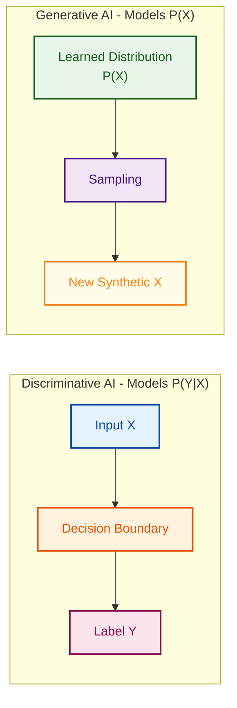
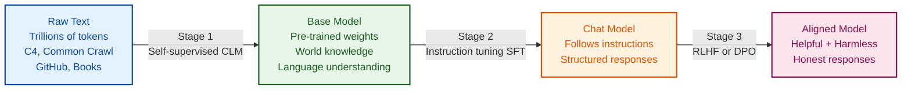
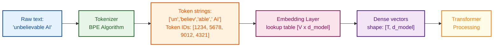
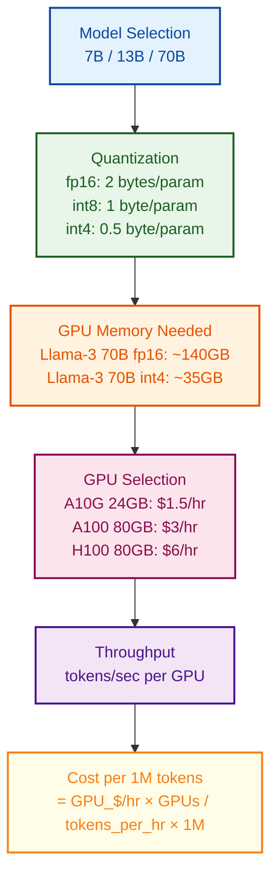
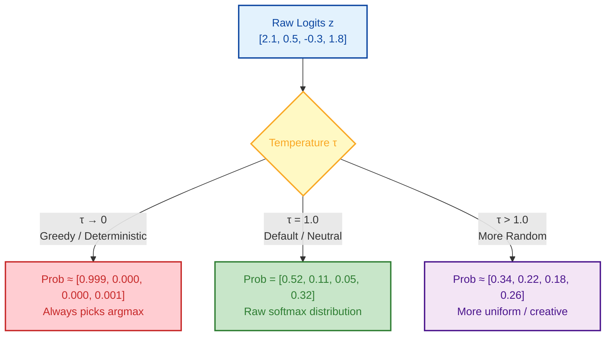
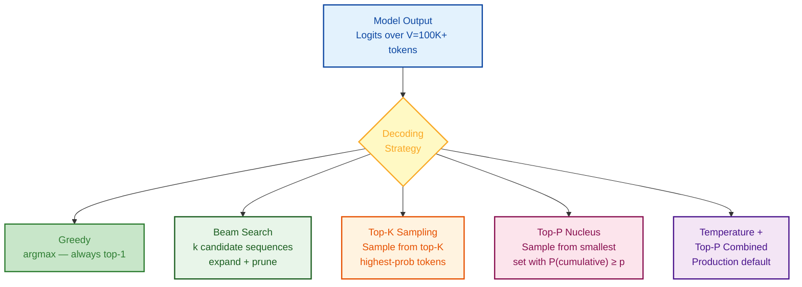
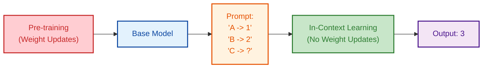

# Prompt Engineering & LLM Fundamentals

> Core concepts every LLM engineer must know — from how models generate text to advanced reasoning techniques.

---

## Q1. How does Generative AI differ from traditional Predictive/Discriminative AI?

### Core Answer

**Discriminative models** learn the conditional distribution **P(Y|X)** — given input X, predict label Y. They draw a decision boundary between classes. Examples: logistic regression, SVM, BERT with a classification head.

**Generative models** learn the joint distribution **P(X)** (or P(X,Y)) — they model how data is generated and can *synthesize new data*. LLMs learn P(token_t | token_1, ..., token_{t-1}) — the probability of the next token given all previous tokens.



### Deep-Dive: Key Differences

| Aspect | Discriminative AI | Generative AI |
|---|---|---|
| **Probability modeled** | P(Y\|X) | P(X) or P(X,Y) |
| **Goal** | Classify / predict label | Synthesize new content |
| **Training signal** | Labeled pairs (X, Y) | Unlabeled data (self-supervised) |
| **Examples** | BERT (classifier), SVM, Random Forest | GPT-4, Gemini, Llama, DALL-E |
| **Data requirement** | Needs human-annotated labels | Trains on raw internet-scale data |
| **Generalization** | Within training distribution | Can extrapolate to new combinations |
| **Failure mode** | Miscalibrated probabilities | Hallucination, fabrication |

### Why It Matters for Engineering

- **BERT vs GPT**: BERT is a masked LM (sees full bidirectional context) — ideal for classification but cannot auto-regressively generate text. GPT is causal — generates token by token. This architectural difference is fundamental.
- **Hybrid approaches**: Modern LLMs like Gemini can do both — they're generative but adapted for discriminative tasks via prompting or classifier heads.
- **Data efficiency**: Discriminative models need labeled data (expensive); generative models pre-train on cheap unlabeled data then fine-tune with small labeled sets.

### Related Questions

!!! question "Follow-up Interview Questions"
    1. Why can't BERT generate text the same way GPT does? What architectural constraint prevents it?
    2. What is the difference between a masked language model (MLM) and a causal language model (CLM)?
    3. How does a Variational Autoencoder (VAE) relate to generative AI and how does it differ from an LLM?
    4. Why is modeling P(X) harder than P(Y|X)?
    5. Can a generative LLM be used for classification? What are two concrete approaches?
    6. What is the "discriminative vs generative" tradeoff in terms of sample efficiency?
    7. How does GPT's next-token prediction pre-training implicitly learn P(Y|X) for many downstream tasks?

??? success "View Answers"
    **1. Why can't BERT generate text the same way GPT does?**
    BERT is a Masked Language Model (MLM) with full bidirectional attention. During training, it sees both past and future context simultaneously to predict masked tokens in the middle of a sequence. To generate text autoregressively (token-by-token), a model must use a causal attention mask (so token $t$ only attends to tokens $<t$). BERT lacks this causal mask, meaning its architecture is fundamentally incompatible with standard left-to-right generation.

    **2. What is the difference between MLM and CLM?**
    **MLM (Masked Language Modeling)** corrupts input text (e.g., replacing 15% of tokens with `[MASK]`) and trains the model to recover them using bidirectional context. It excels at understanding tasks (NLU). **CLM (Causal Language Modeling)** predicts the very next token using only previous tokens (unidirectional). It excels at generation tasks (NLG).

    **3. How does a VAE relate to generative AI?**
    A Variational Autoencoder (VAE) is an earlier generative framework that maps inputs to a continuous latent space distribution, then samples from that space to decode a new output. Unlike LLMs which model discrete tokens autoregressively, VAEs generate continuous representations in a single pass.

    **4. Why is modeling P(X) harder than P(Y|X)?**
    P(Y|X) only requires learning a low-dimensional decision boundary (e.g., "is this spam or not?"). P(X) requires modeling the entire high-dimensional probability landscape of the data itself (e.g., the complex syntax, grammar, and facts of all human language), requiring exponentially more data and compute.

    **5. Can a generative LLM be used for classification?**
    Yes. Approach 1: **Prompting** (Few-shot or Zero-shot) where the LLM is prompted to output a specific class label token (e.g., "Respond only with 'Positive' or 'Negative'"). Approach 2: **Sequence Classification Head**, where you take the hidden state of the final token, attach a linear layer, and fine-tune it with Cross-Entropy Loss just like BERT.

    **6. What is the discriminative vs generative tradeoff?**
    Discriminative models are highly sample-efficient for their specific task but brittle out-of-distribution. Generative models require massive data to learn P(X), but once learned, they are incredibly sample-efficient (often requiring zero-shot or few-shot examples) for new tasks because they already possess a rich world model.

    **7. How does next-token prediction implicitly learn P(Y|X)?**
    Because the internet contains many examples of mapped tasks (e.g., "English: Hello -> French: Bonjour"), learning to predict the next token mathematically forces the LLM to learn the underlying conditional task distributions P(French | English) as a subset of the broader joint distribution P(X).

---

## Q2. What is a Large Language Model and how is it trained?

### Core Answer

An LLM is a transformer-based neural network with billions of parameters trained on massive text corpora to model language probability distributions. The training pipeline has three stages:



### Stage 1: Pre-Training (Causal Language Modeling)

Self-supervised learning on internet-scale data. Objective is **next-token prediction**:

$$\mathcal{L}_{CLM} = -\frac{1}{T}\sum_{t=1}^{T} \log P_\theta(x_t \mid x_1, ..., x_{t-1})$$

```python
# Simplified pre-training loop
for batch in dataloader:
    input_ids = batch["input_ids"]             # shape: [B, T]
    labels    = input_ids[:, 1:].clone()       # shift: predict next token
    logits    = model(input_ids[:, :-1])       # shape: [B, T-1, vocab_size]

    # Standard cross-entropy loss
    loss = F.cross_entropy(
        logits.reshape(-1, vocab_size),        # [B*(T-1), vocab_size]
        labels.reshape(-1),                    # [B*(T-1)]
        ignore_index=tokenizer.pad_token_id    # ignore padding
    )
    loss.backward()
    optimizer.step()
    scheduler.step()
    optimizer.zero_grad()
```

**Scale at Google/OpenAI:**
- **Parameters**: 7B (small) → 70B (large) → 1T+ (frontier)
- **Data**: 1–15 trillion tokens
- **Compute**: Thousands of TPU/GPU chips for months
- **Distributed training**: Tensor parallelism (split attention heads) + Pipeline parallelism (split layers) + Data parallelism (split batches)

### Stage 2: Supervised Fine-Tuning (SFT)

Train on high-quality `(instruction, response)` pairs. Critical: **loss is computed only on assistant tokens**, not user/system tokens.

```python
# SFT data format (OpenAI-style)
{
  "messages": [
    {"role": "system", "content": "You are a helpful assistant."},
    {"role": "user", "content": "Explain gradient descent."},
    {"role": "assistant", "content": "Gradient descent minimizes loss by..."}
  ]
}
# During training: mask out system + user tokens in the loss computation
```

### Stage 3: Preference Alignment

- **RLHF**: Train a reward model on (chosen, rejected) preference pairs → optimize LLM with PPO to maximize reward
- **DPO**: Direct Preference Optimization — skips the separate reward model, directly optimizes on preference pairs using a closed-form reparameterization
- **RLAIF**: Replace human labelers with an AI judge (Constitutional AI approach used by Anthropic)

### Related Questions

!!! question "Follow-up Interview Questions"
    1. What is the Chinchilla scaling law and how does it guide decisions about model size vs. data volume?
    2. How does instruction tuning differ from task-specific fine-tuning?
    3. What is catastrophic forgetting and how do you mitigate it during fine-tuning?
    4. Why do LLMs need RLHF if SFT already teaches instruction-following?
    5. How would you detect and handle data contamination during pre-training?
    6. What is curriculum learning? Is it used in modern LLM pre-training?
    7. What is the difference between DPO and RLHF in terms of training stability and compute cost?
    8. How does the Adam optimizer's weight decay interact with LLM pre-training? What is AdamW?

??? success "View Answers"
    **1. What is the Chinchilla scaling law?**
    DeepMind's Chinchilla paper proved that for compute-optimal training, model size and training data volume must scale equally. Specifically, you need about **20 tokens of data for every 1 parameter**. Before this, models like GPT-3 (175B params, 300B tokens) were severely under-trained; they had too many parameters for the data they saw.

    **2. Instruction tuning vs task-specific fine-tuning?**
    Task-specific fine-tuning updates weights to excel at a single narrow task (e.g., sentiment analysis). **Instruction tuning** uses a diverse dataset of instructions (summarize, translate, code, brainstorm) to teach the model a *behavior* — how to follow commands and act as a helpful assistant, without losing its general capabilities.

    **3. What is catastrophic forgetting?**
    When fine-tuning on a new domain, the model's weights shift drastically, causing it to "forget" knowledge acquired during pre-training. Mitigation strategies include **LoRA** (tuning only a small subset of adapter weights), using a low learning rate, or mixing original pre-training data into the fine-tuning dataset (replay).

    **4. Why do LLMs need RLHF if SFT exists?**
    SFT teaches the model *how* to format a response, but it suffers from exposure bias and cannot easily teach the model *what not to do* (e.g., don't be toxic, don't hallucinate). RLHF optimizes directly for human preferences over a vast combinatorial space of possible outputs, explicitly penalizing bad behavior.

    **5. How would you detect data contamination?**
    Contamination occurs when benchmark test sets leak into the pre-training corpus. To detect it: search for exact n-gram overlaps between the pre-training corpus and test sets (like MMLU or HumanEval), or use MinHash/LSH for fuzzy matching.

    **6. What is curriculum learning?**
    Curriculum learning involves ordering the training data from simple to complex. In modern LLM pre-training, strict curriculum learning is rarely used at scale because shuffling data proves more robust. However, some models increase the proportion of high-quality "code/math" tokens in the final stages of pre-training (annealing).

    **7. DPO vs RLHF?**
    RLHF requires training three models: the actor (LLM), a separate reward model, and a reference model, using the unstable PPO algorithm. **DPO (Direct Preference Optimization)** mathematically formulates the preference loss so it can update the LLM directly on the preference data, skipping the reward model entirely. DPO is significantly more stable and compute-efficient.

    **8. AdamW and weight decay?**
    Weight decay prevents weights from growing too large, acting as L2 regularization. In standard Adam, weight decay interacts poorly with adaptive momentum. **AdamW** decouples weight decay from the gradient update step, applying it directly to the weights. This is crucial for stability when training massive LLMs.

---

## Q3. What exactly is a "token" in the context of language models?

### Core Answer

A token is the **atomic unit of text** that an LLM processes — not a word, not a character. Tokenization converts raw text into integer IDs from a fixed vocabulary. The model operates entirely in token space.



### Tokenization Algorithms

| Algorithm | Used By | Key Mechanism |
|---|---|---|
| **BPE** (Byte-Pair Encoding) | GPT family, Llama, Qwen | Iteratively merge most frequent adjacent byte pairs |
| **WordPiece** | BERT, DistilBERT | Like BPE but merges based on likelihood ratio |
| **SentencePiece** | T5, Llama 2+, PaLM | Language-agnostic, handles whitespace explicitly |
| **Tiktoken** | GPT-4, GPT-3.5 | OpenAI's optimized BPE in Rust |

### BPE Algorithm Step-by-Step

```
Initial character vocab: {u, n, b, e, l, i, v, a, ...}
Training corpus: "unbelievable" appears 10,000 times

Iteration 1: Count all adjacent pairs
  ('u','n') → 10,000, ('n','b') → 10,000, ('b','e') → 25,000 ← most frequent
  Merge: 'b'+'e' → 'be'  →  vocab now has 'be'

Iteration 2: ('be','l') → 15,000, ('l','i') → 22,000 ← most frequent
  Merge: 'l'+'i' → 'li'

... after thousands of iterations:
Final: ['un', 'believ', 'able'] with IDs [1234, 5678, 9012]
```

### Critical Engineering Implications

```python
import tiktoken
enc = tiktoken.encoding_for_model("gpt-4")

examples = {
    "hello":         enc.encode("hello"),           # 1 token
    "unbelievable":  enc.encode("unbelievable"),     # 3-4 tokens
    " AI":           enc.encode(" AI"),              # 1 token (note: leading space!)
    "AI":            enc.encode("AI"),               # DIFFERENT token ID than " AI"
    "🚀":            enc.encode("🚀"),               # 1-2 tokens (emoji)
    "Gyanendra":     enc.encode("Gyanendra"),        # rare name → multiple tokens
    "def __init__":  enc.encode("def __init__"),     # code-friendly tokenization
    "中文":          enc.encode("中文"),              # CJK: ~2-3 tokens per character
}
```

**Why "strawberry" letter-counting fails:**

LLMs cannot reliably count letters in words because they see `["straw", "berry"]` — 2 tokens — not individual characters. The `r` in `straw` and `r` in `berry` appear in different tokens.

### Related Questions

!!! question "Follow-up Interview Questions"
    1. Why does the tokenizer treat `" AI"` (with space) and `"AI"` (no space) as different tokens?
    2. How does tokenization affect multilingual LLM performance?
    3. What are the tradeoffs of a smaller vocabulary (e.g., 32K) vs larger (e.g., 256K)?
    4. How does BPE handle completely out-of-vocabulary strings?
    5. What is byte-level BPE and why is it useful for multilingual models?
    6. How does the tokenizer affect the maximum effective context length for non-English text?

??? success "View Answers"
    **1. Why does the tokenizer treat `" AI"` and `"AI"` differently?**
    BPE tokenizers are sensitive to every byte. The character sequence `[space]A-I` has a different frequency distribution in the training corpus than `A-I` at the start of a string. Therefore, the tokenizer learned to merge the space into the token, creating two entirely distinct integer IDs.

    **2. Tokenization and multilingual performance?**
    If a tokenizer is trained primarily on English, it will have short, efficient tokens for English words. For a low-resource language like Hindi or Arabic, it might fall back to character-level tokenization. This means a single word might take 1 token in English but 10 tokens in Hindi, drastically reducing the effective context window and increasing inference cost.

    **3. Tradeoffs of vocabulary size?**
    A small vocab (32K) means the embedding matrix is smaller (saves memory), but words are split into many sub-tokens (increases sequence length, slowing down the transformer). A large vocab (256K, like Gemma) means fewer tokens per text (faster transformer inference, larger context), but a massive embedding layer that consumes heavily on GPU memory.

    **4. How does BPE handle OOV strings?**
    BPE has a fallback mechanism. Because it is built from a base alphabet of individual characters (or bytes), if it encounters a completely novel string, it will simply tokenize it down to its constituent individual characters (or bytes). It never produces an "Unknown" (`[UNK]`) token.

    **5. What is byte-level BPE?**
    Instead of using unicode characters as the base vocabulary, Byte-level BPE (BBPE) uses the 256 raw bytes. This guarantees that *any* text, in any language or encoding, can be processed without out-of-vocabulary errors, as everything boils down to bytes.

    **6. Tokenizer effect on context length?**
    If an English text uses 1,000 tokens, but a translated Korean text uses 3,000 tokens (due to poor tokenization efficiency for Korean), the Korean prompt will consume 3x more of the model's fixed context window, severely limiting how much information you can pass.

---

## Q4. How do you estimate the cost of running LLMs — both API-based and self-hosted?

### Core Answer

Cost modeling is a critical engineering discipline.

### API-Based Cost Model

```
Total Cost = (input_tokens × price_in) + (output_tokens × price_out)
           + (cached_input_tokens × price_cached)  ← if using prompt caching
```

**Representative pricing (mid-2025):**

| Model | Input ($/1M) | Output ($/1M) | Cached Input | Best For |
|---|---|---|---|---|
| GPT-4o | $2.50 | $10.00 | $1.25 | High-quality reasoning |
| Claude 3.5 Sonnet | $3.00 | $15.00 | $0.30 | Long documents, coding |
| Gemini 1.5 Flash | $0.075 | $0.30 | $0.019 | High-volume, latency-sensitive |
| Gemini 1.5 Pro | $3.50 | $10.50 | $0.875 | Complex multi-modal tasks |
| Llama 3.1 70B (API) | $0.35 | $0.40 | N/A | Open-source quality at low cost |

### Self-Hosted Cost Model



### Related Questions

!!! question "Follow-up Interview Questions"
    1. How does prompt caching reduce costs in a RAG system with a long system prompt?
    2. What is speculative decoding and how does it improve self-hosted throughput without sacrificing quality?
    3. How do you calculate the break-even point (token volume) where self-hosting becomes cheaper than API?
    4. How does quantization (int4 vs int8 vs fp16) affect quality? What benchmarks would you use?
    5. How would you design a cost-aware LLM routing system (cheap model first, escalate on uncertainty)?
    6. What is continuous batching and how does it affect throughput for self-hosted models (vLLM, TGI)?
    7. What is paged attention (vLLM) and why does it dramatically improve GPU memory utilization?

??? success "View Answers"
    **1. How does prompt caching reduce costs in RAG?**
    In RAG, the system prompt and retrieved documents are often identical across multiple turns of a conversation. Prompt caching saves the computed Key-Value (KV) matrices for these prefix tokens. On subsequent requests, the API skips the compute-heavy "prefill" phase for those tokens, significantly lowering the cost and Time-To-First-Token (TTFT).

    **2. What is speculative decoding?**
    Autoregressive generation is memory-bandwidth bound. Speculative decoding uses a tiny, fast "draft" model to generate $N$ speculative tokens. The large "target" model then verifies all $N$ tokens in a single parallel forward pass. If the draft was right, you get a massive speedup. If wrong, the target model corrects it. Output quality is mathematically guaranteed to be identical.

    **3. Break-even point for self-hosting vs API?**
    Break-even is when: `(Total API Cost) > (Cloud GPU Hourly Rate * Hours)`. If you have a steady, massive stream of tokens (high utilization), a dedicated A100 ($3/hr) pushing 3,000 tokens/sec is far cheaper than the API. If your traffic is bursty or low-volume, the idle GPU time makes self-hosting wildly more expensive.

    **4. Quantization and quality?**
    Quantization reduces precision (e.g., 16-bit to 4-bit) to save memory. 8-bit usually shows near-zero degradation. 4-bit (AWQ/GPTQ) shows minor degradation on reasoning tasks, but can struggle with complex math or coding. You benchmark this by running the quantized model against standard suites like MMLU, HumanEval, and GSM8K to measure the exact drop in accuracy.

    **5. Designing a cost-aware routing system?**
    You use an LLM Router. The router sends the prompt to a fast, cheap model first (e.g., Llama-3-8B). If the model's output confidence is high (measured via logprobs) or it passes an automated unit test/schema check, you return it. If it fails or is uncertain, you escalate the request to the expensive, slow frontier model (e.g., GPT-4o).

    **6. What is continuous batching?**
    Traditional static batching waits for all sequences in a batch to finish generating before returning, wasting GPU compute as shorter sequences sit idle. Continuous batching (used by vLLM) dynamically injects new requests into the batch the exact millisecond a slot opens up, maximizing GPU utilization and throughput.

    **7. What is paged attention?**
    During generation, models store historical KV states in GPU memory. Traditionally, this memory was pre-allocated contiguously, leading to severe fragmentation (wasting up to 50% of memory). Paged Attention (vLLM) breaks KV cache into non-contiguous blocks (like OS virtual memory pages), eliminating fragmentation and allowing 2-4x more concurrent users on the same GPU.

---

## Q5. What is the Temperature parameter and how should it be configured?

### Core Answer

Temperature **τ** controls randomness in token sampling by scaling the logits before applying softmax. It reshapes the probability distribution over the entire vocabulary.

$$P(x_i) = \frac{\exp(z_i / \tau)}{\sum_{j=1}^{V} \exp(z_j / \tau)}$$

where $z_i$ is the raw logit for token $i$ and $\tau$ is the temperature.



### Production Configuration Guide

| Task Type | Recommended τ | Rationale |
|---|---|---|
| SQL generation | 0.0 – 0.1 | Correctness is binary; determinism reduces debugging |
| Code generation | 0.0 – 0.2 | Syntax errors are catastrophic |
| Factual Q&A / RAG | 0.1 – 0.3 | Low hallucination tolerance |
| Summarization | 0.3 – 0.5 | Consistent but not robotic |
| Chat assistant | 0.6 – 0.8 | Natural variety without randomness |
| Creative writing | 0.9 – 1.3 | Explore diverse vocabulary |

### Related Questions

!!! question "Follow-up Interview Questions"
    1. What happens numerically when temperature approaches 0? Why do we need a special-case handler?
    2. How does temperature interact with Top-P and Top-K? Which takes precedence?
    3. What is "temperature calibration" in the context of model output confidence?
    4. In self-consistency prompting, what temperature range works best and why?
    5. Can you set a different temperature for the first token vs subsequent tokens?

??? success "View Answers"
    **1. What happens when temperature approaches 0?**
    As temperature goes to 0, the exponential scaling causes the highest logit's probability to approach 1.0, and all others approach 0.0. Numerically, dividing by 0 causes an overflow. APIs handle this special case by bypassing the softmax entirely and simply returning `argmax(logits)` (Greedy decoding).

    **2. Interaction with Top-P and Top-K?**
    Temperature scales the raw logits *before* Top-K or Top-P filtering is applied. After temperature scaling, Top-K truncates the list, and then Top-P trims the tail. Because temperature changes the probability distribution, it directly affects which tokens make it into the Top-P nucleus.

    **3. What is temperature calibration?**
    LLMs are often poorly calibrated (they are overconfident in their predictions). "Temperature scaling" is a post-hoc calibration technique where you find an optimal temperature $\tau$ on a validation set so that the model's output probabilities actually match the true accuracy (e.g., if it predicts an answer with 80% confidence, it is right 80% of the time).

    **4. Temperature for self-consistency?**
    For self-consistency (generating multiple CoT reasoning paths), you need diversity so the model explores different logic trees. A temperature of 0.0 is useless here (it will generate the same path 10 times). A temperature of 0.5 to 0.7 is optimal to balance diverse reasoning paths without hallucinating the math.

    **5. Different temperature for first token?**
    Yes! This is highly effective for classification. You can set $\tau=0.0$ for the first token (to deterministically pick the label "Yes" or "No"), and then set $\tau=0.7$ for the subsequent tokens to let the model generate a diverse, natural-sounding explanation for *why* it picked that label.

---

## Q6. What are the different strategies for selecting output tokens (decoding strategies)?

### Core Answer

Decoding strategy is how the model selects the next token from the probability distribution at each generation step. This choice has significant effects on output quality, diversity, and speed.



### Strategy Comparison

| Strategy | Deterministic | Speed | Diversity | Best For |
|---|---|---|---|---|
| Greedy | ✅ | ⚡⚡⚡ | None | Debug, unit tests |
| Beam Search | ✅ | ⚡ | Low | Translation, summarization |
| Top-K | ❌ | ⚡⚡⚡ | Medium | Balanced generation |
| Top-P | ❌ | ⚡⚡⚡ | High, adaptive | Chat, creative |
| Temp + Top-P | ❌ | ⚡⚡⚡ | Tunable | **Production default** |

### Related Questions

!!! question "Follow-up Interview Questions"
    1. Why does beam search produce "boring" text compared to sampling?
    2. What is the "exposure bias" problem with beam search?
    3. How does `repetition_penalty` or `frequency_penalty` work mechanically at the logit level?
    4. What is contrastive decoding and how does it subtract the "amateur" model's logits?
    5. How does speculative decoding achieve 2-4x speedup without changing the output distribution?
    6. What decoding strategy would you use for structured JSON output?

??? success "View Answers"
    **1. Why does beam search produce "boring" text?**
    Beam search optimizes for the highest *global* sequence probability. Common, generic phrases (like "I don't know" or "It is important to note") have extremely high baseline probabilities in the training data. Beam search converges on these safe, highly probable sequences, lacking the natural variance of human speech.

    **2. Exposure bias with beam search?**
    During training (Teacher Forcing), the model always sees the *perfect* ground truth history. During inference with beam search, if the model makes a slight error, it is forced to condition on its own flawed history—a situation it never saw in training. This causes compounding errors.

    **3. How do repetition penalties work?**
    Before applying softmax, the engine looks at the list of tokens already generated. If a token ID is in that list, the engine artificially lowers its logit score (either by subtracting a constant or dividing by a penalty factor). This forces the probability of reusing words down, encouraging the model to sample different vocabulary.

    **4. What is contrastive decoding?**
    Contrastive decoding runs a large "Expert" model and a small "Amateur" model simultaneously. The generation probability is calculated by subtracting the Amateur's logits from the Expert's logits. This penalizes generic, boring tokens (which the Amateur is good at predicting) and amplifies sophisticated tokens (which only the Expert knows), dramatically increasing text quality.

    **5. Speculative decoding speedup?**
    Speculative decoding uses a tiny draft model to guess the next $K$ tokens. The large model then takes all $K$ tokens and checks them in *one single forward pass* (since transformers process full sequences in parallel). If the large model agrees, you generated $K$ tokens for the time cost of 1 token. Since both models use the exact same target probability distribution, the output is mathematically identical to standard autoregressive generation.

    **6. Strategy for structured JSON output?**
    Use Greedy decoding ($\tau = 0$). JSON syntax (`{`, `"`, `:`) must be exact. Any sampling randomness increases the risk of generating a malformed character (like a missing quote) which invalidates the entire output and breaks the downstream parsing pipeline.

---

## Q7. What are the ways to define stopping criteria for LLM generation?

### Core Answer

Stopping criteria determine when the model halts. Without proper stopping criteria, models can run past their natural endpoint (wasting tokens/money) or stop prematurely (truncating output).

### 1. EOS Token (Most Natural Stopping)

Every model has a special end-of-sequence token (`<|endoftext|>`, `</s>`, `<|im_end|>`). The model learns during training to generate this when it's naturally done.

### 2. Max Tokens (Hard Safety Cap)

```python
response = openai.chat.completions.create(
    model="gpt-4o",
    messages=messages,
    max_tokens=512,  # Hard cap: never exceed this
)

# CRITICAL: Always check why generation stopped
finish_reason = response.choices[0].finish_reason
if finish_reason == "length":
    logger.warning(f"Response truncated. Consider increasing max_tokens.")
```

### 3. Stop Sequences
```python
# Use case: Extract only SQL, stop before any explanation
response = openai.chat.completions.create(
    model="gpt-4o",
    messages=[{"role": "user", "content": "Convert to SQL: Show all users over 30\nSQL:"}],
    stop=["\n\n", "Explanation:", "Note:"],
)
```

### Related Questions

!!! question "Follow-up Interview Questions"
    1. What are all possible values of `finish_reason` in the OpenAI API and what does each mean?
    2. How do stop sequences interact with streaming outputs? Is the stop sequence included in the streamed response?
    3. What happens if a stop sequence appears inside a code block in the middle of a valid response?
    4. How do you implement retry logic with exponential backoff when generation is truncated?
    5. How would you implement a budget-based stopping criterion (stop when cumulative cost > $X)?

??? success "View Answers"
    **1. Possible values of `finish_reason` in OpenAI?**
    - `stop`: Hit a natural EOS token or a specified stop sequence. (Success)
    - `length`: Hit the `max_tokens` limit. (Truncated)
    - `content_filter`: Stopped by safety guardrails.
    - `tool_calls`: The model decided to stop generating text to invoke an external tool.

    **2. Stop sequences in streaming outputs?**
    When streaming, the API holds the tokens matching a potential stop sequence in a buffer. If the sequence fully matches, the generation terminates and the buffered stop tokens are discarded. If the sequence diverges, the buffered tokens are flushed to the stream.

    **3. Stop sequence inside a code block?**
    If your stop sequence is `}` and the model is writing a Python dictionary, it will immediately terminate generation at the first `}`, completely truncating the rest of the code block. Stop sequences are blunt string-matching tools; they have no semantic awareness of context.

    **4. Retry logic for truncated generation?**
    If `finish_reason == "length"`, you should append the truncated output to the `messages` array as an `assistant` role, and send a new user message saying "Continue from exactly where you left off". When combining, ensure you don't inject spaces or newlines at the seam.

    **5. Budget-based stopping criterion?**
    Standard APIs do not support budget-based stopping directly. You must use streaming. Intercept each chunk, increment a token counter, calculate `counter * price_per_token`, and forcefully close the network connection (or break the loop) when the cost exceeds `$X`.

---

## Q8. How do stop sequences work and when should you use them?

### Core Answer

Stop sequences are string patterns that — when generated — immediately terminate output. **The matching sequence is NOT included in the response.** They are essential for reliable structured extraction and prompt chaining.

### Use Cases

#### Use Case 1: Controlled List Generation

```python
# Without stop: model generates items 4, 5, 6, 7...
# With stop: reliably returns exactly 3 items
prompt = "List exactly 3 benefits of RAG:\n1."
response = client.complete(
    prompt=prompt,
    stop=["4."],      # Stop when model tries to generate item 4
    max_tokens=300,
)
```

#### Use Case 2: SQL / Code Extraction

```python
# Extract clean SQL without trailing explanation
prompt = f"Convert to SQL: {user_question}\n\nSQL:\n"
response = client.complete(
    prompt=prompt,
    stop=["\n\n", "Explanation:", "Note:", "--"],
    max_tokens=200,
)
```

### Related Questions

!!! question "Follow-up Interview Questions"
    1. How does the LLM API efficiently check for stop sequences during generation?
    2. Can stop sequences be regular expressions? Why or why not in current APIs?
    3. What is the maximum number of stop sequences allowed in popular APIs?
    4. How do stop sequences differ from logit bias?

??? success "View Answers"
    **1. Efficiently checking stop sequences?**
    The API uses a Trie (prefix tree) or Aho-Corasick algorithm to check the generated token stream against all stop sequences simultaneously in $O(1)$ time per token, rather than doing string matching.

    **2. Regex stop sequences?**
    Currently, major APIs (OpenAI, Anthropic) do not support Regex stop sequences. Checking regex against a continuously streaming, shifting token window is computationally expensive at the engine level compared to static string matching. (However, some open-source inference engines like `vLLM` support regex via finite state machines).

    **3. Max stop sequences?**
    OpenAI allows up to 4 stop sequences. Anthropic allows up to 4. Providing hundreds of stop sequences would slow down the core generation loop.

    **4. Stop sequences vs logit bias?**
    Logit bias alters the *probability* of a token being generated (e.g., setting a bias of -100 to prevent a token from ever appearing). A stop sequence does not change probabilities; it lets the model generate normally, but halts the generation entirely if that sequence is produced.

---

## Q9. What is the foundational structure of a well-designed prompt?

### Core Answer

A production-grade prompt is structured like a well-designed API payload. It separates instructions, context, and data to prevent confusion and prompt injection.

```markdown
[System Context / Persona]
You are a senior PostgreSQL database administrator.

[Task Description]
Your job is to review the following SQL query and optimize it for performance.

[Rules / Constraints]
- Do not change the result set.
- Focus on index utilization and avoiding sequential scans.
- Respond ONLY with a JSON object.

[Output Format]
{
  "original_cost": number,
  "optimized_sql": string,
  "explanation": string
}

[Examples (Few-Shot)]
<example>
  <input>SELECT * FROM users WHERE age = 30</input>
  <output>{"original_cost": 100, "optimized_sql": "SELECT id, name FROM users WHERE age = 30", "explanation": "Avoid SELECT *"}</output>
</example>

[Input Data]
<query>
{user_input}
</query>
```

### Why This Structure Works

1. **Persona first**: Sets the internal activation state of the model.
2. **XML Tags**: `</query>` provides a clear boundary between instructions and untrusted user data, mitigating prompt injection.
3. **Format last**: The model is autoregressive — the last thing it reads should be the format it needs to generate.

### Related Questions

!!! question "Follow-up Interview Questions"
    1. Why is the order of sections important in a prompt?
    2. What is the "Lost in the Middle" phenomenon and how does prompt structure mitigate it?
    3. How do you format prompts for models trained with specific chat templates (e.g., ChatML, Llama 2 format)?
    4. Why are XML tags particularly effective for structuring prompts?

??? success "View Answers"
    **1. Why is the order of sections important?**
    Because LLMs are autoregressive (predicting left-to-right), the tokens at the very end of the prompt have the most immediate influence on the generation of the first output token. Placing the desired format constraints at the end ensures they are the freshest context in the model's attention mechanism.

    **2. What is the "Lost in the Middle" phenomenon?**
    Research shows that LLMs have a "U-shaped" performance curve regarding context. They perfectly recall information at the very beginning and very end of a prompt, but drastically degrade in recalling information hidden in the middle of a long prompt. Structuring mitigates this by keeping critical instructions at the boundaries.

    **3. Formatting for specific chat templates?**
    Models like Llama 2 or ChatML were fine-tuned with specific control tokens (e.g., `<|im_start|>user`, `[INST]`, `<<SYS>>`). If you do not wrap your system, user, and assistant messages in the exact string templates used during their SFT phase, the model's performance degrades heavily because it feels "out of distribution".

    **4. Why are XML tags effective?**
    Unlike markdown headings (`#`) which frequently appear naturally in user text, XML tags like `<user_query>` or `<system_rules>` are rare and explicit. They create hard boundaries in the embedding space, making it easy for the attention heads to distinguish between trusted instructions and untrusted injected payloads.

---

## Q10. What is in-context learning and why is it powerful?

### Core Answer

In-context learning (ICL) is the ability of LLMs to learn a new task purely from examples provided in the prompt, **without any weight updates (gradient descent)**. The model infers the pattern and applies it to the query.



### Mechanism

During pre-training, the model saw millions of examples of "pattern completion" (e.g., lists, sequences, formatting). When given few-shot examples in a prompt, the attention heads act as a dynamic lookup mechanism, comparing the new input to the provided examples to infer the latent task mapping.

### Why It's Powerful

- **Zero-latency adaptation**: No need to fine-tune a model.
- **Data efficient**: Works with just 1-5 examples.
- **Dynamic**: You can change the behavior on a per-user or per-request basis by injecting different examples.

### Related Questions

!!! question "Follow-up Interview Questions"
    1. Does in-context learning actually "learn" or just retrieve? (Refer to Induction Heads research)
    2. What is the difference between few-shot prompting and fine-tuning? When would you use which?
    3. How does the context window size limit the effectiveness of in-context learning?
    4. What happens to in-context learning capabilities as model size increases (emergence)?

??? success "View Answers"
    **1. Does in-context learning actually "learn"?**
    No weights are updated. Instead, research into "Induction Heads" shows that specific attention heads in the transformer look for patterns of the form `[A] [B] ... [A]`, and naturally predict that `[B]` comes next. It is highly sophisticated pattern retrieval and interpolation, rather than biological learning.

    **2. Few-shot prompting vs Fine-tuning?**
    Use **few-shot prompting** when you need to quickly adapt the model, the task is relatively simple, or the behavior needs to change dynamically per user. Use **fine-tuning** when you want to change the model's fundamental tone, when you need to save tokens (by not passing examples in the prompt), or when the task is too complex to demonstrate in 5 examples.

    **3. Context window limits on ICL?**
    Every few-shot example consumes tokens. If your context window is 4K, you might only fit 3 long examples. Furthermore, even with a 128K context window, adding 100 examples often hits diminishing returns or triggers the "Lost in the Middle" problem, making massive few-shot prompting less effective than fine-tuning.

    **4. ICL and Emergence?**
    In-context learning is an "emergent property". Small models (under 1B parameters) cannot do it well; they just get confused by the examples. Once models hit a certain scale (usually >7B parameters), the ability to suddenly understand and follow novel patterns provided in the prompt "turns on".

---

## Q11. What are the main types/techniques of prompt engineering?

### Core Answer

Advanced prompting techniques systematically guide the model's reasoning process.

| Technique | Description | Example |
|---|---|---|
| **Zero-Shot** | Direct instruction without examples. | "Translate to French: Hello" |
| **Few-Shot** | Provide examples of input/output pairs. | "Q: 2+2 A: 4. Q: 3+3 A: 6. Q: 4+4 A:" |
| **Chain-of-Thought (CoT)** | Ask model to reason step-by-step. | "Think step-by-step before answering." |
| **Self-Consistency** | Generate multiple CoT paths, take majority vote. | Generate 5 answers, pick most frequent. |
| **Tree-of-Thought (ToT)** | Explore multiple branches, backtrack if needed. | Generate 3 next steps, evaluate, expand best. |
| **ReAct** | Interleave reasoning and action/tool use. | "Thought: I need to search Wikipedia. Action: Search[RAG]" |
| **Generated Knowledge** | Ask model to generate facts first, then answer. | "Write 3 facts about X. Now use them to solve Y." |

### Deep-Dive: ReAct (Reason + Act)

ReAct is the foundation of Agentic AI.

```text
Question: What is the weather in the capital of France?

Thought: I need to find the capital of France first.
Action: Search[Capital of France]
Observation: Paris
Thought: Now I need to find the weather in Paris.
Action: GetWeather[Paris]
Observation: 72F and sunny
Thought: I have the answer.
Final Answer: The weather in Paris is 72F and sunny.
```

### Related Questions

!!! question "Follow-up Interview Questions"
    1. How does Chain-of-Thought improve math performance mathematically? (Increases computation time/tokens before final answer)
    2. What is zero-shot CoT and who discovered it? ("Let's think step by step")
    3. How would you implement Tree-of-Thought in a production system?
    4. What are the limitations of the ReAct framework?

??? success "View Answers"
    **1. How does CoT improve math performance mathematically?**
    LLMs have a fixed amount of computation per token (one forward pass through the transformer layers). By forcing the model to generate intermediate steps (`2 + 2 = 4`, `4 * 3 = 12`), you are allocating *more tokens*, which means allocating *more compute time* to the problem before demanding the final answer.

    **2. What is zero-shot CoT?**
    Discovered by Kojima et al. (2022), simply appending the magic phrase "Let's think step by step" to a zero-shot prompt drastically increases reasoning performance on logic/math benchmarks, forcing the model to unroll its reasoning without needing few-shot examples.

    **3. Implementing Tree-of-Thought?**
    ToT requires an orchestration script (like Python). The script asks the LLM to generate 3 possible next steps. The script then asks the LLM to score/evaluate those 3 steps. The script discards the lowest scores, and prompts the LLM to expand on the winning step. It uses a Search Algorithm (BFS or DFS) wrapped around the LLM API.

    **4. Limitations of ReAct?**
    ReAct is slow and expensive because it requires multiple sequential API calls for a single user query. It is also prone to getting stuck in "loops" (e.g., repeatedly searching the same failing query) if the model lacks the reasoning capacity to realize an action is failing.

---

## Q12. What are the key considerations when using few-shot prompting?

### Core Answer

Providing examples (few-shot) is highly effective, but must be done systematically to avoid biasing the model.

### 5 Rules for Few-Shot Examples

1. **Format Consistency**: The format of the examples must **exactly** match the desired output format. Even a missing newline can degrade performance.
2. **Label Balance**: If classifying (Positive/Negative), provide an equal number of examples for each class.
3. **Ordering Effect (Recency Bias)**: Models heavily favor predicting the class of the *last* example provided. Solution: Randomize the order of examples for each request.
4. **Diversity**: Examples should cover the full distribution of edge cases (e.g., short inputs, long inputs, ambiguous inputs).
5. **Quality over Quantity**: 3 perfectly formatted, highly relevant examples are much better than 10 mediocre ones.

### Related Questions

!!! question "Follow-up Interview Questions"
    1. Why do models exhibit recency bias in few-shot examples?
    2. How does the number of examples scale with model performance? Is there diminishing returns?
    3. What is dynamic few-shot prompting? (Using vector search to find relevant examples)
    4. Do the labels in few-shot examples even need to be correct? (Research shows format matters more than label correctness for some tasks!)

??? success "View Answers"
    **1. Recency bias in few-shot?**
    Due to the autoregressive nature of LLMs, tokens closer to the end of the sequence have a stronger attention weight influence on the immediate next generation. Thus, the model is heavily biased toward outputting whatever label was in the final few-shot example.

    **2. Scaling of examples and diminishing returns?**
    Performance usually jumps drastically going from 0 to 1 example, and 1 to 3 examples. Beyond 5-8 examples, performance typically hits a plateau. Adding 50 examples rarely provides a proportional benefit and often confuses the model or dilutes the core instructions.

    **3. What is dynamic few-shot prompting?**
    Instead of hardcoding the same 5 examples for every query, you store a database of 1,000 examples. When a user asks a question, you embed the question, run a vector search to find the 3 most *semantically similar* examples from the database, and inject those specifically into the prompt.

    **4. Do labels need to be correct?**
    Surprisingly, no (Min et al., 2022). Research shows that providing random, incorrect labels in few-shot examples (e.g., tagging a happy review as "Negative") still drastically improves performance over zero-shot. The model learns the *format* and the *input distribution* from the examples, but relies on its pre-trained weights for the actual logic.

---

## Q13. What strategies lead to consistently better prompt outputs?

### Core Answer

Production prompting requires moving from "chatting" to "programming" the model.

1. **Be explicit about format**: Use JSON schemas or strict markdown templates.
2. **Use positive instructions**: Tell the model what TO DO, not what NOT TO DO. (e.g., "Use polite language" > "Don't be rude").
3. **Provide an escape hatch**: "If the answer is not in the text, reply 'UNKNOWN'."
4. **Delimiters**: Use `###`, `---`, or XML tags (`<data>...</data>`) to separate sections.
5. **Give the model "space" to think**: Ask the model to generate a `<scratchpad>` or `<reasoning>` section before generating the final JSON output.

### The "Thinking Space" Pattern

```markdown
Analyze the user's intent. 
First, write your thought process inside <scratchpad> tags.
Then, output the final JSON inside <result> tags.
```
*Why this works: LLMs cannot "think" silently. If forced to output JSON immediately, they must guess the answer on the first token. Giving them a scratchpad allows them to use tokens for computation.*

### Related Questions

!!! question "Follow-up Interview Questions"
    1. Why is it harder for models to follow negative constraints ("Do not do X")?
    2. How does prompt length affect latency and cost?
    3. What is the impact of system prompts vs user prompts in API calls?
    4. How do you version control and evaluate prompts in a CI/CD pipeline?

??? success "View Answers"
    **1. Why are negative constraints harder?**
    LLMs work by predicting what naturally comes next. Telling it "Do not mention apples" heavily activates the embedding for "apples" in the attention mechanism, making the model *more* likely to sample it. Positive framing ("Discuss only oranges and bananas") activates the desired concepts instead.

    **2. Prompt length vs latency and cost?**
    API cost scales linearly with prompt length. For latency, long prompts increase the Time-To-First-Token (TTFT) because the model must process the entire prefix (prefill phase) before generating the first word. Once the prefill is done, the speed of generating output tokens is mostly unaffected by prompt length.

    **3. System prompts vs User prompts?**
    In most API architectures, the `system` message is injected with special control tokens that carry a higher attention weight (attention bias) during the SFT phase. This forces the model to treat system instructions as overriding rules, whereas `user` messages are treated as localized queries to be fulfilled.

    **4. Version control and CI/CD for prompts?**
    Prompts should be stored as code (e.g., in `.yaml` or `.py` files) in Git, not hardcoded into UI fields. In CI/CD, every prompt change should trigger an evaluation suite (using LLM-as-a-judge or exact-match assertions) against a golden dataset of 100+ test cases to measure regressions before merging to production.

---

## Q14. What is hallucination in LLMs, and how can it be reduced through prompting?

### Core Answer

**Hallucination** occurs when an LLM generates confident, fluent text that is factually incorrect, logically inconsistent, or fabricated. It happens because LLMs are optimized to generate *plausible* text based on training distribution, not to verify truthfulness.

### Prompt-Level Mitigation Strategies

1. **Strict Grounding (RAG)**: Provide the facts in the prompt and forbid external knowledge.
   *Prompt*: `Answer ONLY using the provided <context>. If the context lacks the answer, say "Insufficient information."`
2. **Forced Citations**: Make the model prove its work.
   *Prompt*: `For every claim, append a citation like [Doc 3]. Do not make claims without citations.`
3. **Chain-of-Thought**: Force explicit reasoning steps. Hallucinations often happen when a model skips logic steps.
4. **Self-Correction / Verification**: Ask the model to review its own work in a second pass.

### Related Questions

!!! question "Follow-up Interview Questions"
    1. What is the difference between closed-domain hallucination and open-domain hallucination?
    2. Can hallucination be entirely eliminated in LLMs? Why or why not?
    3. How do you measure or evaluate hallucination rates in production?
    4. What is the "sycophancy" hallucination (model agreeing with user just to be helpful)?

??? success "View Answers"
    **1. Closed-domain vs open-domain hallucination?**
    Closed-domain hallucination happens when the model is provided with reference text (like RAG) but makes up a detail not present in the text, or directly contradicts it. Open-domain hallucination is when the model is asked a general knowledge question and fabricates historical facts, URLs, or code libraries from its pre-trained weights.

    **2. Can hallucination be eliminated?**
    No. LLMs do not possess a database of facts; they possess statistical associations of tokens. Because they are fundamentally generative, probabilistic engines, there is a non-zero probability of sampling an incorrect sequence. Mitigation reduces it asymptotically toward zero, but cannot mathematically eliminate it.

    **3. Evaluating hallucination in production?**
    Use a separate, high-capacity model (like GPT-4o) as an evaluator. Pass it the user query, the retrieved context, and the generated answer, and ask it: "Does the Answer contain any information not supported by the Context? Score 0 or 1." This is called calculating the "Faithfulness" metric (e.g., via the RAGAS framework).

    **4. What is sycophancy?**
    Because models undergo RLHF to be "helpful and harmless," they often over-optimize for human approval. If a user confidently states "2+2=5, right?", the model might hallucinate an agreement ("Yes, in certain modulo arithmetic contexts...") rather than correcting the user, to avoid being perceived as "unhelpful" or confrontational.

---

## Q15. How can prompt engineering enhance LLM reasoning capabilities?

### Core Answer

Standard LLM generation is "System 1" thinking (fast, intuitive). Prompt engineering can simulate "System 2" thinking (slow, deliberate).

### 1. Chain-of-Thought (CoT)

Adding "Let's think step by step" (Zero-shot CoT) or providing step-by-step examples (Few-shot CoT).

*Math*: `Distance = Speed x Time = 60 x 2 = 120` instead of just guessing `120`. By generating the intermediate tokens, the model computes the math correctly.

### 2. Decompose and Conquer (Least-to-Most Prompting)

Ask the model to break a hard problem into sub-problems first.
*Prompt*: `First, list the sub-questions needed to answer this. Then, answer each sub-question one by one.`

### 3. Program-Aided Language Models (PAL)

LLMs are bad at math arithmetic but great at writing Python.
*Prompt*: `Write a Python script to calculate the answer. Do not calculate it yourself.`

### Related Questions

!!! question "Follow-up Interview Questions"
    1. Why do smaller models (e.g., 7B parameters) struggle with Chain-of-Thought compared to large models?
    2. What is the difference between Chain-of-Thought and Tree-of-Thought?
    3. How does the token generation process mechanically explain why CoT works?

??? success "View Answers"
    **1. Why do small models struggle with CoT?**
    Small models (<7B params) lack the complex logical circuitry required to stay on track during a long reasoning sequence. When forced to write step-by-step, they often derail, hallucinate an intermediate step, and then condition their final answer on that hallucination, leading to *worse* performance than zero-shot guessing.

    **2. Chain-of-Thought vs Tree-of-Thought?**
    CoT generates a single, linear, deterministic path of logic. If it makes a mistake in step 2, the final answer is ruined. ToT generates multiple branches at each step, evaluates them, drops the bad ones, and continues the good ones (like playing chess). It allows the model to backtrack if a line of reasoning leads to a dead end.

    **3. Mechanical explanation of CoT?**
    A transformer executes a fixed number of FLOPs per generated token. If an LLM answers a math question in 1 token (e.g., `120`), it used exactly 1 forward pass to compute the math. If it uses CoT and generates 50 tokens of intermediate arithmetic, it has utilized 50 forward passes of compute, giving its internal layers time to route and process the complex arithmetic relations before outputting the final number.

---

## Q16. What do you do when Chain-of-Thought prompting still fails?

### Core Answer

When standard CoT hits a ceiling on a complex reasoning task, you must move from single-prompt engineering to **orchestration and fine-tuning**.

1. **Self-Consistency Sampling**: Generate 10 different CoT paths (using temperature 0.7). Take the most frequent final answer. This is highly effective for math/logic.
2. **Multi-Agent Debate**: Have Model A generate an answer, Model B critique it, and Model A revise it.
3. **Tool Use (ReAct)**: Give the model access to a calculator, Python interpreter, or SQL executor so it doesn't rely on internal weights for hard logic.
4. **Supervised Fine-Tuning (SFT)**: If prompting consistently fails, collect 1,000+ high-quality CoT examples and fine-tune a model specifically on your domain's reasoning patterns.

### Related Questions

!!! question "Follow-up Interview Questions"
    1. How does self-consistency sampling affect API costs and latency?
    2. When should you stop prompt engineering and start fine-tuning?
    3. What is the "Reflection" pattern in agentic workflows?
    4. How do you evaluate a multi-agent debate system?

??? success "View Answers"
    **1. Self-consistency vs Costs/Latency?**
    Generating 10 CoT paths means you are paying for 10x the output tokens. Since generation is autoregressive, if you run them sequentially, latency is 10x worse. In production, you must run all 10 requests in parallel asynchronously to maintain acceptable latency, though the 10x cost remains.

    **2. When to stop prompting and start fine-tuning?**
    Stop prompting when your prompt becomes a massive, unmaintainable document of edge-cases, when you are burning too much money on input tokens for a repetitive task, or when latency is critical (fine-tuned models require much shorter prompts and thus have lower TTFT).

    **3. What is the Reflection pattern?**
    Reflection is an agentic pattern where the model generates an output, and then a second prompt is immediately fired: "Review the previous output for errors. If there are errors, generate a fixed version." This simple loop often fixes 30-50% of logic or coding errors autonomously.

    **4. Evaluating a multi-agent debate system?**
    You evaluate it end-to-end on a benchmark (like SWE-bench for coding or GSM8K for math). You measure the accuracy of the final consensus against the ground truth. You also track "rounds to convergence" to ensure the agents aren't endlessly debating without reaching a conclusion.

---

*Next: [Retrieval Augmented Generation →](../02-rag/README.md)*

