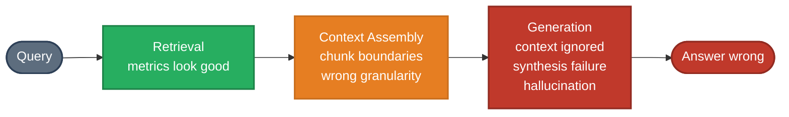

# RAG — Interview Questions

Role focus: **AI Engineer**

---

## Q1 — When Good Retrieval Produces Bad Answers

**Question:** Retrieval metrics (recall@K, MRR) look solid but users are still getting wrong or incomplete answers. The problem is downstream of retrieval. Walk through the diagnostic framework and fixes.

**Short answer:** Good retrieval does not guarantee good answers. Five failure modes exist between the retrieved context and the final response — each requires a different fix.

---

### The retrieval-generation gap

Retrieval metrics measure stage 1. If stage 1 is healthy, the problem is in stages 2–4. The failure is not "wrong documents" — it's "right documents, wrong answer."

---

### Failure mode 1: Retrieved but not used

The relevant information is in the context window, but the model ignores it and answers from parametric memory instead.

**How to detect:** Run the same query with and without retrieval. If answers are similar, the model isn't reading the context.

**Fixes:**
- Explicitly instruct the model: "Answer only using the provided context below. Do not use prior knowledge."
- Reduce context length — relevant content buried at position 40 of 50 chunks gets underweighted ("lost in the middle")
- Sort chunks by relevance score so the highest-scoring content appears first

---

### Failure mode 2: Chunk boundary fragmentation

The answer spans two consecutive chunks, but each chunk alone is incomplete — neither chunk is returned by the retriever.

**Example:** A policy document where the rule appears in chunk N and the exception appears in chunk N+1. Retrieval returns N but not N+1. The answer is incomplete.

**Fixes:**
- Add chunk overlap (e.g., 10–20% overlap between adjacent chunks)
- Use hierarchical retrieval: retrieve at the document or section level first, then extract the relevant passage
- Decompose multi-part questions and retrieve separately for each sub-question

---

### Failure mode 3: Wrong granularity

Retrieval returns topically correct content at the wrong level of detail — high-level overview when the user needs specifics, or a narrow fragment when the user needs the broader picture.

**Fixes:**
- Maintain multiple indexes at different granularities (summaries + detailed chunks)
- Classify query intent to route to the appropriate index
- Use RAPTOR-style recursive summarization to build a hierarchy of summary nodes

---

### Failure mode 4: Synthesis required but not performed

The answer requires combining information from multiple retrieved chunks, but the model summarizes each chunk independently instead of synthesizing across them.

**Example:** "Compare approach A and approach B" — chunks about A and chunks about B are both retrieved, but the model produces two separate summaries rather than a comparison.

**Fixes:**
- Explicit synthesis instruction: "The context below contains information about multiple approaches. Synthesize and compare them directly."
- Multi-hop reasoning chains: break complex questions into sub-questions, answer each, then combine
- Pre-process retrieved chunks into a comparison table before feeding to the model

---

### Failure mode 5: Hallucination despite grounded context

The model generates plausible-sounding content that neither contradicts nor is supported by the retrieved context — it simply fills gaps with confident-sounding fabrication.

**Fixes:**
- Require citations: "For every factual claim, include [Source: chunk_id]. If you cannot provide a citation, do not state the claim."
- Reduce temperature for factual retrieval tasks
- Add a verification step: after generation, run a second LLM pass that checks each claim against the retrieved context (faithfulness scoring)

---

### Debugging workflow

1. **Error categorization (manual, 20–30 bad answers):** Classify each failure by the modes above. Different modes require different solutions — misdiagnosis leads to wasted effort.

2. **Pipeline instrumentation:** Log retrieved chunks with scores, the full assembled prompt, and the model's chain-of-thought (if using CoT). Invisibility is the main obstacle to debugging RAG.

3. **Targeted metrics:** Add generation-level metrics beyond retrieval:
   - **Faithfulness** — what fraction of generated claims are supported by context?
   - **Answer completeness** — does the answer cover all sub-questions asked?
   - **Context utilization** — what fraction of the retrieved context contributed to the answer?

---

*Back to [RAG →](README.md) · See also: [Hallucination Control →](../11-hallucination/README.md)*
