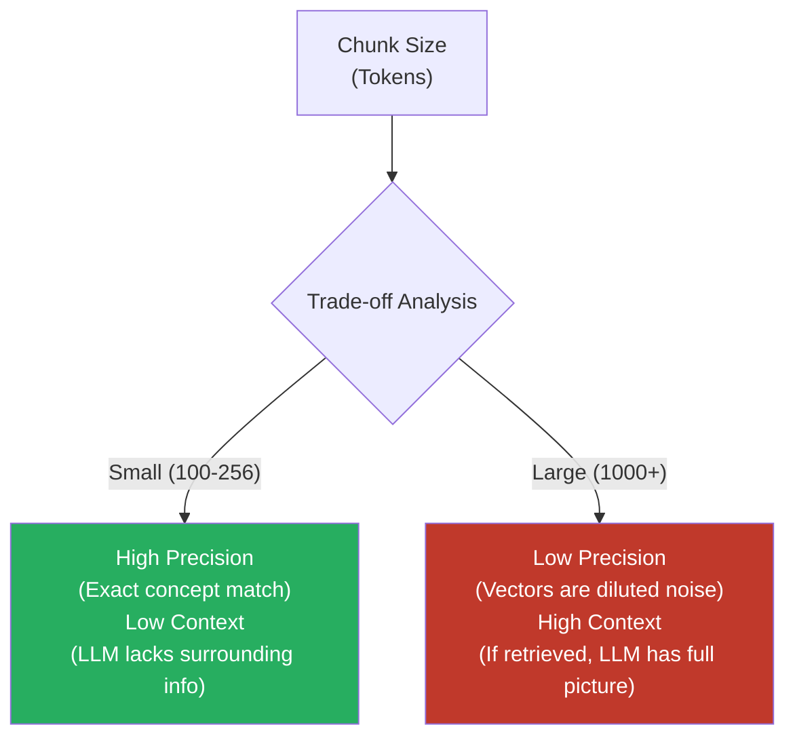
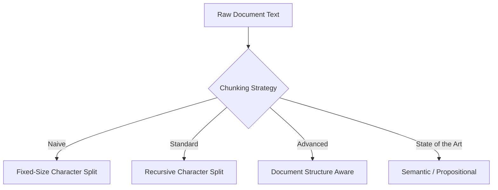
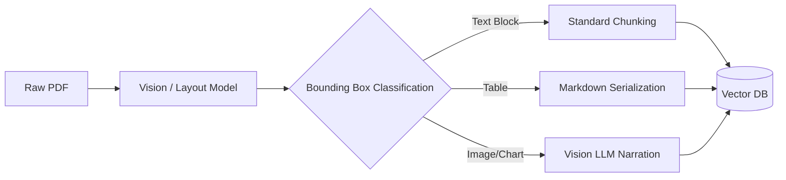

# Document Digitization & Chunking

> How you split your documents is often the single biggest factor in RAG retrieval quality. Answers are calibrated for a **Google L5 Senior AI/ML Engineer** interview bar.

---

## Q1. What is the mathematical and operational necessity of chunking in a RAG pipeline?

### Core Answer

**Chunking** is the systematic process of fracturing large, monolithic documents into smaller, semantically contiguous blocks before vectorization.

It solves three fundamental engineering constraints:
1. **Context Window Limits:** LLMs have finite input windows (e.g., 8k, 32k, 128k). You physically cannot inject a 500-page PDF into a standard prompt.
2. **Embedding Model Constraints:** Dense embedding models (like BERT variants) typically possess a maximum sequence length of 512 tokens. Passing 2,000 tokens to a 512-token embedder results in the model silently truncating the trailing 1,488 tokens, causing massive data loss.
3. **Signal-to-Noise Ratio (Dilution):** Mathematically, a dense vector represents the *average* semantic meaning of its input text. If you embed a 10-page chapter, the specific fact (the "needle") is averaged out by the thousands of other words (the "haystack"). Small chunks preserve the exact semantic geometry of specific facts.



### Related Questions

!!! question "Follow-up Interview Questions"
    1. What happens mathematically to a dense embedding if a chunk is too large?
    2. How does the choice of embedding model dictate your maximum chunk size?
    3. Why does chunking affect citation accuracy?
    4. What is the "Small-to-Big" (Parent-Child) chunking strategy?

??? success "View Answers"
    **1. Mathematical dilution of large chunks?**
    Dense embeddings use mean-pooling over token representations to generate a single fixed-length vector (e.g., 768 dimensions). If you average 100 tokens, the vector strongly points toward those specific concepts. If you average 2,000 tokens covering 5 different topics, the resulting vector points to the geometric center of those topics, which might be a generic, empty space in the latent manifold.

    **2. Embedding model constraints?**
    Many open-source models (like `BGE-Large` or `MiniLM`) use an absolute positional encoding limit of 512 tokens. If your chunk size is 1000, the last 488 tokens are simply dropped before the forward pass. Newer models like `text-embedding-3-large` support up to 8191 tokens, but suffer from the dilution problem mentioned above.

    **3. Citation accuracy?**
    In RAG, if an LLM uses a chunk, the UI displays that chunk as the source citation. If the chunk is a 5-page block of text, the user has to read all 5 pages to verify the LLM's claim. If the chunk is a single paragraph, the citation is exact and instantly verifiable.

    **4. What is Small-to-Big chunking?**
    It solves the Precision vs. Context tradeoff. You chunk the document into very small pieces (e.g., 100 tokens) to ensure highly precise vector embeddings. However, in your database, you link these small "child" chunks to their parent document. At query time, you run the vector search on the precise child chunks, but before passing the context to the LLM, you fetch and inject the entire parent document to provide maximum context.

---

## Q2. What are the primary algorithms for text chunking?

### Core Answer

Chunking is not just splitting by character count; it requires semantic awareness to avoid breaking thoughts mid-sentence.



1. **Fixed-Size with Overlap:** Splits exactly every $N$ tokens. Must include a sliding window overlap (e.g., 10%) to prevent splitting a crucial sentence exactly in half.
2. **Recursive Character Text Splitting:** Attempts to split by paragraphs (`\n\n`), then sentences (`.`), then words (` `). It only falls back to smaller separators if the paragraph exceeds the maximum chunk size.
3. **Document-Structure Aware:** Uses Markdown or HTML tags to split strictly at `<h2>` or `<h3>` boundaries, ensuring chunks map perfectly to logical sections.
4. **Semantic Chunking:** Uses an embedding model during the chunking phase to calculate the cosine similarity between adjacent sentences. If the similarity drops below a percentile threshold, it assumes a topic shift and inserts a chunk boundary.
5. **Propositional (Agentic) Chunking:** Uses an LLM to rewrite the document into atomic, self-contained factual statements (propositions) before embedding.

### Related Questions

!!! question "Follow-up Interview Questions"
    1. How does the Recursive Character Splitter mechanically operate?
    2. What are the cost and latency implications of Propositional chunking?
    3. Why is sliding window overlap critical for Fixed-Size chunking?
    4. How does Semantic Chunking use cosine similarity?

??? success "View Answers"
    **1. Recursive Character Splitter mechanics?**
    It takes a prioritized list of separators, usually `["\n\n", "\n", " ", ""]`. It attempts to split the text using the first separator. If any resulting chunk is still larger than the `max_chunk_size`, it recursively applies the next separator in the list to only that oversized chunk, preserving structural integrity as much as possible.

    **2. Propositional chunking costs?**
    Propositional chunking requires passing the entire corpus through an LLM *before* indexing. For a million-document enterprise database, this will cost hundreds of thousands of dollars in LLM API fees and take weeks of processing time. It is SOTA for quality, but economically unviable for massive corpora.

    **3. Importance of sliding overlap?**
    If a user searches for "Apple stock price", and chunk 1 ends with "The current value of Apple" and chunk 2 begins with "stock price is $150", neither chunk contains the full semantic concept. A 10-20% overlap ensures the boundary concept exists completely within at least one chunk.

    **4. Semantic chunking mechanics?**
    It splits the text into raw sentences. It embeds every single sentence into a vector. It calculates the cosine similarity between sentence $i$ and sentence $i+1$. It plots these similarities on a graph. Deep "valleys" (low similarity) indicate a shift in topic, and the algorithm dynamically places chunk boundaries at these valleys.

---

## Q3. How do you evaluate and optimize chunk sizes experimentally?

### Core Answer

Chunk size cannot be guessed; it is a hyperparameter that must be tuned against an evaluation dataset using a framework like **RAGAS** or **TruLens**.

The evaluation process:
1. Generate a **Golden Dataset** of 100+ Question-Context-Answer triplets.
2. Build 3 separate vector indexes with varying chunk strategies (e.g., 256 tokens, 512 tokens, Markdown-aware).
3. Run the evaluation dataset against each index.
4. Calculate **Context Precision** and **Context Recall**.

### Related Questions

!!! question "Follow-up Interview Questions"
    1. How do you build a Golden Dataset for evaluating chunking strategies?
    2. What is Context Precision vs Context Recall?
    3. How do you isolate chunking performance from LLM generation performance?
    4. What is the impact of chunking on multi-hop reasoning?

??? success "View Answers"
    **1. Building a Golden Dataset?**
    Manually writing 100 questions is slow. In production, we use a synthetic data generation pipeline. We feed raw documents to an LLM (like GPT-4o) and prompt it: "Generate 5 complex questions that can be answered using this text, and provide the exact quote that answers them." This automatically generates the Question and Ground Truth Context.

    **2. Context Precision vs Recall?**
    **Context Precision** measures the Signal-to-Noise ratio: out of the 5 chunks retrieved, how many were actually relevant? (High precision means the LLM isn't distracted by garbage). **Context Recall** measures completeness: did the retrieved chunks contain *all* the facts necessary to answer the question?

    **3. Isolating retrieval performance?**
    If the final answer is wrong, it could be because the retriever failed (bad chunking) OR the LLM hallucinated (bad generation). To evaluate chunking, you completely ignore the LLM's final answer. You only evaluate the retrieved chunks against the Ground Truth Context using LLM-as-a-judge metrics (Context Precision/Recall).

    **4. Multi-hop reasoning and chunking?**
    If a query requires linking Fact A (page 1) and Fact B (page 10), small chunks are dangerous. The retriever might find Fact A (Rank 1) but miss Fact B entirely. Larger chunks or Small-to-Big retrieval ensures that when a concept is hit, the surrounding associative context is dragged along into the prompt.

---

## Q4. How do you digitize and chunk complex multimodal documents (PDFs)?

### Core Answer

Naive PDF parsing (using PyPDF or pdfminer) extracts text linearly based on the PDF byte stream. This catastrophically fails on enterprise documents containing multi-column layouts, sidebars, headers, tables, and charts.

Production systems require **Document Intelligence** (Layout-Aware) models.



### Advanced Pipeline

1. **OCR + Layout Analysis:** Models like `LayoutLMv3`, Azure Document Intelligence, or Unstructured.io use computer vision to draw bounding boxes around elements and classify them (`Title`, `List`, `Table`, `Figure`).
2. **Reading Order:** The layout model reconstructs the correct left-to-right, top-to-bottom reading order, ignoring sidebars and page headers.
3. **Element-Specific Processing:** Text is semantically chunked. Tables and Images are routed to specialized pipelines.

### Related Questions

!!! question "Follow-up Interview Questions"
    1. Why do standard text extractors (like PyPDF) fail on enterprise PDFs?
    2. How do you handle charts and graphs mathematically in the embedding space?
    3. What metadata should be attached to every chunk during this phase?
    4. What is the difference between OCR and Layout-Aware parsing?

??? success "View Answers"
    **1. Why do naive extractors fail?**
    PDFs do not contain structural tags like HTML; they contain absolute X/Y coordinate instructions for drawing glyphs on a canvas. A two-column academic paper might be drawn row-by-row across both columns. PyPDF will extract the text exactly as drawn, mashing sentences from the left column into the right column, creating complete gibberish that ruins the embedding.

    **2. Handling charts and graphs?**
    A vector database cannot embed a PNG file directly in a way that aligns with text queries (unless using CLIP, which struggles with complex data). The standard approach is to pass the cropped chart image to a Vision LLM (GPT-4o) with the prompt: "Describe all data trends, axes, and insights in this chart." You then embed the resulting text narration into the vector store.

    **3. Required chunk metadata?**
    Every chunk must include: `document_id`, `page_number`, `chunk_index`, `section_heading`, `access_level`, and `timestamp`. This allows for exact citation rendering, access control filtering, and time-based retrieval weighting.

    **4. OCR vs Layout-Aware?**
    OCR (Optical Character Recognition) like Tesseract only converts pixels to text. It has no understanding of document structure. Layout-aware models (LayoutLM) use transformer architectures trained on millions of documents to understand that large bold text at the top is a `Title`, and a grid of numbers is a `Table`, preserving the structural hierarchy.

---

## Q5. What are the advanced strategies for handling structured data (Tables & Lists)?

### Core Answer

Tables represent structured relational data. Splitting a table mid-row by character count destroys the column alignment and renders the data mathematically useless to an LLM.

**Table Chunking Strategies:**
1. **Markdown Serialization:** Convert the table to Markdown (`| Col | Col |`). Embed the table as a single chunk if it fits within the context limit.
2. **Header Repetition (Row-Level):** For massive tables, chunk every $N$ rows, but artificially prepend the column headers to *every single chunk* so the LLM retains column context.
3. **Data-to-Text (Narration):** Use an LLM to convert each row into a natural language sentence. (e.g., `[Row 1]: The Q3 Revenue for Apple was $89B.`)
4. **Hybrid Routing (Text2SQL):** Do not embed massive tables. Route table-based queries to an SQL agent/database, and route text queries to the vector store.

### Related Questions

!!! question "Follow-up Interview Questions"
    1. Why do embedding models struggle with raw HTML or Markdown tables?
    2. How do you handle a list of 50 bullet points?
    3. What is the LLM-Narration technique for tables and why is it expensive?
    4. Why is Hybrid Search (SQL + Vector) often superior for table querying?

??? success "View Answers"
    **1. Why do embeddings struggle with tables?**
    Standard embedding models (like `text-embedding-ada-002`) are trained primarily on natural language prose (Wikipedia, books). They lack the structural attention mechanisms to understand 2D spatial relationships encoded in Markdown pipes (`|`) or HTML `<td>` tags. The semantic representation of a table is often highly degraded.

    **2. Handling 50 bullet points?**
    If you split a list of "50 side effects of Drug X", chunks 2-5 will just be a list of symptoms with no context about "Drug X". You must artificially inject the parent heading (`Section: Drug X Side Effects\n - Nausea...`) into every chunked subset of the list to preserve the semantic grounding.

    **3. What is LLM-Narration?**
    It converts a relational table into prose. Since embedding models are trained on prose, converting `[Apple, Q3, $89B]` into `"In Q3, Apple reported a revenue of $89 billion."` creates a massively superior vector embedding. However, narrating thousands of rows via an LLM API is extremely expensive and slow during the ingestion phase.

    **4. Why use SQL for tables?**
    Vector search cannot do math. If a user asks, "What is the average revenue across all quarters?", a vector database cannot execute an `AVG()` function. It will just retrieve random rows. For structured analytical queries, you must route the query to a Text-to-SQL engine connected to a relational database, entirely bypassing RAG.

---

## Q6. How do you build an idempotent, production-grade ingestion pipeline?

### Core Answer

A production ingestion pipeline must handle failures, duplicates, rate limits, and updates without corrupting the vector space. 

```mermaid
flowchart TD
    A[S3 Bucket / Document Drop] --> B[Hash Calculation (SHA-256)]
    B --> C{Hash exists in Metadata DB?}
    C -->|Yes| D[Skip / Idempotent Exit]
    C -->|No| E[Async Queue (Kafka / Celery)]
    E --> F[Document Intelligence Parsing]
    F --> G[Chunking & Metadata Enrichment]
    G --> H[Batch Embedding with Exponential Backoff]
    H --> I[Vector DB Upsert]
    I --> J[Update Metadata DB]
```

**Key Production Requirements:**
- **Idempotency:** Re-running the pipeline on the same folder should not create duplicate chunks. Use SHA-256 hashing of the file content.
- **Asynchronous Processing:** Embedding millions of tokens takes time. Use queues to prevent timeouts.
- **Rate Limit Handling:** LLM and Embedding APIs have strict RPM/TPM limits. Implement exponential backoff and jitter.

### Related Questions

!!! question "Follow-up Interview Questions"
    1. How do you handle document deletions or updates in a vector database?
    2. What is the role of a dead-letter queue in document ingestion?
    3. How do you implement hash-based deduplication?
    4. Why batch embeddings instead of processing chunks one by one?

??? success "View Answers"
    **1. Document updates/deletions?**
    Vector databases don't have a "file" concept; they just have millions of chunks. When a document is updated, you must query the vector DB to delete all chunks matching the old `document_id` metadata tag, and then ingest the new document. Deleting a document requires the same metadata-based bulk delete operation.

    **2. Dead-letter queue (DLQ) role?**
    If a 500-page PDF is corrupted and crashes the parser, it will block the entire ingestion queue indefinitely if the system keeps retrying. A DLQ catches messages that fail after $N$ retries, allowing the rest of the pipeline to continue while engineers manually inspect the corrupted file.

    **3. Hash-based deduplication?**
    When a file arrives, calculate its SHA-256 hash. Query a fast key-value store (like Redis or PostgreSQL). If the hash exists, the exact file has already been parsed and embedded, so you skip it. This saves massive amounts of money on redundant API calls.

    **4. Batching embeddings?**
    Calling an embedding API sequentially for 1,000 chunks involves 1,000 network round-trips, creating massive latency overhead. Batching sends 100 chunks in a single HTTP request, maximizing network throughput and utilizing the API provider's parallel GPU processing capabilities.

---

*Next: [Embedding Models →](../04-embeddings/README.md)*
