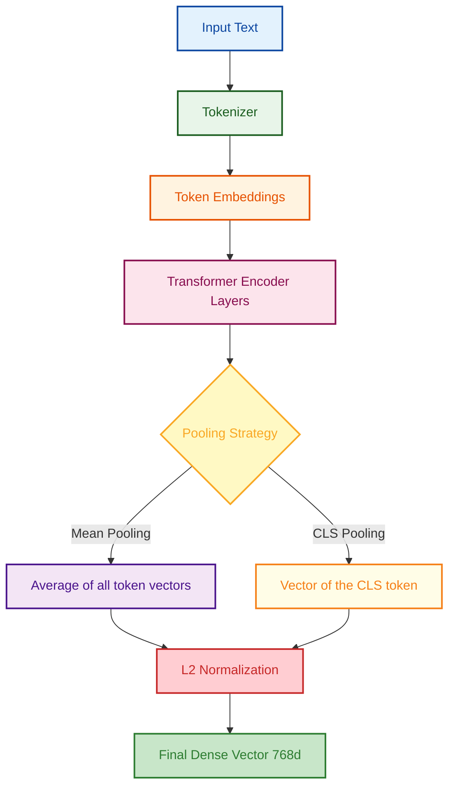
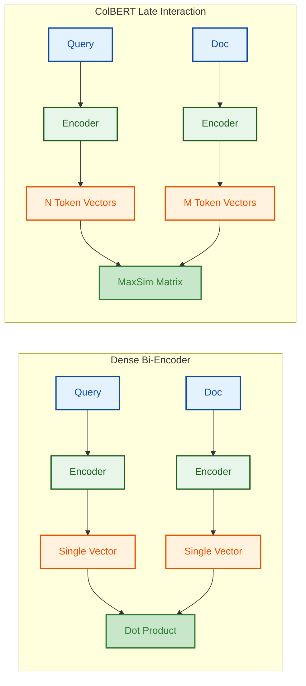
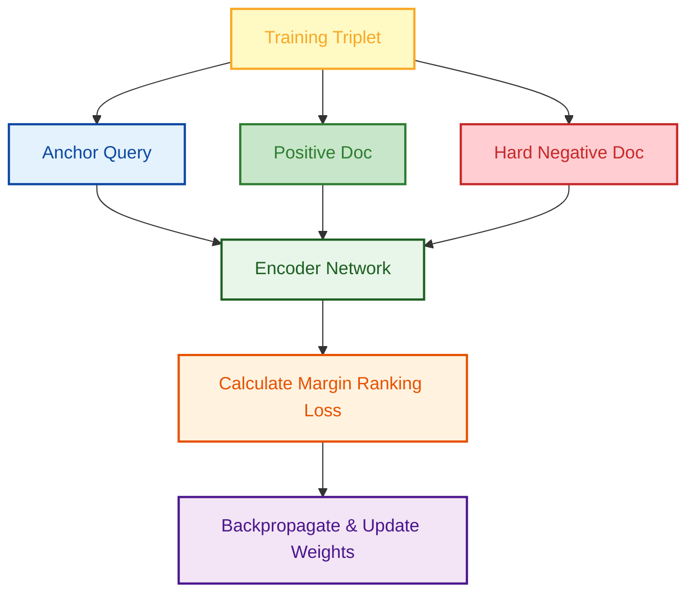

# Embedding Models

> Embeddings are the mathematical bridge between raw text and semantic similarity. They are the engine of modern RAG systems.

---

## Q1. What is the mathematical foundation of a vector embedding and how is it derived?

### Core Answer

A **vector embedding** is a dense, high-dimensional continuous mathematical projection of discrete data (text). In a well-trained embedding space, geometric distance (e.g., Cosine Distance) inversely correlates with semantic similarity.

Modern embedding models (like `text-embedding-3`, `BGE`, `MiniLM`) are derived from Transformer encoder architectures (like BERT). 

To convert a variable-length sequence of token vectors into a single fixed-length document vector, the model uses a **Pooling Strategy**:
- **Mean Pooling:** Averages the contextualized embeddings of all tokens in the sequence.
- **CLS Pooling:** Takes the embedding of the special `[CLS]` (classification) token at the start of the sequence, which has been trained to aggregate sequence-level meaning.

### Related Questions

!!! question "Follow-up Interview Questions"
    1. What is the mathematical difference between using the `[CLS]` token vs Mean-Pooling across all token embeddings?
    2. How does the dimensionality of an embedding impact retrieval latency vs accuracy?
    3. Why can't we just use TF-IDF or BM25 instead of dense embeddings?
    4. What is the phenomenon of "anisotropy" in embedding spaces?

??? success "View Answers"
    **1. CLS vs Mean Pooling?**
    Mean-pooling calculates the arithmetic mean of all token vectors across the sequence dimension ($V = \frac{1}{N} \sum v_i$). It captures the overall semantic average but dilutes specific highly-weighted tokens. `[CLS]` pooling relies on the transformer's attention mechanism to route critical sequence-level information into a single token vector during the forward pass. Today, mean-pooling (often weighted by attention masks) is generally preferred for sentence-transformers as it produces smoother semantic spaces.

    **2. Dimensionality vs Latency?**
    A higher dimension (e.g., 3072 vs 768) mathematically increases the capacity of the model to resolve fine-grained semantic differences (higher accuracy). However, calculating cosine similarity requires taking the dot product of the vectors. The time complexity of computing dot products across $N$ vectors is $O(N \times D)$. Quadrupling the dimension quadruples the memory requirements (RAM/VRAM) and the computational latency of the search.

    **3. TF-IDF vs Dense Embeddings?**
    TF-IDF (Sparse retrieval) relies on exact lexical matching. If a user searches for "automobile", and the document says "car", the vectors are orthogonal (dot product = 0), yielding no match. Dense embeddings project "car" and "automobile" into nearby continuous coordinates, capturing the semantic synonymy.

    **4. Anisotropy in embedding spaces?**
    Anisotropy means the embeddings occupy a narrow cone in the high-dimensional space rather than being uniformly distributed. This often happens with untrained BERT representations, where all vectors have a high baseline cosine similarity (e.g., 0.9) to each other, regardless of meaning. Contrastive learning solves this by forcing the space to become isotropic (spreading the vectors out).

---

## Q2. How do you evaluate and benchmark the quality of an embedding model for a specific domain?

### Core Answer

Public leaderboards (like MTEB - Massive Text Embedding Benchmark) are often misleading for domain-specific enterprise tasks (e.g., medical diagnoses, internal codebase search). You must benchmark models using a domain-specific **Golden Dataset** and rigorous Information Retrieval (IR) metrics.

**Key Metrics:**
1. **Recall@K:** Out of all relevant documents, what percentage were found in the top K retrieved results? (Measures whether the model finds the answer at all).
2. **NDCG@K (Normalized Discounted Cumulative Gain):** Measures ranking quality. Finding the right document at Rank 1 scores much higher than finding it at Rank 10.

### Related Questions

!!! question "Follow-up Interview Questions"
    1. What is the mathematical formula for Recall@K vs Precision@K?
    2. Why is NDCG preferred over Mean Reciprocal Rank (MRR) for multi-document retrieval?
    3. How do you synthetically generate a golden dataset using LLMs (GPL)?
    4. What is the difference between Symmetric and Asymmetric semantic search evaluation?

??? success "View Answers"
    **1. Recall vs Precision?**
    $Precision@K = \frac{|Relevant \cap Retrieved_K|}{K}$. (How much of what we retrieved is useful?)
    $Recall@K = \frac{|Relevant \cap Retrieved_K|}{|Relevant_{Total}|}$. (How much of the total useful info did we retrieve?)

    **2. NDCG vs MRR?**
    MRR (Mean Reciprocal Rank) evaluates the rank of the *first* relevant document ($1/rank$). It assumes there is only one correct answer. If a query has 5 highly relevant chunks that all need to be retrieved for a complete answer, MRR ignores chunks 2-5. NDCG handles multiple relevant documents and heavily penalizes the system if they are ranked lower down the list.

    **3. Generating a Golden Dataset (GPL)?**
    Generative Pseudo Labeling (GPL) involves taking raw chunks from your enterprise corpus and feeding them to an LLM with the prompt: *"Generate 3 search queries that a user might type to find this exact paragraph."* This automatically creates thousands of (Query, Ground_Truth_Chunk) pairs without expensive human annotation, which you can use to benchmark embedding models.

    **4. Symmetric vs Asymmetric search?**
    Symmetric search implies the query and the target document are of similar length and style (e.g., finding duplicate bug reports). Asymmetric search implies a short query (e.g., "How do I reset my password?") targeting a long, detailed document. Models must be specifically trained or evaluated on the asymmetric task for standard RAG use cases.

---

## Q3. What are the architectural differences between standard dense embeddings, Late Interaction (ColBERT), and Matryoshka embeddings?

### Core Answer

Standard dense embeddings (Bi-Encoders) compress all tokens into a single vector, leading to the **information bottleneck** problem where nuance is lost.

- **ColBERT (Late Interaction):** Instead of pooling into one vector, ColBERT stores a separate embedding for *every single token* in the document. At query time, it computes a massive similarity matrix between every query token and every document token, retaining near cross-encoder accuracy with much lower latency.
- **Matryoshka Representation Learning (MRL):** A training technique where the embedding vector is trained to hold the most critical information in its earliest dimensions. You can dynamically truncate a 3072d vector down to 256d at runtime without retraining, saving massive amounts of memory while preserving 90% of the accuracy.

### Related Questions

!!! question "Follow-up Interview Questions"
    1. How does the MaxSim operator work in ColBERT's late interaction?
    2. Why does ColBERT require significantly more storage and memory than standard embeddings?
    3. How do Matryoshka embeddings allow for cost-saving multi-stage retrieval pipelines?
    4. What is cross-encoder re-ranking and how does it compare to late interaction?

??? success "View Answers"
    **1. ColBERT MaxSim operator?**
    For every token embedding in the query, MaxSim calculates the dot product against *all* token embeddings in the document, and selects the maximum score (the best matching token). It then sums these maximum scores across all query tokens. This allows the model to match specific query keywords directly to specific document keywords.

    **2. ColBERT storage overhead?**
    A standard 512-token chunk produces exactly one 768d vector (3KB). ColBERT produces 512 separate 768d vectors (1.5MB) for that same chunk. This causes vector database storage and RAM requirements to explode by orders of magnitude, making it expensive for billion-document scales.

    **3. Multi-stage retrieval with MRL?**
    With MRL models (like OpenAI's `text-embedding-3`), you can chop the vector to 256 dimensions. You perform the initial exhaustive ANN search across millions of documents using only the 256d vectors (which is 12x faster and uses 12x less RAM). Then, you fetch the full 3072d vectors for the top 100 results and recalculate the exact distances for a highly precise re-ranking phase.

    **4. Cross-Encoder vs Late Interaction?**
    A Cross-Encoder concatenates the Query and Document together (`[CLS] Query [SEP] Document`) and runs them through the transformer *together*. This allows full self-attention between query and document words, yielding the highest possible accuracy. However, you cannot pre-compute document embeddings; you must run the heavy transformer at runtime, making it incredibly slow. ColBERT (Late Interaction) approximates this accuracy while allowing offline document pre-computation.

---

## Q4. How do you improve retrieval when standard dense embeddings fail?

### Core Answer

Dense embeddings notoriously struggle with exact keyword matching (e.g., error codes like `ERR_502_X`), acronyms, and out-of-domain vocabulary they were not trained on. 

To bridge this semantic gap, production systems utilize **Hybrid Search** and **HyDE (Hypothetical Document Embeddings)**.

### Related Questions

!!! question "Follow-up Interview Questions"
    1. How does HyDE (Hypothetical Document Embeddings) mathematically bridge the semantic gap?
    2. Why do dense embeddings fail on exact keyword searches (like an ID "XJ-92")?
    3. How do you combine Sparse and Dense embeddings using Reciprocal Rank Fusion (RRF)?
    4. What is the computational risk of using HyDE in production?

??? success "View Answers"
    **1. How HyDE bridges the gap?**
    A short user query ("How to fix XJ-92?") occupies a very different semantic space than the long instructional manual that answers it. HyDE forces an LLM to generate a fake (hypothetical) answer to the query first. Even if the LLM hallucinates the facts, it generates the *semantic vocabulary and structure* of a correct answer. We then embed this hypothetical answer. Because the hypothetical answer and the real document share the same semantic signature, their geometric distance is extremely close.

    **2. Why dense embeddings fail on IDs?**
    Embedding models use sub-word tokenization (like Byte-Pair Encoding). An ID like "XJ-92" might be split into tokens `[X, J, -, 92]`. The transformer averages these out. The semantic meaning of an arbitrary ID is basically random noise in the embedding space, making it impossible to retrieve via cosine similarity.

    **3. Reciprocal Rank Fusion (RRF)?**
    You run a Dense search (Cosine Similarity) and a Sparse search (BM25 keyword match) simultaneously. RRF combines them by taking the rank of the document in each list, rather than the raw scores (which have different scales). Formula: $Score = \frac{1}{k + Rank_{Dense}} + \frac{1}{k + Rank_{Sparse}}$. The document that ranks highest across *both* lists rises to the top.

    **4. HyDE computational risks?**
    HyDE requires calling an LLM API to generate text *before* you can run your vector search. This adds hundreds of milliseconds (or seconds) of latency to the search query, which is unacceptable for real-time autocomplete or instantaneous search applications.

---

## Q5. How do you mathematically fine-tune an embedding model on proprietary data?

### Core Answer

When public models fail on internal jargon, you must fine-tune them using **Contrastive Learning**. The goal is to mathematically pull the query vector closer to the relevant document vector (positive pair) and push it away from irrelevant document vectors (negative pairs).

The standard approach uses **Multiple Negatives Ranking (MNR) Loss**, maximizing the dot product of positive pairs while minimizing the dot product against all other in-batch examples.

### Related Questions

!!! question "Follow-up Interview Questions"
    1. What is Multiple Negatives Ranking (MNR) Loss and why is it efficient?
    2. What is a "Hard Negative" and why is it critical for fine-tuning?
    3. Why might fine-tuning a small model (MiniLM) outperform a massive API model (OpenAI) in specialized domains?
    4. How do you avoid catastrophic forgetting during fine-tuning?

??? success "View Answers"
    **1. MNR Loss efficiency?**
    Normally, you have to explicitly provide negative examples (wrong documents) for every query. With MNR loss, you only provide (Query, Positive_Doc) pairs in a batch of size $N$. The loss function treats the $N-1$ *other* positive documents in the batch as implicit negatives for the current query. This allows massive computational efficiency because you reuse the encoded vectors across the batch to calculate the contrastive loss matrix.

    **2. What is a Hard Negative?**
    If a user searches for "How to reset router", a random batch negative might be a document about "Company holiday policy." The model easily learns they are different. A *Hard Negative* is a document that is lexically very similar but semantically incorrect (e.g., "How to reset password"). Supplying hard negatives forces the model to learn fine-grained semantic boundaries rather than just relying on keyword overlap.

    **3. Small fine-tuned model vs Massive API?**
    OpenAI's models are generalists; their embedding space is distributed to handle everything from French poetry to Python code. A 33M parameter MiniLM model fine-tuned entirely on your company's proprietary IT helpdesk tickets will restructure its latent space to exclusively differentiate IT concepts, often destroying OpenAI's accuracy on that specific narrow distribution, while executing 100x faster and locally.

    **4. Avoiding catastrophic forgetting?**
    If you fine-tune a general model purely on legal contracts, it will "forget" general English semantics and perform poorly if users ask casual questions. To avoid this, you must mix a portion (e.g., 20%) of general domain datasets (like MS MARCO or NLI) into your fine-tuning batches to act as a regularization anchor.

---

*Next: [Vector Databases →](../05-vector-databases/README.md)*
