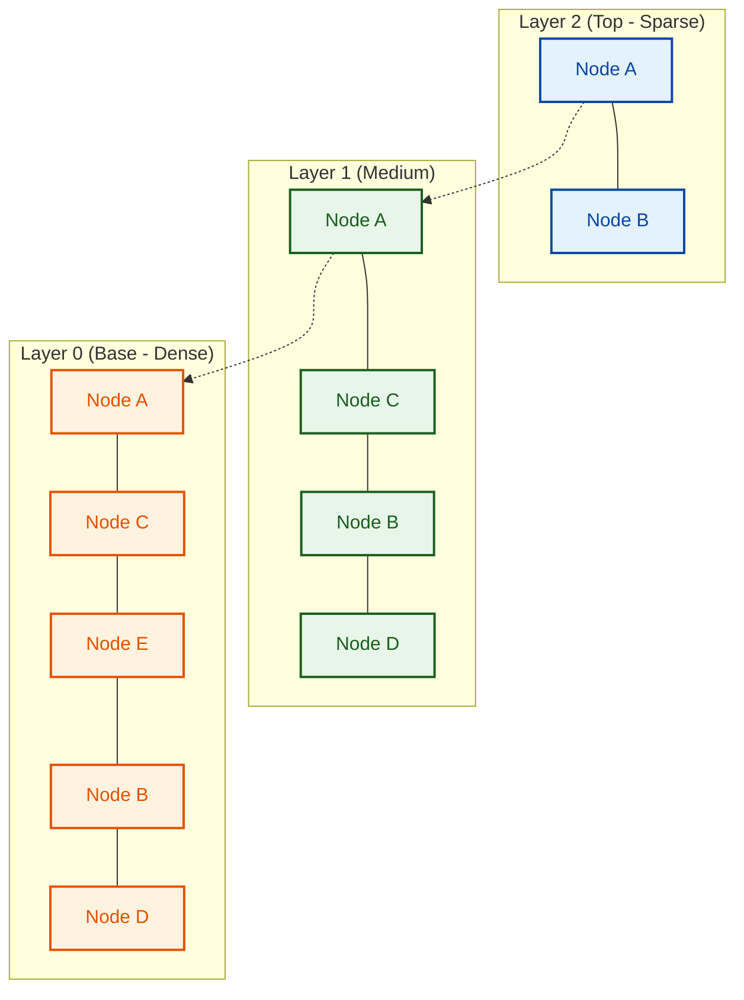
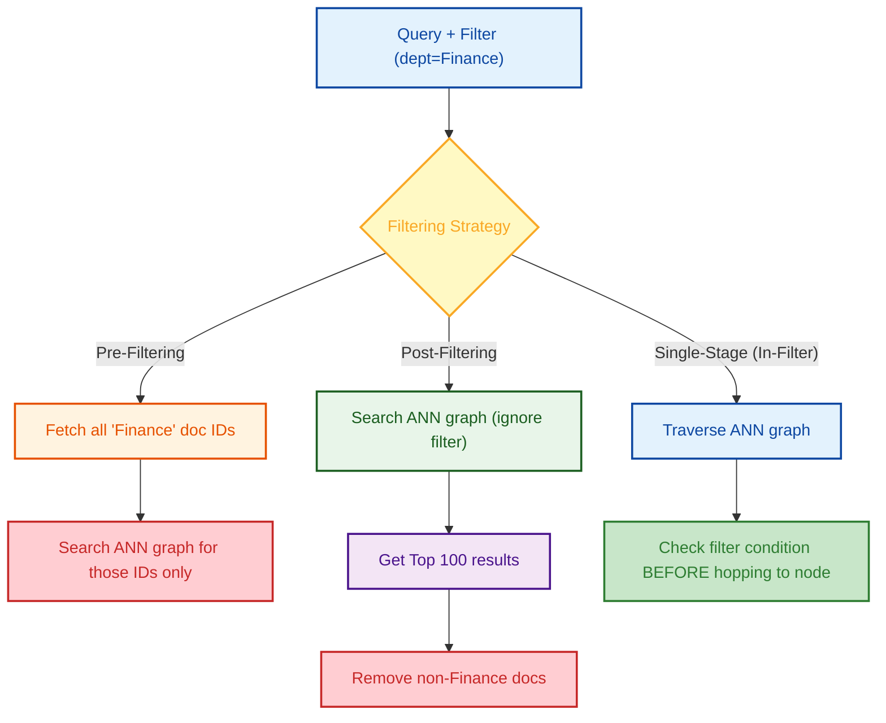

# Vector Databases — Internal Working

> Vector Databases are the storage layer of the AI era, purpose-built to execute Approximate Nearest Neighbor (ANN) searches across billions of high-dimensional embeddings.

---

## Q1. What is the fundamental architecture of a distributed Vector Database?

### Core Answer

A vector database (like Qdrant, Milvus, or Pinecone) is drastically different from a raw vector index (like FAISS). A vector index is just an in-memory mathematical algorithm. A vector database provides distributed storage, persistence, CRUD operations, metadata filtering, and consensus protocols (Raft/Paxos).

```mermaid
flowchart TD
    subgraph WritePath ["Write Path"]
        A["Embedding + Metadata"] --> B["Write-Ahead Log (WAL)"]
        B --> C["MemTable (In-Memory Buffer)"]
        C --> D{"Flush to Disk?"}
        D -->|Yes| E["Immutable Immutable Segment"]
    end
    
    subgraph ReadPath ["Read Path"]
        F["Query Vector + Filter"] --> G["Metadata Index (Roaring Bitmaps)"]
        G --> H["Graph Traversal (HNSW)"]
        H --> I["Top-K Result Aggregation"]
    end
    style A fill:#e3f2fd,stroke:#0d47a1,stroke-width:2px,color:#0d47a1
    style B fill:#e8f5e9,stroke:#1b5e20,stroke-width:2px,color:#1b5e20
    style C fill:#fff3e0,stroke:#e65100,stroke-width:2px,color:#e65100
    style D fill:#fff9c4,stroke:#f9a825,stroke-width:2px,color:#f9a825
    style E fill:#c8e6c9,stroke:#2e7d32,stroke-width:2px,color:#2e7d32
    style F fill:#e3f2fd,stroke:#0d47a1,stroke-width:2px,color:#0d47a1
    style G fill:#fce4ec,stroke:#880e4f,stroke-width:2px,color:#880e4f
    style H fill:#f3e5f5,stroke:#4a148c,stroke-width:2px,color:#4a148c
    style I fill:#c8e6c9,stroke:#2e7d32,stroke-width:2px,color:#2e7d32
```

To support real-time updates while answering queries, vector databases typically use an **LSM-Tree-like architecture**:
1. **Writes** go to an append-only Write-Ahead Log (WAL) and an in-memory segment (MemTable) which uses an exact or simple index.
2. **Background workers** periodically flush MemTables to disk as immutable segments and asynchronously build heavy ANN indexes (like HNSW) on them.
3. **Reads** query both the immutable on-disk segments and the mutable in-memory segments, merging the Top-K results.

### Related Questions

!!! question "Follow-up Interview Questions"
    1. What is the difference between a Vector Index and a Vector Database?
    2. How do Vector Databases ensure durability (ACID vs Eventual Consistency)?
    3. What is the role of a WAL (Write-Ahead Log) in vector databases?
    4. How is metadata physically stored relative to the vector index?

??? success "View Answers"
    **1. Vector Index vs Database?**
    FAISS (Facebook AI Similarity Search) is a library that runs an algorithm (like IVF-PQ) purely in RAM. It has no concept of updates, deletes, high availability, or persistence. A Vector Database wraps these algorithms in a DBMS architecture, handling sharding, replication, metadata indexing, and disk persistence.

    **2. Consistency models?**
    Unlike relational DBs (Strict ACID), vector DBs typically operate on **Eventual Consistency** for index building. When you insert a vector, it is immediately available for exact search (via the MemTable), but it may take seconds/minutes for the background worker to insert it into the massive HNSW graph for fast approximate search.

    **3. Write-Ahead Log (WAL)?**
    Building an HNSW graph takes massive CPU overhead. If the server crashes before the graph is persisted to disk, the data is lost. The WAL is a fast, append-only disk log. Every insert is written to the WAL *before* it is indexed. On crash recovery, the DB replays the WAL to rebuild the in-memory graph.

    **4. Metadata storage physical layout?**
    Metadata (e.g., `user_id=123`, `doc_type=pdf`) is stored entirely separately from the dense vectors, usually in a traditional inverted index or using Roaring Bitmaps. At query time, the system intersects the Bitmap of the metadata filter with the vector search results.

---

## Q2. How does the HNSW (Hierarchical Navigable Small World) index work mathematically?

### Core Answer

**HNSW** is the state-of-the-art graph-based Approximate Nearest Neighbor (ANN) algorithm. It solves the local-optima problem of standard Navigable Small World (NSW) graphs by borrowing the concept of a **Skip List**.

1. **Hierarchy:** The graph is built in multiple layers. Layer 0 contains *all* vectors. Layer 1 contains a random 10% subset. Layer 2 contains 1%, etc.
2. **Search:** The query enters at the top layer. It greedily hops to the closest node until it hits a local minimum.
3. **Drop Down:** It drops down to the exact same node in the layer below (which has more connections) and resumes the greedy search.
4. **Result:** By the time it reaches Layer 0, it is already zoomed in on the correct microscopic neighborhood, guaranteeing $O(\log N)$ search time.

### Related Questions

!!! question "Follow-up Interview Questions"
    1. What are the `ef_construction` and `m` parameters in HNSW?
    2. Why does HNSW consume significantly more RAM than IVF?
    3. How are elements inserted into an HNSW graph?
    4. How does HNSW perform on low-dimensional vs high-dimensional data?

??? success "View Answers"
    **1. HNSW Parameters?**
    `m` is the maximum number of bidirectional connections (edges) a node can have per layer. (Higher `m` = denser graph, slower build, higher recall). `ef_construction` controls the size of the dynamic candidate list during index building. (Higher `ef_construction` = massively slower build time, but creates much higher quality edges resulting in better query recall).

    **2. HNSW memory overhead?**
    IVF (Inverted File) simply stores cluster IDs. HNSW must maintain adjacency lists in memory for every node across multiple layers. For a dataset of 100M vectors, the edge pointers (graph overhead) can consume tens of gigabytes of RAM *on top* of the raw vector data.

    **3. HNSW insertion logic?**
    To insert a node, you first run a query for that node to find its nearest neighbors in the existing graph. You then draw edges between the new node and those neighbors. The maximum layer the new node exists in is determined randomly using an exponentially decaying probability distribution (e.g., 90% stop at L0, 9% reach L1, 0.9% reach L2).

    **4. Curse of Dimensionality in HNSW?**
    In extremely high dimensions (e.g., 3072d), the distance between any two random points becomes nearly equidistant. Graph traversal algorithms start to fail because the greedy "step toward the closest node" heuristic becomes a random guess. HNSW degrades gracefully but still suffers heavily past 1500 dimensions without dimension reduction (like PCA/Matryoshka).

---

## Q3. How do Product Quantization (PQ) and Locality-Sensitive Hashing (LSH) compress vector space?

### Core Answer

A billion 768-dimensional `float32` vectors require **~3 Terabytes of RAM**. This is economically unviable. Production systems use **Quantization** to compress the vectors by up to 97%.

**Product Quantization (PQ):**
1. **Split:** Divides a 768d vector into $M$ sub-vectors (e.g., 8 chunks of 96d).
2. **Cluster:** Runs K-Means clustering (where $K=256$) on each of the 8 sub-spaces independently.
3. **Encode:** Replaces the 96d float values with the 8-bit Integer ID (0-255) of the nearest centroid.
4. **Compression:** The 3072-byte vector is now represented by 8 bytes (an array of eight 8-bit integers). 

### Related Questions

!!! question "Follow-up Interview Questions"
    1. What is the mathematical process of Asymmetric Distance Computation (ADC) in PQ?
    2. How do you combine IVF (Inverted File Index) with PQ for billion-scale search?
    3. Why does LSH suffer from high false-positive rates?
    4. What is Scalar Quantization (SQ) vs Product Quantization (PQ)?

??? success "View Answers"
    **1. Asymmetric Distance Computation (ADC)?**
    If we decompress the PQ code to calculate distance, we lose all performance. Instead, ADC keeps the Query Vector *uncompressed* (Float32). It pre-computes the exact distance from the Query to all 256 possible centroids. To find the distance to a PQ-encoded document, it simply performs 8 fast O(1) table lookups and sums the distances. 

    **2. IVF-PQ Architecture?**
    PQ is slow if you scan 1 billion PQ codes. IVF (Inverted File) first clusters the dataset into coarse Voronoi cells. At query time, the system identifies the 5 nearest coarse clusters, and *then* only scans the PQ codes inside those 5 clusters. IVF-PQ is the standard architecture for massive memory-constrained vector retrieval.

    **3. LSH false positives?**
    LSH uses random hyperplanes to slice the vector space. It generates a binary hash based on which side of the plane a vector lands on. Because hyperplanes are drawn randomly, two vectors on opposite sides of a cluster might end up in different buckets, or distant vectors might accidentally share a bucket boundary, destroying recall.

    **4. Scalar (SQ) vs Product (PQ)?**
    Scalar Quantization rounds each individual dimension independently. It finds the min/max of a dimension across the dataset and maps the float32 space (4 bytes) to an `int8` space (1 byte). SQ compresses a vector by exactly 4x. PQ chunks dimensions together and clusters them, allowing massive 300x compression ratios.

---

## Q4. What is the mathematical difference between Cosine Similarity, Dot Product, and L2 Distance?

### Core Answer

Choosing the wrong distance metric will silently ruin your RAG system's retrieval quality. 

| Metric | Formula | Semantic Meaning |
|---|---|---|
| **Dot Product** | $\sum (A_i \times B_i)$ | Measures angle AND magnitude. Fast to compute. |
| **Cosine Similarity** | $\frac{A \cdot B}{||A|| \times ||B||}$ | Measures purely the angle between vectors. Ignores magnitude. |
| **L2 (Euclidean)** | $\sqrt{\sum (A_i - B_i)^2}$ | Measures straight-line geometric distance between endpoints. |

**The Golden Rule:** If you mathematically L2-normalize all vectors (forcing their length to $1.0$ so they sit on a hypersphere), then **Cosine Similarity = Dot Product**. You must normalize vectors at ingestion and query using Dot Product to save the massive CPU overhead of calculating vector magnitudes at runtime.

### Related Questions

!!! question "Follow-up Interview Questions"
    1. Why is Dot Product mathematically faster to compute than Cosine Similarity?
    2. When would you explicitly want to use Euclidean (L2) distance instead of Cosine?
    3. How does Maximum Inner Product Search (MIPS) differ from L2 search?
    4. What happens if you use L2 distance on unnormalized text embeddings?

??? success "View Answers"
    **1. Dot Product CPU efficiency?**
    Cosine Similarity requires calculating the square root of the sum of squares for both vectors, and then executing a floating-point division. Square roots and division are incredibly expensive CPU operations. Dot Product is just a Multiply-Accumulate (MAC) operation, which modern CPUs/GPUs can execute in a single clock cycle using SIMD/AVX-512 instructions.

    **2. When to use L2 Distance?**
    Text embeddings usually encode semantic meaning in the *angle* (direction), making Cosine standard. However, in Recommendation Systems or Computer Vision, the *magnitude* of the vector might represent the "strength" or "popularity" of an item. In these cases, a highly popular item and a niche item might point in the same direction, but their L2 distance will correctly identify them as different due to magnitude.

    **3. MIPS vs L2?**
    Maximum Inner Product Search (MIPS) looks for the highest Dot Product. Standard ANN indexes (like HNSW) are naturally optimized for L2 distance (finding the minimum distance). Searching an HNSW graph using MIPS on unnormalized vectors mathematically breaks the triangle inequality theorem, causing the graph traversal to fail.

    **4. Unnormalized text embeddings + L2?**
    If a text embedding model (like an early BERT model) outputs vectors of varying lengths, using L2 distance will penalize vectors that are geometrically long, even if they point in the exact same semantic direction as the query. You will retrieve short, semantically irrelevant vectors simply because they are closer to the origin.

---

## Q5. How does a Vector Database handle metadata filtering at scale?

### Core Answer

In Enterprise RAG, users almost never execute pure vector searches. They execute filtered searches (e.g., *"Find documents similar to 'tax policy' WHERE department='Finance' AND access_level='Public'"*). 

Filtering fundamentally breaks graph-based ANN algorithms (like HNSW) because it deletes nodes from the graph at runtime, creating disconnected islands.

### Related Questions

!!! question "Follow-up Interview Questions"
    1. Why does Pre-filtering severely degrade the recall of an HNSW index?
    2. What is the "Missing Neighbor" problem in Post-filtering?
    3. How does Qdrant achieve Single-Stage (In-filter) HNSW traversal?
    4. How do you handle high-cardinality metadata (like Tenant ID) in a multi-tenant SaaS application?

??? success "View Answers"
    **1. Pre-filtering graph destruction?**
    If you pre-filter for `dept=Finance`, the DB tells the HNSW algorithm to ignore all nodes that aren't Finance. If the entry point to the graph is an HR document, all of its immediate neighbors might also be HR documents. The algorithm is trapped; it cannot traverse the graph because the path to the Finance cluster has been "deleted" by the filter, resulting in 0 results returned (Zero Recall).

    **2. Missing Neighbor in Post-filtering?**
    If you post-filter, you ask HNSW for the Top 100 semantic matches. It returns 100 documents. You then apply the `dept=Finance` filter. If 99 of the documents were HR policies, you are left with exactly 1 result. Even though there are 50 highly relevant Finance documents deep in the database, the ANN search didn't pull them into the Top 100, so they are lost forever.

    **3. Single-Stage (In-Filter) traversal?**
    Modern DBs like Qdrant and Weaviate intercept the HNSW greedy routing algorithm at runtime. At every hop, the algorithm checks the metadata bitmap. If the neighbor fails the filter, it doesn't delete the node; it simply prevents the node from being added to the *results list*, but *allows* the algorithm to use the node as a bridge to hop to the next neighborhood.

    **4. Multi-tenant SaaS architecture?**
    If you build a SaaS app for 10,000 companies, filtering by `tenant_id` at query time using In-Filtering is too slow and dangerous. Best practice is to physically isolate tenants. Either use Payload-based Partitioning (where the DB maintains 10,000 separate miniature HNSW graphs internally) or deploy separate collections/namespaces per tenant to guarantee absolute data isolation and maximum graph density.

---

*Next: [Advanced Search Algorithms →](../06-search-algorithms/README.md)*
