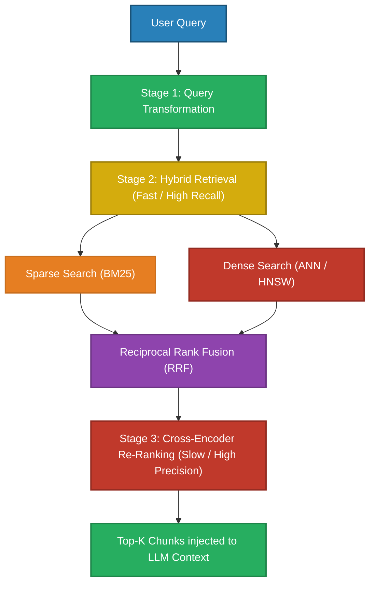
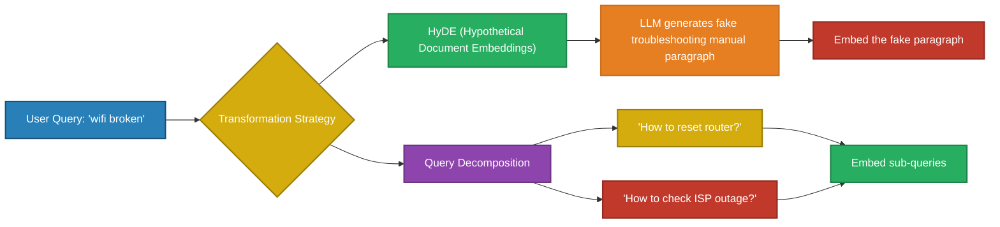

# Advanced Search Algorithms

> Retrieval quality is the single biggest lever in a RAG system. Poor retrieval equals poor answers, regardless of whether you are using a 7B or 400B parameter LLM.

---

## Q1. What are the fundamental architectural patterns for Information Retrieval in RAG?

### Core Answer

Production retrieval systems are not a single database query. They are multi-stage data engineering pipelines designed to balance the brutal trade-off between **Recall** (finding everything relevant) and **Precision** (filtering out the noise), all within a strict latency budget.

**The Multi-Stage Pipeline:**
1. **Query Transformation:** Rewrite the user's ambiguous query into an optimized search vector (e.g., HyDE, Query Expansion).
2. **First-Stage Retrieval (Recall):** Use incredibly fast Approximate Nearest Neighbor (ANN) and Inverted Indexes (BM25) to cast a wide net and retrieve the Top-100 candidates in $<50$ms.
3. **Second-Stage Re-Ranking (Precision):** Pass the Top-100 candidates through a heavy Transformer Cross-Encoder to exactly calculate their relevance to the query, selecting the final Top-5 chunks in $\sim 150$ms.

### Related Questions

!!! question "Follow-up Interview Questions"
    1. What is the latency budget for a production Two-Stage retrieval pipeline?
    2. Why do Cross-Encoders perform mathematically better than Bi-Encoders for re-ranking?
    3. How does Agentic Retrieval solve multi-hop reasoning?
    4. What is the "Retrieval Bottleneck" in RAG systems?

??? success "View Answers"
    **1. Latency budget?**
    Search must be virtually instantaneous to leave time for LLM generation (Time-To-First-Token). Stage 1 (ANN) must execute in $10$-$50$ms. Stage 2 (Cross-Encoder) is computationally heavy, operating at $O(N)$ where N is the number of candidates. Scoring 100 candidates usually takes $100$-$200$ms on GPU. The entire retrieval pipeline should strictly complete in $<300$ms.

    **2. Cross-Encoder vs Bi-Encoder?**
    A Bi-Encoder embeds the Query and Document completely independently. A Cross-Encoder concatenates them (`[CLS] Query [SEP] Document`) and passes them through the Transformer layers together. This allows the Self-Attention mechanism to calculate direct attention weights between individual words in the query and individual words in the document, resulting in vastly superior semantic matching accuracy at the cost of massive latency.

    **3. Agentic Retrieval for multi-hop?**
    Standard RAG fails at queries like *"Who is the CEO of the company that acquired Slack?"* because no single document contains both facts. Agentic Retrieval uses an LLM to decompose the query. It executes Search 1: *"Who acquired Slack?"* -> Extracts "Salesforce". It then dynamically constructs Search 2: *"Who is the CEO of Salesforce?"* -> Extracts "Marc Benioff".

    **4. The Retrieval Bottleneck?**
    In most production RAG failures, over 70% of hallucinated or "I don't know" answers occur because the correct chunk was never retrieved and placed in the context window. If the facts aren't in the prompt, no amount of prompt engineering or LLM parameter scaling will fix the output.

---

## Q2. How do Sparse (BM25) and Dense (Embedding) search algorithms fundamentally differ?

### Core Answer

**Dense Retrieval** relies on continuous vector spaces (Semantic). It maps concepts mathematically so that "car" and "automobile" sit in the same geographic region of the space.

**Sparse Retrieval (BM25)** relies on discrete lexical tokens. It builds an **Inverted Index** (a hash map of words pointing to document IDs). BM25 is based on TF-IDF (Term Frequency - Inverse Document Frequency) but applies a mathematical saturation curve to prevent keyword spamming.

$$ BM25(q, D) = \sum_{i=1}^{n} IDF(q_i) \cdot \frac{TF(q_i, D) \cdot (k_1 + 1)}{TF(q_i, D) + k_1 \cdot (1 - b + b \cdot \frac{|D|}{avgdl})} $$

### Related Questions

!!! question "Follow-up Interview Questions"
    1. How does the BM25 formula mathematically prevent token saturation?
    2. Why is an Inverted Index $O(1)$ for exact keyword lookups?
    3. Why does Dense retrieval fail catastrophically on exact ID matches?
    4. What is SPLADE and how does it bridge Sparse and Dense retrieval?

??? success "View Answers"
    **1. BM25 Saturation?**
    In raw TF-IDF, if a document contains the word "Apple" 100 times, it scores 10x higher than a document containing it 10 times. BM25 introduces the $k_1$ parameter (usually set to 1.2 - 2.0). As Term Frequency ($TF$) increases, the score asymptotes toward a maximum limit. Seeing a word 5 times proves relevance; seeing it 500 times is just keyword spamming and doesn't yield a higher score.

    **2. Inverted Index $O(1)$ lookup?**
    An inverted index works identically to the index at the back of a textbook. It is a Hash Map where the Key is the token (e.g., `apple`) and the Value is a list of Document IDs `[doc1, doc7, doc9]`. Looking up a keyword is a direct hash table lookup, which is $O(1)$ time complexity, instantly returning the exact documents containing the word.

    **3. Dense failures on IDs?**
    Embedding models use sub-word tokenizers (like Byte-Pair Encoding). An ID like `ERR-902-X` is fractured into multiple tokens (e.g., `[ERR, -, 90, 2, -X]`). The Transformer averages these random characters together, generating a vector that points to random noise in the semantic space. Cosine similarity cannot effectively match random sub-word geometric noise.

    **4. What is SPLADE?**
    SPLADE (Sparse Lexical and Expansion) is a neural sparse retrieval model. It uses a BERT model to analyze a document, but instead of outputting a dense 768d vector, it outputs weights for the 30,000 words in the BERT vocabulary. Crucially, it expands the document by assigning weights to words that *aren't even in the text* but are highly relevant (synonyms). It gives you the exact matching of Sparse with the semantic understanding of Dense.

---

## Q3. How do you mathematically merge multiple search algorithms (Hybrid Search)?

### Core Answer

Hybrid Search executes a Sparse (BM25) search and a Dense (Vector) search simultaneously. 

Because Cosine Similarity scores range from `[-1, 1]` and BM25 scores can range from `[0, 100+]`, you cannot simply add the scores together. You must merge them using **Reciprocal Rank Fusion (RRF)** or **Convex Combination (Alpha Weighting)**.

**Reciprocal Rank Fusion (RRF):**
RRF ignores the raw scores entirely. It looks only at the *position* (rank) of the document in the respective lists. 

$$ RRF\_Score = \frac{1}{k + Rank_{Dense}} + \frac{1}{k + Rank_{Sparse}} $$

### Related Questions

!!! question "Follow-up Interview Questions"
    1. Why is RRF mathematically superior to raw score normalization?
    2. What is the $k$ smoothing constant in RRF?
    3. How does Convex Combination (Alpha Weighting) work?
    4. How do you dynamically tune Alpha weighting based on query intent?

??? success "View Answers"
    **1. RRF vs Score Normalization?**
    If you try to normalize BM25 scores using Min-Max scaling, an outlier document with a massive BM25 score of 300 will squash all other documents into the `[0, 0.01]` range. By discarding the scores and relying strictly on Rank, RRF becomes completely immune to outlier scores and varying distributions across different retrieval algorithms.

    **2. The $k$ smoothing constant?**
    $k$ is typically set to 60. Without $k$, a document at Rank 1 in Dense gets a score of $1/1 = 1.0$, and Rank 2 gets $1/2 = 0.5$. The penalty for dropping one rank is massive. By adding $k=60$, Rank 1 becomes $1/61 \approx 0.0163$ and Rank 2 becomes $1/62 \approx 0.0161$. This smooths out the curve, preventing highly-ranked documents in one list from completely dominating documents that rank consistently well (e.g., Rank 10) in both lists.

    **3. Convex Combination (Alpha Weighting)?**
    If you mathematically normalize the scores (using z-score or softmax), you can blend them using an Alpha ($\alpha$) parameter where $0 \le \alpha \le 1$.
    $Final\_Score = (\alpha \times Dense\_Score) + ((1 - \alpha) \times Sparse\_Score)$. 
    If $\alpha=1$, it is pure semantic search. If $\alpha=0$, it is pure keyword search.

    **4. Dynamic Alpha Tuning?**
    Advanced systems use a lightweight classifier (like a fast RoBERTa model or XGBoost) to classify the query at runtime. If the query contains heavily capitalized acronyms or UUIDs (`"Fix error XJ-92"`), the classifier sets $\alpha = 0.1$ (favoring BM25). If the query is conversational (`"How does the company feel about remote work?"`), it sets $\alpha = 0.9$ (favoring Dense).

---

## Q4. How do you evaluate and diagnose retrieval failures systematically?

### Core Answer

You cannot evaluate retrieval by eyeballing the final LLM output. If the LLM generates a bad answer, it could be a hallucination (Generation Failure) or a missing document (Retrieval Failure). 

**Systematic Evaluation Pipeline:**
1. Generate a **Golden Dataset** of (Query, Relevant_Document_IDs) pairs.
2. Run the queries through the retrieval pipeline, completely bypassing the LLM.
3. Calculate IR metrics: **Recall@K** and **NDCG@K**.

### Related Questions

!!! question "Follow-up Interview Questions"
    1. What is NDCG@K and why is it the gold standard for search?
    2. Why is MRR (Mean Reciprocal Rank) better for QA systems than NDCG?
    3. What is the difference between Precision@K and Recall@K?
    4. How do you instrument logs to catch Retrieval Bottlenecks in production?

??? success "View Answers"
    **1. NDCG (Normalized Discounted Cumulative Gain)?**
    NDCG measures ranking quality. It handles graded relevance (e.g., Document A is "Perfect", Document B is "Okay"). The "Discounted" part means it applies a logarithmic penalty to the score based on rank. Finding a "Perfect" document at Rank 1 gives you a massive score. Finding a "Perfect" document at Rank 10 gives you almost nothing, because users rarely scroll to the 10th result.

    **2. MRR for QA Systems?**
    NDCG evaluates the entire list of K results. Mean Reciprocal Rank (MRR) strictly evaluates the rank of the *very first* relevant document ($Score = 1/Rank_{first\_relevant}$). In a Q&A RAG system, the LLM just needs the correct fact to answer the question. It doesn't matter if there are 5 more good documents at ranks 7, 8, and 9. MRR perfectly tracks "Did we get the answer to the top of the context window?"

    **3. Precision vs Recall?**
    - $Precision@K$: Out of the 10 documents retrieved, how many were actually relevant? (Measures noise/distractions for the LLM).
    - $Recall@K$: Out of all the relevant documents in the database, what percentage did we find in the top 10? (Measures if we missed critical facts).

    **4. Instrumentation?**
    In production, you must log: `Query`, `Retrieved_Chunk_IDs`, `RRF_Scores`, and the `Final_LLM_Answer`. You then implement user telemetry (Thumbs Up / Thumbs Down buttons). When a user hits Thumbs Down, you can cross-reference the `Retrieved_Chunk_IDs` against the Golden Dataset to see if the retriever failed to pull the correct document, entirely isolating the failure point.

---

## Q5. What are the state-of-the-art query transformation techniques?

### Core Answer

Users are notoriously lazy. They type `"wifi broken"` instead of `"What are the troubleshooting steps for a disconnected wireless network router?"`. Passing `"wifi broken"` directly to a Dense Embedding model yields terrible vector similarity to the highly technical troubleshooting manual.

**Query Transformation** intercepts the query and uses a fast, cheap LLM to rewrite it before hitting the vector database.

### Related Questions

!!! question "Follow-up Interview Questions"
    1. How does HyDE mathematically bridge the semantic gap?
    2. What is Step-Back Prompting?
    3. What is Self-Querying (Metadata Extraction)?
    4. What is the latency risk of Query Transformation?

??? success "View Answers"
    **1. HyDE Semantic Bridging?**
    HyDE asks an LLM to generate a hypothetical answer to the short query. Even if the LLM hallucinates the facts, it generates the exact *lexical vocabulary, tone, and structural distribution* of a correct manual. When this hypothetical text is embedded, it projects into the exact same region of the high-dimensional vector space as the real manual, yielding massive Cosine Similarity scores.

    **2. Step-Back Prompting?**
    Sometimes queries are too specific: *"Why did the Model S battery fail on Oct 4th?"* The vector database might have no documents matching that date. Step-Back Prompting asks an LLM to generate a broader abstraction: *"What are the common causes of battery failures in electric vehicles?"* You run retrieval for both the specific query and the step-back query, drastically improving recall for edge cases.

    **3. Self-Querying?**
    Users often include metadata in their natural language: *"Show me Q3 finance reports from last year."* If you embed this directly, it fails. Self-Querying passes the query to an LLM with access to the database schema. The LLM extracts the structured metadata and rewrites the query: `Search_String = "finance reports"`, `Filter = {quarter: Q3, year: 2025}`.

    **4. Latency Risks?**
    Query Transformation requires an LLM inference call *before* the database search even begins. Even with fast models (like `gpt-4o-mini`), this adds 300-800ms of latency. For real-time autocomplete or instantaneous search, this is a total blocker. It is best reserved for asynchronous agentic workflows or complex RAG chat systems.

---

*Next: [Language Models Internal Working →](../07-language-models/README.md)*
