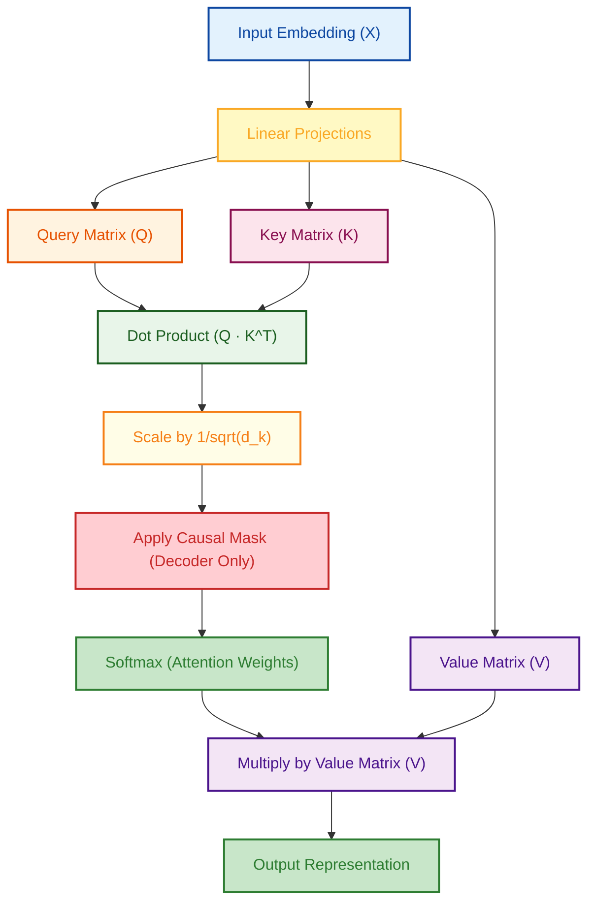
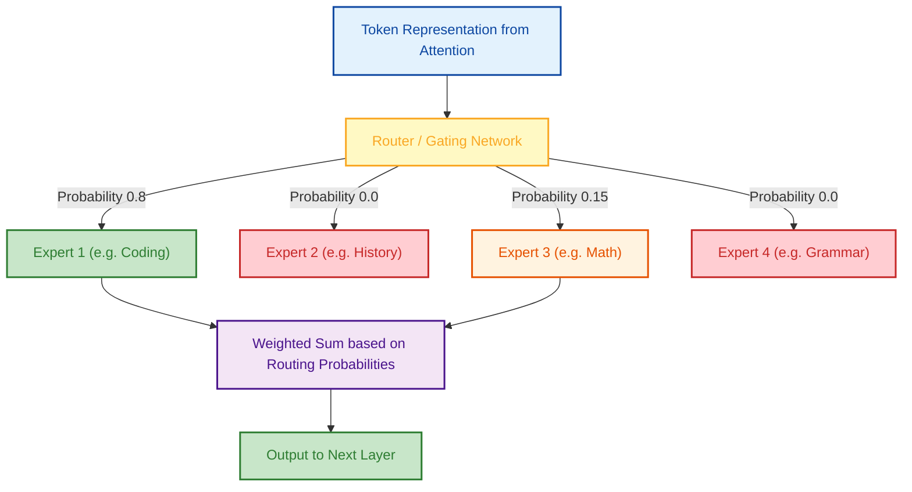

# Language Models — Internal Working

> A deep dive into the mathematical mechanics, memory constraints, and architectural evolutions of modern Transformer-based LLMs.

---

## Q1. How does the Self-Attention mechanism mathematically function?

### Core Answer

The core innovation of the Transformer is the **Scaled Dot-Product Self-Attention** mechanism. It allows the model to dynamically weigh the importance of every token in the sequence relative to the current token being processed.

For every token, the model projects its embedding into three vectors: **Query ($Q$)**, **Key ($K$)**, and **Value ($V$)**. 

$$ \text{Attention}(Q, K, V) = \text{softmax}\left(\frac{QK^T}{\sqrt{d_k}}\right)V $$

**Intuition:** 
- The **Query** asks: *"What semantic information am I looking for?"*
- The **Key** answers: *"What semantic information do I contain?"*
- The dot product ($Q \cdot K^T$) measures how well the Keys match the Queries across the entire sequence.
- The **Value** is the actual contextual payload that gets summed up based on the resulting attention weights.

### Related Questions

!!! question "Follow-up Interview Questions"
    1. Why is the attention score divided by the square root of the head dimension ($\sqrt{d_k}$)?
    2. What is the difference between Self-Attention and Cross-Attention?
    3. How does the Causal Mask prevent future-looking in Decoder models?
    4. What is the computational complexity of the Self-Attention mechanism?

??? success "View Answers"
    **1. Why scale by $\sqrt{d_k}$?**
    If the dimension $d_k$ is large, the dot products of random vectors grow extremely large in magnitude. When these large values are passed into the softmax function, it pushes the softmax into regions where the gradients are almost zero (vanishing gradients), halting training. Scaling by $\sqrt{d_k}$ forces the variance of the dot product to remain close to 1, keeping the gradients stable.

    **2. Self vs Cross Attention?**
    In Self-Attention, $Q$, $K$, and $V$ all come from the exact same input sequence (e.g., the user's prompt). In Cross-Attention (found in Encoder-Decoder models like T5), $Q$ comes from the Decoder (the translation being generated), while $K$ and $V$ come from the Encoder (the original source text).

    **3. Causal Masking?**
    During training, we process the entire sequence in parallel. Without a mask, token $t$ could simply "look ahead" at token $t+1$ to predict the next word, completely cheating the objective. The causal mask is a matrix of $-\infty$ applied to the upper triangle of the $QK^T$ matrix before the softmax. Since $\text{softmax}(-\infty) = 0$, it mathematically prevents any token from assigning attention weight to future tokens.

    **4. Computational Complexity?**
    The matrix multiplication $QK^T$ requires calculating the dot product between every token and every other token. This results in $O(N^2 \cdot d)$ time and memory complexity, where $N$ is the sequence length. This quadratic scaling is the fundamental reason why processing a 100K context window is exceptionally difficult.

---

## Q2. What are the memory bottlenecks of the Transformer during inference?

### Core Answer

Inference memory is fundamentally different from training memory. During autoregressive generation (inference), the largest bottleneck is not the model weights—it is the **KV Cache**.

To predict token $t$, the model needs the Key and Value vectors for all previous tokens $(0 \dots t-1)$. Recomputing these vectors at every step would require $O(N^3)$ compute. Instead, we cache them in VRAM.

**KV Cache Memory Formula per Token:**
$2 \times (\text{Num Layers}) \times (\text{Num Heads}) \times (\text{Head Dim}) \times (\text{Bytes per Float})$

For a 70B model with a 32K context window and a batch size of 16, the KV Cache can consume over 80GB of VRAM—more memory than the model weights themselves!

### Related Questions

!!! question "Follow-up Interview Questions"
    1. How do Multi-Query Attention (MQA) and Grouped-Query Attention (GQA) reduce memory?
    2. How does FlashAttention reduce memory overhead during training?
    3. What is the difference between the Prefill Phase and Decode Phase?
    4. Why do larger context windows exponentially increase Time-To-First-Token (TTFT)?

??? success "View Answers"
    **1. MQA and GQA?**
    Standard Multi-Head Attention creates separate $Q, K, V$ heads. MQA forces all Query heads to share a single $K$ and $V$ head, shrinking the KV Cache size by $H$ times (e.g., 8x smaller). GQA is a compromise: it groups a few Query heads (e.g., 4) to share a single $K$ and $V$ head. GQA (used in Llama 3) perfectly balances the memory savings of MQA with the performance quality of standard attention.

    **2. FlashAttention?**
    During training, standard attention materializes the massive $N \times N$ attention matrix in the GPU's slow High Bandwidth Memory (HBM). FlashAttention fuses the operations, computing the softmax in blocks (tiling) entirely within the GPU's ultra-fast SRAM. This prevents writing the $N \times N$ matrix to HBM, saving massive memory and achieving up to a 4x speedup.

    **3. Prefill vs Decode?**
    **Prefill:** The user submits a prompt. The LLM processes all tokens in the prompt simultaneously in parallel to populate the initial KV Cache. This is heavily compute-bound (matrix multiplications).
    **Decode:** The LLM generates tokens autoregressively, one by one. It reads the massive KV Cache from memory to compute just a single token. This is heavily memory-bandwidth bound.

    **4. TTFT Context Scaling?**
    Time-To-First-Token is determined by the Prefill phase. Because attention is $O(N^2)$, doubling the context window from 16K to 32K means the prefill compute doesn't double—it quadruples. Without hardware optimization (like RingAttention), massive contexts result in unacceptable user latency before the first word is even printed.

---

## Q3. How do Positional Encodings work, and why is RoPE the industry standard?

### Core Answer

A mathematical dot product has no concept of order; without intervention, a Transformer sees a sentence as a "Bag of Words." We must inject positional information into the embeddings.

The modern standard is **RoPE (Rotary Position Embedding)**. Instead of adding a static vector to the input embedding, RoPE mathematically rotates the $Q$ and $K$ vectors in the complex plane by an angle proportional to their position index.

The brilliance of RoPE is that the dot product of two rotated vectors depends strictly on the *relative distance* between them ($m - n$), allowing the model to perfectly capture relative phrasing (e.g., "not good" vs "good not").

### Related Questions

!!! question "Follow-up Interview Questions"
    1. How does RoPE differ from Sinusoidal Absolute Positional Encoding?
    2. What is ALiBi and why does it extrapolate well to unseen context lengths?
    3. How does Position Interpolation (PI) extend context length after pre-training?
    4. Why do we apply RoPE *after* the linear projections of Q and K?

??? success "View Answers"
    **1. RoPE vs Absolute Encoding?**
    The original "Attention is All You Need" paper used Absolute encoding: it created a static sinusoidal vector for position $t$ and added it to the input word embedding. The problem is that the attention between position $1$ and $5$ looked mathematically different from position $101$ and $105$. RoPE encodes *relative* distance mathematically, so the distance between $(1, 5)$ and $(101, 105)$ yields the exact same attention penalty.

    **2. ALiBi (Attention with Linear Biases)?**
    ALiBi doesn't touch the embeddings at all. Instead, it subtracts a linear penalty directly from the final attention scores right before the softmax. The penalty is proportional to the distance between tokens: $Penalty = m \times |i - j|$. Because the penalty is just a linear subtraction, it naturally extrapolates to sequences much longer than the model was trained on.

    **3. Position Interpolation (PI)?**
    If a model is trained on 4K tokens, its RoPE angles only know how to rotate up to position 4,000. If you pass in 8,000 tokens, the model collapses due to unseen angles. PI compresses the sequence: it tells the model that position 8,000 is actually position 4,000, and position 1 is 0.5. By squishing the indices to fit within the trained 0-4K domain, the model can instantly handle 8K context with minimal fine-tuning.

    **4. Why apply after projection?**
    If we applied rotation to the raw word embedding *before* the linear projections ($W_q, W_k$), the linear transformation matrix would distort the precise geometric angles. By applying RoPE *after* creating $Q$ and $K$, we guarantee that the relative dot product $Q \cdot K^T$ strictly preserves the rotary math.

---

## Q4. How does the Mixture of Experts (MoE) architecture work?

### Core Answer

In a standard dense Transformer, every parameter in the Feed-Forward Network (FFN) is multiplied for every single token. As models scale to trillions of parameters, this becomes too computationally expensive.

**Mixture of Experts (MoE)** (used in Mixtral and GPT-4) solves this by replacing the massive dense FFN with multiple smaller FFNs (Experts) and a **Router**.

For every token, the Router calculates probabilities and selects only the Top-K experts (usually Top-2 out of 8). Only those 2 experts are executed, saving massive amounts of compute (FLOPs).

### Related Questions

!!! question "Follow-up Interview Questions"
    1. What is the "Expert Load Balancing" problem during training?
    2. Why is VRAM usage higher in MoE despite lower inference FLOPs?
    3. Are experts explicitly trained for specific domains (e.g., one for Math)?
    4. What is the Router/Gating Network mathematically?

??? success "View Answers"
    **1. Expert Load Balancing?**
    During early training, the Router might accidentally prefer Expert 1. Expert 1 gets more gradients, becomes "smarter," causing the Router to route *more* tokens to Expert 1, creating a runaway feedback loop. The other 7 experts die. We fix this by adding an "Auxiliary Loss" (Load Balancing Loss) to the training objective, mathematically penalizing the model if it doesn't distribute tokens equally across all experts in a batch.

    **2. VRAM vs FLOPs in MoE?**
    A model like Mixtral 8x7B has 47 Billion total parameters. Because only 2 experts are active per token, it executes at the speed of a ~14B parameter model (low FLOPs). However, *all 47B parameters must be loaded into GPU VRAM* because the Router could choose any expert at any time. Thus, it requires the massive RAM of a 47B model, but the compute hardware of a 14B model.

    **3. Are experts domain-specific?**
    No. We do not explicitly label Expert 1 as "Math" and Expert 2 as "French". The routing behavior emerges completely organically during backpropagation. Upon post-training analysis, researchers often find that experts specialize in syntax, punctuation, or abstract concepts rather than clean human subjects.

    **4. The Router Math?**
    The Router is just a simple linear layer. We multiply the token embedding by a weight matrix $W_r$, which outputs an 8-dimensional vector (for 8 experts). We apply a Softmax function to turn this into a probability distribution, and pick the Top-2 highest probabilities.

---

## Q5. What is the difference between Encoder-Only, Decoder-Only, and Encoder-Decoder architectures?

### Core Answer

The original Transformer (2017) was an **Encoder-Decoder** designed for translation. Since then, the architecture has bifurcated.

| Architecture | Attention Type | Primary Use Case | Leading Models |
|---|---|---|---|
| **Encoder-Only** | Bidirectional | Text Classification, Dense Embeddings | BERT, RoBERTa |
| **Decoder-Only** | Causal (Unidirectional) | Autoregressive Text Generation (Chatbots) | GPT-4, Llama 3, Claude |
| **Encoder-Decoder**| Bidirectional + Cross | Translation, Summarization | T5, BART |

### Related Questions

!!! question "Follow-up Interview Questions"
    1. Why did the industry standardize on Decoder-Only models for general AI?
    2. Why are Encoder-Only models strictly better for dense vector embeddings?
    3. What happens if you try to use a Decoder-Only model for text classification?
    4. How does the Cross-Attention block work in an Encoder-Decoder model?

??? success "View Answers"
    **1. The dominance of Decoder-Only?**
    Decoder-only models (GPT) predict the next token based *only* on previous tokens. Researchers discovered that next-token prediction over massive internet-scale data forces the model to learn world models, syntax, logic, and facts. Because they are causal, they can generate text indefinitely. Encoders require a fixed input and cannot generate text cleanly without complex modifications.

    **2. Encoders for Embeddings?**
    If you want an embedding that represents the word "bank" in the sentence "I sat on the river bank", the model *must* be able to look ahead at the word "river". An Encoder uses Bidirectional attention, allowing every token to look at every other token simultaneously. A Decoder-only model reading "I sat on the river bank" processes "bank" without being able to look ahead, creating a mathematically inferior contextual representation.

    **3. Decoders for Classification?**
    You can use a Decoder for classification (e.g., Prompt: "Classify this sentiment: 'I love it.' Sentiment: "). However, because it only uses unidirectional attention, it is incredibly inefficient. A 110M parameter BERT (Encoder) will routinely outperform a 7B parameter Llama (Decoder) at pure classification tasks while using 1/60th of the compute.

    **4. Cross-Attention in Encoder-Decoder?**
    In translation (French to English), the Encoder processes the entire French sentence bidirectionally and outputs a matrix of hidden states. The Decoder generates the English sentence word-by-word. During generation, the Decoder uses Cross-Attention: its Queries ($Q$) come from the currently generated English words, but its Keys ($K$) and Values ($V$) come directly from the Encoder's French hidden states, allowing it to "look back" at the source text.

---

*Next: [Supervised Fine-Tuning →](../08-fine-tuning/README.md)*
