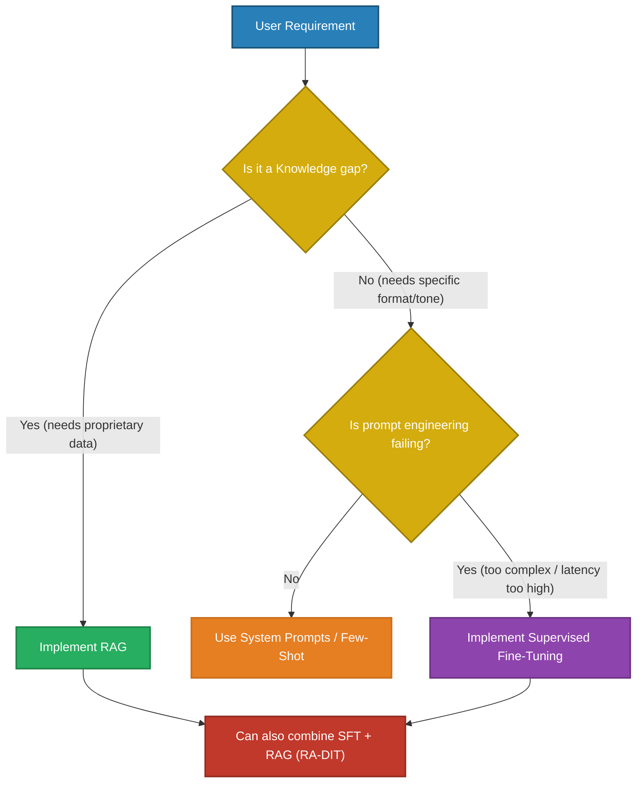
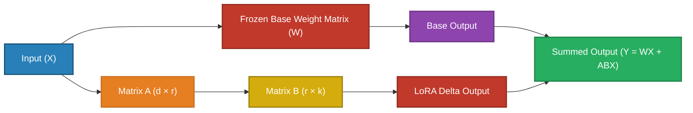
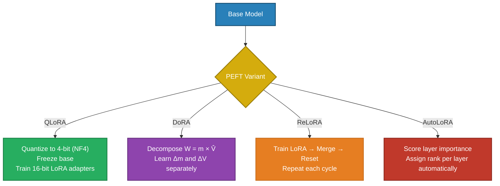

# Supervised Fine-Tuning of LLMs

> Supervised Fine-Tuning (SFT) adapts a generalist foundation model to your specific domain, tone, and formatting constraints.

---

## Q1. What is the fundamental difference between Pre-training, SFT, and RAG?

### Core Answer

Many engineering teams confuse the purpose of Fine-Tuning with Retrieval-Augmented Generation (RAG). 

**Pre-training** learns the *World Model*. It predicts the next token over trillions of words (Unsupervised) to learn grammar, logic, and broad facts.
**Supervised Fine-Tuning (SFT)** learns *Behavior and Format*. It uses high-quality (Prompt, Response) pairs to teach the model how to act (e.g., "Always respond in strict JSON," "Adopt a clinical tone").
**RAG** provides *Dynamic Context*. It injects facts into the prompt at runtime.

**The Golden Rule:** Use RAG for *Knowledge*. Use SFT for *Behavior*.

### Related Questions

!!! question "Follow-up Interview Questions"
    1. Can SFT reliably inject new factual knowledge into an LLM?
    2. How does SFT reduce inference latency in production?
    3. What is the ChatML format and why is it necessary for SFT?
    4. What happens if you fine-tune on low-quality data?

??? success "View Answers"
    **1. SFT for Knowledge Injection?**
    It is highly discouraged. SFT modifies the model's weights to increase the probability of specific token sequences. While the model *might* memorize a fact seen in SFT, it is prone to hallucination, cannot be cited, cannot be updated without retraining, and cannot have role-based access control (RBAC). Always use RAG for facts.

    **2. SFT for Latency Reduction?**
    If you want a model to output a complex JSON schema, you might need a 2,000-token system prompt containing 10 few-shot examples. This massive prompt consumes significant Prefill compute and Time-To-First-Token (TTFT) latency for *every single user query*. By fine-tuning the model on 5,000 JSON examples, you bake the behavior into the weights. You can then drop the system prompt entirely, drastically reducing latency and token costs.

    **3. The ChatML Format?**
    Base models just predict the next word. SFT teaches them to be "chatbots" using special control tokens (e.g., `<|im_start|>user`, `<|im_start|>assistant`). If you fine-tune a model using a different control token format than what it was pre-trained with, the model will output gibberish. Data must be strictly formatted into conversational turns.

    **4. Low-Quality SFT Data?**
    SFT requires massive quality control. "Garbage in, garbage out" is magnified in SFT. Fine-tuning on 10,000 mediocre examples will actively degrade the model's foundational reasoning capabilities (Model Collapse), whereas fine-tuning on just 1,000 pristine, expert-curated examples (like the LIMA paper demonstrated) yields a highly capable model.

---

## Q2. How do you mathematically estimate the GPU memory required for Full Fine-Tuning?

### Core Answer

Training a model requires vastly more VRAM than running inference. During Full Fine-Tuning (FFT), you must store the Model Weights, the Gradients, the Optimizer States, and the Forward Activations.

If we use the standard **AdamW optimizer** with **Mixed Precision (BF16)**, the memory formula is:
- **Weights (BF16):** 2 bytes per parameter
- **Gradients (BF16):** 2 bytes per parameter
- **AdamW Master Weights (FP32):** 4 bytes per parameter
- **AdamW Momentum 1 (FP32):** 4 bytes per parameter
- **AdamW Momentum 2 / Variance (FP32):** 4 bytes per parameter

**Total fixed overhead:** $\approx 16$ Bytes per Parameter.
For a 7B parameter model (e.g., Llama-3-8B): $8B \times 16 \text{ bytes} \approx 128 \text{ GB of VRAM}$.

This is *before* accounting for the KV Cache and Activation memory (which scales quadratically with sequence length and batch size). A standard 8B model requires at least two 80GB A100 GPUs just to fit in memory for Full Fine-Tuning.

### Related Questions

!!! question "Follow-up Interview Questions"
    1. Why does the Adam optimizer consume twice as much memory as the model weights?
    2. How does Gradient Checkpointing trade compute for memory?
    3. What is Mixed Precision Training (BF16)?
    4. How does Gradient Accumulation solve batch size limits on single GPUs?

??? success "View Answers"
    **1. Adam Optimizer Memory?**
    Standard SGD just uses the gradient. Adam tracks the exponentially decaying average of past gradients (Momentum) and the past squared gradients (Variance) to dynamically adjust the learning rate for *every single parameter*. These two rolling averages must be stored in high-precision FP32, requiring 8 bytes per parameter (4x the memory of the BF16 model weights).

    **2. Gradient Checkpointing?**
    During the forward pass, the model must save all intermediate layer outputs (Activations) in memory because the Backpropagation algorithm needs them to calculate the chain rule. For deep models, this memory is massive. Gradient Checkpointing deletes these activations from memory immediately. During the backward pass, it simply *recalculates* them on the fly. It saves up to 60% of VRAM at the cost of being 20% slower computationally.

    **3. Mixed Precision Training?**
    Training purely in FP32 takes 4 bytes per weight. We can store the model and run the forward/backward pass in Bfloat16 (BF16, 2 bytes) to double speed and halve memory. However, BF16 doesn't have enough precision for the tiny gradient updates applied by the optimizer. Mixed Precision keeps a "Master Copy" of the weights in FP32, calculates the update in BF16, and applies the update to the FP32 Master.

    **4. Gradient Accumulation?**
    If your GPU only has enough RAM to support a Batch Size of 1, the gradients will be incredibly noisy and the model won't converge. Gradient Accumulation runs the forward and backward pass for a Batch Size of 1, but *does not update the weights*. It simply adds the gradient to a running tally. After 32 iterations, it calls `optimizer.step()`, perfectly simulating a Batch Size of 32 without needing 32x the VRAM.

---

## Q3. How does LoRA (Low-Rank Adaptation) bypass the memory bottleneck?

### Core Answer

Full Fine-Tuning modifies all 8 Billion parameters, requiring 128GB of VRAM. **LoRA (Low-Rank Adaptation)** is a Parameter-Efficient Fine-Tuning (PEFT) technique that allows you to fine-tune a 70B model on a single consumer GPU.

Instead of updating the massive pre-trained weight matrix $W$ (which has dimension $d \times k$), LoRA completely **freezes** the base model. It then injects a parallel trainable "Delta Matrix" ($\Delta W$).

To save parameters, LoRA decomposes $\Delta W$ into two tiny low-rank matrices: $A$ (dimension $d \times r$) and $B$ (dimension $r \times k$), where $r$ (rank) is extremely small (e.g., 8 or 16).

**Math Example:** If $W$ is $4096 \times 4096$, it has **16.7M params**. If $r = 8$, $A$ is $4096 \times 8$ and $B$ is $8 \times 4096$, totaling just **65K params**. We achieved the same matrix dimensions while training **99.6% fewer parameters**, eliminating the massive Adam optimizer overhead.

### Related Questions

!!! question "Follow-up Interview Questions"
    1. What is the relationship between the rank ($r$) and the LoRA alpha ($\alpha$) parameter?
    2. Why does LoRA introduce absolutely zero latency during inference?
    3. How does QLoRA push memory boundaries even further?
    4. Which transformer modules should you target with LoRA adapters?

??? success "View Answers"
    **1. Rank ($r$) vs Alpha ($\alpha$)?**
    $r$ determines the parameter bottleneck (the "intelligence" capacity of the adapter). $\alpha$ is a scaling factor used during training to dictate how strongly the LoRA output influences the frozen base output. The outputs of the LoRA matrices are multiplied by $\frac{\alpha}{r}$. A common rule of thumb is to set $\alpha = 2r$. 

    **2. Zero Inference Latency?**
    During inference, you do not need to run the $X \times A \times B$ calculation. Because matrix multiplication is distributive, you can mathematically merge the trained LoRA weights directly into the base weights permanently: $W_{new} = W + (A \times B) \cdot \frac{\alpha}{r}$. The resulting matrix is the exact same size as the original, meaning inference latency is 100% identical to the base model.

    **3. What is QLoRA?**
    LoRA reduces the optimizer memory, but you still have to load the 16-bit Frozen Base Model into VRAM. QLoRA mathematically quantizes the Frozen Base Model down to 4-bit precision (NF4), slashing the base memory footprint by 75%. It then trains the 16-bit LoRA adapters on top of the 4-bit base. This allows fine-tuning a 70B model on two 24GB consumer GPUs.

    **4. Target Modules?**
    Originally, researchers only applied LoRA to the Attention Query ($Q$) and Value ($V$) projection matrices. Modern best practice (as shown by the QLoRA paper) dictates applying LoRA adapters to *all linear layers* in the model, including $Q, K, V, O$, and the massive FFN Up/Down projections. This drastically improves convergence and final model quality.

---

## Q4. How do you mitigate Catastrophic Forgetting during SFT?

### Core Answer

**Catastrophic Forgetting** occurs when an LLM is fine-tuned heavily on a narrow domain (e.g., Medical diagnosis). As the weights shift to perfectly predict medical text, the model actively overwrites and "forgets" its pre-trained general reasoning abilities, failing at basic math, coding, or conversational tasks it previously excelled at.

**Mitigation Strategies:**
1. **Low Learning Rates & Epochs:** SFT requires learning rates ~10x lower than pre-training (e.g., $2e-5$) and usually converges in just 1 to 3 epochs. Training for 10 epochs guarantees overfitting and forgetting.
2. **Data Mixing (Replay):** If you are training on 10,000 Medical documents, inject 2,000 General Domain documents (Math, Code, Chit-chat) into the training set. This forces the gradients to preserve the general circuits.
3. **PEFT (LoRA):** Because LoRA freezes 99% of the base weights, the foundational world-model is mathematically preserved in the frozen matrix. Only the tiny delta matrix is biased toward the medical domain.

### Related Questions

!!! question "Follow-up Interview Questions"
    1. How do you calibrate the Learning Rate for SFT compared to Pre-training?
    2. What is Elastic Weight Consolidation (EWC)?
    3. What is the impact of training for too many epochs in SFT?
    4. How does "Format Overfitting" manifest in SFT models?

??? success "View Answers"
    **1. Learning Rate Calibration?**
    Pre-training uses high learning rates to violently carve out the foundational loss landscape. SFT uses a "Cosine Decay with Warmup" schedule starting at a very low rate (e.g., $1e-5$). The warmup prevents the initial uncalibrated gradients from destroying the delicate pre-trained weights, and the low learning rate ensures we are only "polishing" the loss minimum, not escaping it.

    **2. Elastic Weight Consolidation (EWC)?**
    EWC is an advanced continual-learning technique. Before SFT, we calculate the Fisher Information Matrix to identify exactly which weights are critical for the model's general abilities. We then add a penalty to the loss function: if the SFT optimizer tries to change those specific "important" weights, the loss spikes. It forces the optimizer to learn the new task using only "unimportant" weights.

    **3. Over-epoching?**
    LLMs are massive over-parameterized function approximators. By Epoch 4 or 5 on a small dataset of 5,000 examples, the model will simply memorize the exact training data verbatim (overfitting) rather than learning the underlying semantic patterns. Validation Loss will decouple from Training Loss and skyrocket.

    **4. Format Overfitting?**
    If 100% of your SFT training data ends with the phrase "Thank you for asking!", the model will structurally bind that phrase to every output. If all your training data is exactly 3 paragraphs long, the model will lose the ability to write a 1-paragraph or 5-paragraph answer. Training data must have high variance in length, structure, and tone.

---

## Q5. How do you build an SFT dataset for "Abstention" (Refusing to Hallucinate)?

### Core Answer

In Enterprise RAG, the worst possible outcome is the LLM hallucinating a confident answer when the retrieved context doesn't contain the facts. 

Trying to solve this with System Prompts (*"If the answer is not in the context, say 'I don't know'"*) is highly fragile. The LLM's pre-trained urge to "be helpful" will often override the prompt.

**You must use SFT to teach Abstention.**
Your dataset must contain a specific ratio of **Negative Examples**:
1. Retrieve a document.
2. Ask a question completely unrelated to the document.
3. Set the target ground-truth output to the exact string: *"I do not have enough information in the provided context to answer this."*

By exposing the model to this pattern thousands of times, Abstention becomes a mathematically preferred neural pathway over hallucination.

### Related Questions

!!! question "Follow-up Interview Questions"
    1. What is the optimal ratio of Positive to Negative examples in an abstention dataset?
    2. How do you use Distillation (Synthetic Data) from GPT-4 to build an SFT dataset?
    3. How do you evaluate an SFT model beyond simple Validation Loss?
    4. What is the difference between SFT and RLHF for behavioral alignment?

??? success "View Answers"
    **1. Optimal Positive/Negative Ratio?**
    Empirically, the dataset should contain 20% to 30% Negative (Abstention) examples. If you drop below 10%, the model ignores the lesson and still hallucinates. If you go above 40%, you induce "Refusal Overfitting"—the model becomes hyper-conservative and starts saying "I don't know" even when the correct facts *are* present in the context.

    **2. Synthetic Data (Distillation)?**
    Human labeling is slow and expensive. You can script GPT-4-Turbo to generate your SFT dataset. Pass a company document to GPT-4 and prompt it: *"Generate 5 complex user queries that can be answered by this document, and provide the exact step-by-step answer."* You then use these thousands of synthetic QA pairs to fine-tune a much smaller, cheaper 8B parameter model, effectively "distilling" GPT-4's intelligence into your local model.

    **3. SFT Evaluation?**
    Validation Loss is a poor metric for LLMs because it only measures next-token probability, not semantic quality. You must use "LLM-as-a-Judge". Pass the fine-tuned model's outputs to GPT-4 and ask GPT-4 to score them from 1-5 on metrics like Faithfulness, Helpfulness, and Format Adherence.

    **4. SFT vs RLHF?**
    SFT uses supervised examples (Input $\rightarrow$ Output). It is great for teaching format and style. Reinforcement Learning from Human Feedback (RLHF) uses preference ranking (Output A is better than Output B). RLHF is vastly superior at teaching abstract behavioral concepts like "Helpfulness", "Safety", and "Toxicity avoidance", which are incredibly hard to define via static SFT examples.

---

## Q6. What are the key PEFT variants beyond LoRA: QLoRA, DoRA, ReLoRA, and AutoLoRA?

### Core Answer

After LoRA established the PEFT paradigm, four major variants emerged to address specific limitations in memory, convergence, and adapter placement. All four freeze the base model and train only small adapter structures, but each does it differently.

**QLoRA (Quantized LoRA):** Loads the base model in 4-bit precision (NF4 format), then trains 16-bit LoRA adapters on top of it. Paged optimizers prevent GPU memory spikes. This enables fine-tuning a 65B model on a single 48GB GPU with near full-precision quality.

**DoRA (Weight-Decomposed LoRA):** Decomposes each weight matrix into a magnitude scalar $m$ and a normalized direction $\hat{V}$, then applies LoRA updates to each component separately: $W = m \cdot \hat{V}$. Standard LoRA blends both into one $\Delta W$, which struggles when the task requires significant weight rescaling. DoRA fixes this and consistently outperforms LoRA at the same parameter count.

**ReLoRA (Restart LoRA):** Standard LoRA adapters can stall in local optima during long training runs. ReLoRA periodically merges the current adapters into the base weights ($W \leftarrow W + AB$), resets the adapters, and continues training — allowing each training phase to start from a richer base. Best suited for full pre-training or continued pre-training runs, not short SFT.

**AutoLoRA:** Instead of manually choosing which layers and what rank to assign, AutoLoRA uses importance scoring across layers to automatically determine adapter placement and rank allocation. A layer that shows high gradient sensitivity gets a higher rank; others get a lower rank or no adapter at all.

| Method | Core Idea | Best For |
|---|---|---|
| QLoRA | 4-bit base + 16-bit LoRA | Fitting huge models on small GPUs |
| DoRA | Separate magnitude/direction updates | Better quality than LoRA, same cost |
| ReLoRA | Merge + restart LoRA periodically | Long pre-training or continued training |
| AutoLoRA | Auto-assign ranks by layer importance | Reducing wasted parameters in SFT |

### Related Questions

!!! question "Follow-up Interview Questions"
    1. What is NF4 and why does it outperform standard 4-bit uniform quantization?
    2. Why does DoRA separate weight magnitude from direction?
    3. In what scenario would you choose ReLoRA over standard LoRA?
    4. How does AutoLoRA differ from manually sweeping LoRA rank as a hyperparameter?

??? success "View Answers"
    **1. NF4 (NormalFloat-4)?**
    NF4 is a 4-bit data type designed around the empirical observation that LLM weights follow a near-Gaussian distribution centered at zero. Standard INT4 quantization places its 16 representable values evenly across the range, wasting most bins on extreme values where almost no weights exist. NF4 derives its bin boundaries by quantizing a theoretical normal distribution so that each bin covers an equal portion of the probability mass — placing many more bins near zero where the weights are dense. This reduces quantization error significantly. QLoRA also uses *double quantization*: the quantization constants themselves (one per 64-parameter block) are quantized a second time from FP32 to FP8, saving an additional ~0.37 bits per parameter.

    **2. DoRA Magnitude/Direction Split?**
    LoRA updates $W + AB$, which changes both the scale and direction of the weight matrix in a coupled way. Tasks that require the model to strongly rescale certain weight channels (e.g., switching output tone or learning a task with very different activation magnitudes) require large $\Delta W$ norms that a low-rank decomposition struggles to express cleanly. DoRA decouples these: the scalar $m$ absorbs all scaling changes while $\hat{V}$ handles purely directional changes. This matches how weight updates look in fully fine-tuned models, leading to more stable convergence.

    **3. When to Use ReLoRA?**
    ReLoRA's periodic merge-and-restart gives each subsequent LoRA phase a richer starting point, simulating the effect of a higher-rank adapter over time. This benefit compounds over long training runs (tens of thousands of steps). For a short SFT run of 1–3 epochs on a small dataset, a standard LoRA with a well-tuned rank achieves similar results with less complexity.

    **4. AutoLoRA vs Rank Sweep?**
    A manual rank sweep trains one full run per candidate rank and picks the best. AutoLoRA runs once and learns the rank allocation jointly with the adapter weights, using differentiable importance scores. This means it can discover that layer 8 needs rank 32 while layer 2 only needs rank 4 — a result that would require $O(N)$ separate manual experiments to find.

---

*Interview Questions: [Fine-Tuning Interview Q&A →](interview-questions.md)*

*Next: [Preference Alignment →](../09-preference-alignment/README.md)*
