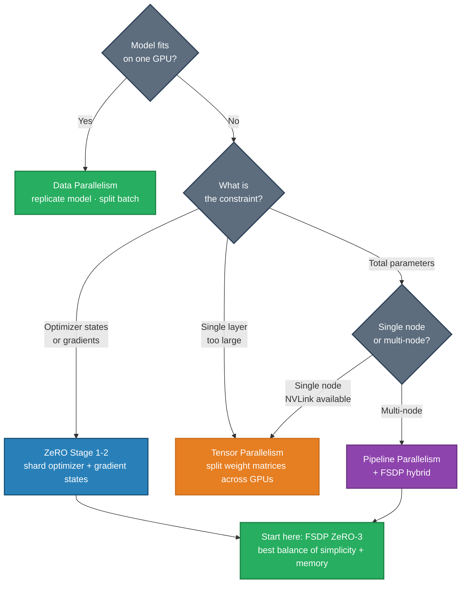
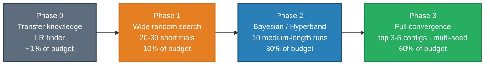
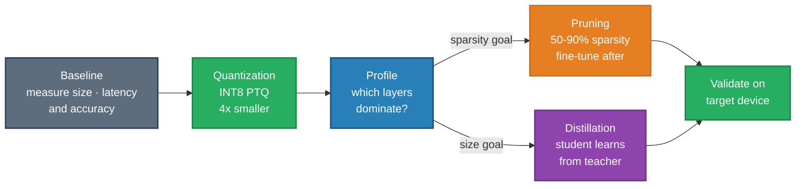

# Fine-Tuning & Training Infrastructure — Interview Questions

Role focus: **ML Engineer** · **Data Scientist**

---

## Q1 — Training Infrastructure for High-Volume Experimentation

**Question:** Your team runs hundreds of experiments per month. What does a well-designed training pipeline look like, and what are the decisions that matter most?

**Short answer:** A good training pipeline enables fast iteration through reproducibility (versioned code + data + configs), cost control (preemptible instances, resource quotas), and debuggability (experiment tracking, failure logging). The infrastructure is only worth investing in once the bottlenecks are diagnosed.

---

### Core components

**Experiment tracking**

Every run must capture: hyperparameters, data version (not just dataset name — the exact hash), code version (git commit), metrics over time, and output artifacts. Without this, results cannot be reproduced and promising directions cannot be reliably revisited.

Use existing tools (MLflow, Weights & Biases, Comet) rather than building custom tracking. The tooling is mature and battle-tested — building from scratch is almost never worth it.

**Configuration management**

Define experiments declaratively:

```yaml
model:
  architecture: transformer
  hidden_size: 768
  num_layers: 12

training:
  learning_rate: 1.0e-4
  batch_size: 32
  max_steps: 100_000

data:
  dataset_version: v2.3
  preprocessing: standard
```

Configs make experiments diffable — "what changed between run 47 and run 48?" is a one-line diff.

**Compute orchestration**

- Job queue with priority management (prevent one team member from monopolizing all GPUs)
- Auto-scaling to match demand rather than provisioning for peak
- Preemptible instances with automatic checkpoint recovery to reduce costs by 3–5×
- Per-user/per-project resource quotas to prevent runaway cost

**Data pipeline**

- Dataset versioning so you know which model trained on which data
- Efficient data loading — I/O saturation is a common GPU utilization killer, often more impactful than model changes
- Pre-training data validation (schema checks, corruption detection) before a 10-hour run starts

---

### Critical decisions

| Decision | What good looks like |
|---------|---------------------|
| Checkpoint storage | Fast local storage during training; durable object storage after; automatic cleanup policies to manage costs |
| Failure handling | Auto-resume from last checkpoint; alert on unexpected failures (OOM, NaN loss); easy log inspection |
| Experiment comparison | Dashboards filterable by config, data version, and metric; statistical significance testing for close results |

---

### Common failure modes to design against

- **"That good result from last month is irreproducible"** → Strict code + data + config versioning
- **"GPUs are 40% utilized"** → Profile data loading pipeline; preprocessing is usually the bottleneck
- **"Compute costs are out of control"** → Preemptible instances + automatic termination on NaN loss + resource quotas
- **"Nobody can find anything"** → Good naming conventions, tags, and searchable metadata from day one

---

## Q2 — Distributed Training Strategy Selection

**Question:** A model is too large to fit on a single GPU. Walk through the available distributed training strategies and how you'd choose between them.

**Short answer:** There are four fundamental strategies — data parallelism, tensor parallelism, pipeline parallelism, and fully-sharded data parallelism (ZeRO/FSDP). The right choice depends on what's too large: parameters alone, or individual layers within the model.

---

### Understanding GPU memory breakdown first

For a 7B parameter model in float32 with Adam optimizer:

| Component | Memory |
|-----------|--------|
| Parameters | ~28 GB |
| Gradients | ~28 GB |
| Optimizer states (Adam) | ~56 GB |
| Total (pre-activations) | ~112 GB |

This explains why even 80 GB A100s can't fit large models without parallelism.

---

### Strategy 1: Data parallelism

Each GPU holds a complete model copy; the batch is split across GPUs. Gradients are synchronized via all-reduce after each backward pass.

- **Use when:** Model fits on one GPU; you want higher throughput or larger effective batch size
- **Scales:** Compute near-linearly; memory does NOT decrease per GPU
- **Limitation:** Communication overhead grows with model size

---

### Strategy 2: Tensor parallelism

Large weight matrices are split column- or row-wise across GPUs. Each GPU computes a shard of each matrix multiplication, then results are combined via all-reduce.

- **Use when:** Individual layers are too large (attention heads, FFN layers in very large models)
- **Best for:** Single nodes with fast interconnect (NVLink); communication cost is too high across nodes
- **Limitation:** Very high communication frequency — every layer needs synchronization

---

### Strategy 3: Pipeline parallelism

Different sets of layers run on different GPUs. Forward activations flow GPU0 → GPU1 → ... ; gradients flow in reverse. Micro-batching keeps all GPUs busy and reduces "pipeline bubbles."

- **Use when:** Model depth is the constraint; you have multiple nodes to span
- **Best for:** Scenarios where tensor parallelism's communication cost is too high
- **Limitation:** Pipeline bubbles still reduce efficiency; scheduling complexity is high

---

### Strategy 4: FSDP / ZeRO sharding

Shards optimizer states, gradients, and optionally parameters across all GPUs. Parameters are gathered just-in-time for computation and discarded afterward.

- **ZeRO Stage 1:** Shard optimizer states only (~4× memory reduction)
- **ZeRO Stage 2:** + shard gradients (~8× memory reduction)
- **ZeRO Stage 3:** + shard parameters — maximum efficiency, most communication overhead

**Use when:** You want data-parallel simplicity but the model doesn't fit. Best balance of memory efficiency and implementation complexity.

---

### Decision tree



**Practical default:** Start with FSDP (ZeRO Stage 3). It's the best balance of memory savings and implementation simplicity. Add tensor or pipeline parallelism only if profiling shows communication becomes the bottleneck.

---

## Q3 — Hyperparameter Search on a Budget

**Question:** You have a limited compute budget and need to find good hyperparameters for a new architecture. What's the most efficient approach?

**Short answer:** Transfer before searching. Identify high-impact hyperparameters before tuning. Use a three-phase process: wide random exploration (10% of budget) → focused Bayesian optimization (30%) → final validation runs (60%). Avoid grid search.

---

### Budget allocation at a glance



### Phase 0: Transfer knowledge first

Before running a single experiment:

- Look for published hyperparameters from similar architectures or tasks — these are your starting point
- Use well-established defaults (Adam lr=1e-4, batch size=32 or 64, warmup ratio=5%)
- Run a learning rate finder: sweep lr over 3 orders of magnitude on a single short run, plot loss vs. lr, and pick the value where loss decreases fastest

The best hyperparameter search is the one you don't run.

---

### Know what matters

Not all hyperparameters affect results equally:

| High impact | Medium impact | Usually low impact |
|-------------|--------------|-------------------|
| Learning rate | Weight decay | Adam β₂ |
| Batch size | Warmup steps | Gradient clip threshold |
| Model size | Dropout rate | Label smoothing |
| Training duration | | Attention dropout |

Focus search budget on the top row. Use defaults for everything else.

---

### Phase 1: Wide random search (10% of budget)

- Broad ranges: lr ~ log-uniform(1e-5, 1e-2), batch size ~ choice(32, 64, 128, 256)
- Short runs: 10–20% of full training steps
- 20–30 trials
- Goal: eliminate clearly bad regions, identify promising neighborhoods

Key insight: early training loss is predictive of final performance. You don't need to train to convergence to rank configurations.

---

### Phase 2: Focused search (30% of budget)

**Successive Halving (Hyperband):** Start many trials with a small budget. Keep the top half. Double the budget. Repeat. Automatically allocates resources to promising configurations.

**Bayesian optimization:** Fit a surrogate model (Gaussian process) to observed results. Use an acquisition function (expected improvement) to pick the next point. Better for continuous search spaces with expensive evaluations.

Use the promising regions from Phase 1. Run medium-length training (50% of full steps).

---

### Phase 3: Final validation (60% of budget)

Train the top 3–5 configurations from Phase 2 to full convergence. Run multiple seeds to measure variance. Use a proper holdout set — not the one used during search (otherwise you're fitting to the validation set).

---

## Q4 — Model Compression for Production Deployment

**Question:** Your model performs well but is too large and slow for production constraints. What compression techniques do you apply and in what order?

**Short answer:** Apply in order of effort and risk: quantization first (easy, high impact), pruning second (moderate effort), knowledge distillation third (high effort, best size reduction). Match the technique to what you're optimizing — size, latency, or memory.

---

### Mapping techniques to goals

| Target | Primary technique | Accuracy impact |
|--------|------------------|-----------------|
| Smaller file size | Quantization, pruning | Low (< 1% typical) |
| Faster inference | Architecture optimization, quantization | Low–medium |
| Lower memory at runtime | Quantization, FSDP-style sharding | Low |
| Mobile/edge deployment | Distillation + architecture changes | Medium |

---

### Technique 1: Quantization (start here)

Reduce the numerical precision of weights and activations.

- **Post-training INT8:** 4× smaller, minimal accuracy loss — the default first step
- **Post-training INT4:** 8× smaller, ~1% typical accuracy drop — acceptable for most tasks
- **Quantization-aware training (QAT):** Simulate quantization during training; better accuracy than post-training at the cost of a retraining step

Use PTQ first. Add QAT only if accuracy drop exceeds your tolerance.

### Technique 2: Pruning

Remove weights or entire neurons/channels that contribute little to outputs.

**Process:** Train full model → measure weight magnitudes → set sparsity threshold → prune below threshold → fine-tune on training data → repeat (iterative pruning).

- Unstructured (weight-level) pruning: 50–90% sparsity with < 1% accuracy drop possible, but hardware speedup requires sparse kernels
- Structured (channel/head-level) pruning: Directly accelerates inference on standard hardware; larger accuracy impact per unit of sparsity

### Technique 3: Knowledge distillation

Train a smaller "student" model to reproduce the outputs of the larger "teacher" model.

Loss combines two terms:
- Hard loss: cross-entropy against ground truth labels
- Soft loss: KL divergence against teacher's logit distribution (carries information about inter-class similarity)

Achieves significantly greater size reduction than quantization or pruning at the cost of a full retraining cycle. DistilBERT achieves 40% size reduction with ~3% accuracy drop on GLUE benchmarks.

---

### Compression pipeline



1. **Baseline:** Measure size, latency (P50/P95/P99), and accuracy on your target hardware
2. **Quantize:** INT8 post-training — almost always justified
3. **Profile:** Where is the remaining latency? Which layers dominate?
4. **Prune or distill:** Based on profiling and accuracy budget
5. **Validate on target device:** Desktop benchmark ≠ mobile latency

---

## Q5 — Reproducible ML Pipelines Across Environments

**Question:** Training produces different results on developer machines vs. CI vs. production. How do you achieve full reproducibility across environments?

**Short answer:** Reproducibility requires controlling three axes simultaneously: code (git commit), data (content-addressed hash), and environment (containerized with pinned dependencies). Add deterministic training controls and provenance logging to complete the picture.

---

### The three axes of irreproducibility

| Axis | Common failure | Fix |
|------|---------------|-----|
| Code | Different library versions install on different machines | Pin with `requirements.txt` hash, containerize |
| Data | Dataset silently updated, preprocessing re-run with different logic | Content-address datasets, store hash with experiment |
| Environment | Python version difference, CUDA version mismatch, nondeterministic GPU ops | Docker with pinned base image and explicit CUDA version |

---

### Practical measures

**Environment capture:** Containerize every training run. Use a pinned base image (e.g., `nvidia/cuda:12.1-cudnn8-runtime-ubuntu22.04`). Pin all Python dependencies by hash, not just version (use `pip freeze > requirements.txt` or `poetry.lock`).

**Data versioning:** Store datasets in content-addressed storage (DVC, Git LFS for small datasets, or object storage with immutable paths). Record the dataset SHA-256 hash alongside every experiment in your tracking system.

**Deterministic training:** Fix random seeds for PyTorch, NumPy, and Python's random module. Set `torch.backends.cudnn.deterministic = True` and `torch.backends.cudnn.benchmark = False`. Note: full GPU determinism has a performance cost — apply in validation contexts, not necessarily all training.

**Provenance logging:** Every model artifact should be accompanied by: git commit SHA, dataset hash, Python + CUDA environment spec, and full hyperparameter config. These are the minimum fields needed to re-create the run from scratch.

**Workflow management:** Use an orchestration tool (Airflow, Kubeflow Pipelines, Dagster, or Prefect) to define training as a versioned DAG. Ad-hoc script execution cannot be reliably reproduced.

---

*Back to [Fine-Tuning →](README.md)*
