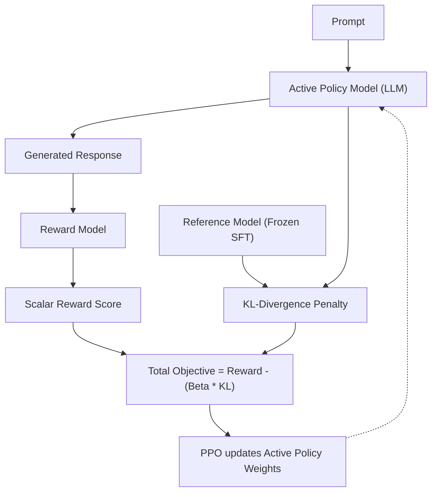
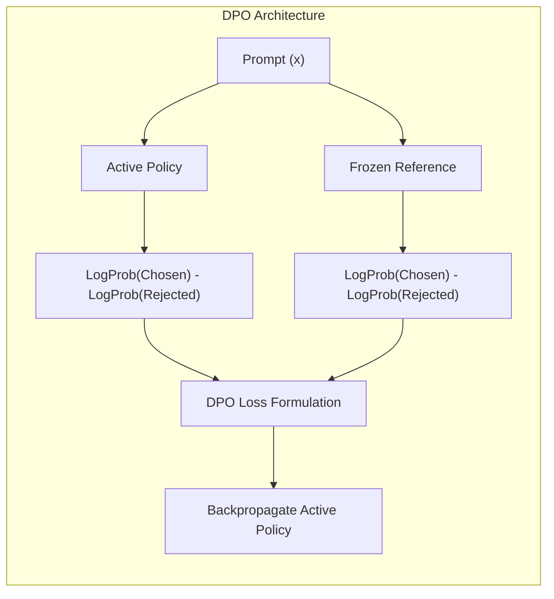

# Preference Alignment (RLHF & DPO)

> Supervised Fine-Tuning (SFT) teaches a model *how* to talk. Preference Alignment teaches a model *what humans actually want it to say*. Answers are calibrated for a **Google L5 Senior AI/ML Engineer** interview bar.

---

## Q1. What is the mathematical distinction between SFT and Preference Alignment?

### Core Answer

**Supervised Fine-Tuning (SFT)** is purely **Behavioral Cloning**. It uses standard Cross-Entropy loss to maximize the probability of the next token matching the training data. If your SFT dataset contains mediocre answers 20% of the time, the model mathematically learns to produce mediocre answers 20% of the time. 

**Preference Alignment** optimizes for abstract human objectives that cannot be easily defined via next-token prediction (e.g., Helpfulness, Honesty, Harmlessness - the HHH criteria). Instead of learning to *mimic* an answer, the model is penalized for generating a "Rejected" answer and rewarded for generating a "Chosen" answer, establishing a clear mathematical boundary between good and bad behavior.

### Related Questions

!!! question "Follow-up Interview Questions"
    1. Why can't we just use SFT on "perfect" data to achieve alignment?
    2. What is the "Alignment Tax"?
    3. How does Preference Alignment fix the "Sycophancy" problem?
    4. What is Constitutional AI?

??? success "View Answers"
    **1. SFT vs Perfect Data?**
    Even with perfect data, SFT models suffer from the "Exposure Bias" problem. During SFT training (Teacher Forcing), the model is fed the exact perfect previous tokens to predict the next one. During inference, if the model makes a single mistake, it enters an out-of-distribution state that it never saw during training, causing the output to rapidly degrade. Preference alignment explores these suboptimal states during training and teaches the model how to recover.

    **2. The Alignment Tax?**
    When you force a model to be completely safe, harmless, and polite, you mathematically compress its probability distribution. This restriction causes the model's performance on raw reasoning, coding, and benchmark tasks to drop compared to the unaligned Base model. This loss in raw intelligence is called the Alignment Tax.

    **3. The Sycophancy Problem?**
    SFT models inherently learn to agree with the user. If a user says, *"The earth is flat, right?"*, an SFT model will often reply, *"Yes, the earth is flat..."* because internet training data usually features people agreeing with each other. Preference alignment explicitly penalizes the model for agreeing with factually incorrect user premises.

    **4. Constitutional AI?**
    Created by Anthropic (Claude), Constitutional AI bypasses human labelers. You define a "Constitution" (a list of abstract rules like "Do not assist in illegal acts"). An LLM generates responses, and a second "Judge" LLM critiques the response against the Constitution and rewrites it. The model is then aligned using these AI-generated (Chosen, Rejected) pairs, massively reducing the cost of human feedback.

---

## Q2. How does the RLHF (Reinforcement Learning from Human Feedback) pipeline work?

### Core Answer

**RLHF** is a highly complex, 3-stage pipeline that requires 4 distinct neural networks to reside in memory simultaneously.

1. **SFT Policy Model:** Create a baseline instruction-following model.
2. **Reward Model (RM):** Train a model to output a scalar score (e.g., `4.2`) representing human preference. We use the **Bradley-Terry model**, where the probability of choosing Response A over Response B is the sigmoid of the difference between their reward scores: $P(A \succ B) = \sigma(R(A) - R(B))$.
3. **PPO Loop:** Use Proximal Policy Optimization (RL) to update the Policy Model to maximize the Reward Model's score.

### Related Questions

!!! question "Follow-up Interview Questions"
    1. Why is the KL-Divergence penalty strictly required during PPO?
    2. What is the "Reward Hacking" (Goodhart's Law) problem?
    3. Why is RLHF considered notoriously unstable to train?
    4. How much data is required to train a Reward Model?

??? success "View Answers"
    **1. The KL-Divergence Penalty?**
    If we just told PPO to maximize the Reward Model, the LLM would find adversarial loopholes in the Reward Model. It might discover that generating the string "indubitably therefore" achieves an infinite reward score, resulting in the model outputting gibberish. The KL penalty calculates the mathematical distance between the current PPO model's output distribution and the original frozen SFT model. If the PPO model drifts too far from natural English, the KL penalty destroys its reward, forcing it to remain grounded.

    **2. Reward Hacking?**
    Goodhart's Law states: *"When a measure becomes a target, it ceases to be a good measure."* Because human labelers unconsciously prefer longer, highly formatted answers (even if they are slightly incorrect), the Reward Model learns that `Length = Good`. During PPO, the LLM exploits this and becomes excessively verbose, generating 4-paragraph essays for a simple "Yes/No" question.

    **3. RLHF Instability?**
    RLHF requires tuning the PPO clipping epsilon, the KL beta penalty, the learning rate, and the Generalized Advantage Estimation (GAE) parameters simultaneously. If the Reward Model is slightly uncalibrated, the PPO gradients will explode, destroying the LLM's weights. It is notoriously difficult to converge compared to standard supervised learning.

    **4. Reward Model Data?**
    Training a robust Reward Model typically requires 50,000 to 100,000 expertly labeled (Chosen, Rejected) pairs. Because these labels must come from domain experts (e.g., lawyers rating legal answers), the dataset generation is incredibly slow and costs millions of dollars.

---

## Q3. How does DPO (Direct Preference Optimization) eliminate the need for PPO?

### Core Answer

RLHF requires 4 models in VRAM: The Active Policy, the Frozen Reference, the Reward Model, and the PPO Value Network. This makes training massive models (like 70B parameters) almost impossible without thousands of GPUs.

**Direct Preference Optimization (DPO)** mathematically proves that you can completely bypass the Reward Model and the RL loop. DPO formulates the reward directly as the log-probability difference between the Active Policy and the Frozen Reference model. 

DPO turns RLHF into a simple Binary Cross-Entropy classification problem. It only requires 2 models in memory (Active and Reference) and is infinitely more stable to train.

$$ \mathcal{L}_{DPO} = - \log \sigma \left( \beta \log \frac{\pi_\theta(y_w | x)}{\pi_{ref}(y_w | x)} - \beta \log \frac{\pi_\theta(y_l | x)}{\pi_{ref}(y_l | x)} \right) $$

### Related Questions

!!! question "Follow-up Interview Questions"
    1. What is the $\beta$ (beta) temperature parameter in DPO?
    2. Does DPO use a Reward Model during inference?
    3. Why does DPO suffer from the "Out-of-Distribution" problem compared to PPO?
    4. What is the difference between Online DPO and Offline DPO?

??? success "View Answers"
    **1. The $\beta$ (beta) Parameter?**
    $\beta$ controls the strength of the KL-divergence constraint implicitly baked into the math. A high $\beta$ (e.g., $0.5$) forces the model to stay extremely close to the Reference model, making minimal changes. A low $\beta$ (e.g., $0.1$) allows the model to deviate heavily to maximize the margin between the Chosen and Rejected responses.

    **2. Reward Models in DPO?**
    No. DPO mathematically maps the reward directly into the policy weights. There is no explicit Reward Model trained, and nothing is used during inference. You just run the fine-tuned LLM normally.

    **3. The Out-of-Distribution (OOD) Problem?**
    Standard (Offline) DPO relies strictly on static datasets. The model only learns from the exact (Chosen, Rejected) pairs you provide. RLHF (PPO) generates *new* responses dynamically during training, allowing the Reward Model to score states the model has never seen before. Because DPO cannot explore dynamically, it struggles to correct edge-case hallucinations that aren't present in the static dataset.

    **4. Online vs Offline DPO?**
    Offline DPO uses a fixed, static dataset. **Online DPO** solves the OOD problem by combining DPO with a Reward Model. In Online DPO, the LLM generates a batch of fresh responses, a Reward Model scores them, and those freshly scored pairs are fed instantly back into the DPO loss function. This allows dynamic exploration without the massive mathematical instability of PPO.

---

## Q4. What are the modern variants of Preference Optimization (IPO, KTO, ORPO)?

### Core Answer

DPO fundamentally changed alignment, but it is not perfect. If the Chosen and Rejected responses are almost identical (e.g., off by a single word), the DPO loss function can overfit and arbitrarily push the token probabilities to extremes. This led to a Cambrian explosion of DPO variants.

| Algorithm | Meaning | Key Innovation | Best Use Case |
|---|---|---|---|
| **DPO** | Direct Preference Optimization | Removes PPO/Reward Model. Simple paired loss. | The default standard for general alignment. |
| **IPO** | Identity Preference Optimization | Adds a regularization term to the DPO loss to prevent overfitting when Chosen/Rejected pairs are too similar. | When your preference dataset has low variance. |
| **KTO** | Kahneman-Tversky Optimization | Drops the requirement for (Chosen > Rejected) pairs. Learns from single Unpaired (Thumbs Up / Thumbs Down) data. | When you have massive amounts of implicit user telemetry data (likes/dislikes). |
| **ORPO** | Odds Ratio Preference Optimization | Combines SFT Loss and DPO Loss into a single mathematical step. | When you want to skip the SFT phase entirely to save compute time and memory. |

### Related Questions

!!! question "Follow-up Interview Questions"
    1. Why is Kahneman-Tversky Optimization (KTO) vastly cheaper for data collection?
    2. How does Odds Ratio Preference Optimization (ORPO) eliminate the SFT phase?
    3. When should an enterprise team use RLHF instead of DPO?
    4. What is the fundamental intuition behind the Odds Ratio in ORPO?

??? success "View Answers"
    **1. KTO Data Efficiency?**
    Collecting strict (Chosen, Rejected) pairs requires a human to meticulously read two essays and declare a winner. KTO is based on human Prospect Theory. It only requires a binary label: "Was this response Good or Bad?" This allows you to scrape millions of implicit signals (e.g., "Did the user copy-paste the code snippet? Yes = Good"). Unpaired data is 10x cheaper to collect than paired data.

    **2. ORPO single-stage alignment?**
    Traditionally, you must run SFT (predict the next token), then freeze that model, then run DPO. ORPO adds an Odds Ratio penalty directly to the standard Cross-Entropy SFT loss. As the model learns to predict the next token (SFT), it simultaneously penalizes the tokens associated with the rejected response. This halves the infrastructure cost by merging two training phases into one.

    **3. RLHF vs DPO for Enterprise?**
    90% of enterprise teams should use DPO because it is deterministic, stable, and easy to debug. You should only migrate to RLHF (or Online DPO) if you have the budget to train a massive, highly accurate Reward Model, and your LLM is suffering from severe Out-of-Distribution hallucinations that static DPO datasets cannot suppress.

    **4. The Odds Ratio (ORPO) Intuition?**
    The Odds Ratio measures how much more likely the model is to generate the Chosen response compared to the Rejected response. By maximizing this ratio, ORPO guarantees that even if the absolute probability of a token is low, the relative mathematical distance between the "Good" token and the "Bad" token remains massive, achieving perfect alignment without a reference model.

---

*Next: [LLM Evaluation →](../10-evaluation/README.md)*
