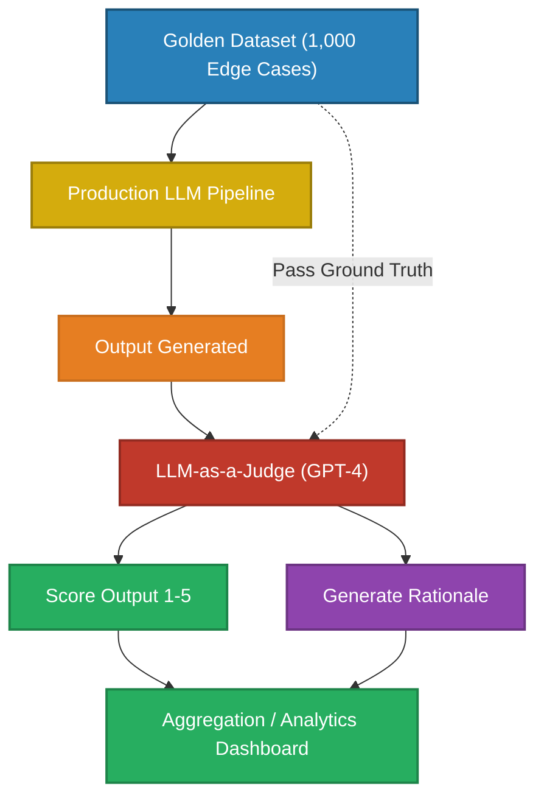
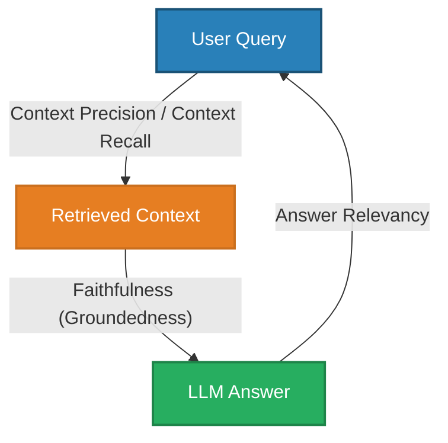
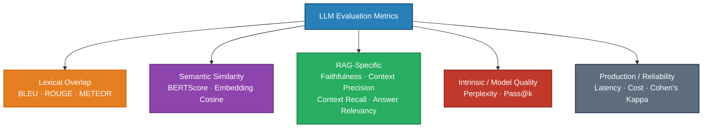
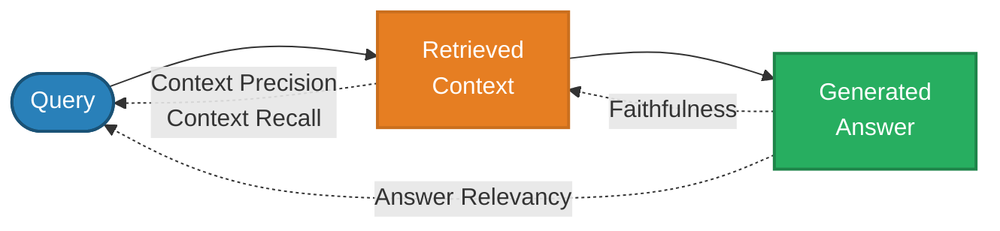

# Evaluation of LLM Systems

> You cannot improve what you cannot measure. Moving an LLM application from a "cool demo" to a production system requires a rigorous, automated evaluation harness.

---

## Q1. What is the fundamental difference between evaluating traditional ML models vs LLMs?

### Core Answer

In traditional Machine Learning, evaluation is deterministic and mathematically absolute. You calculate the F1-Score, RMSE, or Accuracy against a static ground-truth label. 

Large Language Models generate open-ended, non-deterministic text. If you ask an LLM to "Summarize the French Revolution," there are millions of valid linguistic permutations. There is no single "correct" string to compare against, rendering traditional exact-match math entirely obsolete. You must evaluate **Semantic Quality** rather than **Lexical Overlap**.

### Related Questions

!!! question "Follow-up Interview Questions"
    1. Why did traditional NLP metrics like BLEU and ROUGE fail for LLMs?
    2. What is BERTScore and how did it bridge the semantic gap?
    3. How do you measure production metrics beyond just text quality?
    4. What is the "Vibe Check" problem in LLM engineering?

??? success "View Answers"
    **1. BLEU and ROUGE failures?**
    BLEU (for translation) and ROUGE (for summarization) measure n-gram overlap (how many exact words/phrases from the generated text appear in the reference text). If the reference is *"The feline rested on the rug"* and the LLM outputs *"The cat sat on the mat"*, BLEU gives a score of 0.0 because there are zero matching words. It severely penalizes models for using valid synonyms or paraphrasing.

    **2. BERTScore?**
    BERTScore was the first step away from exact-match metrics. Instead of comparing strings, it uses a pre-trained BERT model to embed both the generated text and the reference text into dense vectors, and then calculates their Cosine Similarity. In the cat/feline example above, BERTScore would output a 0.95 similarity, successfully recognizing the semantic equivalence. 

    **3. Production Metrics?**
    A production harness must track 3 non-linguistic metrics: **Latency** (Time-To-First-Token and Tokens-Per-Second at p50/p90/p99), **Cost** (Calculated exactly by tracking input/output tokens multiplied by API pricing), and **Error Rate** (Timeouts, JSON parsing failures, Context Length exceeded). A model might have a perfect quality score but be rejected because its p99 latency is 12 seconds.

    **4. The Vibe Check Problem?**
    In early AI development, engineers tweak a prompt, run 5 examples manually, read the outputs, and declare "the new prompt feels better." This "vibe check" is catastrophic in production. A prompt change might improve formatting for those 5 edge cases, but silently regress the accuracy of 5,000 other cases. Only an automated, comprehensive evaluation harness prevents regression.

---

## Q2. How do you construct a deterministic Evaluation Harness for an open-ended GenAI system?

### Core Answer

The modern industry standard for evaluating open-ended text is **LLM-as-a-Judge**. You use a vastly superior, highly capable model (like GPT-4) to grade the outputs of your cheaper production model (like Llama-3-8B).

You must build a pipeline that iterates over a "Golden Dataset" of test cases, executes the prompt against your system, passes the output to the Judge, and aggregates the scores.

### Related Questions

!!! question "Follow-up Interview Questions"
    1. How do you write a robust prompt for an LLM Judge?
    2. What are the common biases of LLM Judges?
    3. How do you measure the reliability of an LLM Judge?
    4. What is Pairwise Evaluation vs Single-Point Evaluation?

??? success "View Answers"
    **1. LLM Judge Prompting?**
    A Judge prompt must be incredibly explicit. You cannot just ask, "Is this good?" You must define a rubric: *"Score from 1 to 5 based strictly on Faithfulness. Score 1: Hallucinates facts not in the context. Score 3: Partially grounded but includes minor unverified details. Score 5: 100% grounded. You must output a `<rationale>` block explaining your reasoning BEFORE outputting the `<score>`."* Forcing the LLM to write the rationale first uses Chain-of-Thought to mathematically improve the accuracy of the final score.

    **2. LLM Judge Biases?**
    Judges suffer from:
    - **Position Bias:** In Pairwise evaluation, they arbitrarily prefer the first answer (Option A) over the second (Option B).
    - **Verbosity Bias:** They inherently equate "longer" with "better," penalizing concise, accurate answers.
    - **Self-Enhancement Bias:** A GPT-4 Judge will inherently rate outputs generated by GPT-4 higher than outputs generated by Claude, simply because it recognizes its own linguistic patterns.

    **3. Cohen's Kappa (Inter-Rater Reliability)?**
    To trust an LLM Judge, you must test it against humans. You have Human Experts rate 100 outputs, and the LLM Judge rate the same 100 outputs. You calculate **Cohen's Kappa**, a statistical measure of agreement that accounts for random chance. A Kappa $> 0.8$ proves your LLM Judge is statistically identical to your Human Experts, allowing you to fully automate the pipeline.

    **4. Pairwise vs Single-Point?**
    Single-Point asks the Judge to rate Response A on a scale of 1-5. This is notoriously uncalibrated. Pairwise Evaluation asks the Judge: *"Here is the output from the Old Prompt, and the output from the New Prompt. Which is better, and why?"* Pairwise is vastly more accurate and acts as an immediate A/B test for system regressions.

---

## Q3. How do you evaluate a Retrieval-Augmented Generation (RAG) system end-to-end?

### Core Answer

You cannot evaluate a RAG system as a single "Black Box". If the final answer is wrong, you need to know *why* it's wrong. Did the vector database fail to find the document, or did the LLM fail to read it? 

You must evaluate RAG using the **RAGAS (RAG Assessment) Triad**, which breaks the system into distinct, measurable vectors:

### Related Questions

!!! question "Follow-up Interview Questions"
    1. What is Context Precision vs Context Recall?
    2. What is Faithfulness (Groundedness) and how does it catch hallucinations?
    3. What is Answer Relevancy and how does it detect evasive answers?
    4. How do you build a Golden Dataset for RAG evaluation?

??? success "View Answers"
    **1. Context Precision vs Recall?**
    **Context Recall** measures: *Did we find the needle in the haystack?* Out of all the facts needed to answer the query, how many were present in the retrieved chunks?
    **Context Precision** measures: *How much hay did we bring with the needle?* If we retrieved 10 chunks, and only 1 was relevant, precision is 10%. High recall with terrible precision means you are polluting the LLM's context window and wasting massive amounts of money on token costs.

    **2. Faithfulness (Groundedness)?**
    Faithfulness evaluates the Generation step. The LLM Judge looks *only* at the Retrieved Context and the Final Answer. It asks: *"Can every single claim in the Final Answer be traced back to a sentence in the Context?"* If the Answer contains a date that isn't in the Context, the Faithfulness score drops. This explicitly detects LLM Hallucinations.

    **3. Answer Relevancy?**
    An LLM might generate a 100% Faithful summary of the retrieved document, but the document had nothing to do with the user's question. Answer Relevancy compares the Final Answer directly back to the User Query. It detects situations where the RAG system says, *"I don't have the answer to that, but here are some fun facts about penguins."* (Faithful, but irrelevant).

    **4. RAG Golden Datasets?**
    Writing 1,000 test queries manually takes weeks. Instead, you use Synthetic Generation. You pass your company's proprietary documents to GPT-4 and run a script: *"Read this document. Generate 5 realistic, difficult questions that can be answered by this document, and provide the exact answer."* This instantly gives you a massive dataset of (Query, Ground_Truth_Context, Ground_Truth_Answer) pairs.

---

## Q4. What is Chain of Verification (CoVe) and Self-Consistency?

### Core Answer

While standard evaluation happens *offline* during development, **Inference-Time Evaluation** techniques force the model to evaluate and correct its own work *live in production* before showing the answer to the user.

**Self-Consistency (Majority Voting):**
Instead of generating one answer, the system generates 10 answers in parallel using a non-zero temperature. It then extracts the final conclusion from all 10 answers and returns the most frequent one (Majority Vote).

**Chain of Verification (CoVe):**
1. **Draft:** The LLM generates a baseline answer.
2. **Plan:** The LLM reads its own answer and lists verifiable claims as questions.
3. **Execute:** The LLM answers the verification questions *independently* (without looking at the draft).
4. **Refine:** The LLM compares the verification answers to the draft and revises any contradictions.

### Related Questions

!!! question "Follow-up Interview Questions"
    1. How does Self-Consistency mathematically improve LLM accuracy on logic tasks?
    2. Why does CoVe require independent verification questions?
    3. What is the latency impact of using CoVe in production?
    4. How does Self-Reflection differ from CoVe?

??? success "View Answers"
    **1. Math of Self-Consistency?**
    LLMs are probabilistic. On complex math or logic puzzles, an LLM might take a wrong turn early in the reasoning chain 30% of the time. However, there are usually many different correct reasoning paths that lead to the single right answer. By sampling 10 times, the "wrong" paths will yield 3 random, scattered answers, while the "correct" paths will converge heavily on the exact same final answer. The majority vote mathematically marginalizes out the random hallucinated errors.

    **2. CoVe Independent Verification?**
    If the LLM generates a hallucination in the Draft step, and you ask it to verify that hallucination *while it is looking at the Draft*, its self-attention mechanism will lock onto the hallucinated tokens and confidently confirm the lie. CoVe forces the model to answer the verification questions in a completely isolated context window, forcing it to retrieve the facts fresh from its pre-trained weights without bias.

    **3. CoVe Latency Impact?**
    CoVe is devastating to production latency. It requires 4 sequential LLM calls. If a standard query takes 2 seconds, CoVe will take 8 to 12 seconds. It also quadruples token costs. It should only be used on async background tasks, high-stakes financial/medical queries, or agentic systems where correctness is paramount and latency is secondary.

    **4. Self-Reflection vs CoVe?**
    Self-Reflection is a simpler, naive approach where you feed the LLM's output back to it and prompt: *"Is this correct? Are you sure? Fix any mistakes."* It often fails because the LLM is sycophantic; it will apologize profusely and change the answer even if the original answer was completely correct, degrading performance. CoVe provides a rigid, structural framework to prevent this.

---

## Q5. What metrics are used to evaluate LLM systems — formulas, calculations, and examples?

### Overview

LLM evaluation metrics fall into five families. Each measures a different property; no single metric is sufficient on its own.

---

### 1. BLEU — Bilingual Evaluation Understudy

**What it measures:** Modified n-gram precision between a candidate and one or more reference texts. Originally designed for machine translation.

#### Formula

$$\text{BLEU} = \underbrace{\min\!\left(1,\ e^{1 - r/c}\right)}_{\text{Brevity Penalty}} \cdot \exp\!\left(\sum_{n=1}^{N} w_n \log p_n\right)$$

where:

| Symbol | Meaning |
|--------|---------|
| $c$ | length of the candidate sentence |
| $r$ | length of the reference sentence |
| $p_n$ | modified n-gram precision at order $n$ |
| $w_n$ | weight per n-gram order, usually $\frac{1}{N}$ |
| $N$ | max n-gram order, usually 4 (BLEU-4) |

**Modified n-gram precision** clips each candidate n-gram count to the maximum it appears in any reference, preventing a model from gaming the score by repeating a single correct word:

$$p_n = \frac{\displaystyle\sum_{\text{n-gram} \in C} \text{Count}_{\text{clip}}(\text{n-gram})}{\displaystyle\sum_{\text{n-gram} \in C} \text{Count}(\text{n-gram})}$$

$$\text{Count}_{\text{clip}}(\text{n-gram}) = \min\!\bigl(\text{Count in candidate},\ \max_{\text{ref}} \text{Count in reference}\bigr)$$

#### Worked Example

**Reference:** `"The cat sat on the mat"`  
**Candidate:** `"The cat sat on the mat"` (perfect)

- $p_1 = 6/6 = 1.0$,  $p_2 = 5/5 = 1.0$,  $p_3 = 4/4 = 1.0$,  $p_4 = 3/3 = 1.0$
- BP $= \min(1, e^{1-6/6}) = 1.0$
- **BLEU-4 = 1.0** ✓

**Candidate (repeating word):** `"the the the the the the"`

- Count("the") in candidate = 6, max in reference = 2  →  $\text{Count}_\text{clip} = 2$
- $p_1 = 2/6 = 0.33$
- BP $= \min(1, e^{1-6/6}) = 1.0$  (same length, no penalty)
- **BLEU-1 ≈ 0.33** — clipping prevents gaming ✓

**Limitation:** `"The feline rested on the rug"` scores 0 against the reference above despite being semantically equivalent, because zero n-grams overlap.

---

### 2. ROUGE — Recall-Oriented Understudy for Gisting Evaluation

**What it measures:** N-gram *recall* between candidate and reference. Designed for summarization — did the summary capture the reference's content?

Three variants matter in practice:

#### ROUGE-N (Unigram / Bigram Recall)

$$\text{ROUGE-N}_\text{Recall} = \frac{\displaystyle\sum_{\text{n-gram} \in R} \text{Count}_\text{match}(\text{n-gram})}{\displaystyle\sum_{\text{n-gram} \in R} \text{Count}(\text{n-gram})}$$

$$\text{ROUGE-N}_\text{Precision} = \frac{\displaystyle\sum_{\text{n-gram} \in C} \text{Count}_\text{match}(\text{n-gram})}{\displaystyle\sum_{\text{n-gram} \in C} \text{Count}(\text{n-gram})}$$

$$\text{ROUGE-N}_{F_1} = 2 \cdot \frac{P \cdot R}{P + R}$$

#### ROUGE-L (Longest Common Subsequence)

Rewards word-order preservation without requiring contiguous matches:

$$P_\text{LCS} = \frac{\text{LCS}(C, R)}{|C|}, \qquad R_\text{LCS} = \frac{\text{LCS}(C, R)}{|R|}$$

$$\text{ROUGE-L}_{F_1} = \frac{(1+\beta^2)\, P_\text{LCS} \cdot R_\text{LCS}}{R_\text{LCS} + \beta^2 P_\text{LCS}}, \quad \beta = P_\text{LCS}/R_\text{LCS}$$

#### Worked Example

**Reference:** `"The police caught the thief yesterday"` (6 tokens)  
**Candidate:** `"The thief was caught by police"` (6 tokens)

**ROUGE-1:**
- Matching unigrams: *the, thief, caught, police* = 4
- Recall $= 4/6 = 0.667$, Precision $= 4/6 = 0.667$, **F1 = 0.667**

**ROUGE-2:**
- Reference bigrams: *(The, police), (police, caught), (caught, the), (the, thief), (thief, yesterday)*
- Candidate bigrams: *(The, thief), (thief, was), (was, caught), (caught, by), (by, police)*
- Matching bigrams: 0 (none overlap)
- **ROUGE-2 = 0.0** (word order divergence is penalized)

**ROUGE-L:**
- LCS = `"The caught"` or `"The thief"` — length 2
- $R_\text{LCS} = 2/6 = 0.333$, $P_\text{LCS} = 2/6 = 0.333$, **F1 = 0.333**

| Metric | Score | Interpretation |
|--------|-------|---------------|
| ROUGE-1 | 0.667 | Good word coverage |
| ROUGE-2 | 0.000 | Poor phrase preservation |
| ROUGE-L | 0.333 | Moderate sequence order |

---

### 3. METEOR — Metric for Evaluation of Translation with Explicit ORdering

**What it measures:** Improves on BLEU by incorporating **stemming** (run/running count as a match), **synonym matching** (cat ≈ feline via WordNet), and a **chunk-order penalty**.

#### Formula

$$\text{METEOR} = F_{\text{mean}} \cdot (1 - \text{Penalty})$$

**Harmonic mean** with higher weight on recall ($\alpha = 0.9$ default):

$$F_{\text{mean}} = \frac{P \cdot R}{\alpha \cdot P + (1-\alpha) \cdot R}$$

**Chunk penalty** — penalizes fragmented alignments where matched words are spread across many non-contiguous chunks:

$$\text{Penalty} = \gamma \cdot \left(\frac{\text{chunks}}{\text{matches}}\right)^\theta, \quad \gamma=0.5,\ \theta=3$$

If all matched words are adjacent (one chunk), penalty → 0. If every match is isolated (chunks = matches), penalty is maximum.

#### Worked Example

**Reference:** `"The cat sat on the mat"`  
**Candidate:** `"The feline rested on the rug"`

After synonym expansion (feline → cat):
- Matches: *the, cat (via feline), on, the* = 4 unigrams
- Precision $P = 4/6 = 0.667$, Recall $R = 4/6 = 0.667$
- $F_\text{mean} = 0.667 \cdot 0.667 / (0.9 \times 0.667 + 0.1 \times 0.667) = 0.667$
- Chunks: 2 (*the cat*, *on the*), Matches: 4
- Penalty $= 0.5 \times (2/4)^3 = 0.5 \times 0.125 = 0.0625$
- **METEOR** $= 0.667 \times (1 - 0.0625) \approx \mathbf{0.625}$ — vs BLEU score of ~0.0

---

### 4. BERTScore

**What it measures:** Semantic similarity using contextual BERT embeddings rather than token overlap. Each token in the candidate is matched to the most similar token in the reference in embedding space.

#### Formula

Let $\mathbf{x}_i$ = BERT embedding of reference token $i$ and $\hat{\mathbf{x}}_j$ = embedding of candidate token $j$, both L2-normalised so that $\mathbf{x}_i^\top \hat{\mathbf{x}}_j = \cos(\mathbf{x}_i, \hat{\mathbf{x}}_j)$.

$$P_\text{BERT} = \frac{1}{|\hat{y}|} \sum_{j \in \hat{y}} \max_{i \in y}\; \mathbf{x}_i^\top \hat{\mathbf{x}}_j$$

$$R_\text{BERT} = \frac{1}{|y|} \sum_{i \in y} \max_{j \in \hat{y}}\; \mathbf{x}_i^\top \hat{\mathbf{x}}_j$$

$$F_\text{BERT} = 2 \cdot \frac{P_\text{BERT} \cdot R_\text{BERT}}{P_\text{BERT} + R_\text{BERT}}$$

**Precision:** for every candidate token, find its closest reference token → how many candidate tokens are "covered" by the reference.  
**Recall:** for every reference token, find its closest candidate token → how much of the reference is "captured" by the candidate.

#### Worked Example

**Reference:** `"The cat sat"` → embeddings $[\mathbf{x}_1, \mathbf{x}_2, \mathbf{x}_3]$  
**Candidate:** `"The feline rested"` → embeddings $[\hat{\mathbf{x}}_1, \hat{\mathbf{x}}_2, \hat{\mathbf{x}}_3]$

Cosine similarity matrix (approximate):

| | cat ($\mathbf{x}_2$) | sat ($\mathbf{x}_3$) |
|---|---|---|
| feline ($\hat{\mathbf{x}}_2$) | **0.92** | 0.21 |
| rested ($\hat{\mathbf{x}}_3$) | 0.18 | **0.74** |

- $P_\text{BERT} = (1.0 + 0.92 + 0.74)/3 = 0.887$
- $R_\text{BERT} = (1.0 + 0.92 + 0.74)/3 = 0.887$
- **$F_\text{BERT} = 0.887$** — vs BLEU-1 score of 0.33 for this pair

BERTScore correctly captures that *feline* ≈ *cat* and *rested* ≈ *sat* semantically.

---

### 5. RAGAS Metrics — RAG System Evaluation

RAGAS decomposes the RAG pipeline into four independently measurable signals. Each uses an LLM judge internally.

---

#### 5a. Faithfulness

**What it measures:** Are all claims in the generated answer actually supported by the retrieved context? Detects hallucinations.

$$\text{Faithfulness} = \frac{\text{Number of claims in answer supported by context}}{\text{Total number of claims in answer}}$$

The LLM judge decomposes the answer into atomic claims, then checks each claim against the context independently.

**Worked Example:**

> **Context:** *"Paris is the capital of France. The city has a population of approximately 2.1 million."*  
> **Answer:** *"Paris is the capital of France (✓). It has a population of 2.1 million (✓). The Eiffel Tower was built in 1889 (✗ — not in context)."*

- Supported claims: 2 · Unsupported: 1
- $\text{Faithfulness} = 2/3 \approx \mathbf{0.667}$

A score below 0.8 in production typically indicates a retrieval or grounding failure.

---

#### 5b. Context Precision

**What it measures:** Signal-to-noise ratio of retrieval. Of all the chunks retrieved, what fraction were actually relevant to the query? Penalizes over-retrieval that pollutes the context window.

$$\text{Context Precision@K} = \frac{\displaystyle\sum_{k=1}^{K} \bigl(\text{Precision}@k \times v_k\bigr)}{\text{Total relevant documents retrieved}}$$

where $v_k = 1$ if the $k$-th retrieved chunk is relevant, 0 otherwise, and $\text{Precision}@k$ is the fraction of the first $k$ chunks that are relevant.

**Worked Example:**

Retrieve 4 chunks; relevance sequence: $[1, 1, 0, 1]$ (relevant, relevant, irrelevant, relevant).

| k | $v_k$ | Precision@k | $\text{P}@k \times v_k$ |
|---|---|---|---|
| 1 | 1 | 1/1 = 1.00 | 1.00 |
| 2 | 1 | 2/2 = 1.00 | 1.00 |
| 3 | 0 | 2/3 = 0.67 | 0.00 |
| 4 | 1 | 3/4 = 0.75 | 0.75 |

Total relevant = 3

$$\text{Context Precision} = \frac{1.00 + 1.00 + 0.00 + 0.75}{3} = \frac{2.75}{3} \approx \mathbf{0.917}$$

The irrelevant chunk at position 3 reduced the score from 1.0. If it had been retrieved last ($[1,1,1,0]$), precision would be 1.0 — ordering matters.

---

#### 5c. Context Recall

**What it measures:** Coverage. Of all the claims needed to fully answer the query (from the ground-truth answer), what fraction appear in the retrieved context? A recall of 0.6 means 40% of the information needed to answer was never retrieved.

$$\text{Context Recall} = \frac{\text{GT claims attributable to retrieved context}}{\text{Total claims in ground-truth answer}}$$

**Worked Example:**

> **Ground-truth answer** has 4 key claims:  
> (1) Einstein was born in 1879 · (2) in Ulm, Germany · (3) he developed special relativity · (4) he won the Nobel Prize in 1921

> **Retrieved context** contains claims (1), (2), (3) but not (4).

$$\text{Context Recall} = 3/4 = \mathbf{0.75}$$

The vector search failed to retrieve the Nobel Prize document — you'd need to investigate chunking strategy or embedding quality for that topic.

---

#### 5d. Answer Relevancy

**What it measures:** Does the answer actually address the question asked? Catches evasive or off-topic responses that are nonetheless factually grounded. Uses a reverse-generation trick — no ground truth needed.

**Algorithm:**
1. Take the generated answer $A$
2. Use an LLM to generate $N$ hypothetical questions that $A$ would answer
3. Embed each generated question $q_i$ and the original query $q$
4. Score = mean cosine similarity between generated questions and original query

$$\text{Answer Relevancy} = \frac{1}{N} \sum_{i=1}^{N} \cos(\mathbf{e}_{q_i},\, \mathbf{e}_q)$$

**Worked Example:**

> **Query:** *"What are the side effects of ibuprofen?"*  
> **Answer (evasive):** *"Ibuprofen is an NSAID widely used for pain relief. It was first synthesised in 1961 by Stewart Adams."*

Generated reverse questions from this answer:
- $q_1$: *"What class of drug is ibuprofen?"* → similarity to original: 0.51
- $q_2$: *"Who invented ibuprofen?"* → similarity: 0.38
- $q_3$: *"When was ibuprofen discovered?"* → similarity: 0.35

$$\text{Answer Relevancy} = (0.51 + 0.38 + 0.35)/3 \approx \mathbf{0.41}$$

Low score despite factual accuracy — the answer is Faithful but Irrelevant. This is the "penguin problem": a RAG system that correctly summarizes a retrieved document that happened to be tangentially related.

---

### 6. Perplexity

**What it measures:** How confidently does the model predict the next token? Lower perplexity = better language model fit. An intrinsic metric — does not require a reference text.

$$\text{PPL}(W) = \exp\!\left(-\frac{1}{N}\sum_{i=1}^{N} \log_e P(w_i \mid w_1, \ldots, w_{i-1})\right)$$

Intuitively: a perplexity of $k$ means the model is as uncertain as if it were choosing uniformly among $k$ options at every token step.

**Worked Example:**

A 4-token sequence: `"The cat sat"`

| Token | Model probability |
|-------|------------------|
| The | 0.50 |
| cat | 0.20 |
| sat | 0.05 |

$$\text{PPL} = \exp\!\left(-\frac{1}{3}\bigl(\log 0.50 + \log 0.20 + \log 0.05\bigr)\right)$$
$$= \exp\!\left(-\frac{1}{3}(-0.693 - 1.609 - 2.996)\right) = \exp(1.766) \approx \mathbf{5.85}$$

On average, the model is choosing between ~6 equally likely options at each step. GPT-4 on standard English text achieves PPL ~10–15. A random token predictor over a 50,000-token vocabulary scores PPL = 50,000.

**Limitation:** Perplexity measures fluency and language model fit, not truthfulness or task correctness. A model can achieve low perplexity while confidently hallucinating.

---

### 7. Pass@k — Code Generation

**What it measures:** For coding tasks (HumanEval, MBPP), generate $n$ candidate solutions per problem, then measure the probability that at least one of the top-$k$ passes all unit tests.

#### Formula

The unbiased estimator avoids running all $\binom{n}{k}$ subsets:

$$\text{Pass@}k = 1 - \frac{\dbinom{n - c}{k}}{\dbinom{n}{k}}$$

where $n$ = total solutions generated per problem, $c$ = solutions that pass all tests, $k$ = the top-$k$ we report on.

**Worked Example:**

For one coding problem: generate $n = 10$ solutions. $c = 3$ pass all unit tests.

$$\text{Pass@1} = 1 - \frac{\binom{10-3}{1}}{\binom{10}{1}} = 1 - \frac{7}{10} = \mathbf{0.30}$$

$$\text{Pass@3} = 1 - \frac{\binom{7}{3}}{\binom{10}{3}} = 1 - \frac{35}{120} \approx \mathbf{0.708}$$

$$\text{Pass@5} = 1 - \frac{\binom{7}{5}}{\binom{10}{5}} = 1 - \frac{21}{252} \approx \mathbf{0.917}$$

GPT-4 achieves Pass@1 ≈ 0.67 on HumanEval; Pass@10 approaches 0.95 because correct solutions exist but require sampling.

---

### 8. Cohen's Kappa — Judge Reliability

**What it measures:** Agreement between two raters (human vs LLM judge, or human vs human) that accounts for chance agreement. Used to validate whether an automated judge can replace human annotation.

$$\kappa = \frac{p_o - p_e}{1 - p_e}$$

where $p_o$ = observed proportion of agreement, $p_e$ = expected agreement by chance.

#### Calculating $p_e$

$$p_e = \sum_{\text{category } c} P(\text{rater 1 chooses } c) \times P(\text{rater 2 chooses } c)$$

**Worked Example:**

100 LLM responses rated by a human and an LLM judge (binary: Good / Bad):

|  | Judge: Good | Judge: Bad | Total |
|--|---|---|---|
| **Human: Good** | 45 | 10 | 55 |
| **Human: Bad** | 8 | 37 | 45 |
| **Total** | 53 | 47 | 100 |

$$p_o = \frac{45 + 37}{100} = 0.82$$

$$p_e = \frac{55}{100} \cdot \frac{53}{100} + \frac{45}{100} \cdot \frac{47}{100} = 0.2915 + 0.2115 = 0.503$$

$$\kappa = \frac{0.82 - 0.503}{1 - 0.503} = \frac{0.317}{0.497} \approx \mathbf{0.638}$$

| $\kappa$ range | Interpretation |
|---|---|
| < 0.20 | Slight agreement — judge not usable |
| 0.20 – 0.40 | Fair |
| 0.40 – 0.60 | Moderate |
| 0.60 – 0.80 | Substantial — judge is viable |
| **> 0.80** | **Near-perfect — judge fully trusted** |

A $\kappa > 0.8$ is the threshold at which you can replace human annotators with the LLM judge and trust automated evaluation pipelines.

---

### 9. Production Metrics

Quality metrics alone are insufficient. Production systems require three additional measurement axes.

#### Latency

| Metric | Formula | Target |
|--------|---------|--------|
| TTFT (Time-to-First-Token) | $t_\text{first token} - t_\text{request sent}$ | < 500ms |
| TPS (Tokens per Second) | $\text{output tokens} / (t_\text{last} - t_\text{first})$ | > 30 TPS |
| E2E Latency | $t_\text{response complete} - t_\text{request sent}$ | p95 < 5s |

**Measure percentiles, not averages.** A p50 of 1.2s with p99 of 18s means 1% of users wait 18 seconds — the average hides the worst experience.

#### Cost

$$\text{Cost per query} = \frac{\text{input tokens} \times \text{price}_\text{in} + \text{output tokens} \times \text{price}_\text{out}}{10^6}$$

**Example (Claude Sonnet 4.6):** 1,000 input tokens + 500 output tokens:

$$\text{Cost} = \frac{1000 \times 3.00 + 500 \times 15.00}{10^6} = \frac{3000 + 7500}{10^6} = \$0.0105 \text{ per query}$$

At 10,000 queries/day: $\$105$/day → $\$3,150$/month. Tracking this with a 20% token-over-budget alert prevents cost blowouts from prompt changes that inflate output length.

#### Error Rate

$$\text{Error Rate} = \frac{\text{Timeouts + Parsing failures + Context exceeded + Safety blocks}}{\text{Total requests}}$$

A healthy production system targets < 0.5% error rate. Break down by error type — a 2% context-exceeded rate means your chunking is producing inputs that consistently overflow the model's window.

---

### Summary Cheat Sheet

| Metric | Measures | Needs Ground Truth | Range | Higher = Better |
|--------|---------|-------------------|-------|----------------|
| BLEU-4 | N-gram precision (translation) | Yes | 0 – 1 | Yes |
| ROUGE-1 F1 | Unigram recall (summarization) | Yes | 0 – 1 | Yes |
| ROUGE-L F1 | Sequence order recall | Yes | 0 – 1 | Yes |
| METEOR | Precision + recall + synonyms | Yes | 0 – 1 | Yes |
| BERTScore F1 | Semantic token similarity | Yes | ~0.8 – 1.0 | Yes |
| Faithfulness | Hallucination absence | No (uses LLM judge) | 0 – 1 | Yes |
| Context Precision | Retrieval signal-to-noise | Yes (GT answer) | 0 – 1 | Yes |
| Context Recall | Retrieval coverage | Yes (GT answer) | 0 – 1 | Yes |
| Answer Relevancy | Answer addresses query | No (reverse generation) | 0 – 1 | Yes |
| Perplexity | Language model fluency | No | 1 – ∞ | No (lower = better) |
| Pass@k | Code correctness | Yes (unit tests) | 0 – 1 | Yes |
| Cohen's Kappa | Judge–human agreement | Yes (human labels) | -1 – 1 | Yes (target > 0.8) |

---

*Interview Questions: [Evaluation Interview Q&A →](interview-questions.md)*

*Next: [Hallucination Control →](../11-hallucination/README.md)*
