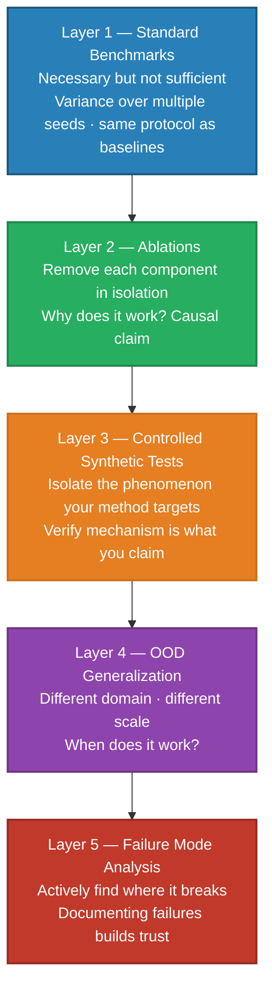

# LLM Evaluation — Interview Questions

Role focus: **AI Researcher** · **Data Scientist**

---

## Q1 — Designing Experiments That Generalize

**Question:** You improved benchmark performance, but reviewers are skeptical the gains will hold outside the evaluation set. How do you structure experiments to build a genuinely convincing case for generalization?

**Short answer:** Strong empirical validation must answer three distinct questions: Does it work? (benchmarks) Why does it work? (ablations + mechanistic analysis) When does it work? (OOD tests, failure mode analysis). Most papers only answer the first question.

---

### The standard is higher than benchmark numbers

Reviewers have seen too many methods that perform well on standard datasets through lucky regularization, hyperparameter overfitting, or exploiting quirks in evaluation protocols. Convincing experimental work needs to build a causal argument, not just a performance table.

---

### Experiment structure

**Layer 1: Standard benchmarks**

Necessary but not sufficient. Report these carefully:

- Variance across multiple runs and random seeds (not just best-of-N)
- The exact same evaluation protocol as the baselines you're comparing to
- Baselines that include the strongest recent work, not just convenient comparisons

**Layer 2: Ablations (the "why")**

Remove or modify each component of your method individually:

- Which component is responsible for the improvement?
- Are there interaction effects between components?
- What happens when you apply a simplified version of the method?

Ablations convert "it works" into "it works because of X" — a much stronger claim.

**Layer 3: Controlled synthetic experiments (the mechanism)**

Design a simplified, controlled setting where the phenomenon your method targets is isolated:

- Generate data with known structure that should favor your method
- Verify it works when the relevant structure is present
- Verify it doesn't hurt significantly when the structure is absent

This directly tests whether your method does what you claim it does.

**Layer 4: Out-of-distribution generalization**

Test on settings that differ meaningfully from the training distribution:

- Different domains (if evaluated on news, test on scientific or legal text)
- Different model scales (does the improvement hold from 1B to 70B?)
- Different task families (if the method is general, it should transfer)

**Layer 5: Failure mode analysis**

Actively find where the method breaks and report it:

- What input properties cause degraded performance?
- Are there systematic failure patterns?
- Where exactly does the method stop being preferable to the baseline?

Counter-intuitively, documenting failures makes the paper more convincing — it signals scientific rigor over cherry-picking.

---

### Addressing reviewer skepticism proactively

Do not wait for reviewers to raise concerns. In the paper, explicitly:

1. Acknowledge the limitations of benchmark-only evaluation
2. Cite the controlled experiments that test the mechanism directly
3. State conditions under which the method is and is not expected to work
4. Provide analysis explaining what properties of the data or task make the approach applicable

---

## Q2 — Benchmarking Robustness to Distribution Shift

**Question:** Describe a principled experimental framework for measuring how a language model degrades under distribution shift — new domains, different user populations, or noisy inputs.

**Short answer:** Define shift axes explicitly, build paired in-domain/out-of-domain datasets, measure both performance and calibration under shift, and stratify results by shift severity and subpopulation.

---

### Defining shift axes

Robustness evaluation is only meaningful when shift is precisely characterized. Four axes worth covering:

| Shift type | Example | Test approach |
|-----------|---------|---------------|
| Lexical | New vocabulary, rare terms | Replace frequent terms with domain-specific synonyms |
| Topical | New subject domain | Hold-out domain test set |
| Demographic | Non-native speakers, dialects | Paraphrase-matched multi-dialect dataset |
| Adversarial | Noisy or misleading inputs | Noise injection (typos, OCR errors, irrelevant context) |

---

### Dataset construction

- **Paired evaluation:** For each shift scenario, have matched in-domain and out-of-domain test sets with equivalent task difficulty. The performance gap is the robustness metric.
- **Synthetic shifts:** Programmatic noise injection (character-level typos, word deletion, paraphrase substitution) allows precise control over shift magnitude.
- **Real-world domain corpora:** Use existing domain datasets (legal, scientific, medical) as natural distribution shift benchmarks.

---

### Metrics

**Task performance:** accuracy, F1, BLEU/ROUGE as appropriate for the task

**Calibration under shift:** Expected Calibration Error (ECE) — does the model's confidence align with its accuracy on OOD data? A well-calibrated model that gets harder should report lower confidence; a poorly-calibrated one stays confidently wrong.

**Robustness gap:** Relative performance drop from in-domain to out-of-domain:

$$\text{Robustness Gap} = \frac{\text{In-domain score} - \text{OOD score}}{\text{In-domain score}}$$

**Failure mode categorization:** Beyond aggregate metrics, classify incorrect OOD responses — hallucination, misinterpretation, refusal, partial answer — to understand the failure type.

---

### Analysis layers

- **Stratify by shift severity:** Group examples by estimated shift magnitude and plot performance vs. severity. A smooth degradation curve is more informative than a single aggregate.
- **Subpopulation analysis:** Report separately for different demographic groups or input lengths. Aggregate metrics can mask disparate impacts.
- **Uncertainty-accuracy alignment:** Rank examples by model confidence. Does higher uncertainty correctly predict lower accuracy on OOD data?
- **Adaptation efficiency:** Fine-tune on a small amount of target-domain data and measure how quickly performance recovers. This characterizes how adaptive the model is to new domains.

---

## Q3 — A/B Test Result Interpretation: Clicks Up, Revenue Flat

**Question:** An A/B test shows a recommendation algorithm achieves a 3% lift in click-through rate, but revenue is unchanged. How do you interpret this, and what do you recommend?

**Short answer:** First validate the data, then form and test competing hypotheses for the divergence, then frame the recommendation as a business decision — not a data question.

---

### Step 1: Validate before interpreting

- Is the randomization valid? Check for assignment bias or leakage.
- Is the sample size sufficient for both metrics separately? A 3% lift needs more samples to detect than a 15% lift.
- Is there a timing lag? Revenue from recommendation-driven behavior may lag clicks by days.
- Are there logging issues? Bot traffic, instrumentation gaps, or definition mismatches between teams?

Assume the data is valid and proceed.

---

### Step 2: Form competing hypotheses

Clicks up, revenue flat admits multiple explanations:

| Hypothesis | Mechanism | Test |
|-----------|-----------|------|
| Lower-value clicks | Algorithm drives clicks on cheaper items | Compare avg clicked item value per group |
| Cannibalization | Recommendations displace higher-value organic discovery | Analyze full user journey, not just recommendation clicks |
| Engagement without intent | More curiosity clicks, same purchase intent | Segment by high-intent users (cart-havers, repeat purchasers) |
| Basket redistribution | Users buy more items at lower per-item price | Compare order value and items-per-order |

Build a diagnostic table before making any recommendation:

| Metric | Control | Treatment | Δ |
|--------|---------|-----------|---|
| CTR | baseline | +3% | +3% |
| Revenue per session | baseline | 0% | 0% |
| Revenue per click | — | lower? | |
| Avg item value clicked | — | lower? | |
| Items per order | — | higher? | |

---

### Step 3: Recommendation depends on the business objective

"Ship it" is right if: the primary goal is engagement and long-term retention, and revenue parity is acceptable.

"Iterate" is right if: the goal is revenue growth and the algorithm is driving low-value clicks by optimizing for the wrong signal.

"Extend the test" is right if: you suspect the revenue effect takes longer to materialize (e.g., recommendation-driven users have higher 30-day LTV).

Present all three options with their preconditions, then state your recommendation with reasoning: "I recommend X because our primary metric is Y and the evidence suggests Z."

---

## Q4 — Designing Metrics for Ambiguous Objectives

**Question:** The product team asks you to measure "user satisfaction" for an AI feature. How do you translate this into something measurable and defensible?

**Short answer:** "User satisfaction" is a goal, not a metric. Decompose it into a primary metric (task success rate), supporting behavioral signals, and guardrail metrics — then validate that the primary metric actually correlates with the behavior you're trying to encourage.

---

### Decomposition process

**Step 1: Clarify what decisions this metric drives**

The right metric depends on the decision. "Are users satisfied?" for a weekly review is different from "are users satisfied?" for a launch/no-launch gate. Ask before proposing a measurement approach.

**Step 2: Map the metric landscape**

Three categories, each with trade-offs:

| Category | Examples | Pros | Cons |
|---------|----------|------|------|
| Direct (ask users) | Thumbs up/down, post-session rating, NPS | Explicit signal | Low response rate, selection bias |
| Behavioral proxy | Task completion rate, return usage, regenerate rate, abandon rate | Passive collection, unbiased | Ambiguous (long session = engaged OR frustrated?) |
| Composite | Weighted combination | More robust | Hard to interpret, expensive to debug |

**Step 3: Recommend a layered approach**

- **Primary metric:** Task success rate — did the user accomplish what they came to do without re-querying or leaving? Define "success" for the specific feature.
- **Leading indicators:** Regenerate rate (negative), follow-up correction rate (negative), return usage within 7 days (positive)
- **Guardrail metrics:** Error rate (task failures), escalation to human rate (for hybrid systems)

**Step 4: Validate the proxy**

Before using behavioral metrics to drive decisions:
- Deliberately degrade the feature quality in a small holdout — does the metric fall?
- Check that high-scoring users behave like satisfied users elsewhere (retention, spend)
- Verify the metric is resistant to gaming — could you improve the number while making the experience worse?

---

## Q5 — Causal Attribution for Marketing Campaigns

**Question:** A marketing campaign ran and revenue increased 15%. The team wants to claim the campaign caused the increase. What's your analysis process?

**Short answer:** Causal claims require a credible counterfactual — what would have happened without the campaign. Establish what level of evidence you have, communicate the confidence honestly, and propose a design for future campaigns that produces stronger evidence.

---

### The hierarchy of causal evidence

| Evidence level | Setup | Confidence |
|---------------|-------|------------|
| Randomized experiment | Random holdout group | High — "the campaign caused X" |
| Natural experiment | Geographic stagger, technical outage as control | Medium-high — "evidence suggests the campaign drove X" |
| Observational with matched controls | Comparable unexposed group | Medium — "associated with, likely contributing" |
| Before-after only | No control group | Low — "sales increased during the campaign period" |

The language you use must match the evidence level.

---

### Diagnostic analyses

**Timing alignment:** Does the uptick start precisely at campaign launch, or was there a pre-existing trend? A trend that predates the campaign is a confound.

**Effect heterogeneity:** Did effect magnitude align with exposure level? If regions with high-spend media show the same lift as regions with low-spend media, the campaign is probably not the cause.

**Dose-response:** More exposure → larger effect? If yes, that's evidence of causation. If not, something else is driving the increase.

**Parallel trends test:** Before the campaign, were the treatment and would-be control groups trending similarly? If they diverged pre-campaign, the comparison is invalid.

**Placebo checks:** Apply the same analysis to a period or group that received no treatment. If you "find an effect" there too, the analysis method is flawed.

---

### The conversation with stakeholders

"The 15% increase is real. Whether the campaign caused it is a separate question.

Based on our evidence level [describe the comparison available], I'd characterize this as: [honest confidence statement with appropriate language from the table above].

The main alternative explanations we haven't ruled out are: [list].

For the next campaign, here's how we set up proper measurement: [random holdout group design]. That gets us to 'caused' instead of 'associated with.'"

---

## Q6 — A/B Testing Generative AI Features

**Question:** How do you design an experiment to evaluate a generative AI feature (e.g., an AI writing assistant) where novelty effects, changing workflows, and hard-to-measure quality all complicate the standard A/B test design?

**Short answer:** Use pre-registered metrics with explicit novelty-effect correction windows, user-level randomization, and both task-completion and safety/quality signal collection. Plan for sequential analysis to avoid peeking inflation.

---

### Metric selection

**Primary business metrics:** Task completion rate, time-to-task-completion, conversion or retention impact — these capture whether the feature delivers value, not just whether users click on it.

**Quality/safety metrics:** Rate of flagged or reported outputs, user-initiated corrections, incidence of harmful suggestions — these capture risks that business metrics don't.

**Engagement metrics (interpret carefully):** Session length and feature usage frequency are ambiguous signals — higher usage could mean higher value or higher frustration.

---

### Handling novelty effects

New AI features often show inflated early engagement that decays to a lower steady state as novelty wears off. Failing to account for this produces false positives.

**Mitigation:**
1. Run a calibration period before analysis windows open — observe metric trajectories over time
2. Separate early-cohort analysis from late-cohort analysis — the steady-state effect in later cohorts is more reliable
3. Use burn-in and cooldown windows to exclude measurements taken before users have formed stable behavior patterns
4. Sequential testing with pre-specified checkpoints and family-wise error correction (don't peek at interim results without adjusting for multiple comparisons)

---

### Experiment design requirements

- **User-level randomization** — not session-level. Cross-session spillover inflates treatment effect estimates if the same user appears in both groups across sessions.
- **Sufficient power analysis** — generative feature effects tend to be noisy. Calculate required sample size for both primary metrics and safety metrics separately.
- **Subgroup pre-registration** — specify which subgroups you'll analyze (new vs. returning users, high-frequency vs. casual users) before running. Post-hoc subgroup analysis is exploratory only.

---

## Q7 — Handling Label Noise and Weak Supervision

**Question:** Your training data comes from multiple noisy annotation sources. How do you model label noise, combine weak supervision signals, and still evaluate reliably?

**Short answer:** Use label-modeling frameworks (e.g., Snorkel) to learn annotator reliabilities and produce probabilistic labels. Train with noise-robust losses or sample reweighting. Maintain a small high-quality test set for unbiased evaluation — never evaluate on the weakly supervised data.

---

### Modeling and aggregating noisy labels

**Label modeling approach (Snorkel-style):**

1. Model each weak supervision source as a labeling function with a learned accuracy and class-conditional recall
2. Learn correlations between labeling functions — if two noisy sources agree, that's stronger signal than if independent sources agree
3. Produce a probabilistic label for each example: `P(y | x)` rather than a hard label
4. Threshold or soft-label these probabilities during training

**Calibration:** Probabilistic labels from a label model are often miscalibrated. Apply isotonic regression or Platt scaling before using them in loss computation.

---

### Robust training techniques

**Noise-robust losses:** Standard cross-entropy treats all labels as correct — it's not noise-robust. Alternatives:
- Generalized cross-entropy: `L_q(f(x), y) = (1 - f_y(x)^q) / q` — interpolates between CE (q→0) and MAE (q=1), giving less weight to high-loss examples that are likely mislabeled
- Symmetric cross-entropy: combines forward and backward KL terms

**Sample reweighting:** Estimate the probability each example is correctly labeled and weight the loss accordingly. Examples with low labeling confidence contribute less to parameter updates.

**Semi-supervised anchor:** Use a small trusted dataset (clean labels) as an anchor for validation and to calibrate confidence thresholds. Even 500–1000 clean examples can significantly improve the label model's calibration.

---

### Evaluation practices

**Critical rule:** Never evaluate on the weakly supervised training data. The label model may have learned systematic biases in the annotation sources that show up as high accuracy but don't reflect true generalization.

Maintain a held-out high-quality test set, ideally annotated by domain experts following a detailed guideline. This is your ground truth.

**Reporting:**
- Report metrics with confidence intervals over multiple runs
- Run sensitivity analysis across noise-level assumptions: "If 20% of our labels are wrong, what is the expected metric range?"
- Report per-class metrics — noisy labels often affect some classes more than others

---

## Q8 — Advanced Analytics for Complex Customer Behavior

**Question:** Standard descriptive analytics isn't surfacing the patterns you need — you need to understand non-linear relationships, temporal dependencies, and network effects in customer behavior. Which techniques do you reach for and how do you validate them?

**Short answer:** Match the technique to the structural property of the problem: causal inference for intervention questions, time-series methods for temporal dependencies, graph algorithms for network effects, and unsupervised methods for pattern discovery. Validation requires both statistical cross-validation and business-metric A/B testing.

---

### Technique selection by problem structure

**Causal questions** ("does feature X cause outcome Y, or do they just co-occur?")

- Randomized experiments remain the gold standard; when infeasible, use quasi-experimental methods
- Difference-in-differences: compare outcome changes between treated and control groups over time
- Regression discontinuity: exploit discontinuities in policy assignment to create natural experiments
- Causal graphs (DAGs): make assumptions about causal structure explicit and testable; identify valid adjustment sets for observational estimation

**Temporal patterns** ("what will happen next, and why does history matter?")

- Statistical: ARIMA, exponential smoothing, Prophet for trend/seasonal decomposition
- Deep learning: LSTM for complex sequences; temporal transformers for very long dependencies
- Hidden Markov Models for regime-switching behavior (e.g., user engagement states)
- Causal impact analysis (Google's method) for measuring intervention effects on time series

**Network effects** ("how does behavior spread through social connections?")

- Graph centrality (degree, betweenness, eigenvector) to identify influential nodes
- Community detection (Louvain, DBSCAN on graph) for organic segmentation
- Network causal inference: estimate spillover effects (when treating one user affects their neighbors)

**Pattern discovery** ("what structure exists in the data that we haven't labeled?")

- Clustering: K-means for compact clusters; DBSCAN for irregular shapes with noise; hierarchical for tree-structured segments
- Dimensionality reduction: PCA for linear structure; UMAP for non-linear structure with topology preservation
- Anomaly detection: Isolation Forest for point anomalies; autoencoders for complex pattern deviations

---

### Validation requirements

**Statistical validation beyond k-fold:**

- Time-series data: use temporal split (train on past, validate on future — never shuffle)
- Group-structured data: use group k-fold to prevent data from the same user appearing in both train and validation
- Bootstrap confidence intervals on all reported metrics

**Business validation:**

Statistical significance is necessary but not sufficient. Before investment, validate in production:

1. Interpret model predictions using SHAP or permutation importance — if the most important features aren't domain-sensible, investigate
2. Deploy in a controlled A/B test and measure actual business outcomes, not just model metrics
3. Sensitivity analysis: how much do conclusions change if key assumptions shift?

---

*Back to [LLM Evaluation →](README.md)*
