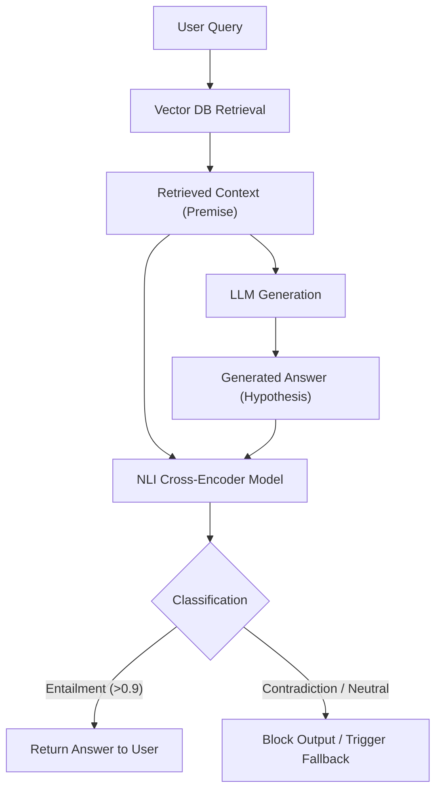
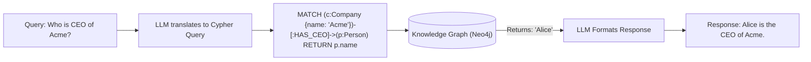

# Hallucination Control Techniques

> Hallucination is the primary barrier preventing Generative AI from achieving full autonomy in production. Controlling it requires systemic interventions across the entire architecture. Answers are calibrated for a **Google L5 Senior AI/ML Engineer** interview bar.

---

## Q1. What is the fundamental mechanism behind LLM Hallucinations?

### Core Answer

To control hallucinations, you must first understand that **hallucination is not a bug; it is the model working exactly as designed.**

An LLM does not possess a database of facts; it possesses a statistical map of token probabilities. It is fundamentally an interpolator. If a user asks a factual question that the model has seen millions of times (e.g., "What is the capital of France?"), the probability pathway to "Paris" is mathematically dominant. 

If the user asks an obscure question, there is no dominant factual pathway in the weights. The LLM does not halt; it seamlessly falls back to lower-probability paths that are *linguistically and grammatically plausible*. It fabricates a fluent response because the objective function (Cross-Entropy Loss) optimizes for fluency and sequence probability, not factual truth.

### Related Questions

!!! question "Follow-up Interview Questions"
    1. What is the difference between Extrinsic and Intrinsic Hallucinations?
    2. How does temperature scaling impact hallucination rates?
    3. Why do LLMs hallucinate URLs and citations so frequently?
    4. What is the "Snowball Effect" in autoregressive hallucination?

??? success "View Answers"
    **1. Extrinsic vs Intrinsic?**
    **Intrinsic Hallucination** occurs when the LLM's output directly contradicts the source material provided in the prompt (e.g., Context says "Revenue is $5M", LLM says "Revenue is $10M").
    **Extrinsic Hallucination** occurs when the LLM adds plausible but unverified information that is *not* in the source material (e.g., Context says "Revenue is $5M", LLM says "Revenue is $5M, which is a record high for the company").

    **2. Temperature and Hallucination?**
    Temperature controls the entropy of the output probability distribution. $T=0$ forces the model to strictly pick the single most mathematically probable next token (ArgMax), which minimizes hallucinations but makes the text sound robotic. $T=0.8$ flattens the distribution, allowing the model to pick the 3rd or 4th most probable token. This vastly increases creativity but mathematically guarantees that the model will eventually veer off the factual pathway into a hallucination.

    **3. URL and Citation Hallucination?**
    Pre-training data (the internet) is filled with academic papers formatted as `(Author, Year)` and URLs formatted as `https://domain.com/path`. The LLM perfectly learns the *syntax* of a URL, but it does not know if a specific path actually exists on a server. It will generate a syntactically flawless URL that yields a 404 error because it's just predicting plausible URL tokens.

    **4. The Autoregressive Snowball Effect?**
    LLMs generate text one token at a time. The next token is conditioned on *all previously generated tokens*. If the model hallucinates a single incorrect date early in the response, that hallucination enters the context window. The model's self-attention mechanism locks onto it, and the model is now mathematically forced to generate subsequent tokens that justify and align with the original lie.

---

## Q2. How do you implement robust Hallucination Control at the Prompt Layer?

### Core Answer

Simply prompting a model with *"Do not hallucinate"* is highly ineffective because the model does not conceptually know when it is lying. You must implement rigid, structural constraints.

The most effective technique is **Citation Enforcement**. You force the model to output the exact substring from the context that justifies its answer, heavily biasing the attention mechanism toward the provided text rather than its internal weights.

```python
system_prompt = """
You are a strict factual extractor. You will answer the User Query using ONLY the provided Context.

RULES:
1. If the Context does not contain the answer, you must output EXACTLY: "INSUFFICIENT_CONTEXT".
2. You must append a citation to every claim you make.
3. The citation must be an exact, verbatim quote from the Context wrapped in brackets.

Example Output:
The company's revenue grew by 20% [Revenue increased by 20% in Q3].

Context:
{retrieved_context}
"""
```

### Related Questions

!!! question "Follow-up Interview Questions"
    1. How do System Prompts fail to prevent "Sycophancy"?
    2. Why is "I don't know" an unnatural state for pre-trained LLMs?
    3. How does Few-Shot prompting anchor the model against hallucinations?

??? success "View Answers"
    **1. Sycophancy?**
    Sycophancy is when the LLM agrees with a false premise provided by the user. If a user asks, *"Why did Abraham Lincoln invent the airplane?"*, a standard model will invent a historical fiction to satisfy the user's premise. The prompt must explicitly instruct the model: *"You are an adversarial truth-checker. If the user's premise is factually flawed, correct the premise before answering."*

    **2. The Unnatural "I don't know"?**
    During pre-training, the model reads billions of internet forums, articles, and books. It rarely encounters text where the author explicitly states "I don't know." The internet is full of confident assertions. Therefore, the probability of the tokens "I do not know" is extremely low. You must use Supervised Fine-Tuning (SFT) to artificially increase the probability of refusal pathways.

    **3. Few-Shot Anchoring?**
    Providing 3 examples of (Context, Query, Answer) inside the prompt is vastly superior to Zero-Shot instructions. The model's self-attention heads map the exact syntactic relationship between the Context and the Answer in your examples, allowing it to mathematically replicate that exact extraction pattern for the live query, drastically reducing hallucination risk.

---

## Q3. How do you detect Hallucinations Post-Generation?

### Core Answer

Even with perfect RAG and strict prompting, models will occasionally hallucinate. Production systems must implement a **Post-Generation Detection Gate** using Natural Language Inference (NLI).

NLI models (often fine-tuned Cross-Encoder BERT models) are explicitly trained to detect if one sentence logically supports another. You pass the Retrieved Context as the *Premise* and the LLM's Answer as the *Hypothesis*. The NLI model outputs a probability: **Entailment** (Supported), **Neutral** (Unrelated), or **Contradiction** (Hallucination).



### Related Questions

!!! question "Follow-up Interview Questions"
    1. What is the Vectara Hughes Hallucination Evaluation Model (HHEM)?
    2. What is the difference between an NLI Cross-Encoder and an LLM Judge?
    3. How does the SelfCheckGPT method detect hallucinations without external context?
    4. What do you do if a hallucination is detected post-generation?

??? success "View Answers"
    **1. Vectara HHEM?**
    HHEM is an open-source, specialized Cross-Encoder model built specifically for RAG hallucination detection. It is smaller and drastically faster than an LLM, making it feasible to run in real-time in the critical path of a production request. It outputs a score from 0.0 to 1.0 indicating the factual consistency between the context and the generated response.

    **2. Cross-Encoder vs LLM Judge?**
    An LLM Judge uses a massive 8B+ parameter model and a complex prompt to grade the answer, which adds 1-2 seconds of latency and high cost. A Cross-Encoder is a tiny ~300M parameter model that only does one thing: classification. It runs in milliseconds and is cheap enough to execute on every single user request.

    **3. SelfCheckGPT?**
    If you are generating text *without* RAG (no context to check against), how do you know if it's a hallucination? SelfCheckGPT leverages the fact that hallucinations are random. You ask the LLM the same question 5 times at a high temperature. If the LLM knows the fact, all 5 answers will contain the same core information. If the LLM is hallucinating, the fabricated details will vary wildly across the 5 samples. High variance = Hallucination.

    **4. Handling Detected Hallucinations?**
    If the NLI gate flags a contradiction, you never show the bad answer to the user. You have two options:
    1. **Regenerate:** Pass the flagged output back to the LLM with the prompt *"Your previous answer contradicted the context. Fix it."* (Self-Correction).
    2. **Graceful Degradation:** Return a hardcoded fallback: *"I'm sorry, I cannot confidently answer that based on the available documents."*

---

## Q4. How do Knowledge Graphs prevent Entity Hallucinations (GraphRAG)?

### Core Answer

Standard Vector RAG retrieves paragraphs of text based on semantic similarity. If a user asks *"Who is the CEO of Acme Corp?"*, the Vector DB might return a chunk saying *"Acme Corp announced John Smith as CTO, while Jane Doe stepped down."* The LLM might become confused by the linguistic proximity of the names and hallucinate the CEO role.

**Knowledge Graphs (KGs)** store data deterministically as Triples: `[Subject] -> [Predicate] -> [Object]`. 
Example: `[Acme Corp] -> [HAS_CEO] -> [Unknown/Null]`.

In **GraphRAG**, you translate the user's natural language query into a strict graph database query (like Cypher for Neo4j). The graph returns rigid, structured facts. Because the relationships are mathematically hardcoded, the LLM cannot hallucinate the relationships between entities.



### Related Questions

!!! question "Follow-up Interview Questions"
    1. Why do LLMs struggle with multi-hop reasoning without a Knowledge Graph?
    2. Can you combine Vector Search and Knowledge Graphs (Hybrid RAG)?
    3. What is the main engineering bottleneck of GraphRAG?

??? success "View Answers"
    **1. Multi-hop Reasoning?**
    Question: *"Who is the mother of the founder of Microsoft?"* A standard Vector DB fails because there is likely no single paragraph containing both "Microsoft Founder" and "Mary Maxwell Gates". A Knowledge Graph easily traverses the nodes: `[Microsoft] <-[FOUNDED_BY]- [Bill Gates] -[HAS_MOTHER]-> [Mary Maxwell Gates]`.

    **2. Hybrid RAG?**
    Yes. Standard text (like a policy document) is stored in a Vector DB. Entities (Companies, People, Products) are stored in a Knowledge Graph. When a user asks a question, the system queries both databases simultaneously, injecting both the semantic paragraphs and the rigid graph triples into the LLM's prompt window, providing the ultimate defense against hallucinations.

    **3. GraphRAG Bottlenecks?**
    Building and maintaining the Knowledge Graph is incredibly difficult. You have to run Information Extraction (Named Entity Recognition and Relation Extraction) pipelines over millions of documents to populate the graph. If the extraction pipeline makes an error, the graph is permanently poisoned with a false hardcoded fact.

---

*Next: [LLM Deployment →](../12-deployment/README.md)*
