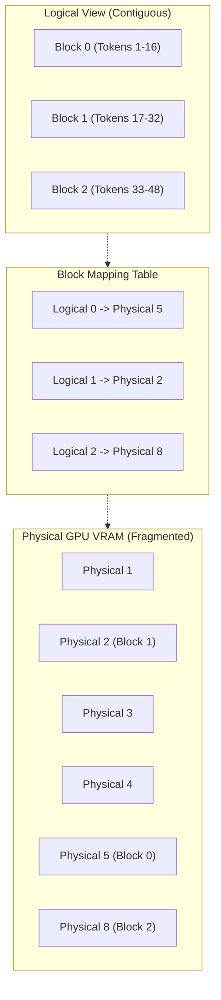
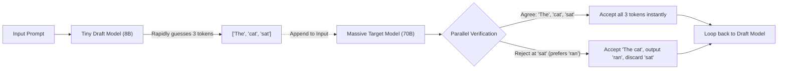

# LLM Deployment & Inference Optimization

> Serving an LLM is easy. Serving an LLM efficiently, securely, and cheaply at scale is one of the hardest infrastructure problems in modern engineering. Answers are calibrated for a **Google L5 Senior AI/ML Engineer** interview bar.

---

## Q1. What is the fundamental bottleneck in LLM Inference?

### Core Answer

To optimize an LLM, you must understand that Inference is split into two entirely different computational regimes:

1. **Pre-fill Phase (Processing the Prompt):** The GPU processes all input tokens simultaneously in a massive parallel matrix multiplication. This phase is **Compute-Bound** (limited by the GPU's teraFLOPS).
2. **Decode Phase (Generating the Output):** The GPU generates one token at a time autoregressively. To generate a single token, the GPU must load the *entire multi-gigabyte weight matrix* from High-Bandwidth Memory (HBM) into the compute cores (SRAM). This phase is **Memory Bandwidth-Bound**. The compute cores sit idle 90% of the time waiting for weights to transfer across the silicon.

Because generating tokens is entirely gated by memory bandwidth, throwing a "faster" GPU at the problem rarely helps unless that GPU also has faster memory transfer speeds.

### Related Questions

!!! question "Follow-up Interview Questions"
    1. What is the difference between TTFT and TPOT?
    2. How does Batching convert a Memory-Bound process into a Compute-Bound process?
    3. Why does standard Static Batching fail for LLMs?
    4. What is Continuous Batching (ORCA)?

??? success "View Answers"
    **1. TTFT vs TPOT?**
    **Time-To-First-Token (TTFT)** is the time it takes to complete the Pre-fill phase. Users are highly sensitive to TTFT; if it exceeds 1 second, they think the app is broken. **Time-Per-Output-Token (TPOT)** is the speed of the Decode phase. Humans read at about 5-8 tokens per second. As long as your TPOT yields >10 tokens per second, the user experiences a smooth stream.

    **2. The Math of Batching?**
    If you generate 1 token for 1 user, you load 15GB of weights to perform a tiny mathematical operation. If you batch 64 users together, you load the *exact same 15GB of weights once*, but apply them to 64 different requests simultaneously. The memory transfer cost is amortized across 64 users, dramatically increasing overall throughput (Tokens Per Second).

    **3. Static Batching Failures?**
    In standard CV/NLP models, you wait for 64 requests, batch them, and run them. However, LLM outputs have variable lengths. If Request A finishes in 10 tokens, and Request B finishes in 500 tokens, Request A's slot in the GPU batch sits completely idle for 490 iterations while waiting for B to finish, wasting massive compute.

    **4. Continuous Batching (Iteration-Level Scheduling)?**
    Continuous batching (pioneered by the ORCA paper, used in vLLM/TGI) solves this. The scheduler operates at the token iteration level. As soon as Request A finishes token 10 and exits, the scheduler immediately pulls Request C from the queue and inserts it into Request A's vacant slot on the very next token iteration. The GPU is kept at 100% batch saturation at all times.

---

## Q2. How does PagedAttention solve KV Cache memory fragmentation?

### Core Answer

During the Decode phase, the LLM must "remember" all previous tokens to generate the next one. Instead of re-calculating everything from scratch, the GPU stores the intermediate Keys and Values in VRAM. This is the **KV Cache**.

The KV cache grows dynamically with every generated token. Historically, inference engines had to statically pre-allocate contiguous memory for the maximum possible sequence length (e.g., 4096 tokens per request) just in case the model generated a long response. If the model only generated 10 tokens, the remaining 4086 tokens of VRAM were permanently locked and wasted (Internal Fragmentation). This limited batch sizes to tiny numbers.

**PagedAttention** (the core of the `vLLM` engine) borrows OS Virtual Memory paging. It chops the KV cache into small, fixed-size blocks (e.g., 16 tokens). It dynamically allocates physical blocks on the fly only when the model actually needs them, mapping them together via a logical page table.

By eliminating memory fragmentation, PagedAttention allows the GPU to fit 3x to 4x more requests into the batch, linearly scaling throughput.

### Related Questions

!!! question "Follow-up Interview Questions"
    1. How does PagedAttention enable automatic Prefix Caching?
    2. What happens when the physical KV cache runs out during generation?
    3. How do MQA and GQA reduce KV Cache pressure architecturally?

??? success "View Answers"
    **1. Prefix Caching?**
    Because PagedAttention separates logical mapping from physical memory, multiple requests can point to the *exact same physical block*. If 1,000 users all send requests with the same massive 2,000-token System Prompt, vLLM only computes the System Prompt's KV cache once, stores it in physical memory, and maps all 1,000 requests to those shared blocks, slashing TTFT to near zero.

    **2. KV Cache Exhaustion (Preemption)?**
    If the batch is full and outputs are longer than expected, physical VRAM runs out. vLLM uses Swapping. It temporarily halts a request, copies its KV blocks from GPU HBM to CPU RAM over PCIe, and frees the GPU memory for other requests. When space opens up, it swaps the KV cache back to the GPU and resumes generation.

    **3. Multi-Query Attention (MQA)?**
    Standard Multi-Head Attention creates a distinct Key and Value matrix for every single Query head (e.g., 32 Q heads, 32 K heads, 32 V heads). MQA forces all 32 Query heads to mathematically share a *single* Key and Value head. This shrinks the total size of the KV cache in VRAM by up to 96%, allowing massive context windows and giant batch sizes without OOM errors.

---

## Q3. How does Quantization speed up inference without destroying accuracy?

### Core Answer

**Quantization** compresses the neural network weights from 16-bit floats (BF16/FP16) down to 8-bit or 4-bit integers. 

Because the Decode phase is strictly **Memory Bandwidth-Bound**, reducing a 7B model from 14GB (FP16) down to 3.5GB (INT4) means the GPU can transfer the entire model across the silicon 4x faster. **Quantization doesn't increase compute speed; it removes the data transfer bottleneck.**

LLMs tolerate extreme quantization because they are massively over-parameterized. The weight distributions form tight Gaussian bell curves, meaning rounding them to the nearest INT4 bin rarely shifts the overall mathematical direction of the forward pass. 

The primary danger in Quantization is **Outliers**—specific activation channels that are 100x larger than the mean. If you quantize an outlier blindly, the clipping error cascades through the network, destroying accuracy.

### Related Questions

!!! question "Follow-up Interview Questions"
    1. What is the difference between AWQ/GPTQ and SmoothQuant?
    2. Does Quantization impact the Pre-fill phase?
    3. What is the trade-off with KV-Cache Quantization (FP8)?

??? success "View Answers"
    **1. AWQ vs SmoothQuant?**
    **AWQ (Activation-aware Weight Quantization)** is a Weight-Only technique. It runs a calibration dataset to find the 1% of "salient" weights (the ones connected to massive outliers) and keeps them in FP16 while crushing the remaining 99% to INT4. **SmoothQuant** tackles Activation Quantization (W8A8). It mathematically pushes the outlier magnitude from the dynamic activations down into the static weights, allowing both to be quantized safely.

    **2. Quantization in Pre-fill?**
    During Pre-fill, the GPU processes thousands of tokens in parallel, saturating the compute cores (Compute-Bound). Because the memory bandwidth is no longer the bottleneck, loading INT4 weights doesn't speed things up. In fact, it actually *slows down* the Pre-fill phase, because the GPU has to burn compute cycles de-quantizing the INT4 weights back to FP16 before performing the matrix multiplication.

    **3. FP8 KV Cache?**
    Just like weights, the KV cache can be quantized. Crushing the KV cache to 8-bit floating point (FP8) cuts memory usage in half, allowing you to double your batch size (massive throughput gain). However, unlike static weights, the KV cache is highly dynamic. Heavy KV quantization on complex reasoning tasks often leads to "attention degradation," where the model forgets specific details from the middle of the prompt.

---

## Q4. How does Speculative Decoding break the autoregressive speed limit?

### Core Answer

Standard LLM generation is strictly sequential. To generate Token 3, you must finish calculating Token 2. You cannot parallelize autoregressive decoding.

**Speculative Decoding** bypasses this constraint by pairing a massive, slow "Target Model" (e.g., Llama-3-70B) with a tiny, lightning-fast "Draft Model" (e.g., Llama-3-8B).

1. The Draft model rapidly hallucinates the next $K$ tokens (e.g., $K=4$).
2. These 4 tokens are appended to the prompt.
3. The Target model runs a **single parallel forward pass** (Pre-fill mode) on all 4 draft tokens simultaneously to check their probabilities.
4. If the Target model's mathematical probabilities agree with the Draft model's choices, all 4 tokens are instantly accepted.

You just generated 4 tokens in the time it normally takes to generate 1, effectively doubling or tripling your Tokens-Per-Second without altering the final output quality.

### Related Questions

!!! question "Follow-up Interview Questions"
    1. Why does the Target Model evaluate the Draft Model's tokens in parallel?
    2. Does Speculative Decoding change the final output probabilities?
    3. How do you construct a good Draft Model?

??? success "View Answers"
    **1. Parallel Verification?**
    Because the Draft model already guessed the tokens, the Target model treats them as if they were part of the input prompt. Processing a prompt is a Pre-fill operation (Compute-bound parallel matrix multiplication). The Target model can evaluate 1 token or 4 tokens in the exact same amount of time, allowing it to verify the entire sequence "for free."

    **2. Mathematical Equivalence?**
    No, it does not change the output. Speculative decoding guarantees mathematically identical outputs to the Target model. If the Draft model makes a bad guess, the Target model simply rejects it and overwrites it with its own true autoregressive calculation. The worst-case scenario is that you fall back to standard generation speed.

    **3. Draft Model Construction?**
    The Draft model must share the exact same Tokenizer vocabulary as the Target model. It must be tiny (so it runs 10x faster) but highly aligned with the Target model's writing style. Often, companies will distill the Target model or use an early checkpoint from the Target model's pre-training phase as the Draft model to maximize the Acceptance Rate.

---

*Next: [Agent-Based Systems →](../13-agents/README.md)*
