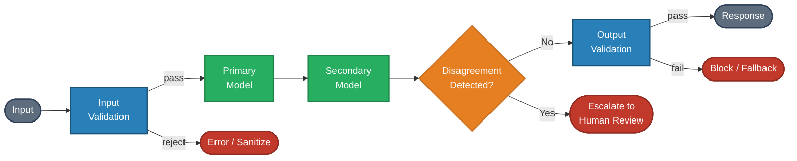
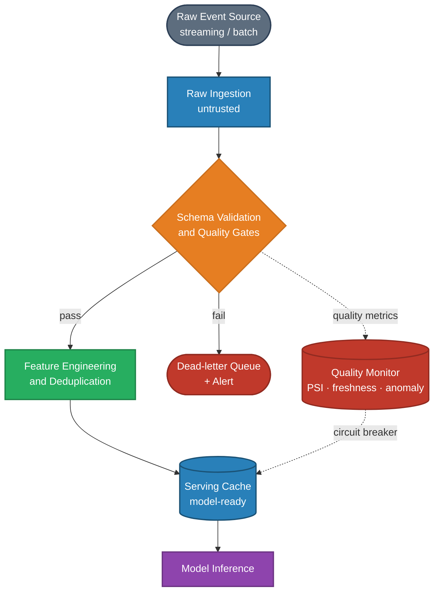
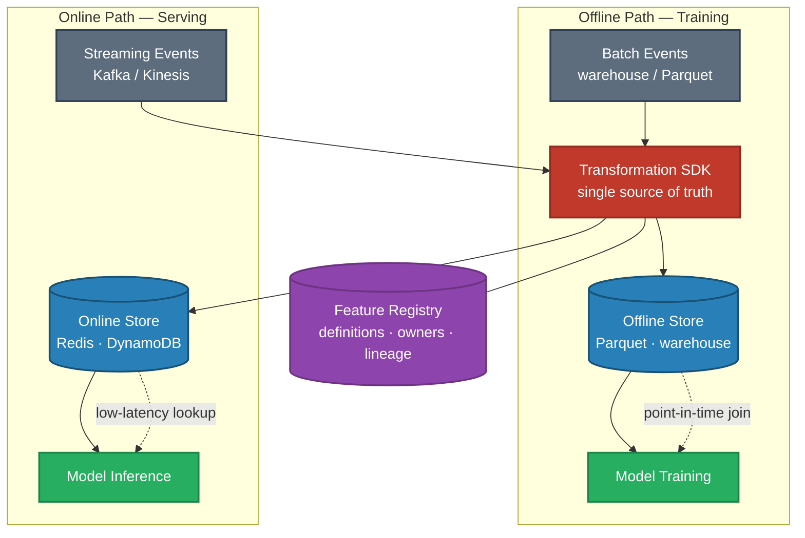

# Deployment & Inference — Interview Questions

Role focus: **AI Architect** · **AI Engineer** · **ML Engineer**

---

## Q1 — Scaling a System 10× in One Year

**Question:** Current architecture barely handles today's load. You need to design for 10× traffic growth over the next 12 months. How do you approach this without a proportional increase in cost?

**Short answer:** Diagnose bottlenecks first (compute, memory, I/O, external APIs). Apply a phased approach: quick wins from caching + quantization (months 1–3), horizontal scaling (months 3–6), architectural optimization (months 6–12). Target 3–4× cost growth for 10× capacity growth.

---

### Phase 0: Understand current bottlenecks

Never propose a scaling solution before profiling. The right fix depends on what's actually slow:

| Bottleneck | Symptoms | Primary fix |
|-----------|----------|-------------|
| LLM inference | GPU maxed, long tail latency | Smaller model, caching, quantization |
| Vector retrieval | DB CPU high, rising query latency | ANN index tuning, caching hot queries |
| Database / storage | High I/O wait, slow writes | Read replicas, write buffering |
| External API | Rate limit errors, cascading 429s | Request queuing, provider diversification |

Cost structure matters too: where does most of the money go today? At 10× scale, linearly-scaling costs become existential.

---

### Phase 1: Quick wins (months 1–3, ~2–3× capacity)

**Semantic caching:** Cache LLM responses for semantically equivalent queries. A cosine similarity threshold of ~0.95 on query embeddings gives 30–50% hit rates on typical workloads, directly cutting LLM API spend.

**Response streaming:** Start delivering tokens to the user immediately rather than waiting for the full response. Perceived latency drops dramatically even if total compute time is unchanged.

**Model quantization:** INT8 inference halves memory footprint and often doubles throughput with < 1% quality loss on standard tasks.

**Vector index optimization:** Switch from brute-force to HNSW. Tune `ef_construction` and `M` for your recall/latency SLO.

---

### Phase 2: Horizontal scaling (months 3–6, additional 2–3×)

**Containerize and orchestrate:** Package each service in Docker; deploy on Kubernetes with Horizontal Pod Autoscaler (HPA) so instances scale with request volume.

**Read replicas for databases:** Separate read and write paths. Model serving is read-heavy — read replicas absorb query load without touching the write primary.

**Async processing:** Move non-latency-critical work off the request path (logging, analytics, batch embedding generation). Decouples system capacity from request volume for background tasks.

---

### Phase 3: Architectural optimization (months 6–12, additional 2–3×)

**Model routing:** Route queries to model size based on complexity signal. Simple queries → small fast model (3B, 7B). Ambiguous or complex queries → larger model. A lightweight classifier (or heuristics on query length/domain) handles routing. Typical impact: 60–80% of traffic served by the cheaper tier.

**Tiered retrieval:** Pre-filter with cheap sparse search (BM25) before expensive dense vector search. Sparse search eliminates 80–90% of the search space; dense search runs on the remainder.

**CQRS pattern for data:** Separate read and write paths architecturally, not just through replicas. Optimize each independently.

---

### Cost math

Scaling 10× does not have to mean 10× spend:

- Model routing can serve 70% of traffic at 1/10 the inference cost
- Semantic caching eliminates 30–50% of LLM calls entirely
- Spot/preemptible instances for batch workloads: 60–80% cost reduction
- Horizontal scaling is roughly linear — but efficiency gains above mean cost growth < traffic growth

**Target:** 10× capacity at 3–4× cost. Achievable with disciplined execution of the phases above.

---

## Q2 — Designing High-Stakes AI for Safe Failure

**Question:** You're architecting a system for high-stakes decisions (financial, medical, or legal). What failure modes are specific to AI systems and how do you design for safe failure rather than just correct operation?

**Short answer:** AI systems have failure modes traditional software doesn't: silent confidence failures, distribution shift, adversarial manipulation, and cascading hallucinations. Design for confidence-gated outputs, human-in-the-loop checkpoints, defense-in-depth validation, and complete audit trails.

---

### AI-specific failure modes

**Silent confidence failures:** The model outputs a wrong answer with high confidence. Traditional error handling doesn't catch this — the system reports success. This is the most dangerous failure mode in high-stakes contexts.

**Distribution shift:** The model was trained on one distribution; the world changes; performance degrades gradually with no explicit error signals. By the time it's caught, many decisions have been affected.

**Adversarial manipulation:** Inputs are crafted to exploit model behavior — prompt injection, adversarial examples, or carefully worded queries that flip outputs.

**Cascading hallucinations:** One component generates an incorrect output; downstream components treat it as ground truth; errors compound.

---

### Architectural patterns

**Pattern 1: Confidence-gated output**

Define behavioral tiers based on model confidence:

| Confidence | System behavior |
|-----------|----------------|
| High (> 95%) | Return result with standard caveats |
| Medium (70–95%) | Return result with explicit uncertainty notice; suggest verification |
| Low (< 70%) | Decline to answer; escalate to human review |

**Requirement:** Confidence scores must be calibrated (expected calibration error < 0.05). Raw model probabilities are typically overconfident — apply temperature scaling or isotonic regression.

**Pattern 2: Defense in depth**

Multiple independent validation stages, any of which can reject or flag:

If the primary and secondary models disagree significantly, escalate rather than choosing arbitrarily.

**Pattern 3: Human-in-the-loop checkpoints**

For truly consequential decisions, AI assists but does not decide:

- AI provides structured analysis with confidence and supporting evidence
- Human reviews and approves or overrides
- The decision is logged with both AI recommendation and human disposition

**Pattern 4: Complete audit trail**

Every decision must be reconstructible post-hoc:

- Input (exactly what did the system receive?)
- Model version and configuration at time of decision
- Retrieved context (for RAG systems)
- Intermediate reasoning (if applicable)
- Confidence scores
- Final output and timestamp

Without this, regulatory review and incident investigation are impossible.

---

### Operational practices

- **Canary deployment:** Roll out new models to 1% → 5% → 25% → 100% traffic. Automated rollback on metric degradation.
- **Monitoring beyond uptime:** Track prediction quality metrics, not just availability. Confidence score distributions, output entropy, and known-answer accuracy on sampled queries.
- **Kill switches:** Architectural support for disabling AI components and falling back to rules-based logic. Essential for incident response.

---

## Q3 — Reducing Inference Latency from 3s to 500ms

**Question:** Users wait 3–4 seconds for responses. The product requirement is sub-500ms. Walk through your systematic approach to reaching that target.

**Short answer:** Profile first, optimize the biggest bottleneck. LLM inference is almost always the largest component (60–80% of latency). Stream first, quantize, and consider a smaller model before touching other layers.

---

### Profile before optimizing

A typical 3–4s response might break down as:

| Component | Time |
|-----------|------|
| LLM inference | 2,500ms |
| Vector retrieval | 300ms |
| Embedding generation | 200ms |
| Network + preprocessing | 200ms |
| **Total** | ~3,200ms |

Optimizing retrieval when inference dominates wastes effort. Always instrument before assuming.

---

### If LLM inference is the bottleneck (most common)

1. **Streaming:** Return tokens as they're generated. Perceived latency = time to first token, not total latency. For many use cases, perceived latency under 500ms is achievable even if generation takes 2s.

2. **Smaller model:** A 7B fine-tuned model often outperforms a 70B general model on specific tasks. Inference is 10× cheaper. Always worth testing.

3. **Quantization:** INT8 inference halves GPU memory and commonly doubles throughput with minimal quality loss.

4. **Speculative decoding:** A small draft model proposes tokens; the large model verifies. Achieves 2–4× wall-clock speedup for generation-heavy tasks.

5. **Semantic caching:** For repeated or similar queries, skip inference entirely. 30–50% hit rates on typical workloads.

---

### If retrieval is the bottleneck

1. **Switch to ANN:** Replace brute-force kNN with HNSW. Query time drops from O(N) to O(log N).
2. **Reduce vector dimensions:** 384-dim embeddings search faster than 1536-dim with acceptable quality trade-off.
3. **Metadata pre-filtering:** Filter by metadata before vector search to reduce the candidate set.
4. **Cache hot queries:** Popular queries can be cached at the retrieval layer.

---

### The product conversation

Present three options as a decision for the product team, not a technical constraint:

| Option | Latency | Quality impact |
|--------|---------|---------------|
| Streaming (perceived time) | ~200ms TTFT | None |
| Smaller model + quantization | ~800ms total | Minimal (~1–2%) |
| Aggressive caching + smaller model | ~400ms total | Cache miss quality unchanged |

---

## Q4 — Model Performance Degrading in Production

**Question:** A model performs well offline but poorly in production. Systematically diagnose the root cause.

**Short answer:** This is train-serve skew. Check feature distribution shift first, then feature computation differences, then preprocessing inconsistencies, then label leakage. Instrument first, debug second.

---

### Root causes in order of frequency

**1. Feature distribution shift**

Production data looks different from training data. Model was optimized for a distribution that no longer reflects reality.

Detection: Compare feature distributions between training and production. Look for changes in mean, variance, and tail behavior. Low prediction confidence is a signal.

**2. Feature computation differences**

The features computed during training are different from the features computed during serving — same name, different computation.

Common culprits:
- Time-based features computed over different windows (training: batch over full history; serving: real-time over recent window)
- Aggregations that include future data in training (data leakage)
- Categorical encoding applied in different order
- Tokenizer version mismatches

Detection: Log features at serving time and compare to the same examples from training data. Any distribution difference is a bug.

**3. Preprocessing inconsistencies**

Tokenization, normalization, or encoding differs between training and serving pipelines.

Examples: text lowercased in training but not serving; different whitespace handling; different categorical cardinality (unseen categories at serving time handled differently).

**4. Label leakage in training**

The model trained on a feature that isn't available at prediction time — it "knows" the answer before predicting. Produces suspiciously good offline metrics that evaporate in production.

---

### Debugging infrastructure you need before you can diagnose

1. **Feature logging:** Record the exact feature vector used for each production prediction
2. **Prediction logging:** Save input, model output, confidence, and timestamp for each request
3. **Shadow mode:** Run new model versions in parallel without serving results — compare outputs
4. **Offline replay:** Replay production traffic through the training feature pipeline to detect computation differences

Without these, root cause analysis is guesswork.

---

## Q5 — Reliable Data Pipelines for AI Systems

**Question:** Your AI system depends on real-time data with inconsistent quality — missing values, duplicates, late-arriving events. What pipeline architecture ensures reliable model performance?

**Short answer:** Treat data as an API contract: version schemas, validate at every stage, monitor quality continuously, and implement graceful degradation when quality drops below thresholds.

---

### Layered pipeline architecture

Each layer has explicit entry and exit criteria. A quality gate failure stops downstream processing rather than silently propagating bad data.

---

### Handling real-time data challenges

**Late arrivals:** Use event-time windowing with watermarks. Define a lateness threshold (e.g., events arriving > 5 minutes after their event timestamp are "late"). Handle late data explicitly: update prior aggregations or discard.

**Missing values:** Define strategies per field: mandatory fields → fail validation; optional numerical fields → forward-fill or category mean; optional categoricals → "unknown" sentinel. Never silently drop records.

**Duplicates:** Deduplication via composite key (entity_id + timestamp + event_type). Time-windowed deduplication for streaming scenarios where exact duplicates may arrive within minutes.

---

### Quality monitoring

Track per pipeline stage:

- **Freshness:** How recent is the latest data for each entity?
- **Completeness:** What fraction of expected records arrived?
- **Distribution drift:** Are feature distributions shifting? (PSI threshold: > 0.1 = investigate, > 0.25 = alert)
- **Anomaly rate:** What fraction of records failed validation?

Automated circuit breakers: when quality drops below threshold, stop updating model inputs and serve from the last known-good snapshot rather than propagating corrupted features.

---

## Q6 — Inference Observability and Fallback Design

**Question:** What observability signals should you collect for production language model inference, and how do you design fallback strategies for degraded models or infrastructure failures?

**Short answer:** Collect performance signals (latency, GPU utilization, error rates), quality signals (confidence distributions, hallucination detection), and user impact signals (escalation rate, task success). Design multi-layered fallbacks that preserve user trust even when primary inference fails.

---

### Signals to collect

**Performance:** p95/p99 latency, GPU/CPU utilization, request queue length, error rates by type (4xx, 5xx, timeout)

**Quality:** Model confidence score distribution (drift here precedes accuracy degradation), freshness of retrieved evidence (for RAG), hallucination detector scores on sampled outputs

**User impact:** Human escalation rate, task success rate (where measurable), time-to-first-byte

**Data and drift:** Input token length distribution, input topic distribution skew, per-feature PSI scores

**Safety:** Rate of blocked outputs (policy violations), false positive rate on safety filters (over-blocking degrades UX)

---

### Fallback strategy layers

**Layer 1: Model size degradation**

When primary model capacity is constrained, route to a smaller, faster model. The response format should be calibrated to match the smaller model's capability (narrower confidence claims, explicit uncertainty).

**Layer 2: Cached responses**

For repeat or near-repeat queries, serve previously validated responses. Effective for FAQ-style use cases; requires freshness management.

**Layer 3: Read-only fallback**

When synthesis models are down, return retrieved evidence and ask the user to interpret it themselves. Preserves partial value without generating novel (potentially incorrect) responses.

**Layer 4: Circuit breakers**

When a downstream service (LLM API, vector DB) shows elevated error rates, open the circuit: queue requests, serve cached results, or return a degraded-mode response with clear user messaging. Prevents cascading failures.

---

### Automation and SLOs

Define SLOs explicitly for each signal tier (e.g., p99 latency < 3s, hallucination rate < 2%, escalation rate < 5%). Automated remediation playbooks: restart unhealthy pods, scale out on CPU > 80%, switch model on quality degradation. Use anomaly detection (not just threshold alerting) for silent quality degradation that doesn't trigger hard thresholds.

---

## Q7 — Train-Serve Skew: Debugging the Production-Offline Gap

**Question:** Your model's offline metrics are strong but production performance is poor. Walk through the systematic diagnosis.

*(See Q4 above for the full diagnosis framework — this question from the ML Engineer perspective adds infrastructure-level fixes.)*

**Fix matrix:**

| Root cause | Fix |
|-----------|-----|
| Feature distribution shift | Retrain on recent data; add continuous training pipeline |
| Feature computation difference | Unify code: use a feature store so training and serving use identical compute logic |
| Preprocessing mismatch | Single shared preprocessing module imported by both training and serving |
| Label leakage | Audit feature timelines; enforce point-in-time correct joins in training data preparation |
| Model staleness | Trigger retraining when PSI > 0.2 on key features |

---

## Q8 — Feature Stores and Training/Serving Consistency

**Question:** How do you design a feature store architecture that guarantees training/serving consistency and supports safe feature evolution?

**Short answer:** Separate offline (batch) and online (low-latency) stores with a shared transformation layer. Use event-time joins with explicit cutoff timestamps. Version features, not just code. Run shadow traffic before cutover to any new feature version.

---

### Core components

| Component | Description |
|-----------|-------------|
| Offline store | Materialized feature tables in a data warehouse or Parquet; used for training and backtesting |
| Online store | Low-latency key-value store (Redis, DynamoDB, Bigtable); used during inference |
| Feature registry | Central catalog: feature definitions, transformation code, owners, lineage, deprecation status |
| Transformation SDK | Shared library that computes the same feature identically for both offline and online paths |

---

### Ensuring consistency

The #1 source of training/serving skew is different code computing the same feature in training vs. production.

Fix: the transformation SDK must be the single source of truth. Training reads from the offline store (which was populated by the SDK). Serving reads from the online store (populated by the same SDK on streaming events). The code must be identical — not "equivalent" or "similar."

**Event-time joins:** When joining features from different sources, join on event time with watermarks, not on processing time. Feature values must reflect what was known at the time of the event, not at the time of ingestion.

---

### Feature evolution

**Versioning:** When a feature definition changes, create a new version rather than modifying in place. Old models continue to request `feature_v1`; new models request `feature_v2`. Both are materialized simultaneously.

**Shadow traffic:** Before fully migrating to a new feature version, run new and old versions in parallel on production traffic. Compare model predictions — large divergence signals a meaningful behavioral change.

**Deprecation:** Track feature importance scores continuously. Features with consistently low importance and no active model dependencies can be deprecated on a schedule. Publish a deprecation calendar in the feature registry.

---

*Back to [Deployment →](README.md) · See also: [Agent Interview Questions →](../13-agents/interview-questions.md)*
