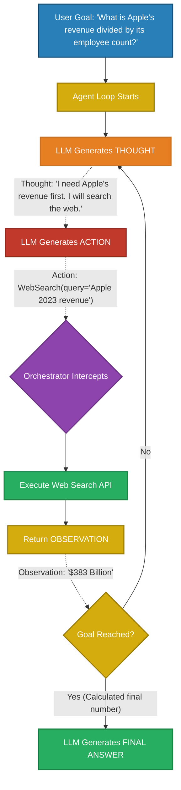
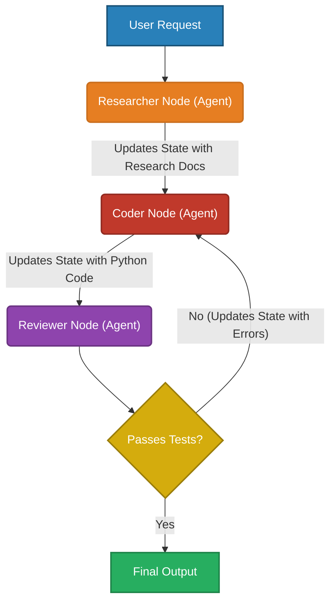

# Agent-Based Systems

> Moving from stateless chatbots to autonomous reasoning engines. Agents are the bridge between generating text and taking action in the real world.

---

## Q1. What is the fundamental architecture of an Autonomous LLM Agent?

### Core Answer

A standard LLM is a stateless text generator. An **LLM Agent** is a systemic architecture that elevates the LLM to function as a central "Brain." The agent dynamically decides *which* steps to take, *when* to execute external tools, and *how* to adapt when things fail.

An Agent consists of four critical components:
1. **The Brain (LLM):** Parses the goal, generates a multi-step plan, and evaluates intermediate results.
2. **Tools (Functions):** Deterministic APIs that allow the agent to affect the outside world (e.g., Python REPL, SQL database query, Web Search API).
3. **Memory:** Short-term memory (the rolling context window of the current execution loop) and Long-term memory (a Vector DB to recall past actions across sessions).
4. **The Orchestrator:** The deterministic code (e.g., Python `while` loop, LangGraph state machine) that intercepts the LLM's tool-call, executes the actual code, and feeds the `Observation` back into the LLM.

### Related Questions

!!! question "Follow-up Interview Questions"
    1. What is the difference between ReAct and Plan-and-Execute architectures?
    2. How do Agents solve the "Context Window Degradation" problem?
    3. Why are standard LLMs bad at tool selection, and how does Fine-Tuning fix it?
    4. What is the role of an Orchestrator framework?

??? success "View Answers"
    **1. ReAct vs Plan-and-Execute?**
    **ReAct** is highly dynamic. The agent thinks one step ahead, takes an action, sees the result, and decides the next step. It is great for unpredictable tasks but prone to infinite loops. **Plan-and-Execute** uses a Planner LLM to write a 10-step rigid to-do list upfront, and an Executor LLM simply blindly runs the steps. It is vastly cheaper and faster, but if Step 2 fails, Step 3 through 10 will likely crash.

    **2. Context Window Degradation?**
    If an agent runs for 50 iterations, the context window fills up with thousands of tokens of tool outputs (e.g., massive JSON API responses). The self-attention mechanism becomes diluted, and the LLM "forgets" the original goal. Advanced agents use **Context Compression**: every 5 steps, a secondary LLM summarizes the raw tool outputs into a dense paragraph and clears the raw JSON from the active prompt.

    **3. Fine-Tuning for Tool Use?**
    Base LLMs struggle to output perfectly formatted JSON strings matching a tool's API schema. Modern models (like GPT-4 and Claude-3) are explicitly fine-tuned on millions of synthetic Tool-Calling datasets. They learn special control tokens that signal "I am invoking a function now," which dramatically reduces syntax errors compared to relying purely on prompt engineering.

    **4. The Orchestrator?**
    The LLM does not execute code. When an LLM outputs `search("AAPL")`, the LLM stops. The Orchestrator (your Python code) parses that string, makes the actual HTTP request to Google, takes the HTML result, and appends it to the LLM's prompt as `Observation: [Apple is at $150]`. The Orchestrator manages the infinite loop.

---

## Q2. How does ReAct (Reasoning and Acting) actually work under the hood?

### Core Answer

**ReAct** is the foundational prompt engineering technique that enabled the first generation of Agents. 

The core mathematical insight of ReAct is that you must force the LLM to emit a **Thought** *before* it emits an **Action**. Because Transformers are autoregressive, the next token is conditioned on all previous tokens. If the LLM generates the reasoning tokens first, its attention heads lock onto that logic, mathematically forcing the subsequent `Action` to be highly accurate. If it generates the `Action` immediately without thinking, it often guesses the wrong tool.

### Related Questions

!!! question "Follow-up Interview Questions"
    1. Why does ReAct suffer from the "Infinite Loop" problem?
    2. How do you implement early stopping or budget constraints in ReAct?
    3. What is Reflexion (Self-Critique)?
    4. How does ReAct handle multi-tool dependencies?

??? success "View Answers"
    **1. The Infinite Loop?**
    If the Web Search tool returns "Error 404", the LLM might generate: *Thought: The search failed. I will try again. Action: WebSearch(query='Apple 2023 revenue')*. It will do this indefinitely. Because LLMs lack a sense of absolute time or iteration count, they easily get trapped in localized logical loops if an observation fails to push their internal state forward.

    **2. Budget Constraints?**
    The Orchestrator must enforce a `max_iterations` counter (usually 10-15). If the loop hits the limit, the Orchestrator injects a forced system prompt: *"SYSTEM WARNING: You have reached the maximum allowed steps. You must output the FINAL ANSWER immediately based on your current knowledge, or say you failed."*

    **3. Reflexion?**
    Reflexion is a variant of ReAct where you add an explicit self-critique step. After receiving an Observation, the LLM must generate a `Critique` token: *"Did my previous action succeed? If not, why?"* This forces the model to evaluate its own failure before attempting a new action, breaking the infinite loop phenomenon.

    **4. Multi-Tool Dependencies?**
    In standard ReAct, tools are executed sequentially. If an agent needs to search for Apple and Microsoft, it takes two full iterations (Thought -> Search Apple -> Observe -> Thought -> Search MSFT -> Observe). This is incredibly slow and expensive.

---

## Q3. Native Function Calling vs Prompt-based Tool Use?

### Core Answer

Early Agent frameworks (like old LangChain) relied on **Prompt-based Tool Use**. You had to inject a massive system prompt describing all tools, and beg the model to output a specific string format (e.g., `Action: Calculator, Input: {"eq": "2+2"}`). The LLM frequently hallucinated the JSON syntax, crashing the agent.

Modern systems use **Native Function Calling** (OpenAI/Anthropic tool schemas). You define your tools using strictly typed JSON Schemas (or Python Pydantic models) and pass them to the API via a dedicated `tools=[]` parameter. 

The LLM provider's backend is explicitly fine-tuned to recognize this schema. Instead of generating natural language text, the API pauses and returns a highly deterministic, syntactically perfect JSON object representing the tool call.

### Related Questions

!!! question "Follow-up Interview Questions"
    1. How do you define a Tool Schema using Pydantic?
    2. How do you force a model to use a specific tool?
    3. What is Parallel Function Calling?
    4. Why should you avoid LangChain's generic `AgentExecutor` in production?

??? success "View Answers"
    **1. Pydantic Tool Schemas?**
    Instead of writing raw JSON schema, production Python systems use Pydantic. You define a class `class WeatherRequest(BaseModel): city: str = Field(..., description="The city name")`. Libraries like Instructor or LangChain automatically compile this Pydantic class into the exact JSON schema OpenAI expects, guaranteeing type safety in your Python orchestrator.

    **2. Forcing Tool Use?**
    APIs expose a `tool_choice` parameter. By default, it is set to `"auto"` (the LLM decides). If you set `tool_choice={"type": "function", "function": {"name": "get_weather"}}`, you mathematically force the LLM's first output to be that specific tool call, entirely bypassing its decision-making process.

    **3. Parallel Function Calling?**
    Modern function calling supports emitting arrays of tool calls. If the user asks for the weather in Tokyo, London, and New York, the LLM can output a single array containing three separate JSON tool-calls. The Orchestrator executes all three HTTP requests asynchronously in parallel, collapsing three ReAct iterations into one.

    **4. LangChain `AgentExecutor` in Production?**
    LangChain's generic `AgentExecutor` hides the ReAct `while` loop behind a massive wall of opaque abstractions. When the agent fails, it is incredibly difficult to debug the exact prompt that was sent or inject custom failure-recovery logic. Production systems either write the `while` loop from scratch in pure Python, or use state-machine frameworks like LangGraph.

---

## Q4. What is the State Graph paradigm for Multi-Agent systems?

### Core Answer

Single agents fail at complex, long-running tasks (like writing a software application). The context window becomes a messy soup of conflicting thoughts, code snippets, and API errors, causing the single LLM to completely lose track of the goal.

**Multi-Agent State Graphs** (e.g., LangGraph, AutoGen) solve this by abandoning the massive single `while` loop. Instead, you define distinct, highly specialized Agents (e.g., a *Researcher*, a *Coder*, and a *Reviewer*). 

These agents are modeled as **Nodes** in a cyclical Graph. You define a strict, typed **State Object**. The State Object is passed from Node to Node. The *Coder* node only sees the specific variables in the State it needs, writes the code, updates the State, and routes to the *Reviewer* node.

### Related Questions

!!! question "Follow-up Interview Questions"
    1. What is the difference between a Sequential Chain and a State Graph?
    2. How does AutoGen handle Conversational Multi-Agent architectures?
    3. What is the "Lost in the Middle" problem in Multi-Agent memory?
    4. When should you use a Multi-Agent system versus a Single Agent with many tools?

??? success "View Answers"
    **1. Chain vs Graph?**
    A Chain (like `LLMChain`) is a strictly linear DAG (Directed Acyclic Graph). Step A -> Step B -> Step C. It cannot loop. A State Graph allows cyclical routing. If the Reviewer rejects the code, the graph routes *backward* to the Coder node, creating a dynamic `while` loop governed by explicit edge logic rather than LLM guesswork.

    **2. Conversational AutoGen?**
    AutoGen (by Microsoft) treats agents as simulated human conversants. Instead of passing a rigid State object, the agents "chat" with each other in a group thread. The Coder posts a message, the Reviewer reads the message and posts a critique. This is easier to prototype but heavily prone to hallucination because it relies on unstructured natural language parsing to maintain state.

    **3. "Lost in the Middle"?**
    If the Coder and Reviewer loop 20 times, the State Object (or chat thread) becomes massive. LLMs suffer from the "Lost in the Middle" phenomenon—they pay heavy attention to the very beginning and very end of a prompt, but completely ignore facts buried in the middle of a massive context window. You must explicitly truncate or summarize the State Object at each node boundary.

    **4. Multi-Agent vs Single-Agent?**
    If the task requires less than 5 steps and uses 3 tools, use a Single Agent with Function Calling. It is faster, cheaper, and easier to debug. If the task requires distinct personas, conflicting validation (a creator vs a critic), or takes hundreds of steps (like autonomous software engineering), you must use a Multi-Agent State Graph to isolate the context windows and enforce strict routing.

---

*Interview Questions: [Agents Interview Q&A →](interview-questions.md)*

*Next: [Prompt Hacking →](../14-prompt-hacking/README.md)*
