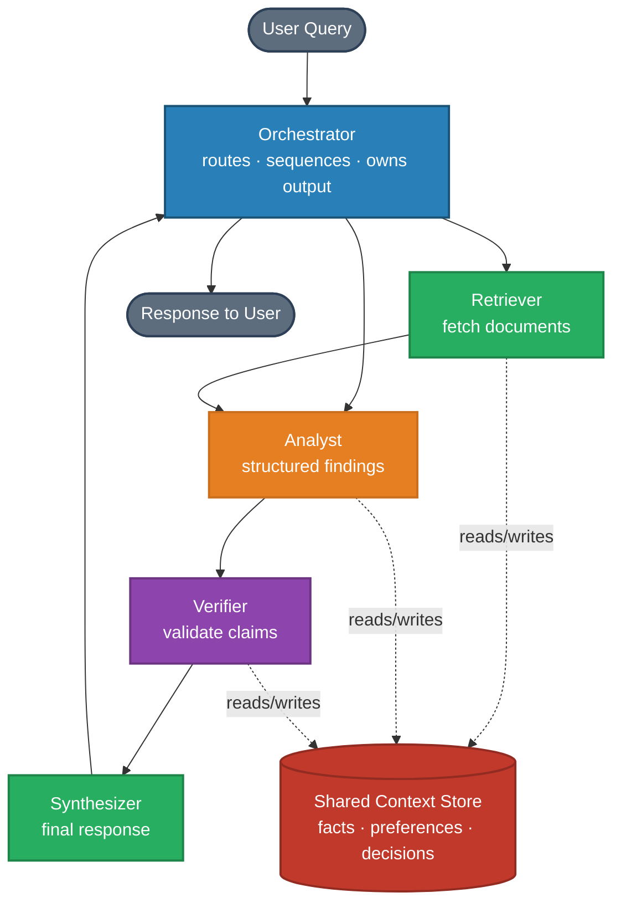
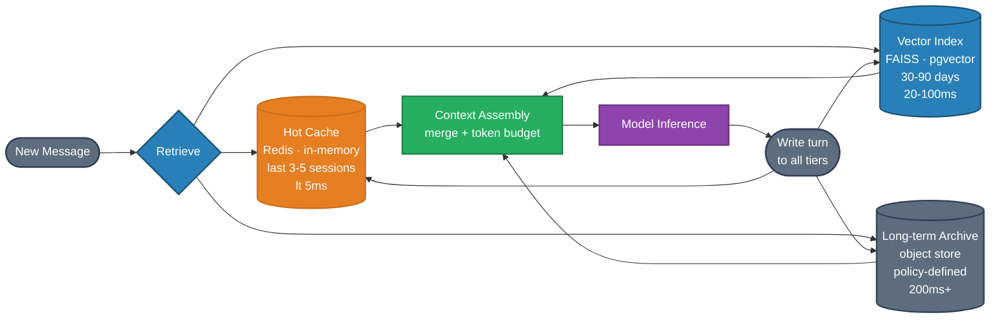

# Agent Systems — Interview Questions

Role focus: **AI Architect** · **AI Engineer**

---

## Q1 — Multi-Agent Output Conflicts

**Question:** When multiple agents in a pipeline start producing contradictory outputs, what are the root causes and how do you eliminate them at the architecture level?

**Short answer:** Contradictions arise from overlapping agent responsibilities and missing shared state. Fix this with explicit role boundaries, a central orchestrator, typed output schemas, and a dedicated conflict-resolution agent.

---

### Why agents conflict

**Responsibility overlap.** Two agents that share jurisdiction over the same decision will independently derive answers using different context, different prompts, and different priors — producing disagreement as a natural outcome.

**Context fragmentation.** Each agent holds only its local slice of information. Without a shared knowledge layer, Agent A and Agent B may reach contradictory conclusions that are both locally rational.

**No ground-truth authority.** When agents disagree, the system has no mechanism to arbitrate. Output defaults to whichever agent spoke last — or worse, both outputs are surfaced to the user.

**Prompt-level disagreement.** If agent system prompts encode different priorities (e.g., "be concise" vs. "be thorough"), those instructions manifest as contradictory outputs even on identical inputs.

---

### Architectural solutions

**1. Assign single-responsibility roles with clear ownership boundaries**

Define each agent's responsibility so there is no overlap:

| Role | Input | Output |
|------|-------|--------|
| Retriever | Query | Ranked documents |
| Analyst | Documents + query | Structured findings |
| Verifier | Findings + sources | Validated claims |
| Synthesizer | Validated claims | Final response |

No agent reaches into another's domain. The Retriever doesn't analyze; the Analyst doesn't retrieve.

**2. Central orchestration**

A controller agent routes work, sequences agents, and owns the final output. Without an orchestrator, agents race in parallel — producing contradictions. With one, work flows as a directed pipeline where each agent's output feeds the next.



**3. Typed output contracts**

Define a schema for what each agent produces:

```
Analyst output:
- claim: string
- confidence: high | medium | low
- evidence: list[source_id]
- caveats: list[string]
```

Structured outputs make contradictions detectable programmatically. Two claims claiming opposite things on the same fact become an automated trigger, not a silent failure.

**4. Verifier agent for conflict resolution**

Add a dedicated agent that receives competing claims, evaluates source quality and confidence, and emits a single canonical answer. This is the arbitration layer the system otherwise lacks.

**5. Shared context store**

Maintain a shared state object readable by all agents — capturing established facts, user preferences, and prior decisions. Agents that draw from the same ground truth cannot independently contradict it.

---

### Core principle

Autonomy within a role; coordination across roles; arbitration when disagreement arises. Multi-agent systems that rely solely on agent intelligence will contradict themselves. Systems that invest in governance won't.

---

## Q2 — Memory Architecture for Long Conversations

**Question:** A user reports that your AI assistant loses context from earlier in a long session — they have to repeat information they already provided. Walk through the technical cause and the solution space.

**Short answer:** This is a context window saturation problem, not a model failure. The model is stateless and attention is bounded — fix requires one of three memory architectures chosen based on use-case.

---

### Why it happens

LLMs are stateless between inference calls. The only "memory" available is what appears in the current token window. Once the conversation exceeds that window (8K, 32K, or 128K depending on the model), earlier turns are dropped or compressed — and the model can no longer reference them.

This is architectural, not a capability failure. You cannot prompt your way out of it.

---

### Three architectural solutions

**Option A: Summarization memory**

After every N turns (or when context approaches the limit), compress prior conversation into a summary. The model sees: `[Summary] + [Recent N turns]`.

- Suitable for: customer service bots, support agents, most conversational use cases
- Latency: low — just an extra LLM call when compressing
- Failure mode: lossy — specific named entities, numbers, or precise facts may not survive summarization

**Option B: Vector memory (RAG over conversation)**

Store each conversation turn as an embedding in a vector index. When a new message arrives, retrieve the most semantically relevant past turns and inject them into context.

- Suitable for: personal assistants, knowledge-intensive workflows
- Latency: adds retrieval round-trip (~50–200ms)
- Failure mode: requires good embedding quality; retrieval misses on paraphrase or implicit references

**Option C: Hybrid memory**

Summarization provides long-term continuity; vector retrieval handles precision recall of specific facts (names, numbers, decisions).

- Suitable for: complex multi-session workflows, personal AI companions
- Latency: moderate — retrieval + summary assembly
- Failure mode: complex to tune and debug; needs careful design to avoid redundant context

---

### How to diagnose which memory type to use

First instrument the system:

1. What categories of information are users re-stating? (Names → summary may drop them; preferences → vector works; recent decisions → sliding window)
2. Is the problem intra-session or cross-session? (Intra: summarization helps. Cross: persistent vector store required.)
3. What's the latency budget? (Sub-200ms rules out complex retrieval pipelines)

---

## Q3 — Memory System Design for Multi-Session Agents

**Question:** Describe a production-grade memory architecture for an agent that must retain relevant context across multiple sessions while keeping latency low and respecting privacy requirements.

**Short answer:** Use a three-tier store (hot cache → medium-term vector index → long-term archive), retrieve with a hierarchical pipeline, prune by relevance decay, and enforce consent-based access controls at query time.

---

### Storage tiers



| Tier | Store | Retention | Access speed |
|------|-------|-----------|--------------|
| Hot cache | In-memory / Redis | Last 3–5 sessions | < 5ms |
| Medium-term | Vector index (FAISS / pgvector) | 30–90 days, pruned by relevance | 20–100ms |
| Long-term archive | Object store (compressed embeddings) | Policy-defined | 200ms+ |

Each turn is stored with metadata: timestamp, topic tags, sensitivity level, user consent flags.

---

### Retrieval pipeline

1. **Pre-filter** — keyword/tag match to narrow candidates (cheap)
2. **ANN search** — cosine similarity over embeddings on filtered candidates
3. **Reranker** — cross-encoder reranks top-K for relevance
4. **Context assembly** — merge retrieved memories with current session context, respecting token budget

Only fetch a bounded context window — do not inject all matching memories.

---

### Pruning and retention

- **Recency decay:** memories older than threshold without reactivation lose priority score
- **Relevance eviction:** low-utility memories (never retrieved, low similarity scores) get evicted on schedule
- **User controls:** explicit forget / export endpoints that propagate to all tiers

---

### Privacy and access control

- Encrypt all tiers at rest; use strict RBAC for backend access
- Consent flags are attached at write time and enforced at query time — queries automatically exclude memories marked non-shareable
- Never retrieve memories across user boundaries; session context is tenant-isolated

---

### Performance considerations

- Pre-compute and cache embeddings for frequently queried context patterns
- Use approximate nearest-neighbor indices tuned to your update frequency and latency SLO
- Monitor retrieval latency separately from model inference latency to isolate bottlenecks

---

*Back to [Agent Systems →](README.md) · [Deployment Interview Questions →](../12-deployment/interview-questions.md)*
