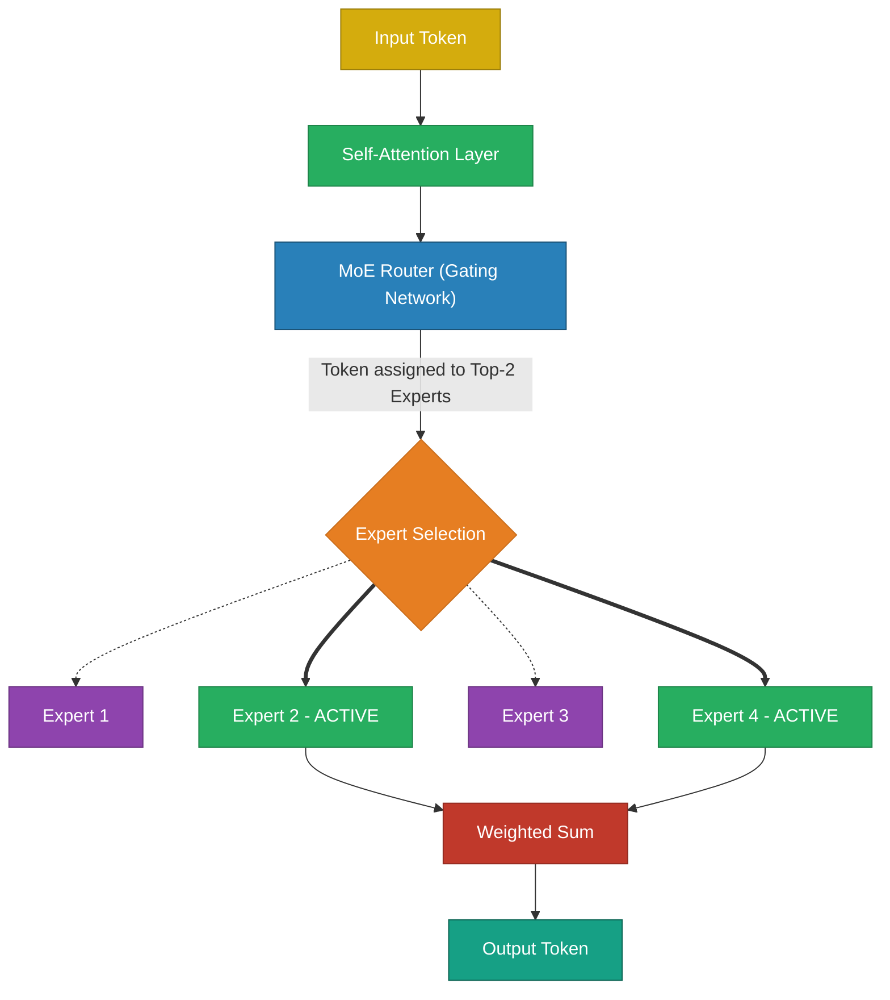
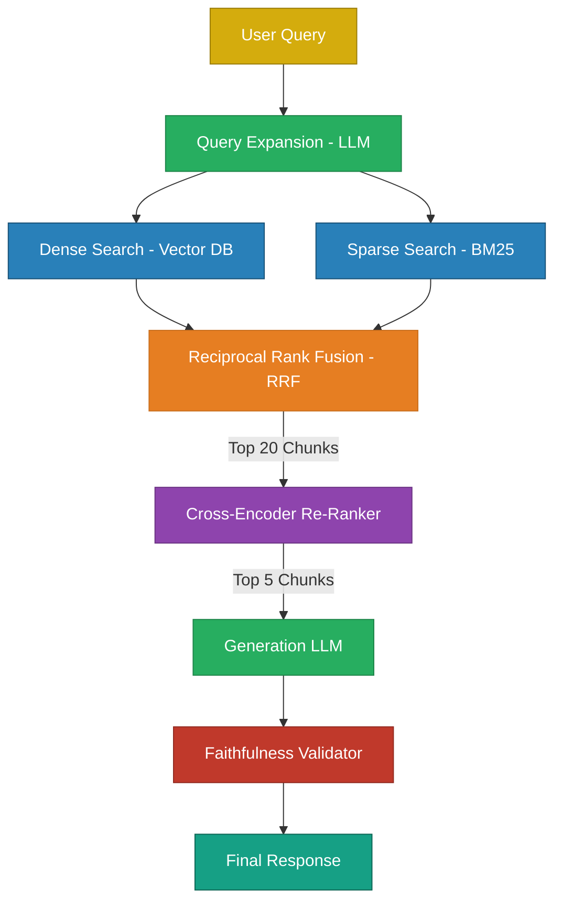

# Miscellaneous LLM Engineering Topics

> Advanced topics spanning architecture, memory mathematics, low-precision training, and production pipelines.

---

## Q1. How do you optimize the overall cost of a production LLM system?

### Core Answer

Cost comes from two sources: **inference** (token API costs) and **infrastructure** (compute/storage). A Senior Engineer must implement systemic optimizations across both.

**1. Semantic Caching:** Standard caching hashes the exact string. Semantic Caching embeds the query into a vector and checks for $>0.95$ Cosine Similarity with past queries, serving cached answers for synonymous questions and dropping latency to 20ms.

**2. Prompt Compression & Smart Truncation:** Remove redundant context before it hits the LLM.

```python
# 1. Prompt compression — removes linguistically redundant tokens
from llmlingua import PromptCompressor
compressor = PromptCompressor()
compressed = compressor.compress_prompt(long_prompt, rate=0.5)  # 50% cheaper

# 2. Semantic Truncation — strictly enforce context budget
def smart_truncate(chunks, max_tokens=2000):
    total_tokens = 0
    kept_chunks = []
    # Sort by relevance score, not document order
    for chunk in sorted(chunks, key=lambda x: x.score, reverse=True):
        chunk_tokens = count_tokens(chunk.text)
        if total_tokens + chunk_tokens <= max_tokens:
            kept_chunks.append(chunk)
            total_tokens += chunk_tokens
    return kept_chunks
```

**3. Cascading Routing:** Do not send every query to GPT-4o. Route easy queries to a fast, cheap model (like Haiku or Llama-3-8B), and only escalate to the frontier model if the cheap model's confidence is low.

### Related Questions

!!! question "Follow-up Interview Questions"
    1. How do you track per-request cost in a dynamic multi-tenant system?
    2. What is the infrastructure cost difference between Static and Continuous Batching?

??? success "View Answers"
    **1. Cost Tracking?**
    You must wrap every LLM call in a telemetry decorator that counts input/output tokens and multiplies by the specific model's API pricing tier. You tag this metric with the `tenant_id` and push it to Datadog/Prometheus to measure exact margin-per-customer.
    
    **2. Infrastructure Cost?**
    If you self-host on AWS, your cost is $X/hour per GPU. Continuous batching (via vLLM) keeps the GPU at 100% saturation, increasing Tokens-Per-Second by 4x compared to static batching. This means you need 4x fewer GPUs to serve the same traffic, instantly slashing your AWS bill by 75%.

---

## Q2. How do Mixture of Experts (MoE) architectures decouple Parameter Count from Compute Cost?

### Core Answer

In a standard **Dense Transformer**, 100% of the model's parameters are activated to generate a single token. Scaling a dense model makes inference painfully slow.

**Mixture of Experts (MoE)** replaces the standard Feed-Forward Network (FFN) with a Router and $N$ "Expert" FFNs. For every token, the Router selects only the **Top-$K$** experts (e.g., 2 out of 8) to process that specific token. 

A model like Mixtral 8x7B has **47 Billion total parameters**, but only activates **13 Billion parameters** per token.



**PyTorch Implementation of an MoE Layer:**
```python
import torch
import torch.nn as nn
import torch.nn.functional as F

class MoELayer(nn.Module):
    def __init__(self, d_model, num_experts=8, top_k=2):
        super().__init__()
        # The router calculates probabilities for each expert
        self.router = nn.Linear(d_model, num_experts)
        self.experts = nn.ModuleList([FFN(d_model) for _ in range(num_experts)])
        self.top_k = top_k
    
    def forward(self, x):
        # x: (batch, seq, d_model)
        router_logits = self.router(x)
        # Select the top 2 experts for this specific token
        weights, indices = router_logits.topk(self.top_k, dim=-1)
        weights = F.softmax(weights, dim=-1)
        
        output = torch.zeros_like(x)
        for k in range(self.top_k):
            expert_idx = indices[..., k]         
            expert_weight = weights[..., k:k+1]  
            for i, expert in enumerate(self.experts):
                mask = (expert_idx == i)
                if mask.any():
                    # Process the token through the active expert and weight it
                    output[mask] += expert_weight[mask] * expert(x[mask])
        return output
```

### Related Questions

!!! question "Follow-up Interview Questions"
    1. What is the "Load Balancing" problem in MoE?
    2. Does an MoE model save VRAM compared to a dense model of the same active size?

??? success "View Answers"
    **1. Load Balancing Problem?**
    If the Router discovers that Expert 2 is slightly better at general English, it will start sending *all* tokens to Expert 2. The other experts die (zero gradients). MoE requires an **Auxiliary Load Balancing Loss** penalty that mathematically forces the router to distribute tokens equally across all experts.

    **2. MoE VRAM Requirements?**
    MoE saves *Compute* (TeraFLOPS), but it does not save *Memory*. All 47B parameters must be loaded into the GPU's VRAM simultaneously. You cannot dynamically load experts from disk; it is too slow.

---

## Q3. How do you calculate the exact VRAM size of the KV Cache?

### Core Answer

The KV Cache stores Key and Value tensors for all previous tokens during autoregressive generation. As sequence length and batch size grow, the KV cache consumes massive amounts of VRAM, eventually causing Out-Of-Memory (OOM) errors.

**The Exact Mathematical Formula:**
$$ \text{Size} = 2 \times \text{Layers} \times \text{KV\_Heads} \times \text{Head\_Dim} \times \text{Seq\_Len} \times \text{Batch\_Size} \times \text{Bytes\_Per\_Param} $$

*Note: The `2` accounts for the Key tensor and the Value tensor.*

**Example: Llama-3-8B**
```python
num_layers    = 32
num_kv_heads  = 8      # GQA: 8 KV heads vs 32 query heads
head_dim      = 128    # d_model/num_heads = 4096/32
seq_len       = 8192   # Context length
batch_size    = 1
bytes         = 2      # BF16 precision

kv_cache_bytes = 2 * 32 * 8 * 128 * 8192 * 1 * 2
               = 1,073,741,824 bytes ≈ 1 GB per sequence
```
If you want to run a batch size of 64, you need **64 GB of VRAM** just for the KV cache, which is vastly larger than the 8B model weights (16 GB).

### Related Questions

!!! question "Follow-up Interview Questions"
    1. How does Multi-Query Attention (MQA) shrink this formula?
    2. What are the dimensional shapes of the Attention tensors?

??? success "View Answers"
    **1. MQA vs GQA?**
    Standard Attention has 32 Query Heads and 32 KV Heads. MQA forces all 32 Query Heads to share a *single* KV Head (`KV_Heads = 1`), shrinking VRAM by 96%. Grouped-Query Attention (GQA) groups them into 8 KV Heads, shrinking VRAM by 75% while maintaining higher accuracy.

    **2. Tensor Dimensions?**
    For `d_model=4096`, `n_heads=32`, `d_head=128`:
    - `Input X`: `(batch, seq_len, 4096)`
    - `Q, K, V`: `(batch, 32, seq_len, 128)`
    - `Attention Scores`: `(batch, 32, seq_len, seq_len)` <- This is the $O(N^2)$ bottleneck!

---

## Q4. How do you build a sub-500ms Production RAG Architecture?

### Core Answer

A production RAG is a monolithic multi-stage pipeline designed for extreme precision.



**Production RAG Component Class:**
```python
class ProductionRAG:
    def __init__(self):
        self.query_rewriter = QueryRewriter()        # Normalize and expand
        self.dense_retriever = DenseRetriever()      # Embedding-based
        self.sparse_retriever = BM25Retriever()      # Keyword-based
        self.reranker = CrossEncoderReranker()       # Precision layer
        self.llm = OpenAI(model="gpt-4o")
        self.validator = FaithfulnessChecker()
    
    def query(self, user_question: str) -> dict:
        # 1. Expand Query to catch synonyms
        expanded_query = self.query_rewriter.expand(user_question)
        
        # 2. Hybrid Retrieval (Parallel)
        dense_results  = self.dense_retriever.get(expanded_query, k=20)
        sparse_results = self.sparse_retriever.get(expanded_query, k=20)
        
        # 3. Merge via Reciprocal Rank Fusion
        merged = reciprocal_rank_fusion([dense_results, sparse_results])
        
        # 4. Cross-Encoder Re-Ranking (Discard irrelevant hay)
        top_chunks = self.reranker.rerank(user_question, merged, top_k=5)
        
        # 5. Generation with strict citations
        context = build_context(top_chunks)
        answer = self.llm.generate_grounded(user_question, context)
        
        # 6. Post-Generation Hallucination Check
        if not self.validator.is_faithful(answer, context):
            answer = "I don't have enough verified information to answer this."
        
        return {"answer": answer, "sources": [c.metadata for c in top_chunks]}
```

### Related Questions

!!! question "Follow-up Interview Questions"
    1. What is the "Lost-in-the-Middle" Phenomenon?
    2. Why run BM25 and Dense Search in parallel?

??? success "View Answers"
    **1. Lost-in-the-Middle?**
    LLMs exhibit a U-shaped accuracy curve across long context windows. They strongly attend to the very first token and the very last token, but ignore facts buried in the middle. The Re-Ranker solves this by placing the most critical chunk at the very beginning of the context window.
    
    **2. Hybrid Search Necessity?**
    Dense (Vector) search understands concepts but fails at exact keyword matching (e.g., searching for product ID `XZ-899`). BM25 handles exact keyword intersections perfectly but fails at conceptual synonyms. Running both in parallel and merging via RRF gives you the best of both worlds.

---

## Q5. What is FP8 Training and Mixed Precision Math?

### Core Answer

NVIDIA's Hopper architecture (H100) introduced a hardware-native 8-bit floating-point format: **FP8**. It doubles Tensor Core TFLOPS compared to BF16 and halves memory bandwidth bottlenecks.

There is a massive difference between Mixed Precision (BF16/FP16) and pure FP32. In Mixed Precision, the forward and backward passes are done in low precision for speed, but the **Master Weights** are kept in FP32 inside the Optimizer to prevent microscopic gradient updates from vanishing.

```python
# Standard Mixed Precision Training (BF16)
from torch.amp import autocast, GradScaler
import torch

scaler = GradScaler()  # Scales gradients to prevent FP16 underflow

for batch in dataloader:
    # 1. Forward pass in fast BF16
    with autocast(device_type='cuda', dtype=torch.bfloat16):  
        loss = model(batch)
    
    # 2. Backward pass in FP32 (via scaler)
    scaler.scale(loss).backward()
    scaler.step(optimizer)
    scaler.update()
    
    # The optimizer maintains a hidden FP32 copy of the weights.
    # It applies the FP32 gradients to the FP32 master weights, 
    # then casts them back to BF16 for the next forward pass.
```

If using FP8 natively:
```python
# FP8 training with NVIDIA Transformer Engine
import transformer_engine.pytorch as te

# Automatically handles FP8 casting and dynamic scaling
model = te.Linear(1024, 4096) 
```

### Related Questions

!!! question "Follow-up Interview Questions"
    1. Why did FP16 cause overflow problems, and why is BF16 better?
    2. What is the difference between FP8 and INT8?

??? success "View Answers"
    **1. FP16 vs BF16?**
    Standard FP16 has a maximum value of `65,504`. LLM activations frequently spike above 100,000, causing FP16 tensors to overflow to `NaN` and crash the training run. BF16 sacrificed precision (mantissa bits) to expand its exponent range to match FP32 ($3 \times 10^{38}$), permanently solving the overflow problem.

    **2. FP8 vs INT8?**
    INT8 uses 8 bits to represent equally spaced integers (-128 to 127). FP8 is a floating-point format, meaning numbers are exponentially distributed (high precision near zero, low precision for massive numbers). Because neural network weights naturally form a Gaussian distribution clustered around zero, FP8 perfectly maps to the math, making it vastly superior to INT8 for training.

---

*Next: [Case Studies →](../16-case-studies/README.md)*
