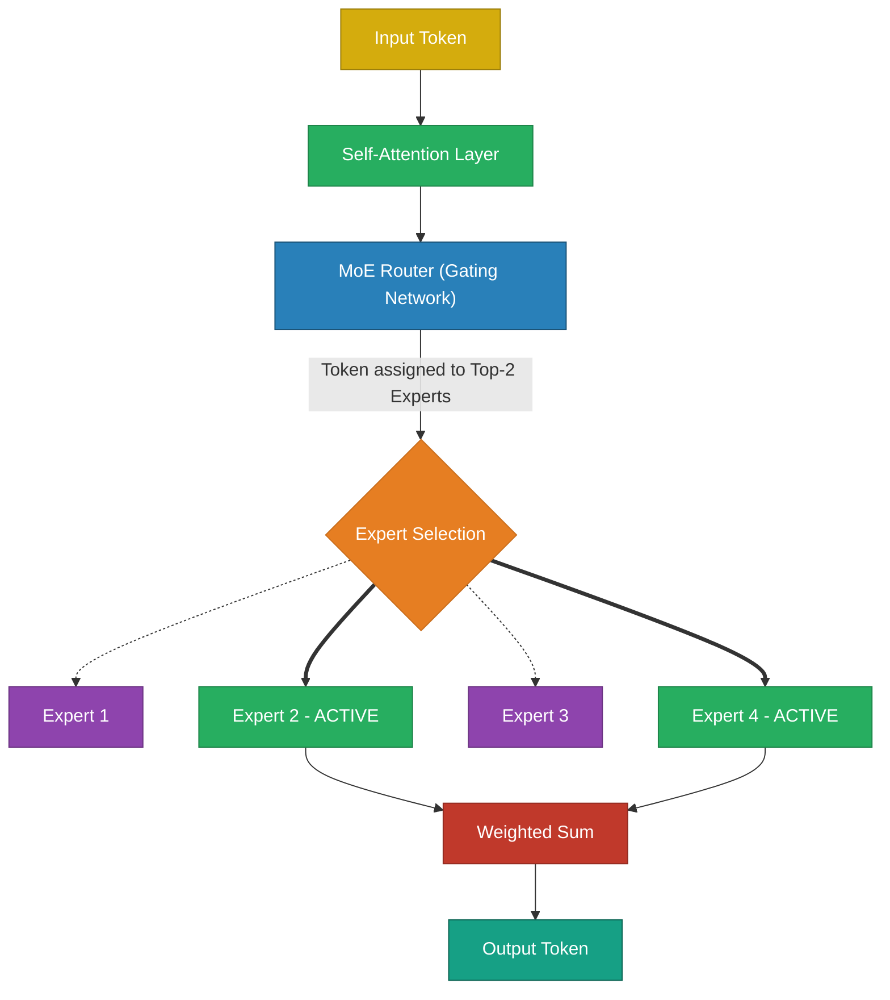
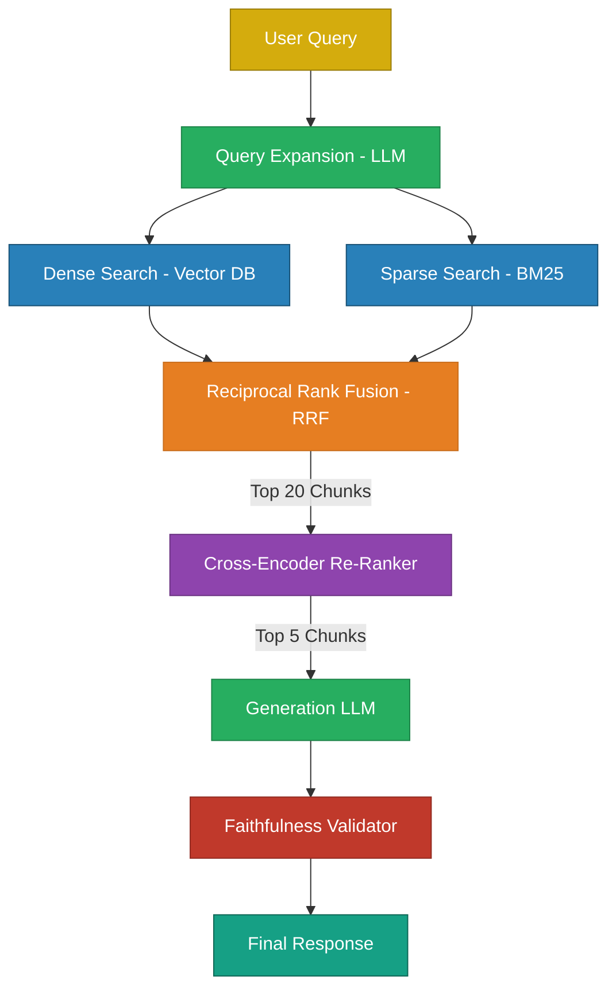
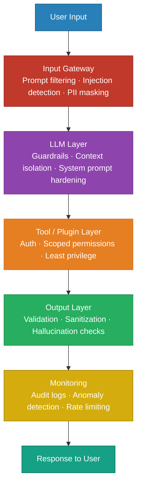
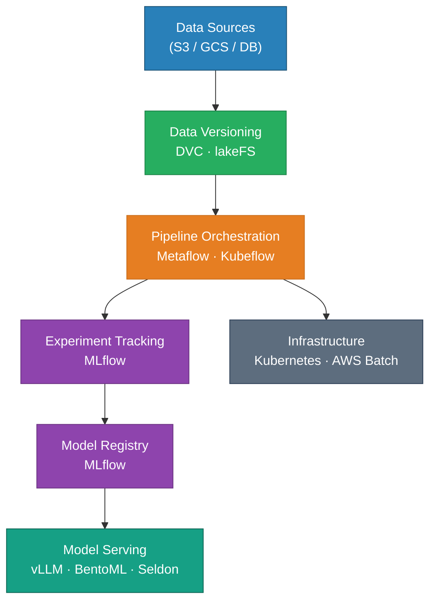
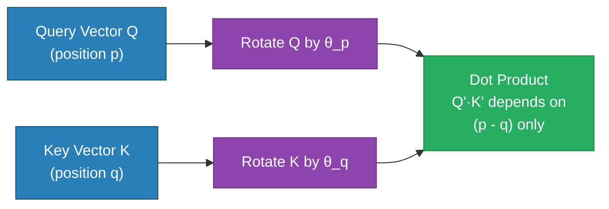
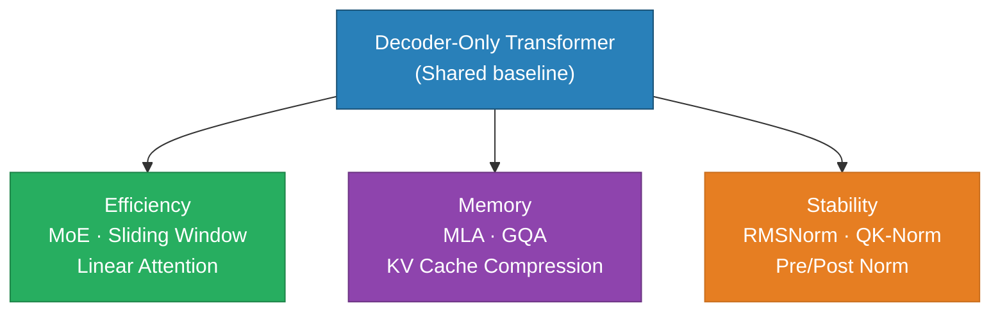
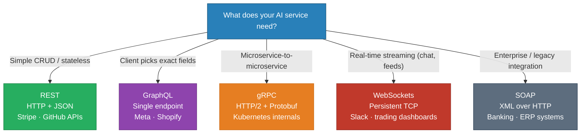

# Miscellaneous LLM Engineering Topics

> Advanced topics spanning architecture, memory mathematics, low-precision training, and production pipelines.

---

## Q1. How do you optimize the overall cost of a production LLM system?

### Core Answer

Cost comes from two sources: **inference** (token API costs) and **infrastructure** (compute/storage). A Senior Engineer must implement systemic optimizations across both.

**1. Semantic Caching:** Standard caching hashes the exact string. Semantic Caching embeds the query into a vector and checks for $>0.95$ Cosine Similarity with past queries, serving cached answers for synonymous questions and dropping latency to 20ms.

**2. Prompt Compression & Smart Truncation:** Remove redundant context before it hits the LLM.

```python
# 1. Prompt compression — removes linguistically redundant tokens
from llmlingua import PromptCompressor
compressor = PromptCompressor()
compressed = compressor.compress_prompt(long_prompt, rate=0.5)  # 50% cheaper

# 2. Semantic Truncation — strictly enforce context budget
def smart_truncate(chunks, max_tokens=2000):
    total_tokens = 0
    kept_chunks = []
    # Sort by relevance score, not document order
    for chunk in sorted(chunks, key=lambda x: x.score, reverse=True):
        chunk_tokens = count_tokens(chunk.text)
        if total_tokens + chunk_tokens <= max_tokens:
            kept_chunks.append(chunk)
            total_tokens += chunk_tokens
    return kept_chunks
```

**3. Cascading Routing:** Do not send every query to GPT-4o. Route easy queries to a fast, cheap model (like Haiku or Llama-3-8B), and only escalate to the frontier model if the cheap model's confidence is low.

### Related Questions

!!! question "Follow-up Interview Questions"
    1. How do you track per-request cost in a dynamic multi-tenant system?
    2. What is the infrastructure cost difference between Static and Continuous Batching?

??? success "View Answers"
    **1. Cost Tracking?**
    You must wrap every LLM call in a telemetry decorator that counts input/output tokens and multiplies by the specific model's API pricing tier. You tag this metric with the `tenant_id` and push it to Datadog/Prometheus to measure exact margin-per-customer.
    
    **2. Infrastructure Cost?**
    If you self-host on AWS, your cost is $X/hour per GPU. Continuous batching (via vLLM) keeps the GPU at 100% saturation, increasing Tokens-Per-Second by 4x compared to static batching. This means you need 4x fewer GPUs to serve the same traffic, instantly slashing your AWS bill by 75%.

---

## Q2. How do Mixture of Experts (MoE) architectures decouple Parameter Count from Compute Cost?

### Core Answer

In a standard **Dense Transformer**, 100% of the model's parameters are activated to generate a single token. Scaling a dense model makes inference painfully slow.

**Mixture of Experts (MoE)** replaces the standard Feed-Forward Network (FFN) with a Router and $N$ "Expert" FFNs. For every token, the Router selects only the **Top-$K$** experts (e.g., 2 out of 8) to process that specific token. 

A model like Mixtral 8x7B has **47 Billion total parameters**, but only activates **13 Billion parameters** per token.



**PyTorch Implementation of an MoE Layer:**
```python
import torch
import torch.nn as nn
import torch.nn.functional as F

class MoELayer(nn.Module):
    def __init__(self, d_model, num_experts=8, top_k=2):
        super().__init__()
        # The router calculates probabilities for each expert
        self.router = nn.Linear(d_model, num_experts)
        self.experts = nn.ModuleList([FFN(d_model) for _ in range(num_experts)])
        self.top_k = top_k
    
    def forward(self, x):
        # x: (batch, seq, d_model)
        router_logits = self.router(x)
        # Select the top 2 experts for this specific token
        weights, indices = router_logits.topk(self.top_k, dim=-1)
        weights = F.softmax(weights, dim=-1)
        
        output = torch.zeros_like(x)
        for k in range(self.top_k):
            expert_idx = indices[..., k]         
            expert_weight = weights[..., k:k+1]  
            for i, expert in enumerate(self.experts):
                mask = (expert_idx == i)
                if mask.any():
                    # Process the token through the active expert and weight it
                    output[mask] += expert_weight[mask] * expert(x[mask])
        return output
```

### Related Questions

!!! question "Follow-up Interview Questions"
    1. What is the "Load Balancing" problem in MoE?
    2. Does an MoE model save VRAM compared to a dense model of the same active size?

??? success "View Answers"
    **1. Load Balancing Problem?**
    If the Router discovers that Expert 2 is slightly better at general English, it will start sending *all* tokens to Expert 2. The other experts die (zero gradients). MoE requires an **Auxiliary Load Balancing Loss** penalty that mathematically forces the router to distribute tokens equally across all experts.

    **2. MoE VRAM Requirements?**
    MoE saves *Compute* (TeraFLOPS), but it does not save *Memory*. All 47B parameters must be loaded into the GPU's VRAM simultaneously. You cannot dynamically load experts from disk; it is too slow.

---

## Q3. How do you calculate the exact VRAM size of the KV Cache?

### Core Answer

The KV Cache stores Key and Value tensors for all previous tokens during autoregressive generation. As sequence length and batch size grow, the KV cache consumes massive amounts of VRAM, eventually causing Out-Of-Memory (OOM) errors.

**The Exact Mathematical Formula:**
$$ \text{Size} = 2 \times \text{Layers} \times \text{KV\_Heads} \times \text{Head\_Dim} \times \text{Seq\_Len} \times \text{Batch\_Size} \times \text{Bytes\_Per\_Param} $$

*Note: The `2` accounts for the Key tensor and the Value tensor.*

**Example: Llama-3-8B**
```python
num_layers    = 32
num_kv_heads  = 8      # GQA: 8 KV heads vs 32 query heads
head_dim      = 128    # d_model/num_heads = 4096/32
seq_len       = 8192   # Context length
batch_size    = 1
bytes         = 2      # BF16 precision

kv_cache_bytes = 2 * 32 * 8 * 128 * 8192 * 1 * 2
               = 1,073,741,824 bytes ≈ 1 GB per sequence
```
If you want to run a batch size of 64, you need **64 GB of VRAM** just for the KV cache, which is vastly larger than the 8B model weights (16 GB).

### Related Questions

!!! question "Follow-up Interview Questions"
    1. How does Multi-Query Attention (MQA) shrink this formula?
    2. What are the dimensional shapes of the Attention tensors?

??? success "View Answers"
    **1. MQA vs GQA?**
    Standard Attention has 32 Query Heads and 32 KV Heads. MQA forces all 32 Query Heads to share a *single* KV Head (`KV_Heads = 1`), shrinking VRAM by 96%. Grouped-Query Attention (GQA) groups them into 8 KV Heads, shrinking VRAM by 75% while maintaining higher accuracy.

    **2. Tensor Dimensions?**
    For `d_model=4096`, `n_heads=32`, `d_head=128`:
    - `Input X`: `(batch, seq_len, 4096)`
    - `Q, K, V`: `(batch, 32, seq_len, 128)`
    - `Attention Scores`: `(batch, 32, seq_len, seq_len)` <- This is the $O(N^2)$ bottleneck!

---

## Q4. How do you build a sub-500ms Production RAG Architecture?

### Core Answer

A production RAG is a monolithic multi-stage pipeline designed for extreme precision.



**Production RAG Component Class:**
```python
class ProductionRAG:
    def __init__(self):
        self.query_rewriter = QueryRewriter()        # Normalize and expand
        self.dense_retriever = DenseRetriever()      # Embedding-based
        self.sparse_retriever = BM25Retriever()      # Keyword-based
        self.reranker = CrossEncoderReranker()       # Precision layer
        self.llm = OpenAI(model="gpt-4o")
        self.validator = FaithfulnessChecker()
    
    def query(self, user_question: str) -> dict:
        # 1. Expand Query to catch synonyms
        expanded_query = self.query_rewriter.expand(user_question)
        
        # 2. Hybrid Retrieval (Parallel)
        dense_results  = self.dense_retriever.get(expanded_query, k=20)
        sparse_results = self.sparse_retriever.get(expanded_query, k=20)
        
        # 3. Merge via Reciprocal Rank Fusion
        merged = reciprocal_rank_fusion([dense_results, sparse_results])
        
        # 4. Cross-Encoder Re-Ranking (Discard irrelevant hay)
        top_chunks = self.reranker.rerank(user_question, merged, top_k=5)
        
        # 5. Generation with strict citations
        context = build_context(top_chunks)
        answer = self.llm.generate_grounded(user_question, context)
        
        # 6. Post-Generation Hallucination Check
        if not self.validator.is_faithful(answer, context):
            answer = "I don't have enough verified information to answer this."
        
        return {"answer": answer, "sources": [c.metadata for c in top_chunks]}
```

### Related Questions

!!! question "Follow-up Interview Questions"
    1. What is the "Lost-in-the-Middle" Phenomenon?
    2. Why run BM25 and Dense Search in parallel?

??? success "View Answers"
    **1. Lost-in-the-Middle?**
    LLMs exhibit a U-shaped accuracy curve across long context windows. They strongly attend to the very first token and the very last token, but ignore facts buried in the middle. The Re-Ranker solves this by placing the most critical chunk at the very beginning of the context window.
    
    **2. Hybrid Search Necessity?**
    Dense (Vector) search understands concepts but fails at exact keyword matching (e.g., searching for product ID `XZ-899`). BM25 handles exact keyword intersections perfectly but fails at conceptual synonyms. Running both in parallel and merging via RRF gives you the best of both worlds.

---

## Q5. What is FP8 Training and Mixed Precision Math?

### Core Answer

NVIDIA's Hopper architecture (H100) introduced a hardware-native 8-bit floating-point format: **FP8**. It doubles Tensor Core TFLOPS compared to BF16 and halves memory bandwidth bottlenecks.

There is a massive difference between Mixed Precision (BF16/FP16) and pure FP32. In Mixed Precision, the forward and backward passes are done in low precision for speed, but the **Master Weights** are kept in FP32 inside the Optimizer to prevent microscopic gradient updates from vanishing.

```python
# Standard Mixed Precision Training (BF16)
from torch.amp import autocast, GradScaler
import torch

scaler = GradScaler()  # Scales gradients to prevent FP16 underflow

for batch in dataloader:
    # 1. Forward pass in fast BF16
    with autocast(device_type='cuda', dtype=torch.bfloat16):  
        loss = model(batch)
    
    # 2. Backward pass in FP32 (via scaler)
    scaler.scale(loss).backward()
    scaler.step(optimizer)
    scaler.update()
    
    # The optimizer maintains a hidden FP32 copy of the weights.
    # It applies the FP32 gradients to the FP32 master weights, 
    # then casts them back to BF16 for the next forward pass.
```

If using FP8 natively:
```python
# FP8 training with NVIDIA Transformer Engine
import transformer_engine.pytorch as te

# Automatically handles FP8 casting and dynamic scaling
model = te.Linear(1024, 4096) 
```

### Related Questions

!!! question "Follow-up Interview Questions"
    1. Why did FP16 cause overflow problems, and why is BF16 better?
    2. What is the difference between FP8 and INT8?

??? success "View Answers"
    **1. FP16 vs BF16?**
    Standard FP16 has a maximum value of `65,504`. LLM activations frequently spike above 100,000, causing FP16 tensors to overflow to `NaN` and crash the training run. BF16 sacrificed precision (mantissa bits) to expand its exponent range to match FP32 ($3 \times 10^{38}$), permanently solving the overflow problem.

    **2. FP8 vs INT8?**
    INT8 uses 8 bits to represent equally spaced integers (-128 to 127). FP8 is a floating-point format, meaning numbers are exponentially distributed (high precision near zero, low precision for massive numbers). Because neural network weights naturally form a Gaussian distribution clustered around zero, FP8 perfectly maps to the math, making it vastly superior to INT8 for training.

---

## Q6. What is the OWASP Top 10 for LLMs and how do you architect against them?

### Core Answer

The OWASP Top 10 for LLM Applications is a security framework identifying the most critical risks when building LLM-powered systems. The core principle is: **treat both inputs and outputs as untrusted**, enforce layered security, and design with least-privilege access and human oversight.

| # | Risk | Root Cause | Mitigation |
|---|---|---|---|
| 1 | **Prompt Injection** | Attacker overrides system instructions via user input | Input validation, allowlists, output filtering |
| 2 | **Insecure Output Handling** | LLM output executed without sanitization | Treat output as untrusted; sanitize before SQL/JS execution |
| 3 | **Training Data Poisoning** | Malicious data injected into fine-tuning datasets | Data provenance tracking, dataset validation, anomaly detection |
| 4 | **Model Denial of Service** | Complex or recursive queries exhaust compute | Rate limiting, token limits, query complexity controls |
| 5 | **Supply Chain Vulnerabilities** | Compromised third-party models, plugins, or datasets | Vendor validation, dependency scanning, SBOM verification |
| 6 | **Sensitive Information Disclosure** | Model reveals PII or confidential training data | PII masking, access control, avoid training on sensitive data |
| 7 | **Insecure Plugin Design** | Poorly secured tools/APIs connected to the LLM | Auth + authorization, least-privilege API scopes |
| 8 | **Excessive Agency** | LLM given too much autonomy without constraints | Human-in-the-loop, action confirmation, scoped permissions |
| 9 | **Overreliance on LLMs** | Blind trust in model output without verification | Validation layers, confidence scoring, human review |
| 10 | **Model Theft** | Model weights or knowledge extracted via repeated queries | Rate limiting, output watermarking, access control |

**Production Defense Architecture — Layered Security:**



**Python — Defense-in-Depth Example:**

```python
import re

INJECTION_PATTERNS = [
    r"ignore (previous|prior|all) instructions",
    r"disregard (your|the) (system|previous)",
    r"you are now",
    r"jailbreak",
]

class LLMSecurityGateway:
    def __init__(self, llm, pii_detector, output_validator, audit_logger):
        self.llm       = llm
        self.pii       = pii_detector
        self.validator = output_validator
        self.audit     = audit_logger

    # ── OWASP #1: Prompt Injection Detection ────────────────────────────────
    def detect_injection(self, text: str) -> bool:
        lower = text.lower()
        return any(re.search(p, lower) for p in INJECTION_PATTERNS)

    # ── OWASP #6: PII Masking ────────────────────────────────────────────────
    def mask_pii(self, text: str) -> str:
        return self.pii.anonymize(text)   # Presidio or equivalent

    # ── OWASP #2: Output Sanitization ───────────────────────────────────────
    def sanitize_output(self, text: str) -> str:
        text = re.sub(r"<script.*?>.*?</script>", "", text, flags=re.DOTALL)
        text = re.sub(r"(DROP|DELETE|INSERT|UPDATE)\s+TABLE", "[BLOCKED]", text, flags=re.I)
        return text

    # ── OWASP #8: Excessive Agency Guard ────────────────────────────────────
    def requires_human_approval(self, action: str) -> bool:
        high_risk = ["send_email", "delete_record", "execute_payment", "modify_policy"]
        return any(a in action for a in high_risk)

    # ── Orchestrator ─────────────────────────────────────────────────────────
    def handle(self, user_input: str, user_id: str) -> dict:
        # Gate 1: Injection check
        if self.detect_injection(user_input):
            self.audit.log(user_id, user_input, "BLOCKED: injection attempt")
            return {"error": "Invalid input detected."}

        # Gate 2: PII masking before LLM sees the input
        clean_input = self.mask_pii(user_input)

        # Gate 3: Generate
        raw_output = self.llm.generate(clean_input)

        # Gate 4: Output sanitization (OWASP #2)
        safe_output = self.sanitize_output(raw_output)

        # Gate 5: Faithfulness check (OWASP #9)
        if not self.validator.is_grounded(safe_output):
            safe_output = "I cannot confidently answer based on available information."

        self.audit.log(user_id, clean_input, safe_output)
        return {"response": safe_output}
```

### Related Questions

!!! question "Follow-up Interview Questions"
    1. What is the difference between prompt injection and jailbreaking?
    2. Why is "Excessive Agency" (OWASP #8) particularly dangerous in agentic AI systems?
    3. How do you defend against training data poisoning in a fine-tuning pipeline?
    4. How does output sanitization differ from input validation?

??? success "View Answers"
    **1. Prompt Injection vs. Jailbreaking?**
    Prompt injection is an *input manipulation attack* — an attacker crafts user input that overrides the system prompt, causing the model to follow attacker instructions instead of developer instructions. Jailbreaking is a *model bypass attack* — using carefully crafted prompts (role-play, hypotheticals, base64 encoding) to make the model ignore its safety alignment and produce harmful content. Injection attacks target the application layer; jailbreaks target the model's RLHF-trained refusals. Defense for injection: strict input parsing and context isolation. Defense for jailbreaks: output classifiers and safety fine-tuning.

    **2. Excessive Agency in agentic systems?**
    When an LLM is given tools (send email, query DB, execute code, call APIs), a single manipulated or hallucinated action can have irreversible real-world consequences — a deleted record, a sent payment, a modified policy. Unlike a chatbot that only produces text, an agentic system *actuates* the world. The mitigation is a two-tier model: the LLM can only *propose* actions; a separate deterministic approval layer checks the action against a policy engine and, for high-risk operations, requires explicit human confirmation before execution.

    **3. Training data poisoning defense?**
    The pipeline must enforce: (a) *data provenance* — every training example is tagged with its source URL, author, and ingestion timestamp; (b) *deduplication and anomaly detection* — flag documents that statistically deviate from the corpus distribution; (c) *holdout evaluation* — maintain a clean golden test set that was never in the training pipeline to catch backdoor behaviors; (d) *supply chain SBOM* — treat datasets like software dependencies and scan them against known-bad hashes. In fine-tuning, use differential privacy (DP-SGD) to limit how much any single training example can influence model weights.

    **4. Output sanitization vs. input validation?**
    Input validation happens at the perimeter before the LLM processes the request — it blocks malicious patterns, removes injection attempts, and masks PII. Output sanitization happens after the LLM generates a response — it strips dangerous content from what the model produced (XSS tags, SQL commands, leaked secrets). Both are required because even a clean input can produce dangerous output (e.g., a model trained on vulnerable code examples may generate SQL without being prompted to do so). Never skip output sanitization on the assumption that clean inputs guarantee clean outputs.

---

## Q7. MLOps Tool Landscape — Metaflow, MLflow, DVC, Kubeflow, and lakeFS

### Core Answer

These tools operate at **different layers** of the ML system. Treating them as interchangeable causes architectural confusion. The right mental model is a factory:

- **Metaflow / Kubeflow** → the assembly line (workflow orchestration)
- **MLflow** → the dashboard (experiment tracking and model registry)
- **DVC / lakeFS** → the inventory system (data and artifact versioning)



**Tool-by-Tool Breakdown:**

| Tool | Category | Key Idea | Best For | Avoid When |
|---|---|---|---|---|
| **Metaflow** | Orchestration | Python-first workflows, no YAML | Data scientists, rapid iteration | Need full Kubernetes-native control |
| **MLflow** | Tracking + Registry | Log metrics, params, models | Cross-team experiment tracking | You need pipeline orchestration |
| **DVC** | Data versioning | Git-like, file-based, lightweight | Small–medium teams, Git-centric | Large-scale enterprise data lakes |
| **Kubeflow** | Orchestration + Infra | Kubernetes-native ML pipelines | Large-scale production, K8s teams | Teams without Kubernetes expertise |
| **lakeFS** | Data lake versioning | Branch/commit/merge datasets like code | Enterprise data platforms, large datasets | Simple file-level versioning needs |

**Key Distinctions:**

- **MLflow vs. Metaflow** — These are *complementary*, not competing. Metaflow orchestrates the pipeline; MLflow tracks what happened inside each run. Use both together.
- **DVC vs. lakeFS** — DVC is Git-native and file-centric; it tracks pointers to data in S3/GCS via Git commits. lakeFS sits on top of the object store itself and provides branch/merge semantics at the data-lake level — essential when multiple teams share a petabyte-scale S3 bucket.
- **Metaflow vs. Kubeflow** — Metaflow abstracts infrastructure; you write Python decorated with `@step` and the framework handles cloud execution. Kubeflow exposes Kubernetes primitives directly — more control, much steeper learning curve.

**Python — Metaflow Pipeline with MLflow Tracking:**

```python
from metaflow import FlowSpec, step, Parameter
import mlflow

class TrainingFlow(FlowSpec):
    learning_rate = Parameter("lr", default=1e-4)

    @step
    def start(self):
        # DVC or lakeFS would handle data versioning here
        self.train_data = load_dataset("s3://bank-ai/data/train_v42")
        self.next(self.train)

    @step
    def train(self):
        with mlflow.start_run():
            mlflow.log_param("learning_rate", self.learning_rate)
            self.model, metrics = fine_tune(self.train_data, lr=self.learning_rate)
            mlflow.log_metrics(metrics)
            mlflow.pytorch.log_model(self.model, "model")
        self.next(self.evaluate)

    @step
    def evaluate(self):
        self.score = evaluate_model(self.model)
        if self.score["recall@5"] >= 0.90:
            mlflow.register_model(
                f"runs:/{mlflow.active_run().info.run_id}/model",
                "banking-rag-embedder"
            )
        self.next(self.end)

    @step
    def end(self):
        print(f"Pipeline complete. Score: {self.score}")

if __name__ == "__main__":
    TrainingFlow()
```

**Recommended Stack by Team Size:**

| Team Scale | Orchestration | Tracking | Data Versioning |
|---|---|---|---|
| Solo / Small | Metaflow | MLflow (local) | DVC |
| Mid-size | Metaflow | MLflow (hosted) | DVC or lakeFS |
| Enterprise / FAANG | Kubeflow | MLflow or W&B | lakeFS |
| Air-gapped (bank) | Kubeflow (on-prem) | MLflow (self-hosted) | lakeFS (MinIO backend) |

### Related Questions

!!! question "Follow-up Interview Questions"
    1. Why can't MLflow replace Metaflow or Kubeflow as a pipeline orchestrator?
    2. What is the fundamental difference between DVC and lakeFS?
    3. When would you choose Kubeflow over Metaflow for a production ML system?
    4. How does lakeFS enable safe experimentation on a shared data lake?

??? success "View Answers"
    **1. MLflow is not a pipeline orchestrator?**
    MLflow tracks what a run *produced* — parameters, metrics, artifacts, model versions. It does not define or execute the *order* in which steps run, manage dependencies between steps, handle retries, or schedule jobs. Metaflow and Kubeflow define a DAG of steps and execute them (locally, on AWS Batch, or on Kubernetes). The distinction: MLflow answers "what happened in run #347?" while Metaflow answers "how do I reliably execute steps A → B → C with fan-out and retries?"

    **2. DVC vs. lakeFS?**
    DVC stores data in S3/GCS but tracks versions as Git objects — a `.dvc` pointer file committed to Git maps to a specific data snapshot. This is elegant for file-level versioning but requires every team member to use Git properly and breaks down when multiple pipelines concurrently write to the same bucket. lakeFS sits *between* your application and the object store, providing a full Git-like branching model at the storage layer — you can `git checkout` a data branch, run an experiment, and `git merge` it back without touching Git at all. lakeFS is operationally heavier but is the correct choice when data is shared across multiple teams or pipelines.

    **3. Kubeflow vs. Metaflow?**
    Choose Kubeflow when: (a) the team already operates Kubernetes clusters; (b) you need fine-grained control over resource requests, GPU scheduling, and node affinity; (c) you need distributed training (Kubeflow integrates with PyTorch Operator and TFJob natively); (d) the platform team wants to expose a self-service ML environment to multiple data science teams. Choose Metaflow when: (a) data scientists own the pipeline code and infrastructure complexity would slow them down; (b) you want fast iteration with minimal DevOps overhead; (c) the team is small and cloud-native (Metaflow handles AWS Batch and Step Functions behind one decorator).

    **4. lakeFS for safe experimentation on shared lakes?**
    Without lakeFS, an experiment that corrupts data in `s3://prod-data/features/` affects every downstream pipeline immediately. With lakeFS, the workflow is: (a) `lakefs branch create experiment-42 --source main` — creates a branch that is a zero-copy view of the main data; (b) run the experiment, writing transformed data to the branch; (c) if results are good, `lakefs merge experiment-42 → main` — atomic, conflict-aware; (d) if results are bad, discard the branch with no impact on production data. This is exactly the same safety model as feature branches in software development, applied to data.

---

## Q8. How does RoPE (Rotary Positional Embedding) work and why is it better than absolute positional encoding?

### Core Answer

Transformers process tokens in parallel and have no inherent sense of order — without positional encoding, "I love AI" and "AI love I" are identical. **RoPE** solves this by *rotating* query and key vectors in embedding space based on token position, rather than *adding* a separate position vector.

**The core geometric intuition:** each token's Q and K vectors are rotated by an angle proportional to its position. When attention is computed as $Q \cdot K^T$, the dot product of two rotated vectors naturally depends only on the *difference* in their positions (the relative distance), not on their absolute coordinates.

**Mathematical form — applied to pairs of dimensions:**

$$\begin{pmatrix} q'_{2i} \\ q'_{2i+1} \end{pmatrix} = \begin{pmatrix} \cos(\theta_p) & -\sin(\theta_p) \\ \sin(\theta_p) & \cos(\theta_p) \end{pmatrix} \begin{pmatrix} q_{2i} \\ q_{2i+1} \end{pmatrix}$$

Where $\theta_p = p / 10000^{2i/d}$ — the same base-frequency schedule as sinusoidal encoding, but applied as a *rotation* rather than an addition. Each pair of dimensions gets a different frequency, so the full $d$-dimensional space encodes position across many frequency bands simultaneously.



**PyTorch Implementation:**

```python
import torch
import torch.nn as nn

def precompute_rope_freqs(dim: int, max_seq_len: int, base: int = 10000) -> torch.Tensor:
    # θ_i = 1 / (base ^ (2i / dim))  for i in [0, dim/2)
    freqs = 1.0 / (base ** (torch.arange(0, dim, 2).float() / dim))
    positions = torch.arange(max_seq_len).float()
    freqs = torch.outer(positions, freqs)        # (seq_len, dim/2)
    return torch.polar(torch.ones_like(freqs), freqs)   # complex form

def apply_rope(x: torch.Tensor, freqs: torch.Tensor) -> torch.Tensor:
    """x: (batch, seq_len, n_heads, head_dim)"""
    x_complex = torch.view_as_complex(x.float().reshape(*x.shape[:-1], -1, 2))
    freqs = freqs[:x.shape[1]].unsqueeze(0).unsqueeze(2)  # broadcast over batch/heads
    x_rotated = x_complex * freqs
    return torch.view_as_real(x_rotated).reshape(x.shape).type_as(x)

class RoPEAttention(nn.Module):
    def __init__(self, d_model: int, n_heads: int, max_seq_len: int = 4096):
        super().__init__()
        self.n_heads  = n_heads
        self.head_dim = d_model // n_heads
        self.Wq = nn.Linear(d_model, d_model, bias=False)
        self.Wk = nn.Linear(d_model, d_model, bias=False)
        self.Wv = nn.Linear(d_model, d_model, bias=False)
        self.freqs = precompute_rope_freqs(self.head_dim, max_seq_len)

    def forward(self, x: torch.Tensor) -> torch.Tensor:
        B, T, _ = x.shape
        Q = self.Wq(x).view(B, T, self.n_heads, self.head_dim)
        K = self.Wk(x).view(B, T, self.n_heads, self.head_dim)
        V = self.Wv(x).view(B, T, self.n_heads, self.head_dim)

        # Apply rotation — position info now baked into Q and K
        Q = apply_rope(Q, self.freqs)
        K = apply_rope(K, self.freqs)

        # Standard scaled dot-product attention from here
        scores = (Q @ K.transpose(-2, -1)) / (self.head_dim ** 0.5)
        return (scores.softmax(-1) @ V).reshape(B, T, -1)
```

**Comparison of Positional Encoding Methods:**

| Method | Type | Relative Position | Extrapolation | Extra Parameters |
|---|---|---|---|---|
| Learned Absolute | Additive | No | Poor | Yes (position embeddings) |
| Sinusoidal | Additive | No | Weak | No |
| **RoPE** | **Multiplicative (rotation)** | **Yes — naturally** | **Good** | **No** |
| ALiBi | Attention bias | Yes | Good | No |

**Why RoPE extrapolates better:** because relative position is encoded in the *angle difference* between two rotations, which is mathematically well-defined even for positions beyond the training length. Absolute embeddings simply have no learned vector for position 5000 if training only saw up to 4096.

**RoPE scaling for very long contexts (NTK / YaRN):** At very long sequences (>4× training length), the rotation frequencies become too dense and quality degrades. NTK-aware scaling modifies the base frequency: $base_{new} = base \times scale\_factor^{dim\,/\,(dim-2)}$. YaRN additionally applies a magnitude correction to preserve attention entropy. Both are applied at inference time without retraining.

### Related Questions

!!! question "Follow-up Interview Questions"
    1. Why does RoPE encode *relative* position even though you only apply it to individual token vectors?
    2. What are the limitations of RoPE at very long contexts, and how does NTK scaling fix them?
    3. How does ALiBi differ from RoPE, and when would you choose one over the other?
    4. Why does RoPE operate on *pairs* of dimensions rather than individual dimensions?

??? success "View Answers"
    **1. How does RoPE encode relative position?**
    The attention score between tokens at positions $p$ and $q$ is $Q'_p \cdot K'_q = (R_p Q) \cdot (R_q K) = Q^T R_p^T R_q K = Q^T R_{p-q} K$. The product of two rotation matrices is another rotation matrix whose angle is the *difference* of the two angles. So the dot product only depends on $(p - q)$, not on $p$ and $q$ individually — relative position emerges automatically from the geometry of rotation composition.

    **2. RoPE limitations and NTK scaling?**
    RoPE uses fixed frequency bands: $\theta_i = 1 / 10000^{2i/d}$. At positions far beyond training length, the high-frequency dimensions rotate so many full cycles that they lose resolution — the model cannot distinguish position 8192 from 8193 at those dimensions. NTK-aware scaling increases the base (e.g., from 10,000 to 500,000) so that all frequency bands remain in their "useful" resolution range across the extended context window. This is applied as a constant multiplier at inference time with no retraining required.

    **3. RoPE vs. ALiBi?**
    ALiBi (Attention with Linear Biases) adds a fixed negative bias to attention logits proportional to the distance between tokens: $\text{score}_{ij} = Q_i \cdot K_j - m \cdot |i - j|$. Unlike RoPE, ALiBi does not modify the Q/K vectors and has no parameters — it is a pure attention logit penalty. ALiBi generalizes better to longer sequences out of the box and has simpler implementation. RoPE is more expressive (the rotation preserves vector norms and interacts with learned Q/K projections) and is currently more widely adopted in frontier models (Llama, Mistral, DeepSeek). Choose ALiBi for maximum simplicity and length extrapolation; choose RoPE for state-of-the-art quality.

    **4. Why pairs of dimensions?**
    A 2D rotation matrix is the simplest way to apply a position-dependent transformation that: (a) is norm-preserving (the vector length does not change), (b) is invertible, and (c) composes predictably (two rotations compose by adding angles). Operating on individual dimensions would require multiplying by a scalar, which just scales the magnitude — not a rotation. RoPE pairs up adjacent dimensions $(q_{2i}, q_{2i+1})$, applies a 2D rotation to each pair, and uses a different frequency per pair so that the full vector encodes position across many time scales simultaneously, analogous to how sinusoidal encoding uses multiple frequencies.

---

## Q9. Modern LLM Architecture Landscape — MLA, MoE, Sliding Window, Normalization Strategies

### Core Answer

Modern LLMs share the same decoder-only Transformer backbone (GPT-style), but the innovation frontier is in three areas: **efficiency** (MoE, sliding window, linear attention), **memory** (MLA, GQA, KV cache optimization), and **training stability** (normalization strategies). Understanding these dimensions — and which model optimizes which — is what interviewers test.

**The Three Innovation Axes:**



**Model-by-Model Cheat Sheet:**

| Model | Key Innovation | Memory Strategy | MoE? | Norm Strategy |
|---|---|---|---|---|
| **DeepSeek V3/R1** | MLA + shared expert MoE | MLA (compress KV) | Yes — shared + routed experts | Standard |
| **OLMo 2** | Training stability focus | Standard | No | Post-Norm + QK-Norm |
| **Gemma 3** | Sliding window attention | Local attention (5:1 ratio) | No | Hybrid Pre+Post Norm |
| **Mistral Small 3.1** | Inference speed | GQA | No | Standard |
| **Llama 4** | MoE with GQA | GQA (not MLA) | Yes — fewer, larger experts | Standard |
| **Qwen3** | Dense + MoE flexibility | GQA | Optional (MoE variant) | Standard |
| **SmolLM3** | NoPE — no positional encoding | Standard | No | Standard |
| **Kimi K2** | Scaled DeepSeek (~1T params) | MLA | Yes | Standard |
| **GPT-OSS** | Width > depth, attention sinks | Sliding window | Yes | Attention bias |
| **GLM-4.5** | Dense layers before MoE | Standard | Yes — delayed routing | Standard |
| **Qwen3-Next** | Hybrid linear + full attention | Linear attention | Yes | QK-Norm |
| **MiniMax-M2** | Per-layer QK-Norm + sparse MoE | Partial RoPE | Yes | Per-layer QK-Norm |
| **Kimi Linear** | DeltaNet + MLA hybrid | MLA + linear attn | Yes | Standard |

**The Key Attention Architectures Side-by-Side:**

```python
# MHA — Multi-Head Attention (baseline)
# Every head has independent Q, K, V projections
# KV cache size: O(layers × heads × seq_len)

# GQA — Grouped Query Attention (Llama, Mistral)
# Multiple query heads share one K/V head per group
# KV cache reduced by factor of (n_heads / n_kv_heads)
class GQAAttention(nn.Module):
    def __init__(self, d_model, n_q_heads=32, n_kv_heads=8):
        super().__init__()
        self.Wq = nn.Linear(d_model, d_model)
        self.Wk = nn.Linear(d_model, d_model // (n_q_heads // n_kv_heads))
        self.Wv = nn.Linear(d_model, d_model // (n_q_heads // n_kv_heads))

# MLA — Multi-Head Latent Attention (DeepSeek)
# Compress KV into a low-rank latent vector; decompress at use time
# KV cache stores only the compressed latent, not full K/V tensors
class MLAAttention(nn.Module):
    def __init__(self, d_model, d_latent=512):
        super().__init__()
        self.compress = nn.Linear(d_model, d_latent)     # compress at cache time
        self.decompress_k = nn.Linear(d_latent, d_model) # decompress at attn time
        self.decompress_v = nn.Linear(d_latent, d_model)
        # KV cache stores d_latent per token, not d_model × 2
```

**MoE Variants:**

```python
# Standard MoE (Llama 4, Qwen3)
# Router selects top-K from N experts; no expert is always active
class StandardMoE(nn.Module):
    def forward(self, x):
        scores = self.router(x)                         # (batch, n_experts)
        topk_scores, topk_idx = scores.topk(2, dim=-1)  # top-2 experts
        return weighted_sum(self.experts, x, topk_idx, topk_scores)

# DeepSeek MoE — shared expert always runs + routed experts
class DeepSeekMoE(nn.Module):
    def forward(self, x):
        shared_out = self.shared_expert(x)              # always active
        routed_out = standard_moe_routing(x, self.routed_experts)
        return shared_out + routed_out                  # combine both paths

# GLM-4.5 — dense FFN in early layers, MoE in later layers
class GLMHybridBlock(nn.Module):
    def forward(self, x, layer_idx: int):
        if layer_idx < self.dense_layers:
            return self.dense_ffn(x)                    # stable early learning
        return self.moe_ffn(x)                          # MoE once foundation is set
```

**Normalization Strategy Summary:**

| Strategy | Where Applied | Used In | Effect |
|---|---|---|---|
| Pre-Norm | Before attention/FFN | Most LLMs | Stable gradients, standard choice |
| Post-Norm | After residual addition | OLMo 2 | Better representation quality, harder to train |
| Hybrid Pre+Post | Both positions | Gemma 3 | Balance stability + quality |
| QK-Norm | On Q and K before attention | OLMo 2, MiniMax | Prevents extreme attention scores |

### Related Questions

!!! question "Follow-up Interview Questions"
    1. What is the difference between MHA, GQA, and MLA, and which reduces KV cache memory the most?
    2. What is the tradeoff of MoE vs. a dense model of the same active parameter count?
    3. Why does GLM-4.5 use dense layers before introducing MoE layers?
    4. What is NoPE (No Positional Encoding) and what does it reveal about transformers?
    5. What are the three biggest architectural trends across modern LLMs?

??? success "View Answers"
    **1. MHA vs. GQA vs. MLA — KV cache reduction?**
    MHA stores a separate K and V tensor per head — KV cache is $O(\text{layers} \times n\_heads \times \text{seq\_len} \times d_{head})$. GQA groups query heads so multiple queries share one K/V pair — if 32 query heads share 8 KV heads, cache shrinks by 75%. MLA compresses the entire KV state into a low-rank latent vector of dimension $d_{latent} \ll d_{model}$ at write time, then decompresses it back to full K/V at attention time. MLA achieves the largest reduction because the cached representation is a compact projection, not a scaled version of the full tensor. The cost: two extra projection matrices and a decompress operation at every attention step.

    **2. MoE tradeoffs vs. dense models?**
    A MoE model with 671B total parameters and 37B active parameters gives the inference cost of a 37B dense model but the knowledge capacity of a 671B dense model — because different experts specialize in different domains. The tradeoffs are: (a) *all experts must be in VRAM simultaneously* — MoE saves compute, not memory; (b) *load imbalance* — without an auxiliary routing loss, the router collapses onto a few popular experts, leaving others starved of gradients; (c) *communication overhead* in distributed settings, expert routing requires all-to-all communication across GPUs; (d) *harder debugging* — it is difficult to inspect why the router chose a particular expert for a given token.

    **3. Why GLM-4.5 delays MoE to later layers?**
    Early transformer layers learn fundamental linguistic representations — syntax, basic semantics, common collocations. These are universal patterns that every token needs, regardless of its domain or topic. Introducing MoE routing in early layers forces the router to make domain-routing decisions before the model has even formed meaningful representations, leading to unstable routing and poor expert specialization. Using dense FFNs in early layers lets the model build a stable, shared representational foundation. Later layers handle higher-level semantic reasoning where domain-specific expert routing becomes meaningful and stable.

    **4. NoPE — what it reveals?**
    SmolLM3 removes all explicit positional encoding (no RoPE, no ALiBi, no sinusoidal) and relies entirely on causal masking to learn sequence order. The fact that this works — even at smaller scales — reveals that causal masking alone contains implicit positional information: a token can only attend to tokens to its left, so its representation is already conditioned on a fixed-length prefix. The model learns to infer relative order from the pattern of accessible tokens. The limitation: NoPE models tend to generalize poorly to contexts much longer than training length, because causal masking provides weaker positional signal than explicit rotations or biases.

    **5. Three biggest architectural trends?**
    First, **sparse activation via MoE** — decoupling parameter count from inference compute, enabling trillion-parameter models that run at the cost of a 30–70B dense model. Second, **KV cache compression** — GQA and MLA address the fact that KV cache is often the dominant memory consumer at long sequence lengths, not model weights. Third, **normalization engineering** — QK-Norm, Post-Norm, and hybrid norm placements are now treated as first-class design decisions because they directly determine training stability and the maximum achievable model scale without divergence.

---

## Q10. What API communication patterns exist for AI systems, and when should you use each?

### Core Answer

Every AI service you build exposes an interface. The choice of communication protocol determines latency, scalability, streaming capability, and developer experience. There are five primary protocols, each with a distinct use case.



**Protocol Breakdown:**

| Protocol | Transport | Format | Real-time | Speed | Best For |
|---|---|---|---|---|---|
| **SOAP** | HTTP, SMTP, TCP | XML only | No | Slow | Enterprise, banking, strict contracts |
| **REST** | HTTP | JSON (mostly) | No | Medium | Public APIs, CRUD services, AI backends |
| **GraphQL** | HTTP | JSON | No (subscriptions add it) | Medium | Mobile apps, multi-client APIs |
| **gRPC** | HTTP/2 | Binary (Protobuf) | Yes (streaming) | Very fast | Microservice mesh, ML inference |
| **WebSockets** | TCP | Any | Yes (full-duplex) | Very fast | Chat, live dashboards, token streaming |

**The AI/LLM-Specific View:**

- **REST** is the standard for public-facing LLM APIs (OpenAI, Anthropic, Cohere all use REST).
- **gRPC** is preferred for internal microservice communication — e.g., a Gateway → Embedding Service → Reranker pipeline where every millisecond matters.
- **WebSockets** (or SSE) power token streaming UIs — the model generates tokens server-side and pushes each token to the browser as it is produced.
- **GraphQL** is useful when multiple clients (web, mobile, voice) need different subsets of the same AI data model.

**FastAPI — the standard Python framework for AI APIs:**

FastAPI is built on Starlette (ASGI) + Pydantic. It is the default choice for Python ML backends because it is async-native, auto-validates request/response shapes via type hints, and auto-generates OpenAPI docs at `/docs`.

```python
from fastapi import FastAPI
from pydantic import BaseModel
from typing import AsyncIterator
import asyncio

app = FastAPI()

class QueryRequest(BaseModel):
    question: str
    top_k: int = 5

class QueryResponse(BaseModel):
    answer: str
    sources: list[str]

# Standard REST endpoint — returns JSON
@app.post("/query", response_model=QueryResponse)
async def query_rag(req: QueryRequest) -> QueryResponse:
    docs = await vector_store.search(req.question, k=req.top_k)
    answer = await llm.generate(req.question, context=docs)
    return QueryResponse(answer=answer, sources=[d.id for d in docs])

# Streaming endpoint — push tokens over SSE as the LLM generates them
from fastapi.responses import StreamingResponse

@app.post("/stream")
async def stream_answer(req: QueryRequest) -> StreamingResponse:
    async def token_generator() -> AsyncIterator[str]:
        async for token in llm.stream(req.question):
            yield f"data: {token}\n\n"   # SSE format
    return StreamingResponse(token_generator(), media_type="text/event-stream")
```

**FastAPI vs Flask vs Django:**

| Feature | FastAPI | Flask | Django |
|---|---|---|---|
| Performance | Very High (ASGI) | Medium (WSGI) | Medium (WSGI) |
| Async support | Native | Limited | Added in 3.1 |
| Request validation | Built-in (Pydantic) | Manual | Manual |
| API docs | Auto (OpenAPI) | Manual | Manual |
| Best for | AI/ML backends, microservices | Small prototypes | Full-stack web apps |

### Related Questions

!!! question "Follow-up Interview Questions"
    1. Why does gRPC outperform REST for internal microservice communication?
    2. How do you stream LLM tokens to a browser — WebSockets or SSE?
    3. What are the trade-offs of GraphQL for an LLM-backed API?
    4. When would you choose REST over gRPC for an AI service?

??? success "View Answers"
    **1. gRPC vs REST performance?**
    gRPC uses HTTP/2 (multiplexed streams over a single TCP connection, no head-of-line blocking) and Protocol Buffers (binary serialization that is 3–10x smaller than JSON and skips string parsing). REST uses HTTP/1.1 with JSON — each request opens a new TCP handshake, and JSON parsing is CPU-intensive at high throughput. For an internal embedding service making 10,000 requests per second, gRPC's binary framing and persistent connections reduce latency by 40–60% compared to REST.

    **2. WebSockets vs SSE for LLM token streaming?**
    SSE (Server-Sent Events) is the simpler choice for LLM UIs. It is unidirectional (server → client), works over standard HTTP, and is supported natively by the browser's `EventSource` API. You use it when the client only needs to *receive* tokens — the usual chat UI pattern. WebSockets are bidirectional (server ↔ client) and suit real-time applications where the client also sends data while receiving — e.g., voice input streams audio to the server while the model streams text back. OpenAI and Anthropic both use SSE for their streaming chat endpoints.

    **3. GraphQL for LLM APIs?**
    GraphQL's main advantage — letting clients specify exactly what fields they need — is less compelling for LLM APIs because the core response is an opaque generated string, not a structured object you can project. The disadvantages are real: GraphQL complicates caching (all requests are POST to a single endpoint, so HTTP caching is defeated), and the resolver architecture makes streaming and chunked responses awkward. GraphQL is a good fit when you build an *AI-backed data API* (e.g., a knowledge graph your app queries) and multiple clients need different subsets of the data model. For a pure chat or RAG endpoint, REST is simpler and better cached.

    **4. REST over gRPC for public AI services?**
    Choose REST when: (a) the service is public-facing — browsers cannot natively call gRPC (no HTTP/2 trailer support); (b) the response payloads are large prose strings, where JSON serialization overhead is negligible compared to LLM generation time; (c) you want HTTP caching, CDN integration, or simple curl debugging; (d) the clients are heterogeneous (mobile, web, third-party integrations). gRPC shines inside the server cluster where you control both ends, payloads are small and frequent, and performance is critical. Most production AI platforms combine both: REST for external clients, gRPC for internal service mesh communication.

---

*Interview Questions: [Miscellaneous Interview Q&A →](interview-questions.md)*

*Next: [Case Studies →](../16-case-studies/README.md)*
