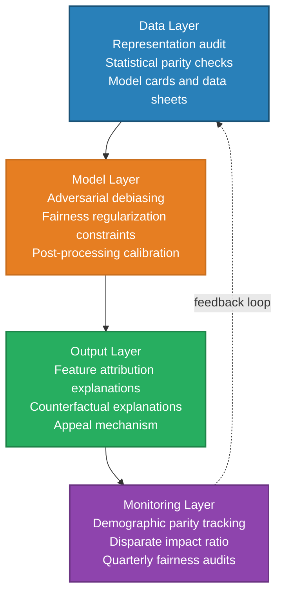
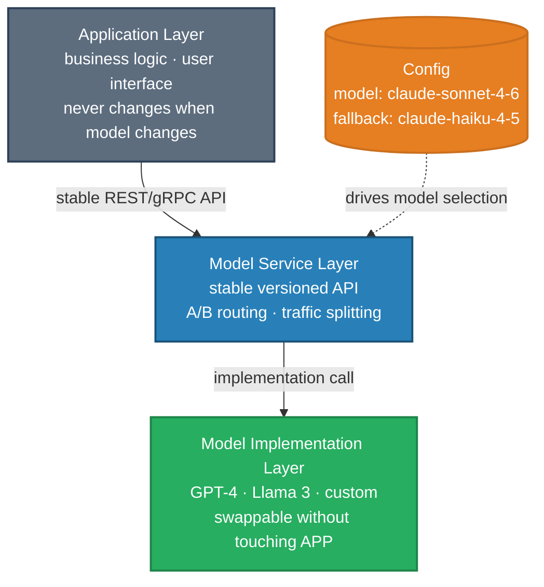

# Miscellaneous Advanced Topics — Interview Questions

Role focus: **AI Architect** · **AI Researcher** · **Data Scientist** · **ML Engineer**

---

## Q1 — Build vs. Buy: Evaluating Custom Infrastructure

**Question:** Your engineering team proposes building a custom vector database instead of using an existing solution. How do you evaluate this decision?

**Short answer:** Ask one question first: "Is this component a source of competitive differentiation, or is it infrastructure?" For most companies, a vector database is infrastructure — the differentiation lives in what you do with it. Buy and focus on your actual product.

---

### The strategic question

Every build-vs-buy decision reduces to:

> Is this component where we compete, or is it what enables us to compete?

- **Where you compete (differentiation):** Build. Your moat lives here. Investments compound.
- **Enabling infrastructure:** Buy. Reinventing solved problems is waste at best, a distraction at worst.

For vector databases: Pinecone, Weaviate, Milvus, Qdrant, and pgvector cover 95%+ of production use cases with mature SDKs, cloud-managed options, and active ecosystems. The only justified exception is if you're building a search/AI platform where the vector store *is* the product.

---

### Evaluation dimensions

**Technical fit**

| Requirement | Existing solutions | Build justified? |
|------------|-------------------|-----------------|
| Scale (vectors, QPS) | Handles billions+ | Only at extreme, unusual scale |
| Latency | Sub-10ms available | Only for sub-millisecond requirements |
| Metadata filtering | Supported natively | Only for complex query semantics |
| Hybrid search | Sparse + dense combined | Only for novel retrieval algorithms |

**Total cost of ownership**

Build costs are systematically underestimated. Realistic estimate:

- Initial development: 2–4 engineer-years for production-grade quality
- Ongoing maintenance: security patches, performance improvements, bug fixes
- Operations: deployment, monitoring, on-call rotation
- Opportunity cost: what else could that team have shipped?

**Rule of thumb:** If your build cost estimate is within 3× of buy cost, you've underestimated. Multiply build estimates by 3 and re-evaluate.

**Risk profile**

| Risk | Build | Buy |
|------|-------|-----|
| Delivery timeline | High — novel development is unpredictable | Low — proven solution |
| Reliability | High initially — needs hardening in production | Low — battle-tested |
| Maintenance burden | Permanent — it's yours forever | Medium — vendor handles core |
| Flexibility | High | Medium — within vendor capabilities |

---

### Handling the team's objections

**"Existing solutions don't do exactly what we need"**
→ Enumerate the specific gaps. Can they be worked around? Is the gap worth 2 engineer-years? Can you use the vendor's API to extend the behavior?

**"We can build something better for our use case"**
→ Probably true in isolation. Is "better for our use case" worth the total cost? What's the marginal business value of 10% better recall?

**"Vendor lock-in is risky"**
→ Real concern. Fix it with an abstraction layer — a repository interface that hides the vendor. This is 10% of the work of building a custom database and eliminates most of the lock-in risk.

---

### When building genuinely makes sense

- Operating at scale that demonstrably breaks existing solutions (and you've hit those limits, not projected them)
- Truly novel retrieval approaches not supported by any existing system
- The vector store becomes a product you can license or offer to others
- Excess engineering capacity with deep relevant expertise

Even then: start with an existing solution, hit its limits in production, then build what existing solutions can't provide.

---

## Q2 — Fairness and Bias in High-Stakes AI Systems

**Question:** You're architecting an AI system for consequential decisions — hiring, lending, or healthcare. How do you make fairness a structural property of the system rather than an afterthought?

**Short answer:** Fairness must be designed in at every layer: data collection, model training, output filtering, and monitoring. No post-hoc check can substitute for fairness-aware design. Add human oversight and appeal mechanisms for any consequential automated decision.

---

### Fairness by construction



**Data layer:**
- Audit training data for representation imbalance across protected groups
- Apply statistical parity checks: is the outcome variable distributed similarly across groups in training data? If not, investigate before training.
- Document known biases in training data (model cards, data sheets)

**Model layer:**
- Adversarial debiasing: train an auxiliary classifier to predict protected attributes from model representations; add a gradient reversal layer that penalizes the model for encoding those attributes
- Fairness constraints: add fairness regularization terms to the training objective (e.g., equalized opportunity: require equal true positive rates across groups)
- Post-processing calibration: adjust decision thresholds per group to equalize outcome rates while preserving predictive accuracy

**Output layer:**
- Require explanations for consequential decisions: what features drove the outcome?
- Counterfactual explanations: what would need to change for the outcome to differ? (If a protected attribute is in the counterfactual, investigate)

---

### Accountability infrastructure

- **Audit trail:** Every consequential decision logged with inputs, model version, confidence, and explanation
- **Appeal mechanism:** Users who receive adverse decisions can request human review
- **Regular fairness audits:** Measure disparate impact metrics quarterly; produce reports for compliance review
- **Incident response:** Defined procedure when a fairness violation is detected in production

---

### Measuring fairness in production

| Metric | Definition | Target |
|--------|-----------|--------|
| Demographic parity | Equal positive decision rate across groups | < 5% gap |
| Equal opportunity | Equal true positive rate across groups | < 5% gap |
| Disparate impact ratio | Min group rate / Max group rate | > 0.80 (4/5ths rule) |

Monitor these continuously. Distribution shifts can re-introduce bias even after training-time mitigation.

---

## Q3 — Future-Proofing AI Architectures

**Question:** AI tooling evolves rapidly — new models, new hardware, new frameworks. How do you design AI systems that remain adaptable as the technology landscape changes?

**Short answer:** Abstract over model implementations, not through them. Use model-as-a-service patterns, configuration-driven behavior, and technology-agnostic interfaces so individual components can be replaced without cascading rewrites.

---

### Core design principles

**Model abstraction layer**



The application layer never calls a specific model directly. It calls a versioned service API with a stable interface. The implementation behind that API can be swapped — or A/B tested — without touching application code.

**Configuration-driven behavior**

Externalize model selection, prompt templates, and inference parameters to config rather than hardcoding them:

```yaml
text_generation:
  model: claude-sonnet-4-6
  max_tokens: 2048
  temperature: 0.3
  fallback_model: claude-haiku-4-5
```

Changing the model is a config push, not a code deploy.

**Standard interfaces**

Prefer REST/gRPC over proprietary SDKs for service communication. Prefer open formats (ONNX, GGUF) for model artifacts where possible. Vendor-proprietary integrations should live behind abstraction layers.

---

### Technology evolution strategy

**Model evolution:** Version models with semantic versioning and performance metadata. Gradual traffic rollout (canary → shadow → full). Keep prior model version available for rollback for at least 30 days post-cutover.

**Infrastructure evolution:** Design for horizontal scalability from day one — stateless services, externalized state. Cloud portability: avoid cloud-provider-specific primitives in the critical path.

**Evaluation:** Maintain a fixed evaluation suite. Before adopting a new model or framework, run it against the suite. Adoption is justified only if it moves your key metrics.

---

## Q4 — AI Service Interoperability and API Contracts

**Question:** Multiple teams each own a different AI service (retrieval, reasoning, evaluation, synthesis). How do you design the service contracts and APIs to support long-term interoperability with minimal coupling?

**Short answer:** Schema-first contracts, semantic versioning, consumer-driven contract tests, and a canonical vocabulary for shared data types. Expose capabilities via discovery endpoints so consumers adapt dynamically.

---

### Schema-first contracts

Define input and output schemas (JSON Schema, Protobuf, or Avro) before writing any implementation. Schemas must include:

- Type information for every field
- Required vs. optional field distinction
- Semantic descriptions (what does `confidence: float` mean in this context? 0–1 probability? A score in another range?)
- Versioning metadata

A schema is a contract between producer and consumer. Break the schema, break the consumer.

---

### Versioning and evolution strategy

- **Backward-compatible changes** (adding optional fields, extending enums with new values): bump minor version, require no consumer changes
- **Breaking changes** (renaming fields, removing fields, changing semantics): bump major version, maintain old version during transition window with published sunset date

Define a deprecation policy: "Any breaking change requires 90-day notice. Old versions supported for 180 days after new version is available."

**Consumer-driven contract tests:** Consumers publish their expectations of each producer API. Producers run these tests in CI. A failing consumer contract test blocks the provider from deploying a breaking change without coordination.

---

### Shared canonical vocabulary

Publish shared type definitions for concepts that cross service boundaries:

```json
{
  "Document": {
    "id": "string",
    "content": "string",
    "source_url": "string",
    "retrieved_at": "ISO 8601 timestamp",
    "relevance_score": "float [0, 1]"
  }
}
```

Without canonical types, each service interprets "Document" differently. Type drift is invisible and accumulates into hard-to-debug failures.

---

### Uncertainty and error contracts

Standardize how uncertainty is reported across services:

```json
{
  "result": "...",
  "confidence": 0.82,
  "confidence_level": "medium",
  "provenance": ["doc_id_1", "doc_id_2"],
  "error_code": null
}
```

Consumers should be able to *programmatically* interpret uncertainty — not just display it to users. A downstream service that can route to human review when `confidence < 0.7` needs a consistent, typed signal.

---

## Q5 — Compliance and Auditability in Regulated Domains

**Question:** For regulated industries (finance, healthcare, legal), how do you design an AI system that satisfies compliance requirements while preserving the team's ability to iterate and improve the system?

**Short answer:** Build compliance into the architecture from the start, not as a layer on top. Immutable audit logs, data lineage, explainable outputs, and governance workflows are not constraints on innovation — they're the infrastructure that makes production AI trustworthy enough to deploy in regulated contexts.

---

### Data handling for compliance

**Data lineage and consent:** Record for every dataset used in training or inference: source, consent status, data subject category (PII or not), retention policy, and transformation steps. Lineage must be traversable — "show me all the data that contributed to this decision" must have an answer.

**Data minimization:** Store only what compliance explicitly requires. Redact or tokenize sensitive attributes (PII, protected characteristics) before storage where the full value isn't needed.

**Retention policies:** Different data types have different retention requirements. Automate enforcement — data that should be deleted after 90 days must be deleted, not just flagged.

---

### Decision explainability

For each high-risk output:

- What features or evidence most influenced the decision?
- What was the model's confidence?
- What would need to change for the outcome to differ (counterfactual)?
- Which specific retrieved documents supported the claim?

Use a hybrid architecture where possible: a deterministic rules layer handles critical safety checks; a learned model provides flexible reasoning. The rules layer is fully explainable; the model layer's decisions are surfaced with feature attribution (SHAP, LIME).

---

### Audit logs

Immutable append-only audit log for every consequential decision:

- Input (what the system received)
- Model version and configuration at decision time
- Post-processing steps applied
- Final output
- Timestamp, request ID, and user/session context

**Important:** Store provenance pointers (document IDs, retrieval timestamps), not full document copies. This avoids data duplication while preserving traceability.

---

### Governance and CI/CD controls

- **Model governance board:** Review and approval workflow for model changes that affect regulated outputs
- **Automated policy checks in CI:** Before any model change deploys, run: data drift checks, fairness metrics, PII leakage detection, adversarial input probes
- **Human-in-the-loop gates:** For decisions above a risk threshold, require human approval before the AI output is actioned

---

## Q6 — Identifying Promising Research Directions

**Question:** How do you decide what research problem to work on? Describe your process for evaluating and selecting among candidate directions.

**Short answer:** Evaluate candidate directions on three dimensions simultaneously: importance (does solving this matter?), tractability (can progress be made now?), and fit (are you positioned to make that progress?). Look for gaps between theory and practice, surprising empirical results, and recurring pain points.

---

### Three evaluation dimensions

**Importance:** If solved, what changes? Who benefits? Is this a bottleneck for broader progress?

A technically interesting problem that's isolated from everything else has limited impact. Good research problems are load-bearing — solving them unlocks progress elsewhere.

**Tractability:** What's changed recently that makes this problem more approachable? Are there early signals that existing approaches are close?

Important but premature problems are frustrating. The best opportunities are where recent progress (new data, new compute, new theoretical tools) has opened a path that wasn't available before.

**Fit:** Do you have relevant expertise, data access, or a unique angle that others don't? Does this build on your existing work and reputation?

Even important, tractable problems may not be right for you specifically if you'd be entering as a weaker competitor in a crowded space.

---

### Signals that indicate a research opportunity

- **Theory-practice gap:** Practitioners are solving problems with heuristics and ad-hoc fixes — a signal that principled methods are missing
- **Surprising empirical results:** Something unexpectedly works (or doesn't) — our model of the phenomenon is incomplete
- **Recurring complaints:** The same frustration surfaces repeatedly across papers, practitioners, and conversations — a real problem, not a perceived one
- **Emerging capabilities:** When models start doing something new, there's a window to characterize and improve those capabilities before the community saturates the direction

---

### Avoiding anti-patterns

- **Crowded direction with diminishing returns:** When 50 groups are all improving the same benchmark by 0.3%, it's time to find an orthogonal contribution
- **Benchmark-defined problems:** If the problem disappears when the benchmark changes, it may not reflect a real capability gap
- **Solution looking for a problem:** Avoid forcing a method you're excited about onto applications where it's not the best fit
- **Hype-driven research:** Popular ≠ important. Some of the best opportunities are in unfashionable areas

---

## Q7 — Extracting Value from Research That Didn't Work

**Question:** You spent six months on a research direction and the method doesn't achieve its intended goal. How do you decide what to do with this work?

**Short answer:** Reframe "failure" as "negative result." Categorize the type of failure, extract insights, and decide whether those insights have sufficient community value to publish. Negative results that save others from trying the same dead end have real scientific value.

---

### Categorizing the failure

| Type | Meaning | Publication potential |
|------|---------|----------------------|
| Hypothesis was wrong | Well-motivated idea empirically doesn't work | High — prevents duplication |
| Method needs refinement | Core insight may be sound but needs development | Medium — depends on insights |
| Problem is harder than expected | Characterized why something is difficult | High — shapes field's understanding |

The type of failure determines what's worth communicating.

---

### Questions to answer before deciding

1. **Why didn't it work?** (Rule out implementation bugs, evaluation issues, missing assumptions before concluding the core idea fails)
2. **Are the negative results robust?** (Consistent across hyperparameter settings, seeds, dataset variations?)
3. **What did you learn?** (New analysis tools? Better understanding of failure modes? Unexpected observations along the way?)
4. **Would this save others time?** (Is this a path many groups might try? Are the experiments reproducible enough to be cited?)

---

### Publication options

**Negative results paper** — venues like TMLR and NeurIPS workshops explicitly welcome these. Requires: clear hypothesis statement, rigorous negative evidence, analysis of *why* it didn't work, and implications for future research.

**Analysis paper** — reframe as "we investigated X approaches to Y and found Z." Focus on what the negative results reveal about the problem space.

**Component of future paper** — include as ablations or baselines in a paper with positive results. "We also tried X, which didn't work because Y" strengthens the positive paper.

**Technical report or preprint** — if not publication-worthy but valuable to share, publish informally. Others can cite it to avoid duplicating the effort.

---

## Q8 — Stakeholder Communication: Complex Results in 5 Minutes

**Question:** You've completed a complex analysis with mixed findings. An executive wants a clear recommendation in 5 minutes. How do you structure this?

**Short answer:** Lead with the recommendation, not the methodology. Use three supporting points maximum. State the key uncertainty as a conditional: "This recommendation holds unless X." Have detail ready on request.

---

### The pyramid structure

```
     Recommendation
   (30 seconds — lead here)
         ↓
   3 Supporting points
   (3 minutes — each with: finding, why it matters, confidence level)
         ↓
   Key uncertainty + next steps
   (1.5 minutes — conditional recommendation, proposed action)
```

Executives need to make decisions. Give them the decision first, then the evidence.

---

### Common mistakes

**Starting with methodology:** "We collected data from three sources and ran a regression..." Nobody cares about the method until they trust the conclusion. Lead with the answer.

**Presenting all findings equally:** Curate ruthlessly. Three findings that directly inform the recommendation. Everything else goes in the appendix.

**Being defensive about uncertainty:** "I'm not sure, the data is messy..." vs "I'm 75% confident in this recommendation. The main uncertainty is X, here's how we'd detect it." Confidence ranges are more useful than hedging.

**Presenting options without a recommendation:** You're paid to have judgment. "Here are the options and trade-offs" is analysis, not a recommendation. Add "I recommend option A because..." and let stakeholders override if they disagree.

---

### Handling "it depends" honestly

Instead of: "It's complex, many factors affect this..."
Say: "The recommendation is X. It holds most strongly for [segment/scenario]. In [other scenario], watch [signal] and be prepared to adjust to Y."

This demonstrates nuanced understanding while still providing clear direction.

---

## Q9 — Interdisciplinary AI Applications

**Question:** You want to apply AI methods to a new scientific domain (materials science, climate modeling, drug discovery). What's the process for a successful cross-disciplinary application?

**Short answer:** Domain immersion before method selection. Co-create the problem definition with domain experts. Evaluate with domain-appropriate metrics, not just ML benchmarks. Publish to both AI and domain venues.

---

### Translation framework

AI applied to a new domain requires translation in both directions — from domain problems to AI-tractable formulations, and from AI outputs to domain-interpretable results.

**Step 1: Domain immersion**
Before writing any code, spend time understanding:
- What are the key unsolved problems in the domain?
- What do current methods look like and where do they fail?
- What data exists, in what format, and with what quality constraints?
- Who are the domain experts, and what do they care about?

**Step 2: Problem formulation**
Translate domain problems into AI problem types:
- What is the input representation? (Graphs for molecular structures, tensors for climate fields, sequences for genomic data)
- What is the prediction target? (Property value, next state, yes/no classification)
- What are the domain constraints? (Physical conservation laws, safety requirements, interpretability needs)
- What metrics does the domain actually care about? (Often not accuracy or perplexity)

**Step 3: Method adaptation**
Domain-specific considerations:

| Domain feature | Adaptation |
|---------------|-----------|
| Physical symmetries | Equivariant networks (SE(3)-invariance for molecules, rotational invariance for images) |
| Known physical laws | Physics-informed neural networks that enforce PDE constraints during training |
| Small datasets | Transfer from related domains, active learning, uncertainty quantification |
| High-stakes decisions | Calibrated uncertainty, conservative predictions, human-in-the-loop validation |

**Step 4: Validation**
Domain validation matters more than benchmark improvement:
- Do domain experts find the results meaningful?
- Does the method outperform existing domain approaches on domain-defined success criteria?
- Have predictions been experimentally validated (even a small number)?

---

### Common failure modes in cross-disciplinary AI

**AI-first thinking:** Applying the most sophisticated ML method to a domain problem without understanding whether the domain actually needs it. Often a well-understood classical method outperforms complex ML with limited domain data.

**Evaluation on ML benchmarks only:** The AI community may celebrate the result; domain practitioners may not find it useful. Evaluate on what the domain cares about.

**Overpromising:** "AI will solve cancer." Focus on incremental, specific improvements with clear limitations. Overpromising destroys trust when the overpromise fails.

---

## Q10 — Data Quality Governance at Scale

**Question:** Your data lake has grown to petabytes and data quality issues are causing model failures and bad business decisions. How do you approach data quality and governance at this scale?

**Short answer:** Data quality at scale isn't about perfection — it's about systematic detection, prioritization, and mitigation. Build a governance structure (ownership + policies), implement automated quality monitoring, and tie data quality violations to operational consequences (SLAs, escalation paths).

---

### Quality dimensions to track

Data quality is not one thing. Each dimension requires different detection and remediation:

| Dimension | Definition | Example failure |
|-----------|-----------|----------------|
| Accuracy | Reflects real-world reality | Wrong prices in product catalog |
| Completeness | All required fields present | Missing user_id on 15% of events |
| Consistency | Same value across sources | Same customer has different names in CRM and billing |
| Timeliness | Available when needed | Inventory data is 4 hours stale |
| Validity | Conforms to defined schema | Negative prices, dates in year 1970 |
| Uniqueness | No unintended duplicates | Same event logged twice due to retry |

---

### Technical implementation

**Automated profiling:** Run statistical summaries on all datasets on ingestion — distribution changes, missing rate changes, cardinality changes. Surface anomalies automatically rather than waiting for model failures to surface them.

**Declarative quality tests (Great Expectations / Deequ):** Define expectations programmatically. Run in CI and on scheduled jobs. A dataset that fails its expectations should not reach model training without an explicit waiver.

**Data lineage:** Track transformations from source to serving. When a quality issue is detected in a model's training data, lineage lets you trace it to the originating system and understand which downstream systems are affected.

**Automated remediation:** For common, predictable issues: imputation strategies for missing values, deduplication pipelines for duplicates, freshness fallbacks when real-time data is stale. Don't require human intervention for issues that can be handled deterministically.

---

### Governance structure

**Ownership model:**

- **Data owners** (business): define quality requirements and accept risk when quality falls below requirements
- **Data stewards** (domain teams): responsible for the quality of the data they produce
- **Data custodians** (engineering): responsible for infrastructure reliability and pipeline correctness

Without clear ownership, quality problems are everyone's problem and no one's responsibility.

**SLAs for data:**

Define expectations per dataset: freshness (data no older than X minutes), completeness (at least Y% of expected records), accuracy (no more than Z% of records failing validation rules). Treat SLA violations like production incidents — with escalation paths and remediation timelines.

---

## Q11 — Feature Engineering at Scale

**Question:** You need to build features from a dataset with billions of rows and thousands of raw attributes. How do you approach this without sacrificing iteration speed or feature quality?

**Short answer:** Prioritize features by expected impact before generating anything. Use distributed computing for batch features, streaming aggregations for real-time features, and a feature store to enforce consistency between training and serving. Most features won't matter — find the 20% that do before scaling.

---

### Framework

**Phase 1: Understand what matters before building**

Before engineering new features:
- Train a baseline model on raw features with default preprocessing
- Examine feature importance (permutation importance or SHAP)
- Which raw features already have predictive signal? Which don't?

This tells you where to invest. Building features on top of already-informative raw signals is more productive than transforming uninformative ones.

**Phase 2: Feature generation strategy**

Three sources, each with different tradeoffs:

| Source | Examples | Cost | Risk |
|--------|---------|------|------|
| Manual domain knowledge | Industry-specific ratios, domain-validated aggregations | Medium | Low — interpretable |
| Automated synthesis (Featuretools) | Cross-entity aggregations, deep feature stacks | Low | Medium — requires validation |
| Interaction features | Pairwise products, ratios of correlated features | Low | Medium — multicollinearity risk |

**Phase 3: Selection before training**

Generating thousands of candidate features and feeding all of them to the model is a recipe for overfitting and explainability problems. Apply selection:

- Filter by feature importance (train a small fast model)
- Remove high-correlation duplicates (Spearman ρ > 0.9)
- Compute marginal contribution: does adding this feature meaningfully improve validation metric?

---

### Computation strategy at scale

**Batch features** (updated daily or hourly): Compute in Spark or Dask. Materialize to Parquet or a feature store. Examples: user lifetime value, product popularity over last 30 days, historical purchase patterns.

**Real-time features** (updated per request or per event): Compute online with streaming aggregations (Flink, Kafka Streams). Store in a low-latency key-value store (Redis). Examples: session length so far, items viewed in last 5 minutes.

**Feature stores (Feast, Tecton, Vertex AI Feature Store):** Central registry that serves features to both training (from offline store) and inference (from online store) with guaranteed consistency. The transformation code is defined once and executed by both paths — eliminating the #1 source of training/serving skew.

---

### Quality and monitoring

- **Schema validation** at feature registration time: correct types, expected ranges
- **Distribution monitoring** in production: alert when feature PSI > 0.1
- **Importance drift monitoring:** which features matter is itself a signal — if feature ranking changes significantly, the problem structure may have shifted
- **Training/serving parity tests:** periodically replay production requests through the training feature pipeline and compare outputs to online feature values

---

*Back to [Miscellaneous Topics →](README.md)*
