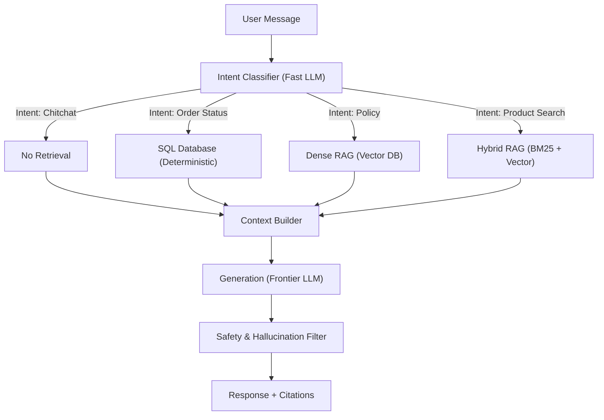

# Case Studies in LLM System Design

> Applying the underlying mathematics, architecture, and prompting theory to realistic production scenarios.

---

## Case Study 1: Dynamic Context LLM Assistant

**The Problem:** Design a production chat assistant for a large e-commerce platform. It must handle customer queries about orders, products, return policies, and general chitchat. It must use the correct information source for each query type and have a near-zero hallucination rate for order tracking.

### The System Design Answer

You cannot solve this with a generic RAG pipeline or a massive monolithic system prompt. You must use **Semantic Intent Routing**. 

A fast, cheap classifier (e.g., Llama-3-8B or a fine-tuned BERT model) sits at the entry point. It classifies the user's intent and deterministically routes the query to a specialized sub-system. 
- Order status queries hit a strict SQL database.
- Policy queries hit a Dense Vector database.
- Product queries hit a Hybrid (BM25 + Dense) database.

Only after the specialized sub-system retrieves the deterministic data is the expensive frontier LLM invoked to generate the final natural language response.



### Python Implementation Architecture

```python
from enum import Enum
from dataclasses import dataclass
import json

class QueryIntent(Enum):
    CHITCHAT = "chitchat"
    ORDER_STATUS = "order_status"
    POLICY = "policy"
    PRODUCT = "product"

@dataclass
class Context:
    intent: QueryIntent
    data: str
    sources: list[str]

class SmartChatAssistant:
    def __init__(self):
        self.classifier = IntentClassifier()
        self.order_db = OrderDatabase()
        self.policy_rag = PolicyRAG()
        self.product_search = ProductSearch()
        self.llm = LLMClient(model="gpt-4o", temperature=0.1) # Low temp for factual grounding
    
    def respond(self, user_message: str, user_id: str) -> dict:
        # 1. Classify Intent (Fast)
        intent = self.classifier.classify(user_message)
        
        # 2. Deterministic Routing
        if intent == QueryIntent.ORDER_STATUS:
            # 100% accurate, no hallucination possible
            order_data = self.order_db.get_recent_orders(user_id)
            context = Context(intent, json.dumps(order_data), ["Order DB"])
            
        elif intent == QueryIntent.POLICY:
            # Semantic RAG
            chunks = self.policy_rag.retrieve(user_message, k=3)
            context = Context(intent, "\n".join(c.text for c in chunks), ["Policy Docs"])
            
        elif intent == QueryIntent.PRODUCT:
            # Hybrid Search
            results = self.product_search.hybrid_search(user_message, k=5)
            context = Context(intent, format_products(results), ["Product Catalog"])
            
        else:
            context = Context(intent, "", [])
            
        # 3. Grounded Generation
        prompt = self._build_prompt(user_message, context)
        response = self.llm.chat(prompt)
        
        return {"response": response, "sources": context.sources}
```

### Related Questions

!!! question "Follow-up Interview Questions"
    1. Why use Semantic Intent Routing instead of an Autonomous Agent with Tools?
    2. How do you handle multi-intent queries (e.g., "Where is my order and what is your return policy?")?

??? success "View Answers"
    **1. Routing vs Agents?**
    An Autonomous Agent (ReAct) requires the LLM to dynamically reason about which tool to use, making sequential API calls. This results in incredibly high latency (e.g., 5-10 seconds) and non-deterministic behavior. Intent Routing is $O(1)$ in LLM calls, deterministic, and easily hits a sub-1s latency budget. Agents are for complex open-ended workflows; Routers are for strict consumer APIs.
    
    **2. Multi-Intent Queries?**
    The Intent Classifier must be upgraded to support Multi-Label Classification (outputting an array like `["ORDER_STATUS", "POLICY"]`). The Orchestrator then forks the execution, executing the SQL lookup and the Vector lookup in parallel asynchronously, concatenates both results into the Context Builder, and sends them to the final LLM.

---

## Case Study 2: High-Yield LLM Data Extraction Pipeline

**The Problem:** A legal tech company wants to extract highly structured JSON information (parties, dates, payment terms) from massive, unstructured legal contracts. A simple prompt like *"Extract data into JSON"* results in frequent syntax errors and hallucinated clauses.

### The System Design Answer

Reliable data extraction requires a multi-stage pipeline:
1. **Schema Definition:** Use Pydantic to strictly type the required JSON output.
2. **Chain-of-Thought (CoT):** Force the LLM to write out its reasoning *before* generating the JSON.
3. **Few-Shot Examples:** Provide explicit edge-case examples.
4. **Self-Correction Loop:** Catch JSON parsing errors in Python, and feed the error string back to the LLM so it can fix its own mistake.

### Python Implementation Architecture

```python
import json
from datetime import datetime

# The Prompt uses CoT (Think first) and Few-Shot examples
extraction_prompt = """
You are a legal analyst extracting structured data.

First, read the contract and WRITE YOUR ANALYSIS:
1. Identify all named parties.
2. Identify all dates and payment clauses.

Then, return a STRICT JSON object:
{
  "parties": [{"name": "...", "role": "..."}],
  "effective_date": "YYYY-MM-DD",
  "payment_terms": {"amount": "...", "due_date": "..."}
}

EXAMPLE EDGE CASE:
Snippet: "This Amendment modifies the Agreement dated March 15, 2023."
Extraction: {"effective_date": null, "notes": "Amendment to 2023-03-15 agreement"}

Contract:
{contract}
"""

def extract_with_validation(contract_text: str, max_retries: int = 3) -> dict:
    for attempt in range(max_retries):
        response = llm(extraction_prompt.format(contract=contract_text))
        
        try:
            # 1. Attempt to parse JSON (must strip markdown blocktags first)
            json_str = extract_json_from_markdown(response)
            data = json.loads(json_str)
            
            # 2. Validate application logic
            assert "parties" in data and len(data["parties"]) >= 2
            if data.get("effective_date"):
                datetime.strptime(data["effective_date"], "%Y-%m-%d")
                
            return data # Success!
            
        except (json.JSONDecodeError, AssertionError, ValueError) as e:
            if attempt < max_retries - 1:
                # 3. Automated Self-Correction Loop
                correction_prompt = f"""
                Your previous extraction failed validation: {str(e)}
                Previous output: {response}
                
                Analyze why it failed and return the CORRECTED JSON.
                """
                response = llm(correction_prompt)
                
    raise ValueError("Catastrophic extraction failure after maximum retries.")
```

### Related Questions

!!! question "Follow-up Interview Questions"
    1. Why does Chain-of-Thought (CoT) mathematically improve extraction accuracy?
    2. Why not just use OpenAI Native Function Calling / Tool Use for extraction?
    3. How do you handle contracts that exceed the LLM's context window?

??? success "View Answers"
    **1. Mathematics of CoT?**
    LLMs are autoregressive; the next token is mathematically conditioned on all preceding tokens in the context window. If the LLM generates the JSON value immediately, it is guessing. If you force the LLM to write out its reasoning first (e.g., *"The contract mentions two dates, Jan 1 and Feb 1. Jan 1 is the signing date..."*), the attention mechanism locks onto those reasoning tokens, guaranteeing the subsequent JSON generation is highly accurate.
    
    **2. Native Function Calling vs CoT?**
    OpenAI Function Calling guarantees perfect JSON syntax, but it forces the model to generate the JSON *immediately* without a Chain-of-Thought reasoning pad. For complex extractions (like resolving conflicting legal clauses), Function Calling often results in syntactically perfect JSON containing completely hallucinated data. Best practice: Use Function Calling, but add a `reasoning_trace: str` field as the very first variable in the JSON schema to force CoT.
    
    **3. Context Window Limits?**
    If a contract is 200,000 tokens, do not feed it all at once (due to the "Lost in the Middle" phenomenon). Use a Map-Reduce architecture: chunk the contract by section headings. Run the extraction prompt on every section in parallel (Map). Then, feed all the partial JSON extracts into a final LLM call to synthesize the master JSON object (Reduce).

---

*Back to [Home](../../README.md)*
