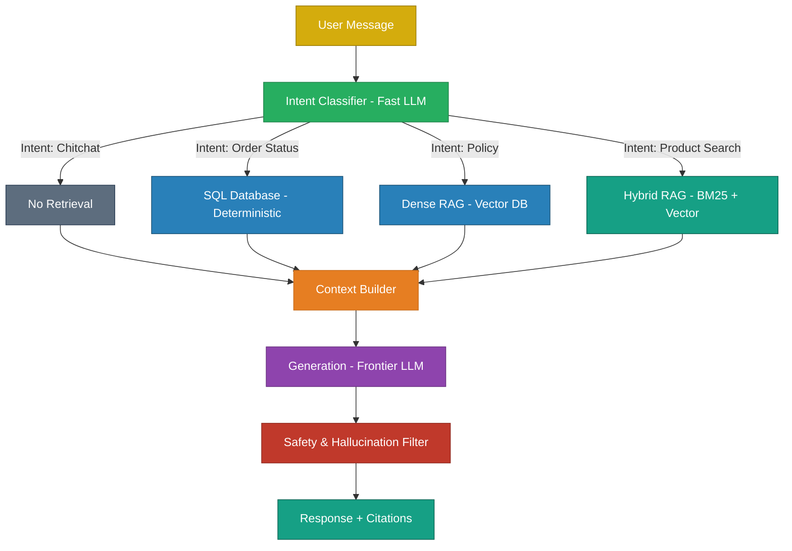
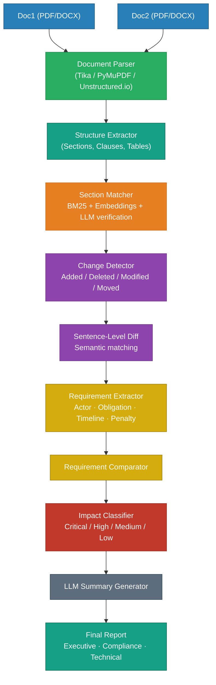
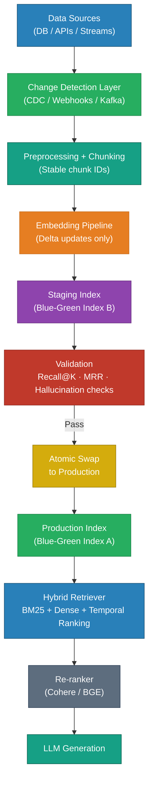
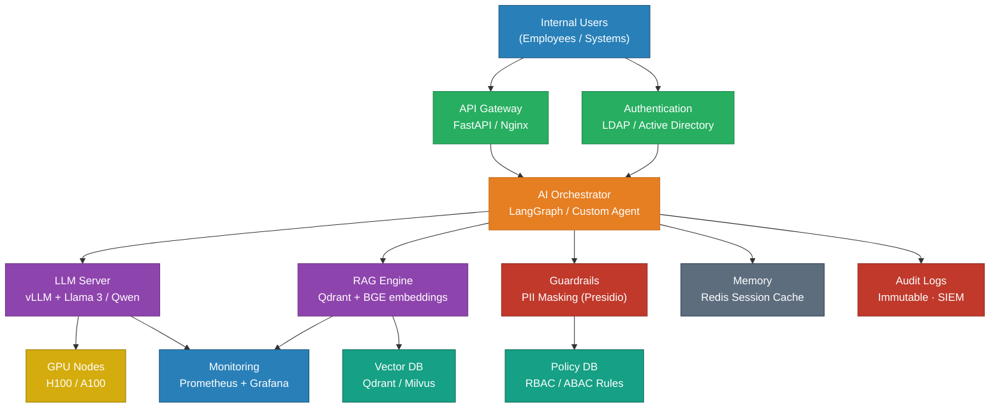
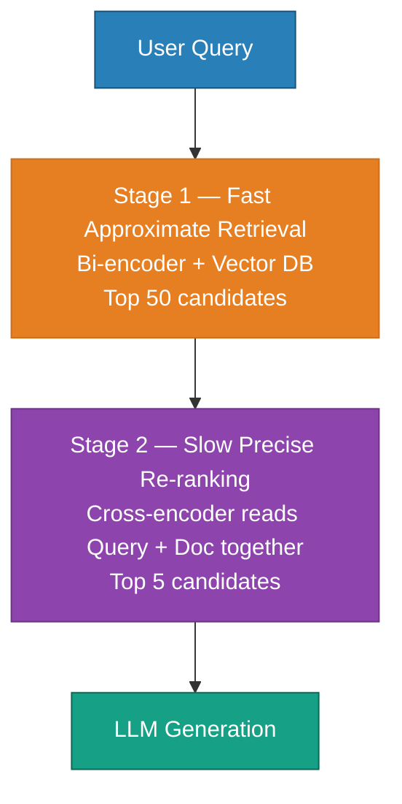

# Case Studies in LLM System Design

> Applying the underlying mathematics, architecture, and prompting theory to realistic production scenarios.

---

## Case Study 1: Dynamic Context LLM Assistant

**The Problem:** Design a production chat assistant for a large e-commerce platform. It must handle customer queries about orders, products, return policies, and general chitchat. It must use the correct information source for each query type and have a near-zero hallucination rate for order tracking.

### The System Design Answer

You cannot solve this with a generic RAG pipeline or a massive monolithic system prompt. You must use **Semantic Intent Routing**. 

A fast, cheap classifier (e.g., Llama-3-8B or a fine-tuned BERT model) sits at the entry point. It classifies the user's intent and deterministically routes the query to a specialized sub-system. 
- Order status queries hit a strict SQL database.
- Policy queries hit a Dense Vector database.
- Product queries hit a Hybrid (BM25 + Dense) database.

Only after the specialized sub-system retrieves the deterministic data is the expensive frontier LLM invoked to generate the final natural language response.



### Python Implementation Architecture

```python
from enum import Enum
from dataclasses import dataclass
import json

class QueryIntent(Enum):
    CHITCHAT = "chitchat"
    ORDER_STATUS = "order_status"
    POLICY = "policy"
    PRODUCT = "product"

@dataclass
class Context:
    intent: QueryIntent
    data: str
    sources: list[str]

class SmartChatAssistant:
    def __init__(self):
        self.classifier = IntentClassifier()
        self.order_db = OrderDatabase()
        self.policy_rag = PolicyRAG()
        self.product_search = ProductSearch()
        self.llm = LLMClient(model="gpt-4o", temperature=0.1) # Low temp for factual grounding
    
    def respond(self, user_message: str, user_id: str) -> dict:
        # 1. Classify Intent (Fast)
        intent = self.classifier.classify(user_message)
        
        # 2. Deterministic Routing
        if intent == QueryIntent.ORDER_STATUS:
            # 100% accurate, no hallucination possible
            order_data = self.order_db.get_recent_orders(user_id)
            context = Context(intent, json.dumps(order_data), ["Order DB"])
            
        elif intent == QueryIntent.POLICY:
            # Semantic RAG
            chunks = self.policy_rag.retrieve(user_message, k=3)
            context = Context(intent, "\n".join(c.text for c in chunks), ["Policy Docs"])
            
        elif intent == QueryIntent.PRODUCT:
            # Hybrid Search
            results = self.product_search.hybrid_search(user_message, k=5)
            context = Context(intent, format_products(results), ["Product Catalog"])
            
        else:
            context = Context(intent, "", [])
            
        # 3. Grounded Generation
        prompt = self._build_prompt(user_message, context)
        response = self.llm.chat(prompt)
        
        return {"response": response, "sources": context.sources}
```

### Related Questions

!!! question "Follow-up Interview Questions"
    1. Why use Semantic Intent Routing instead of an Autonomous Agent with Tools?
    2. How do you handle multi-intent queries (e.g., "Where is my order and what is your return policy?")?

??? success "View Answers"
    **1. Routing vs Agents?**
    An Autonomous Agent (ReAct) requires the LLM to dynamically reason about which tool to use, making sequential API calls. This results in incredibly high latency (e.g., 5-10 seconds) and non-deterministic behavior. Intent Routing is $O(1)$ in LLM calls, deterministic, and easily hits a sub-1s latency budget. Agents are for complex open-ended workflows; Routers are for strict consumer APIs.
    
    **2. Multi-Intent Queries?**
    The Intent Classifier must be upgraded to support Multi-Label Classification (outputting an array like `["ORDER_STATUS", "POLICY"]`). The Orchestrator then forks the execution, executing the SQL lookup and the Vector lookup in parallel asynchronously, concatenates both results into the Context Builder, and sends them to the final LLM.

---

## Case Study 2: High-Yield LLM Data Extraction Pipeline

**The Problem:** A legal tech company wants to extract highly structured JSON information (parties, dates, payment terms) from massive, unstructured legal contracts. A simple prompt like *"Extract data into JSON"* results in frequent syntax errors and hallucinated clauses.

### The System Design Answer

Reliable data extraction requires a multi-stage pipeline:
1. **Schema Definition:** Use Pydantic to strictly type the required JSON output.
2. **Chain-of-Thought (CoT):** Force the LLM to write out its reasoning *before* generating the JSON.
3. **Few-Shot Examples:** Provide explicit edge-case examples.
4. **Self-Correction Loop:** Catch JSON parsing errors in Python, and feed the error string back to the LLM so it can fix its own mistake.

### Python Implementation Architecture

```python
import json
from datetime import datetime

# The Prompt uses CoT (Think first) and Few-Shot examples
extraction_prompt = """
You are a legal analyst extracting structured data.

First, read the contract and WRITE YOUR ANALYSIS:
1. Identify all named parties.
2. Identify all dates and payment clauses.

Then, return a STRICT JSON object:
{
  "parties": [{"name": "...", "role": "..."}],
  "effective_date": "YYYY-MM-DD",
  "payment_terms": {"amount": "...", "due_date": "..."}
}

EXAMPLE EDGE CASE:
Snippet: "This Amendment modifies the Agreement dated March 15, 2023."
Extraction: {"effective_date": null, "notes": "Amendment to 2023-03-15 agreement"}

Contract:
{contract}
"""

def extract_with_validation(contract_text: str, max_retries: int = 3) -> dict:
    for attempt in range(max_retries):
        response = llm(extraction_prompt.format(contract=contract_text))
        
        try:
            # 1. Attempt to parse JSON (must strip markdown blocktags first)
            json_str = extract_json_from_markdown(response)
            data = json.loads(json_str)
            
            # 2. Validate application logic
            assert "parties" in data and len(data["parties"]) >= 2
            if data.get("effective_date"):
                datetime.strptime(data["effective_date"], "%Y-%m-%d")
                
            return data # Success!
            
        except (json.JSONDecodeError, AssertionError, ValueError) as e:
            if attempt < max_retries - 1:
                # 3. Automated Self-Correction Loop
                correction_prompt = f"""
                Your previous extraction failed validation: {str(e)}
                Previous output: {response}
                
                Analyze why it failed and return the CORRECTED JSON.
                """
                response = llm(correction_prompt)
                
    raise ValueError("Catastrophic extraction failure after maximum retries.")
```

### Related Questions

!!! question "Follow-up Interview Questions"
    1. Why does Chain-of-Thought (CoT) mathematically improve extraction accuracy?
    2. Why not just use OpenAI Native Function Calling / Tool Use for extraction?
    3. How do you handle contracts that exceed the LLM's context window?

??? success "View Answers"
    **1. Mathematics of CoT?**
    LLMs are autoregressive; the next token is mathematically conditioned on all preceding tokens in the context window. If the LLM generates the JSON value immediately, it is guessing. If you force the LLM to write out its reasoning first (e.g., *"The contract mentions two dates, Jan 1 and Feb 1. Jan 1 is the signing date..."*), the attention mechanism locks onto those reasoning tokens, guaranteeing the subsequent JSON generation is highly accurate.
    
    **2. Native Function Calling vs CoT?**
    OpenAI Function Calling guarantees perfect JSON syntax, but it forces the model to generate the JSON *immediately* without a Chain-of-Thought reasoning pad. For complex extractions (like resolving conflicting legal clauses), Function Calling often results in syntactically perfect JSON containing completely hallucinated data. Best practice: Use Function Calling, but add a `reasoning_trace: str` field as the very first variable in the JSON schema to force CoT.
    
    **3. Context Window Limits?**
    If a contract is 200,000 tokens, do not feed it all at once (due to the "Lost in the Middle" phenomenon). Use a Map-Reduce architecture: chunk the contract by section headings. Run the extraction prompt on every section in parallel (Map). Then, feed all the partial JSON extracts into a final LLM call to synthesize the master JSON object (Reduce).

---

## Case Study 3: Regulatory Document Diff & Compliance Intelligence Pipeline

**The Problem:** A compliance team has two versions of a regulatory document (Doc1 and Doc2). They need to know not just what text changed, but which clauses changed, which obligations were added or removed, and what the business impact is. A raw text diff is insufficient — compliance officers need answers at the level of requirements and obligations, not characters.

### Why Raw Diff Fails

A `git diff` or `difflib` comparison answers: *"What bytes changed?"* Compliance teams need answers to:

- What **requirements** changed?
- What **obligations** were added or removed?
- What is the **business impact**?
- What is the **executive summary**?

This transforms the problem from a *document-diff task* into a *compliance-intelligence task*.

### The System Design Answer

The pipeline operates at multiple levels of granularity, moving from raw text → structured sections → semantic clauses → extracted requirements → impact-classified changes → executive summary.



### Stage-by-Stage Breakdown

**Stage 1 — Parse & Structure**

Never compare raw PDFs. Convert both documents into structured JSON first. Regulatory documents typically contain: Scope, Definitions, Obligations, Compliance Requirements, Exceptions, Reporting Rules.

```python
# Target structured representation
[
  {"section": "3.2.1", "title": "Customer Data Retention", "text": "..."},
  {"section": "3.2.2", "title": "Audit Logging",           "text": "..."}
]
```

**Stage 2 — Section Matching (not page matching)**

The biggest mistake is comparing pages. Section numbers can change between versions. Use a hybrid matcher:

- **Title similarity** — "Customer Data Retention" ↔ "Customer Information Retention"
- **Embedding cosine similarity** — for sections whose titles were completely reworded
- **LLM verification** — to resolve ambiguous matches

**Stage 3 — Change Detection**

Classify every section pair as `ADDED`, `DELETED`, or `MODIFIED`.

```json
{"type": "MODIFIED", "section": "3.2.1",
 "old": "Records shall be retained for 3 years.",
 "new": "Records shall be retained for 5 years."}
```

**Stage 4 — Requirement Extraction**

Extract obligation objects from changed sentences rather than comparing raw words.

```json
{
  "actor":            "company",
  "action":           "retain records",
  "duration":         "5 years",
  "requirement_type": "mandatory"
}
```

Comparing requirement objects surfaces *compliance meaning* — not just a `- 3 years / + 5 years` diff.

**Stage 5 — Impact Classification**

```python
if new_mandatory_requirement:
    severity = "Critical"
elif reporting_frequency_changed:
    severity = "High"
elif definition_updated:
    severity = "Medium"
else:
    severity = "Low"
```

### Python Implementation Architecture

```python
from dataclasses import dataclass, field
from enum import Enum
import json

class ChangeType(Enum):
    ADDED    = "ADDED"
    DELETED  = "DELETED"
    MODIFIED = "MODIFIED"

class ImpactLevel(Enum):
    CRITICAL = "Critical"
    HIGH     = "High"
    MEDIUM   = "Medium"
    LOW      = "Low"

@dataclass
class Section:
    section_id: str
    title:      str
    text:       str

@dataclass
class SectionChange:
    change_type:  ChangeType
    section_id:   str
    title:        str
    old_text:     str = ""
    new_text:     str = ""
    impact:       ImpactLevel = ImpactLevel.LOW
    impact_reason: str = ""

@dataclass
class Requirement:
    actor:            str
    action:           str
    duration:         str | None
    requirement_type: str   # mandatory / conditional / optional

class RegulatoryDiffPipeline:
    def __init__(self, llm_client, embedder):
        self.llm      = llm_client
        self.embedder = embedder

    # ── Stage 1: Parse ──────────────────────────────────────────────────────
    def parse_document(self, path: str) -> list[Section]:
        """Extract structured sections from PDF/DOCX using Unstructured.io."""
        raw = extract_with_unstructured(path)       # returns heading + text pairs
        return [Section(s["id"], s["title"], s["text"]) for s in raw]

    # ── Stage 2: Match sections ─────────────────────────────────────────────
    def match_sections(
        self, doc1: list[Section], doc2: list[Section]
    ) -> list[tuple[Section | None, Section | None]]:
        """Hybrid BM25 + embedding matching; LLM resolves ambiguities."""
        emb1 = {s.section_id: self.embedder.encode(s.title + " " + s.text) for s in doc1}
        emb2 = {s.section_id: self.embedder.encode(s.title + " " + s.text) for s in doc2}
        return hybrid_match(doc1, doc2, emb1, emb2)   # cosine similarity > 0.85 → match

    # ── Stage 3: Detect changes ─────────────────────────────────────────────
    def detect_changes(
        self, pairs: list[tuple[Section | None, Section | None]]
    ) -> list[SectionChange]:
        changes = []
        for s1, s2 in pairs:
            if s1 is None:
                changes.append(SectionChange(ChangeType.ADDED, s2.section_id, s2.title, new_text=s2.text))
            elif s2 is None:
                changes.append(SectionChange(ChangeType.DELETED, s1.section_id, s1.title, old_text=s1.text))
            elif s1.text.strip() != s2.text.strip():
                changes.append(SectionChange(ChangeType.MODIFIED, s1.section_id, s1.title,
                                             old_text=s1.text, new_text=s2.text))
        return changes

    # ── Stage 4: Extract requirements ──────────────────────────────────────
    def extract_requirements(self, text: str) -> list[Requirement]:
        prompt = f"""
Extract all obligations and requirements from the following regulatory text.
For each, return JSON with: actor, action, duration (or null), requirement_type (mandatory/conditional/optional).
Return a JSON array only.

Text:
{text}
"""
        raw = self.llm.chat(prompt)
        return [Requirement(**r) for r in json.loads(raw)]

    # ── Stage 5: Classify impact ────────────────────────────────────────────
    def classify_impact(self, change: SectionChange) -> SectionChange:
        prompt = f"""
You are a regulatory compliance analyst. Classify the impact of this change.

OLD:
{change.old_text}

NEW:
{change.new_text}

Return JSON: {{"impact": "Critical|High|Medium|Low", "reason": "..."}}
"""
        result = json.loads(self.llm.chat(prompt))
        change.impact        = ImpactLevel(result["impact"])
        change.impact_reason = result["reason"]
        return change

    # ── Stage 6: Executive summary ──────────────────────────────────────────
    def generate_summary(self, changes: list[SectionChange]) -> dict:
        changes_text = "\n".join(
            f"[{c.change_type.value}][{c.impact.value}] {c.title}: {c.impact_reason}"
            for c in changes
        )
        prompt = f"""
You are a compliance analyst. Based on the following detected changes between two regulatory documents, produce three summaries:

Changes:
{changes_text}

Return JSON with keys:
- executive_summary   (bullet points for management)
- compliance_summary  (detailed obligations for compliance team)
- technical_summary   (implementation actions for engineering team)
"""
        return json.loads(self.llm.chat(prompt))

    # ── Orchestrator ────────────────────────────────────────────────────────
    def run(self, path1: str, path2: str) -> dict:
        doc1    = self.parse_document(path1)
        doc2    = self.parse_document(path2)
        pairs   = self.match_sections(doc1, doc2)
        changes = self.detect_changes(pairs)

        enriched = []
        for ch in changes:
            if ch.change_type == ChangeType.MODIFIED:
                ch = self.classify_impact(ch)
            enriched.append(ch)

        summary = self.generate_summary(enriched)
        return {"changes": [vars(c) for c in enriched], "summary": summary}
```

### Technology Stack

| Layer | Options |
|---|---|
| Parsing | Apache Tika, PyMuPDF, Unstructured.io |
| Embeddings | OpenAI `text-embedding-3-small`, `sentence-transformers` |
| Section matching | BM25 (rank-bm25) + cosine similarity |
| Requirement extraction | GPT-4o / Claude with structured output |
| Storage | PostgreSQL (metadata) + pgvector / Pinecone (embeddings) |
| Diff engine | Python `difflib` + semantic similarity |

### Related Questions

!!! question "Follow-up Interview Questions"
    1. Why is comparing raw text (or a `git diff`) insufficient for regulatory documents?
    2. How do you handle section numbers that change between versions?
    3. How do you extract requirements vs. just detecting text changes?
    4. How do you generate summaries at different levels (executive vs. technical)?
    5. What is the impact of using embeddings vs. exact string matching for section alignment?

??? success "View Answers"
    **1. Why is raw diff insufficient?**
    A raw diff answers "what bytes changed?" Compliance teams need to know what *obligations* changed — e.g., a retention period increasing from 3 to 5 years has direct operational and legal consequences that a `- 3 years / + 5 years` diff does not communicate. Raw diffs also produce false positives for formatting changes and miss semantically equivalent rewrites. You need to compare at the *requirement object* level, not the character level.

    **2. Section number drift?**
    Never match by section number alone. A new section inserted in Doc2 shifts every subsequent number. Use a hybrid matcher: (a) exact title match first, (b) embedding cosine similarity for renamed sections (threshold ~0.85), (c) LLM arbitration for ambiguous pairs. This is the same problem as code merge conflict resolution — structural alignment before content comparison.

    **3. Requirement extraction vs. text diff?**
    Convert changed sentences into structured requirement objects with fields: `actor`, `action`, `duration`, `requirement_type`, `exception`. Then diff the objects, not the prose. "Retain records for 3 years" vs. "Retain records for 5 years" produces `{change: "duration", old: "3 years", new: "5 years", impact: "higher retention obligation"}` — a compliance-meaningful signal rather than a text fragment.

    **4. Multi-audience summaries?**
    Feed all classified changes into a single LLM call with three output keys: `executive_summary` (what changed and why it matters, in plain English), `compliance_summary` (which obligations changed and what teams are affected), and `technical_summary` (concrete implementation actions — update retention jobs, modify reporting workflows, etc.). The same detected changes power all three; only the framing prompt differs.

    **5. Embeddings vs. exact matching for alignment?**
    Exact title matching covers ~60–70% of sections in a typical regulatory update. Embedding similarity (cosine > 0.85) handles renamed sections ("Customer Data Retention" → "Customer Information Retention"). For the remaining ambiguous cases, an LLM call asking "Are these two sections covering the same topic?" achieves near-100% recall. Purely exact matching misses renames; purely embedding-based matching is slow and can produce false positives on short titles. The hybrid approach is both accurate and efficient.

---

## Case Study 4: High-Frequency Dynamic RAG — Hourly Data Updates Without Downtime

**The Problem:** A production RAG system serves a banking AI assistant. Data changes every hour — transaction policies, fraud alerts, market rules. The system must deliver fresh, accurate answers without downtime, stale embeddings, broken search results, or hallucinations caused by contradictory chunks (e.g., the old "7% interest rate" chunk coexisting with the new "9% interest rate" chunk).

### Why This Is Hard

This is primarily a **data engineering and retrieval consistency problem**, not an LLM problem. The core tension is:

- Continuous ingestion vs. stable retrieval
- Freshness vs. index consistency
- Compute cost of re-embedding vs. staleness risk

### The System Design Answer



### The Ten Core Problems and Solutions

| Problem | Solution |
|---|---|
| Frequent data updates | Incremental (delta) re-indexing |
| Downtime during updates | Blue-green index swap |
| Outdated embeddings | Hash-based change detection |
| Retrieval inconsistency | Stable deterministic chunk IDs |
| Freshness issues | Temporal ranking boost |
| Vector-only weaknesses | Hybrid retrieval (BM25 + Dense) |
| Unsafe deletions | Soft delete + nightly compaction |
| Large-scale ingestion | Kafka / event-driven pipelines |
| Quality degradation | Golden dataset evaluation before swap |
| Cache staleness | Version-aware cache keys |

### Python Implementation Architecture

```python
import hashlib
from dataclasses import dataclass
from datetime import datetime

@dataclass
class Chunk:
    chunk_id:   str       # deterministic: doc_id + section_id + paragraph_hash
    doc_id:     str
    text:       str
    timestamp:  datetime
    version:    int
    active:     bool = True

class DynamicRAGPipeline:
    def __init__(self, vector_db, bm25_index, embedder, llm):
        self.vector_db   = vector_db
        self.bm25        = bm25_index
        self.embedder    = embedder
        self.llm         = llm
        self.chunk_store: dict[str, Chunk] = {}

    # ── Stage 1: Change Detection ────────────────────────────────────────────
    def _chunk_id(self, doc_id: str, section: str, text: str) -> str:
        para_hash = hashlib.sha256(text.encode()).hexdigest()[:8]
        return f"{doc_id}:{section}:{para_hash}"

    def needs_update(self, doc_id: str, section: str, new_text: str) -> bool:
        cid = self._chunk_id(doc_id, section, new_text)
        return cid not in self.chunk_store   # new hash → content changed

    # ── Stage 2: Incremental Re-indexing ────────────────────────────────────
    def ingest_delta(self, doc_id: str, sections: list[dict]) -> list[str]:
        """Only embed and upsert sections whose content changed."""
        updated_ids = []
        for sec in sections:
            if not self.needs_update(doc_id, sec["id"], sec["text"]):
                continue
            chunk = Chunk(
                chunk_id  = self._chunk_id(doc_id, sec["id"], sec["text"]),
                doc_id    = doc_id,
                text      = sec["text"],
                timestamp = datetime.utcnow(),
                version   = sec.get("version", 1),
            )
            embedding = self.embedder.encode(chunk.text)
            # Write to STAGING index, not production
            self.vector_db.upsert_staging(chunk.chunk_id, embedding,
                                          metadata={"timestamp": chunk.timestamp.isoformat(),
                                                    "version": chunk.version,
                                                    "active": True})
            self.chunk_store[chunk.chunk_id] = chunk
            updated_ids.append(chunk.chunk_id)
        return updated_ids

    # ── Stage 3: Blue-Green Swap ─────────────────────────────────────────────
    def validate_and_swap(self, golden_queries: list[dict]) -> bool:
        """Run retrieval eval on staging; swap only if quality passes."""
        recall_scores = []
        for q in golden_queries:
            results = self.vector_db.query_staging(q["query"], k=5)
            hit = any(r["doc_id"] == q["expected_doc_id"] for r in results)
            recall_scores.append(int(hit))

        recall_at_5 = sum(recall_scores) / len(recall_scores)
        if recall_at_5 >= 0.90:                       # configurable threshold
            self.vector_db.atomic_swap()              # staging → production
            return True
        return False                                  # rollback: staging discarded

    # ── Stage 4: Hybrid Retrieval with Temporal Ranking ─────────────────────
    def retrieve(self, query: str, k: int = 5) -> list[Chunk]:
        dense_results = self.vector_db.query_production(query, k=k * 2)
        bm25_results  = self.bm25.search(query, k=k * 2)

        candidates = merge_and_deduplicate(dense_results, bm25_results)

        # Temporal boost: recency matters for hourly-changing data
        for c in candidates:
            age_hours      = (datetime.utcnow() - c.timestamp).total_seconds() / 3600
            recency_score  = max(0.0, 1.0 - age_hours / 24)   # decays over 24 h
            c.final_score  = (0.7 * c.semantic_score
                             + 0.2 * c.bm25_score
                             + 0.1 * recency_score)

        candidates.sort(key=lambda c: c.final_score, reverse=True)
        return candidates[:k]

    # ── Stage 5: Soft Delete + Compaction ────────────────────────────────────
    def soft_delete(self, chunk_id: str) -> None:
        """Mark stale; physical removal happens during nightly compaction."""
        if chunk_id in self.chunk_store:
            self.chunk_store[chunk_id].active = False
            self.vector_db.update_metadata(chunk_id, {"active": False})

    def compact(self) -> int:
        """Nightly job: remove tombstoned chunks, optimize index segments."""
        dead = [cid for cid, c in self.chunk_store.items() if not c.active]
        self.vector_db.batch_delete(dead)
        for cid in dead:
            del self.chunk_store[cid]
        return len(dead)

    # ── Stage 6: Version-Aware Cache ────────────────────────────────────────
    def cached_retrieve(self, query: str, index_version: int) -> list[Chunk]:
        cache_key = f"{query}::{index_version}"    # stale version → cache miss
        if cached := self.cache.get(cache_key):
            return cached
        result = self.retrieve(query)
        self.cache.set(cache_key, result, ttl=3600)
        return result

    # ── Orchestrator ─────────────────────────────────────────────────────────
    def answer(self, query: str) -> str:
        chunks  = self.retrieve(query)
        context = "\n".join(c.text for c in chunks)
        prompt  = f"Answer using the context below:\n\n{context}\n\nQuestion: {query}"
        return self.llm.chat(prompt)
```

### Separate Hot and Cold Indexes for Banking

```python
# Static (cold): regulations, loan docs, compliance manuals — re-indexed weekly
# Dynamic (hot): transaction policies, fraud alerts, market rules — re-indexed hourly

class TieredRAG:
    def retrieve(self, query: str) -> list[Chunk]:
        hot_results  = self.hot_index.query(query,  k=3)   # small fast model
        cold_results = self.cold_index.query(query, k=3)   # high-quality model
        merged       = hot_results + cold_results
        return self.reranker.rerank(query, merged, top_k=5)
        # hot results carry higher recency_score → naturally surface first
```

### Technology Stack

| Layer | Options |
|---|---|
| Change detection | Debezium (CDC), Kafka, database triggers, doc hashing |
| Embedding | `text-embedding-3-small` (hot), `text-embedding-3-large` (cold) |
| Vector DB | Qdrant / Weaviate / Pinecone (with staging namespace support) |
| Keyword search | Elasticsearch BM25 |
| Re-ranker | Cohere Rerank, BGE cross-encoder |
| Evaluation | Ragas, DeepEval, LangSmith, custom Recall@K harness |
| Observability | Prometheus + Grafana (retrieval drift, freshness SLA, recall) |

### Related Questions

!!! question "Follow-up Interview Questions"
    1. Why is re-embedding the entire vector DB every hour a bad idea?
    2. How does Blue-Green indexing prevent downtime during updates?
    3. Why are stable chunk IDs critical in a dynamic RAG system?
    4. How does temporal ranking help and when does it hurt?
    5. Why is hybrid retrieval (BM25 + Dense) more resilient to fresh data than dense-only?

??? success "View Answers"
    **1. Why not full re-embed every hour?**
    Embedding is the most expensive stage of the pipeline. Re-embedding the entire corpus hourly has O(N) cost regardless of how much actually changed. With hash-based delta detection, only changed or new documents are re-embedded — typically <1% of the corpus per hour. Full re-indexing also produces a window of partial availability if done in-place, and invalidates caches unnecessarily.

    **2. Blue-Green indexing mechanics?**
    Two identical index namespaces exist: A (production, serving live traffic) and B (staging, being rebuilt). The ingestion pipeline writes all updates to B. A validation suite runs Recall@K and hallucination checks against B using a golden query set. If quality passes the threshold (e.g., Recall@5 ≥ 0.90), the router atomically switches all traffic from A to B. B becomes the new production; A becomes the next staging slot. This gives zero-downtime updates and one-step rollback by reversing the pointer.

    **3. Why stable chunk IDs matter?**
    If chunk IDs are random UUIDs regenerated on every ingestion, you cannot perform targeted upserts — every run becomes a full replacement. Deterministic IDs (e.g., `doc_id:section_id:paragraph_hash`) let you: (a) skip re-embedding unchanged chunks, (b) issue precise deletes when a paragraph is removed, (c) maintain consistent citation references in responses, and (d) invalidate caches by chunk rather than clearing the entire cache.

    **4. Temporal ranking — when it helps and when it hurts?**
    Temporal ranking boosts recency and is critical for fast-changing domains (fraud alerts, market rules, live ops). It hurts when old documents are authoritative — e.g., a founding charter or a base regulation should not be deprioritized because it was indexed months ago. Solution: tag documents with a `freshness_policy` field (`time_sensitive` vs. `authoritative`) and apply the recency boost only to `time_sensitive` chunks.

    **5. Hybrid retrieval resilience to fresh data?**
    Dense embeddings are trained on a fixed vocabulary and update lazily (only after re-embedding). A brand-new acronym, product name, or policy ID that appears for the first time today may not be well-represented in the embedding space yet. BM25 is a statistical keyword model — it indexes new terms immediately at insert time and matches them exactly. Hybrid search therefore catches fresh exact-match terms via BM25 while dense retrieval handles semantic paraphrases. The re-ranker then picks the best candidates from both lists.

---

## Case Study 5: Air-Gapped Banking AI — On-Premise LLM Platform with Zero Internet Access

**The Problem:** A bank wants to deploy an AI assistant on its private servers with zero internet access. No cloud APIs, no external services, no outbound network calls. Everything — models, vector DB, orchestration, monitoring, inference, and data — must run inside the bank's network perimeter.

### Why This Is Different From a Startup AI

Banks, defense, healthcare, and government environments operate under constraints that standard AI guides ignore:

- No OpenAI / Anthropic API
- No cloud vector DB (Pinecone, Weaviate Cloud)
- No SaaS observability (Datadog, CloudWatch)
- No HuggingFace Hub at runtime
- Telemetry disabled everywhere
- Model artifacts transferred via approved physical/logical media

The problem is not "which LLM to use" — it is "how do you replace every cloud dependency with an on-premise equivalent."

### The System Design Answer



### Cloud-to-On-Prem Replacement Map

| Cloud Service | On-Prem Alternative |
|---|---|
| OpenAI / Anthropic API | vLLM + Llama 3 / Qwen / Mistral |
| Pinecone / Weaviate Cloud | Qdrant / Milvus (self-hosted) |
| HuggingFace Hub | Internal model registry (MinIO + metadata DB) |
| Weights & Biases | MLflow (self-hosted) |
| AWS S3 | MinIO |
| GitHub | GitLab Enterprise |
| CloudWatch / Datadog | Prometheus + Grafana |
| Auth0 | LDAP / Active Directory |
| Databricks | Kubernetes + Spark |

### Python Implementation Architecture

```python
from dataclasses import dataclass
from enum import Enum
import re

class ClearanceLevel(Enum):
    PUBLIC    = 0
    INTERNAL  = 1
    SENSITIVE = 2
    RESTRICTED = 3

@dataclass
class BankUser:
    user_id:   str
    department: str          # "treasury", "fraud", "retail", "compliance"
    clearance:  ClearanceLevel

@dataclass
class DocumentChunk:
    chunk_id:    str
    text:        str
    department:  str
    clearance:   ClearanceLevel
    source:      str
    version:     int

class AirGappedBankingAI:
    def __init__(self, vllm_client, qdrant_client, embedder, pii_detector, audit_logger):
        self.llm         = vllm_client        # vLLM running Llama-3-70B on H100s
        self.vector_db   = qdrant_client      # self-hosted Qdrant cluster
        self.embedder    = embedder           # BGE-large running on L40S
        self.pii         = pii_detector       # Microsoft Presidio (offline)
        self.audit       = audit_logger       # immutable append-only log → SIEM

    # ── Layer 1: PII Masking ────────────────────────────────────────────────
    def mask_pii(self, text: str) -> tuple[str, dict]:
        """Detect and replace PII before any LLM processing."""
        findings = self.pii.analyze(text, language="en")
        masked, mapping = text, {}
        for f in sorted(findings, key=lambda x: x.start, reverse=True):
            placeholder = f"[{f.entity_type}_{f.start}]"
            mapping[placeholder] = masked[f.start:f.end]
            masked = masked[:f.start] + placeholder + masked[f.end:]
        return masked, mapping

    # ── Layer 2: RBAC Filtering ─────────────────────────────────────────────
    def authorized_chunks(
        self, chunks: list[DocumentChunk], user: BankUser
    ) -> list[DocumentChunk]:
        """Filter retrieved chunks to only those the user is cleared to see."""
        return [
            c for c in chunks
            if c.clearance.value <= user.clearance.value
            and (c.department == user.department or c.department == "public")
        ]

    # ── Layer 3: Retrieval ──────────────────────────────────────────────────
    def retrieve(self, query: str, user: BankUser, k: int = 5) -> list[DocumentChunk]:
        embedding = self.embedder.encode(query)
        # Qdrant filter: only fetch chunks the user's department can see
        dept_filter = {"department": {"$in": [user.department, "public"]}}
        raw = self.vector_db.search(embedding, filter=dept_filter, limit=k * 3)
        chunks = [DocumentChunk(**r.payload) for r in raw]
        return self.authorized_chunks(chunks, user)[:k]

    # ── Layer 4: Audit ──────────────────────────────────────────────────────
    def log(self, user: BankUser, prompt: str, chunks: list[DocumentChunk],
            response: str) -> None:
        self.audit.write({
            "user_id":    user.user_id,
            "department": user.department,
            "prompt":     prompt,                        # masked — no raw PII
            "sources":    [c.chunk_id for c in chunks],
            "response":   response,
            "model":      "llama-3-70b",
        })

    # ── Orchestrator ────────────────────────────────────────────────────────
    def answer(self, raw_query: str, user: BankUser) -> dict:
        masked_query, pii_map = self.mask_pii(raw_query)
        chunks   = self.retrieve(masked_query, user)
        context  = "\n".join(c.text for c in chunks)
        prompt   = f"Answer using only the provided context.\n\nContext:\n{context}\n\nQuestion: {masked_query}"
        response = self.llm.generate(prompt, max_tokens=512, temperature=0.1)
        self.log(user, masked_query, chunks, response)
        return {
            "answer":  response,
            "sources": [c.source for c in chunks],
            "masked_fields": list(pii_map.keys()),
        }
```

### Air-Gapped Model Import Workflow


### Enterprise Deployment Maturity Phases

| Phase | Scope | AI Pattern |
|---|---|---|
| 1 — Internal Assistant | Policy lookup, SOP Q&A, compliance search | RAG chatbot |
| 2 — Workflow Automation | Ticket routing, fraud triage, report drafting | RAG + tools |
| 3 — Agentic Systems | Multi-agent AML investigations, KYC review | LangGraph agents |
| 4 — Mission-Critical AI | Real-time decision engines, regulated governance | Supervised agents + human-in-loop |

### Related Questions

!!! question "Follow-up Interview Questions"
    1. Why do banks refuse cloud APIs even if the provider offers a private endpoint?
    2. How do you get models into an air-gapped environment safely?
    3. How does RBAC work in a multi-department banking RAG system?
    4. Why do banks want RAG before fine-tuning?
    5. What makes audit logging different in a regulated banking AI vs. a startup AI?

??? success "View Answers"
    **1. Why refuse cloud APIs even with private endpoints?**
    Private endpoints still route traffic through the cloud provider's control plane — authentication, billing, model serving. Regulators (RBI, OCC, FINRA) require that customer data and proprietary information never leave the bank's legal jurisdiction or network perimeter. Beyond compliance, cloud APIs introduce a single external dependency: an outage, a pricing change, or a provider sunset event can take down mission-critical systems. An on-prem vLLM cluster is under the bank's full operational control.

    **2. Safe model import into an air-gapped environment?**
    The process is a formal change-control procedure: (a) download on a separate internet-connected staging machine, (b) verify the SHA-256 checksum against the published model card, (c) run antivirus and malware scanning, (d) validate the SBOM (Software Bill of Materials) to check supply chain integrity, (e) transfer via an approved unidirectional data diode or physical media, (f) register in the internal model registry with version, hash, and approval metadata. Only after all gates pass does the model reach the inference cluster.

    **3. RBAC in multi-department RAG?**
    Each document chunk carries `department` and `clearance` metadata at index time. At query time, the vector DB filter constrains retrieval to chunks matching the requesting user's department and clearance level — so a retail banker cannot retrieve treasury risk documents even if the semantic query is relevant. This is enforced in the retrieval layer, not the LLM layer, because LLMs cannot reliably enforce access control from prompt instructions alone.

    **4. RAG before fine-tuning?**
    Fine-tuning bakes knowledge into model weights, making it expensive to update (retraining), hard to audit (you cannot point to a source), and impossible to retract (data cannot be deleted from weights). RAG externalizes knowledge into a vector DB that can be updated, versioned, audited, and rolled back independently of the model. Banks prefer this because regulations change frequently, auditability is mandatory, and the cost of a wrong answer traced to a stale fine-tuned weight is a compliance violation.

    **5. Regulated audit logging requirements?**
    A startup AI log records errors and latency. A regulated banking AI log must be: (a) immutable — append-only, cryptographically signed, write-once storage so no admin can alter it; (b) complete — every prompt, every retrieved source, the exact model version, and the full response, with user ID and timestamp; (c) replayable — compliance officers must be able to reconstruct exactly what information the AI had access to when it produced a given answer; (d) SIEM-integrated — streamed to the bank's Security Information and Event Management system for real-time anomaly detection. This is forensic traceability, not observability.

---

## Case Study 6: Re-Rankers in Enterprise RAG — Types, Internals, and Production Use

**The Problem:** A RAG pipeline for a bank retrieves 50 chunks from a vector DB in response to a query like *"What is the penalty for delayed KYC verification?"* Vector search returns semantically similar but not necessarily the most relevant chunks. The LLM receives noisy context and hallucinates or gives vague answers. Re-ranking fixes this.

### Why Re-Rankers Exist

Vector search is approximate. A bi-encoder model separately encodes the query and each document into embeddings and computes cosine similarity — fast, but the query and document never attend to each other's tokens. A re-ranker reads the query and document **together** through a transformer, producing a much more precise relevance score. The trade-off: re-rankers are too slow to run against an entire corpus, so retrieval is always a two-stage process.



### The Six Types of Re-Rankers

**Type 1 — Cross-Encoder (Gold Standard for Enterprise)**

The most accurate and most widely deployed type.

```
[CLS] Query [SEP] Document [SEP]
              ↓
         Transformer
              ↓
    Scalar Relevance Score (0–1)
```

The model jointly attends to every token in both query and document. There is no precomputed embedding — every query-document pair runs a fresh forward pass. Complexity: O(queries × candidates).

Popular models: `BAAI/bge-reranker-large`, `ms-marco-MiniLM-L-12-v2`, `jina-reranker-v2-base-multilingual`, `monoT5`.

**Type 2 — Bi-Encoder (Retrieval Stage, Not True Re-ranking)**

Encodes query and document separately, computes cosine similarity. Fast because document embeddings are precomputed. Used in Stage 1 (vector DB retrieval), not Stage 2. Lower precision than cross-encoder but scales to billions of documents.

Popular models: `BAAI/bge-large-en-v1.5`, `intfloat/e5-large-v2`, `GTE-large`, `Instructor-XL`.

**Type 3 — Late Interaction (ColBERT)**

A hybrid: instead of one embedding per document, ColBERT stores **token-level embeddings** for every document token. At query time, each query token computes a MaxSim score against all document tokens. Higher quality than bi-encoders while remaining faster than cross-encoders, at the cost of larger storage and more complex infrastructure.

**Type 4 — LLM-Based Re-Ranker**

Prompts a large LLM to score or compare documents.

```
Query: "KYC penalty policy"
Document: "..."
Rate relevance 1–10 and explain why.
```

Variants: pointwise scoring, pairwise comparison ("Is Doc A more relevant than Doc B?"), listwise ranking (rank all candidates simultaneously). Extremely accurate for complex legal/reasoning queries. Too slow and expensive for high-throughput production — used in agentic or high-value workflows.

**Type 5 — Listwise Re-Ranker**

The model receives the query and all candidates together and produces a ranked ordering. Better than pointwise scoring because relevance is relative — Doc A may beat Doc B only when seen together. Computationally prohibitive at scale.

**Type 6 — Rule-Based / Heuristic Re-Ranker**

Deterministic boosting and penalization applied on top of semantic scores. Critical in regulated environments.

```python
final_score = (
    0.7 * semantic_score +
    0.2 * freshness_score +     # recent RBI circulars rank higher
    0.1 * compliance_priority   # regulator-issued docs boosted
)
```

### Type Comparison

| Feature | Bi-Encoder | Cross-Encoder | ColBERT | LLM Ranker |
|---|---|---|---|---|
| Speed | Very fast | Slow | Medium | Very slow |
| Accuracy | Medium | High | High | Very high |
| Precompute embeddings | Yes | No | Partial | No |
| Joint query-doc attention | No | Yes | Token-level | Yes |
| Best use | Stage 1 retrieval | Stage 2 re-ranking | Both | High-value agentic |

### Python Implementation Architecture

```python
from dataclasses import dataclass
import numpy as np

@dataclass
class RankedChunk:
    chunk_id:       str
    text:           str
    semantic_score: float
    bm25_score:     float
    rerank_score:   float = 0.0
    freshness:      float = 1.0
    compliance_priority: float = 1.0

class EnterpriseReranker:
    def __init__(self, cross_encoder, bm25_index, vector_db, embedder):
        self.cross_encoder = cross_encoder   # bge-reranker-large via sentence-transformers
        self.bm25          = bm25_index
        self.vector_db     = vector_db
        self.embedder      = embedder

    # ── Stage 1: Hybrid Retrieval ─────────────────────────────────────────
    def retrieve_candidates(self, query: str, k: int = 50) -> list[RankedChunk]:
        dense = self.vector_db.search(self.embedder.encode(query), limit=k)
        bm25  = self.bm25.search(query, k=k)

        scores: dict[str, RankedChunk] = {}
        for r in dense:
            scores[r.id] = RankedChunk(r.id, r.text, r.score, 0.0,
                                        freshness=r.metadata.get("freshness", 1.0),
                                        compliance_priority=r.metadata.get("priority", 1.0))
        for r in bm25:
            if r.id in scores:
                scores[r.id].bm25_score = r.score
            else:
                scores[r.id] = RankedChunk(r.id, r.text, 0.0, r.score)

        return list(scores.values())

    # ── Stage 2: Cross-Encoder Re-ranking ────────────────────────────────
    def rerank(self, query: str, candidates: list[RankedChunk]) -> list[RankedChunk]:
        pairs  = [(query, c.text) for c in candidates]
        scores = self.cross_encoder.predict(pairs)        # batch inference

        for chunk, score in zip(candidates, scores):
            chunk.rerank_score = float(score)

        return sorted(candidates, key=lambda c: c.rerank_score, reverse=True)

    # ── Stage 3: Heuristic Boosting (Banking-specific) ────────────────────
    def apply_business_rules(
        self, chunks: list[RankedChunk], top_k: int = 5
    ) -> list[RankedChunk]:
        for c in chunks:
            c.rerank_score = (
                0.70 * c.rerank_score +
                0.20 * c.freshness +              # recent circulars rank higher
                0.10 * c.compliance_priority      # regulator docs boosted
            )
        chunks.sort(key=lambda c: c.rerank_score, reverse=True)
        return chunks[:top_k]

    # ── Orchestrator ──────────────────────────────────────────────────────
    def retrieve_and_rerank(self, query: str, top_k: int = 5) -> list[RankedChunk]:
        candidates = self.retrieve_candidates(query, k=50)
        ranked     = self.rerank(query, candidates)
        return self.apply_business_rules(ranked, top_k=top_k)
```

### Why Re-Rankers Matter Especially for Legal/Banking Queries

Embedding retrieval silently fails on:

- **Negation** — *"Loans NOT eligible for restructuring"* may retrieve restructuring documents with high similarity
- **Subtle conditions** — *"penalty only if delay exceeds 30 days"* requires token-level attention to parse the conditional
- **Multi-hop requirements** — *"Which departments are exempt from the Q3 reporting rule?"* requires cross-referencing two clauses
- **Regulatory specificity** — two paragraphs can be semantically similar in embedding space while having opposite compliance implications

A cross-encoder reads the full query-document pair and catches all of these. A bi-encoder cannot.

### Technology Stack

| Layer | Lightweight Stack | High-End Stack |
|---|---|---|
| Stage 1 retrieval | `bge-large` + Qdrant | BM25 (Elasticsearch) + `bge-large` + Qdrant |
| Stage 2 re-ranking | `bge-reranker-base` | `jina-reranker-v2` or `bge-reranker-large` |
| Business rules | Python post-processing | Metadata-aware scoring with compliance weights |
| Context compression | — | LangChain `ContextualCompressionRetriever` |
| Deployment | CPU server | Dedicated GPU (L4 / L40S) |

### Related Questions

!!! question "Follow-up Interview Questions"
    1. Why can't a bi-encoder replace a cross-encoder for re-ranking?
    2. What is ColBERT and when do you prefer it over a cross-encoder?
    3. How do you handle re-ranking latency in a real-time banking system?
    4. Why is negation a fundamental failure mode for bi-encoder retrieval?
    5. How do you combine semantic re-ranking with business rules?

??? success "View Answers"
    **1. Bi-encoder vs. cross-encoder for re-ranking?**
    A bi-encoder encodes query and document in isolation — the query embedding never attends to document tokens and vice versa. Cosine similarity between the two independent vectors is a coarse approximation of relevance. A cross-encoder feeds `[CLS] Query [SEP] Document [SEP]` through a single transformer, so every query token can attend to every document token. This joint attention captures negation, conditions, specific numbers, and legal qualifiers that independent embeddings compress away. The trade-off is that cross-encoder inference cannot be precomputed — it must run at query time for every candidate, which is why it is used in Stage 2 (small candidate set), not Stage 1 (full corpus).

    **2. ColBERT and when to prefer it?**
    ColBERT stores a vector per document token rather than one vector per document. At query time, each query token finds its maximum similarity score against all document token vectors (MaxSim), and the document score is the sum of these per-token maximums. This is more expressive than bi-encoder cosine similarity and faster than cross-encoder forward passes — but requires ~100× more storage and a specialized serving infrastructure (RAGatouille, Vespa, or a custom ColBERT server). Prefer ColBERT when your document corpus is large, latency budget is tight, and you cannot afford full cross-encoder inference, but need better precision than a standard bi-encoder.

    **3. Re-ranking latency in real-time systems?**
    Three levers: (a) **Reduce candidate count** — retrieve top-50 from the vector DB, not top-500; the cross-encoder only runs on 50 pairs; (b) **Batch inference** — group all pairs in one GPU forward pass rather than sequential calls; `sentence-transformers` `cross_encoder.predict(pairs)` does this automatically; (c) **Model size** — `ms-marco-MiniLM-L-6-v2` runs in ~20ms for 50 pairs on a single GPU; `bge-reranker-large` is slower but more accurate; choose based on SLA. For sub-100ms latency budgets, a lightweight cross-encoder on a dedicated L4 GPU is standard practice.

    **4. Why negation breaks bi-encoders?**
    Embedding models are trained to maximize similarity between semantically related text. "Loans eligible for restructuring" and "Loans NOT eligible for restructuring" produce embeddings that are very close in vector space — both contain the same key nouns and are about the same topic. The negation token "NOT" shifts the embedding only slightly because the surrounding context dominates. A cross-encoder, reading both texts token by token, gives "NOT" full attention weight and correctly scores the negated version as low relevance for a query about eligible loans. This is why legal and compliance RAG systems almost always require a cross-encoder re-ranker.

    **5. Combining semantic re-ranking with business rules?**
    Run the cross-encoder first to get a pure relevance score, then apply deterministic post-processing on top. Never mix business rules into the cross-encoder score — they operate on different signals. The final score formula `0.70 × rerank_score + 0.20 × freshness + 0.10 × compliance_priority` applies after re-ranking so that the semantic ordering is preserved as the dominant signal. Business rule weights should be tuned by the compliance team and versioned separately from the model, so they can be updated without redeployment.

---

*Back to [Home](../../README.md)*
